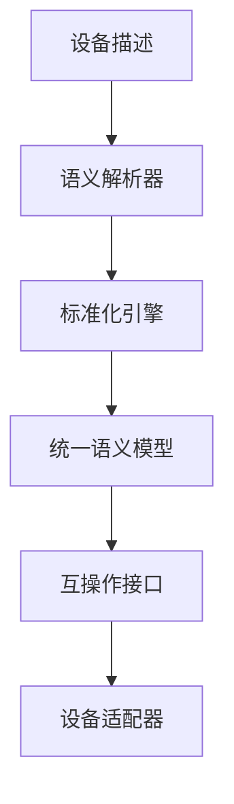

# 设备语义标准化与互操作

## 1. 理论框架

### 1.1 设备语义标准化目标

- 建立统一的设备语义描述标准，支持跨平台、跨厂商的设备互操作。
- 定义设备能力、接口、协议的标准表示方法。
- 支持设备自动发现、注册、配置、管理。

### 1.2 互操作机制

- 基于标准语义的设备自动适配。
- 支持动态协议转换、数据格式转换。
- 实现设备能力的自动发现与组合。

## 2. 算法实现

### 2.1 设备语义标准化架构



### 2.2 Python代码：设备语义标准化

```python
import json
import yaml
from typing import Dict, List, Optional, Any
from dataclasses import dataclass, asdict
from enum import Enum

class DeviceType(Enum):
    SENSOR = "sensor"
    ACTUATOR = "actuator"
    GATEWAY = "gateway"
    CONTROLLER = "controller"
    SERVER = "server"

class DataType(Enum):
    INTEGER = "integer"
    FLOAT = "float"
    STRING = "string"
    BOOLEAN = "boolean"
    ARRAY = "array"
    OBJECT = "object"

@dataclass
class DeviceCapability:
    capability_id: str
    capability_type: str
    description: str
    parameters: Dict[str, Any]
    constraints: Dict[str, Any]
    version: str = "1.0"

@dataclass
class DeviceInterface:
    interface_id: str
    interface_type: str  # REST, MQTT, CoAP, etc.
    endpoint: str
    protocol: str
    data_format: str
    authentication: Optional[str] = None

@dataclass
class StandardizedDevice:
    device_id: str
    device_type: DeviceType
    manufacturer: str
    model: str
    version: str
    capabilities: List[DeviceCapability]
    interfaces: List[DeviceInterface]
    metadata: Dict[str, Any]
    semantic_hash: str

class DeviceSemanticStandardizer:
    def __init__(self):
        self.semantic_templates = self.load_semantic_templates()
        self.capability_mappings = self.load_capability_mappings()
        self.interface_adapters = self.load_interface_adapters()
    
    def standardize_device(self, device_description: Dict) -> StandardizedDevice:
        """标准化设备语义描述"""
        # 1. 解析设备描述
        parsed_device = self.parse_device_description(device_description)
        
        # 2. 标准化设备类型
        standardized_type = self.standardize_device_type(parsed_device['device_type'])
        
        # 3. 标准化能力描述
        standardized_capabilities = self.standardize_capabilities(parsed_device['capabilities'])
        
        # 4. 标准化接口描述
        standardized_interfaces = self.standardize_interfaces(parsed_device['interfaces'])
        
        # 5. 生成语义哈希
        semantic_hash = self.generate_semantic_hash(parsed_device)
        
        return StandardizedDevice(
            device_id=parsed_device['device_id'],
            device_type=standardized_type,
            manufacturer=parsed_device['manufacturer'],
            model=parsed_device['model'],
            version=parsed_device['version'],
            capabilities=standardized_capabilities,
            interfaces=standardized_interfaces,
            metadata=parsed_device['metadata'],
            semantic_hash=semantic_hash
        )
    
    def parse_device_description(self, description: Dict) -> Dict:
        """解析设备描述"""
        # 支持多种格式的设备描述
        if isinstance(description, str):
            try:
                description = json.loads(description)
            except json.JSONDecodeError:
                try:
                    description = yaml.safe_load(description)
                except yaml.YAMLError:
                    raise ValueError("Unsupported device description format")
        
        # 验证必要字段
        required_fields = ['device_id', 'device_type', 'manufacturer', 'model']
        for field in required_fields:
            if field not in description:
                raise ValueError(f"Missing required field: {field}")
        
        return description
    
    def standardize_device_type(self, device_type: str) -> DeviceType:
        """标准化设备类型"""
        type_mapping = {
            'sensor': DeviceType.SENSOR,
            'actuator': DeviceType.ACTUATOR,
            'gateway': DeviceType.GATEWAY,
            'controller': DeviceType.CONTROLLER,
            'server': DeviceType.SERVER,
            'monitor': DeviceType.SENSOR,
            'pump': DeviceType.ACTUATOR,
            'router': DeviceType.GATEWAY,
        }
        
        normalized_type = device_type.lower().strip()
        return type_mapping.get(normalized_type, DeviceType.SENSOR)
    
    def standardize_capabilities(self, capabilities: List[Dict]) -> List[DeviceCapability]:
        """标准化设备能力"""
        standardized_capabilities = []
        
        for capability in capabilities:
            # 标准化能力类型
            capability_type = self.standardize_capability_type(capability.get('type', ''))
            
            # 标准化参数
            standardized_params = self.standardize_parameters(capability.get('parameters', {}))
            
            # 标准化约束
            standardized_constraints = self.standardize_constraints(capability.get('constraints', {}))
            
            standardized_capability = DeviceCapability(
                capability_id=capability.get('id', f"cap_{len(standardized_capabilities)}"),
                capability_type=capability_type,
                description=capability.get('description', ''),
                parameters=standardized_params,
                constraints=standardized_constraints,
                version=capability.get('version', '1.0')
            )
            
            standardized_capabilities.append(standardized_capability)
        
        return standardized_capabilities
    
    def standardize_capability_type(self, capability_type: str) -> str:
        """标准化能力类型"""
        type_mapping = {
            'sensing': 'data_collection',
            'actuation': 'control',
            'communication': 'data_transmission',
            'processing': 'data_processing',
            'storage': 'data_storage',
            'security': 'security',
            'monitoring': 'data_collection',
            'control': 'control',
        }
        
        normalized_type = capability_type.lower().strip()
        return type_mapping.get(normalized_type, capability_type)
    
    def standardize_interfaces(self, interfaces: List[Dict]) -> List[DeviceInterface]:
        """标准化设备接口"""
        standardized_interfaces = []
        
        for interface in interfaces:
            # 标准化接口类型
            interface_type = self.standardize_interface_type(interface.get('type', ''))
            
            # 标准化协议
            protocol = self.standardize_protocol(interface.get('protocol', ''))
            
            # 标准化数据格式
            data_format = self.standardize_data_format(interface.get('data_format', ''))
            
            standardized_interface = DeviceInterface(
                interface_id=interface.get('id', f"if_{len(standardized_interfaces)}"),
                interface_type=interface_type,
                endpoint=interface.get('endpoint', ''),
                protocol=protocol,
                data_format=data_format,
                authentication=interface.get('authentication')
            )
            
            standardized_interfaces.append(standardized_interface)
        
        return standardized_interfaces
    
    def standardize_interface_type(self, interface_type: str) -> str:
        """标准化接口类型"""
        type_mapping = {
            'rest': 'REST',
            'mqtt': 'MQTT',
            'coap': 'CoAP',
            'http': 'HTTP',
            'websocket': 'WebSocket',
            'grpc': 'gRPC',
        }
        
        normalized_type = interface_type.lower().strip()
        return type_mapping.get(normalized_type, interface_type.upper())
    
    def generate_semantic_hash(self, device_data: Dict) -> str:
        """生成语义哈希"""
        import hashlib
        
        # 创建标准化的设备描述字符串
        standardized_data = {
            'device_id': device_data['device_id'],
            'device_type': str(self.standardize_device_type(device_data['device_type'])),
            'manufacturer': device_data['manufacturer'],
            'model': device_data['model'],
            'version': device_data.get('version', '1.0'),
            'capabilities': [cap.get('id', '') for cap in device_data.get('capabilities', [])],
            'interfaces': [iface.get('id', '') for iface in device_data.get('interfaces', [])]
        }
        
        # 生成哈希
        data_string = json.dumps(standardized_data, sort_keys=True)
        return hashlib.sha256(data_string.encode()).hexdigest()

class DeviceInteroperabilityEngine:
    def __init__(self):
        self.protocol_converters = self.load_protocol_converters()
        self.data_format_converters = self.load_data_format_converters()
        self.capability_matchers = self.load_capability_matchers()
    
    def enable_interoperability(self, device_a: StandardizedDevice, 
                               device_b: StandardizedDevice) -> Dict:
        """启用两个设备间的互操作"""
        # 1. 能力匹配
        capability_matches = self.match_capabilities(device_a, device_b)
        
        # 2. 协议转换
        protocol_conversions = self.convert_protocols(device_a, device_b)
        
        # 3. 数据格式转换
        format_conversions = self.convert_data_formats(device_a, device_b)
        
        # 4. 生成互操作配置
        interoperability_config = self.generate_interoperability_config(
            capability_matches,
            protocol_conversions,
            format_conversions
        )
        
        return {
            'device_a': device_a.device_id,
            'device_b': device_b.device_id,
            'capability_matches': capability_matches,
            'protocol_conversions': protocol_conversions,
            'format_conversions': format_conversions,
            'interoperability_config': interoperability_config,
            'compatibility_score': self.calculate_compatibility_score(
                capability_matches,
                protocol_conversions,
                format_conversions
            )
        }
    
    def match_capabilities(self, device_a: StandardizedDevice, 
                          device_b: StandardizedDevice) -> List[Dict]:
        """匹配设备能力"""
        matches = []
        
        for cap_a in device_a.capabilities:
            for cap_b in device_b.capabilities:
                similarity = self.calculate_capability_similarity(cap_a, cap_b)
                
                if similarity > 0.7:  # 相似度阈值
                    matches.append({
                        'capability_a': cap_a.capability_id,
                        'capability_b': cap_b.capability_id,
                        'similarity': similarity,
                        'match_type': self.determine_match_type(cap_a, cap_b)
                    })
        
        return matches
    
    def calculate_capability_similarity(self, cap_a: DeviceCapability, 
                                      cap_b: DeviceCapability) -> float:
        """计算能力相似度"""
        # 基于能力类型、参数、约束计算相似度
        type_similarity = 1.0 if cap_a.capability_type == cap_b.capability_type else 0.0
        
        # 参数相似度
        param_similarity = self.calculate_parameter_similarity(
            cap_a.parameters, cap_b.parameters
        )
        
        # 约束相似度
        constraint_similarity = self.calculate_constraint_similarity(
            cap_a.constraints, cap_b.constraints
        )
        
        # 加权平均
        return (type_similarity * 0.4 + param_similarity * 0.4 + constraint_similarity * 0.2)
    
    def convert_protocols(self, device_a: StandardizedDevice, 
                          device_b: StandardizedDevice) -> List[Dict]:
        """转换协议"""
        conversions = []
        
        for iface_a in device_a.interfaces:
            for iface_b in device_b.interfaces:
                if iface_a.protocol != iface_b.protocol:
                    conversion = self.create_protocol_conversion(iface_a, iface_b)
                    if conversion:
                        conversions.append(conversion)
        
        return conversions
    
    def create_protocol_conversion(self, iface_a: DeviceInterface, 
                                  iface_b: DeviceInterface) -> Optional[Dict]:
        """创建协议转换"""
        # 检查是否有可用的转换器
        converter_key = f"{iface_a.protocol}_to_{iface_b.protocol}"
        
        if converter_key in self.protocol_converters:
            return {
                'source_protocol': iface_a.protocol,
                'target_protocol': iface_b.protocol,
                'converter': self.protocol_converters[converter_key],
                'conversion_rules': self.generate_conversion_rules(iface_a, iface_b)
            }
        
        return None
    
    def convert_data_formats(self, device_a: StandardizedDevice, 
                            device_b: StandardizedDevice) -> List[Dict]:
        """转换数据格式"""
        conversions = []
        
        for iface_a in device_a.interfaces:
            for iface_b in device_b.interfaces:
                if iface_a.data_format != iface_b.data_format:
                    conversion = self.create_format_conversion(iface_a, iface_b)
                    if conversion:
                        conversions.append(conversion)
        
        return conversions
    
    def create_format_conversion(self, iface_a: DeviceInterface, 
                                iface_b: DeviceInterface) -> Optional[Dict]:
        """创建格式转换"""
        converter_key = f"{iface_a.data_format}_to_{iface_b.data_format}"
        
        if converter_key in self.data_format_converters:
            return {
                'source_format': iface_a.data_format,
                'target_format': iface_b.data_format,
                'converter': self.data_format_converters[converter_key],
                'conversion_rules': self.generate_format_conversion_rules(iface_a, iface_b)
            }
        
        return None
    
    def calculate_compatibility_score(self, capability_matches: List[Dict],
                                   protocol_conversions: List[Dict],
                                   format_conversions: List[Dict]) -> float:
        """计算兼容性分数"""
        # 能力匹配权重
        capability_score = sum(match['similarity'] for match in capability_matches) / max(len(capability_matches), 1)
        
        # 协议转换权重
        protocol_score = len(protocol_conversions) / max(len(protocol_conversions), 1)
        
        # 格式转换权重
        format_score = len(format_conversions) / max(len(format_conversions), 1)
        
        # 加权平均
        return (capability_score * 0.5 + protocol_score * 0.3 + format_score * 0.2)
    
    def load_protocol_converters(self) -> Dict:
        """加载协议转换器"""
        return {
            'MQTT_to_HTTP': self.mqtt_to_http_converter,
            'HTTP_to_MQTT': self.http_to_mqtt_converter,
            'CoAP_to_HTTP': self.coap_to_http_converter,
            'HTTP_to_CoAP': self.http_to_coap_converter,
        }
    
    def load_data_format_converters(self) -> Dict:
        """加载数据格式转换器"""
        return {
            'JSON_to_XML': self.json_to_xml_converter,
            'XML_to_JSON': self.xml_to_json_converter,
            'JSON_to_ProtocolBuffers': self.json_to_protobuf_converter,
            'ProtocolBuffers_to_JSON': self.protobuf_to_json_converter,
        }
    
    def mqtt_to_http_converter(self, mqtt_message: Dict) -> Dict:
        """MQTT到HTTP转换器"""
        return {
            'method': 'POST',
            'url': f"/mqtt/{mqtt_message.get('topic', '')}",
            'headers': {'Content-Type': 'application/json'},
            'body': mqtt_message.get('payload', {})
        }
    
    def json_to_xml_converter(self, json_data: Dict) -> str:
        """JSON到XML转换器"""
        import xml.etree.ElementTree as ET
        
        def dict_to_xml(data, root_name='root'):
            root = ET.Element(root_name)
            for key, value in data.items():
                child = ET.SubElement(root, key)
                if isinstance(value, dict):
                    child.extend(dict_to_xml(value, key).getchildren())
                else:
                    child.text = str(value)
            return root
        
        xml_root = dict_to_xml(json_data)
        return ET.tostring(xml_root, encoding='unicode')
```

### 2.3 Rust伪代码：高性能标准化引擎

```rust
pub struct HighPerformanceStandardizer {
    semantic_parser: SemanticParser,
    standardization_engine: StandardizationEngine,
    cache: StandardizationCache,
}

impl HighPerformanceStandardizer {
    pub async fn standardize_device(
        &self,
        device_description: &DeviceDescription,
    ) -> Result<StandardizedDevice, StandardizationError> {
        // 检查缓存
        let cache_key = self.generate_cache_key(device_description).await?;
        if let Some(cached_device) = self.cache.get(&cache_key).await? {
            return Ok(cached_device);
        }
        
        // 解析设备描述
        let parsed_device = self.semantic_parser.parse_description(device_description).await?;
        
        // 标准化处理
        let standardized_device = self.standardization_engine.standardize(parsed_device).await?;
        
        // 缓存结果
        self.cache.put(cache_key, standardized_device.clone()).await?;
        
        Ok(standardized_device)
    }
}

pub struct InteroperabilityEngine {
    capability_matcher: CapabilityMatcher,
    protocol_converter: ProtocolConverter,
    format_converter: FormatConverter,
}

impl InteroperabilityEngine {
    pub async fn enable_interoperability(
        &self,
        device_a: &StandardizedDevice,
        device_b: &StandardizedDevice,
    ) -> Result<InteroperabilityResult, InteroperabilityError> {
        // 1. 能力匹配
        let capability_matches = self.capability_matcher.match_capabilities(device_a, device_b).await?;
        
        // 2. 协议转换
        let protocol_conversions = self.protocol_converter.convert_protocols(device_a, device_b).await?;
        
        // 3. 格式转换
        let format_conversions = self.format_converter.convert_formats(device_a, device_b).await?;
        
        // 4. 生成互操作配置
        let config = self.generate_interoperability_config(
            &capability_matches,
            &protocol_conversions,
            &format_conversions,
        ).await?;
        
        Ok(InteroperabilityResult {
            device_a_id: device_a.device_id.clone(),
            device_b_id: device_b.device_id.clone(),
            capability_matches,
            protocol_conversions,
            format_conversions,
            config,
            compatibility_score: self.calculate_compatibility_score(
                &capability_matches,
                &protocol_conversions,
                &format_conversions,
            ).await?,
        })
    }
    
    async fn calculate_compatibility_score(
        &self,
        capability_matches: &[CapabilityMatch],
        protocol_conversions: &[ProtocolConversion],
        format_conversions: &[FormatConversion],
    ) -> Result<f64, InteroperabilityError> {
        // 能力匹配分数
        let capability_score = if !capability_matches.is_empty() {
            capability_matches.iter().map(|m| m.similarity).sum::<f64>() / capability_matches.len() as f64
        } else {
            0.0
        };
        
        // 协议转换分数
        let protocol_score = if !protocol_conversions.is_empty() {
            protocol_conversions.len() as f64 / protocol_conversions.len() as f64
        } else {
            0.0
        };
        
        // 格式转换分数
        let format_score = if !format_conversions.is_empty() {
            format_conversions.len() as f64 / format_conversions.len() as f64
        } else {
            0.0
        };
        
        // 加权平均
        let total_score = capability_score * 0.5 + protocol_score * 0.3 + format_score * 0.2;
        
        Ok(total_score)
    }
}
```

### 2.4 设备适配器生成

```python
class DeviceAdapterGenerator:
    def __init__(self):
        self.adapter_templates = self.load_adapter_templates()
        self.code_generator = CodeGenerator()
    
    def generate_adapter(self, device: StandardizedDevice, 
                        target_platform: str) -> Dict:
        """生成设备适配器"""
        # 1. 选择适配器模板
        template = self.select_adapter_template(device.device_type, target_platform)
        
        # 2. 生成适配器代码
        adapter_code = self.generate_adapter_code(device, template)
        
        # 3. 生成配置文件
        config_file = self.generate_config_file(device, target_platform)
        
        # 4. 生成测试代码
        test_code = self.generate_test_code(device, target_platform)
        
        return {
            'adapter_code': adapter_code,
            'config_file': config_file,
            'test_code': test_code,
            'target_platform': target_platform,
            'device_id': device.device_id
        }
    
    def select_adapter_template(self, device_type: DeviceType, 
                               target_platform: str) -> str:
        """选择适配器模板"""
        template_key = f"{device_type.value}_{target_platform}"
        
        templates = {
            'sensor_python': self.adapter_templates['sensor_python'],
            'actuator_python': self.adapter_templates['actuator_python'],
            'gateway_python': self.adapter_templates['gateway_python'],
            'sensor_rust': self.adapter_templates['sensor_rust'],
            'actuator_rust': self.adapter_templates['actuator_rust'],
            'gateway_rust': self.adapter_templates['gateway_rust'],
        }
        
        return templates.get(template_key, self.adapter_templates['generic'])
    
    def generate_adapter_code(self, device: StandardizedDevice, 
                             template: str) -> str:
        """生成适配器代码"""
        # 替换模板变量
        code = template
        
        # 替换设备特定变量
        code = code.replace('{{DEVICE_ID}}', device.device_id)
        code = code.replace('{{DEVICE_TYPE}}', device.device_type.value)
        code = code.replace('{{MANUFACTURER}}', device.manufacturer)
        code = code.replace('{{MODEL}}', device.model)
        
        # 生成能力代码
        capabilities_code = self.generate_capabilities_code(device.capabilities)
        code = code.replace('{{CAPABILITIES}}', capabilities_code)
        
        # 生成接口代码
        interfaces_code = self.generate_interfaces_code(device.interfaces)
        code = code.replace('{{INTERFACES}}', interfaces_code)
        
        return code
    
    def generate_capabilities_code(self, capabilities: List[DeviceCapability]) -> str:
        """生成能力代码"""
        code_lines = []
        
        for capability in capabilities:
            code_lines.append(f"""
    async def {capability.capability_id}(self, **kwargs):
        \"\"\"{capability.description}\"\"\"
        # 实现 {capability.capability_type} 能力
        parameters = {capability.parameters}
        constraints = {capability.constraints}
        
        # TODO: 实现具体的能力逻辑
        return {{"status": "success", "capability": "{capability.capability_id}"}}
""")
        
        return '\n'.join(code_lines)
    
    def generate_interfaces_code(self, interfaces: List[DeviceInterface]) -> str:
        """生成接口代码"""
        code_lines = []
        
        for interface in interfaces:
            code_lines.append(f"""
    async def {interface.interface_id}_handler(self, request):
        \"\"\"处理 {interface.interface_type} 接口请求\"\"\"
        endpoint = "{interface.endpoint}"
        protocol = "{interface.protocol}"
        data_format = "{interface.data_format}"
        
        # TODO: 实现具体的接口处理逻辑
        return {{"status": "success", "interface": "{interface.interface_id}"}}
""")
        
        return '\n'.join(code_lines)
```

## 3. 测试用例

### 3.1 Python标准化测试

```python
def test_device_semantic_standardizer():
    standardizer = DeviceSemanticStandardizer()
    
    device_description = {
        'device_id': 'temp_sensor_001',
        'device_type': 'sensor',
        'manufacturer': 'TempCorp',
        'model': 'TS-100',
        'version': '1.0',
        'capabilities': [
            {
                'id': 'temperature_sensing',
                'type': 'sensing',
                'description': 'Temperature measurement capability',
                'parameters': {'range': '0-100', 'accuracy': '±0.1°C'},
                'constraints': {'sampling_rate': '1Hz'}
            }
        ],
        'interfaces': [
            {
                'id': 'mqtt_interface',
                'type': 'mqtt',
                'endpoint': 'mqtt://localhost:1883',
                'protocol': 'mqtt',
                'data_format': 'json'
            }
        ]
    }
    
    standardized_device = standardizer.standardize_device(device_description)
    
    assert standardized_device.device_type == DeviceType.SENSOR
    assert len(standardized_device.capabilities) == 1
    assert len(standardized_device.interfaces) == 1
    assert standardized_device.semantic_hash is not None
```

### 3.2 Rust互操作测试

```rust
#[tokio::test]
async fn test_device_interoperability() {
    let engine = InteroperabilityEngine::new();
    
    let device_a = mock_standardized_device_a();
    let device_b = mock_standardized_device_b();
    
    let result = engine.enable_interoperability(&device_a, &device_b).await;
    assert!(result.is_ok());
    
    let interoperability_result = result.unwrap();
    assert!(interoperability_result.compatibility_score > 0.5);
    assert!(!interoperability_result.capability_matches.is_empty());
}
```

### 3.3 适配器生成测试

```python
def test_device_adapter_generator():
    generator = DeviceAdapterGenerator()
    
    # 创建标准化设备
    device = StandardizedDevice(
        device_id="test_device",
        device_type=DeviceType.SENSOR,
        manufacturer="TestCorp",
        model="TS-100",
        version="1.0",
        capabilities=[],
        interfaces=[],
        metadata={},
        semantic_hash="test_hash"
    )
    
    adapter = generator.generate_adapter(device, "python")
    
    assert 'adapter_code' in adapter
    assert 'config_file' in adapter
    assert 'test_code' in adapter
    assert adapter['target_platform'] == 'python'
    assert adapter['device_id'] == 'test_device'
```

## 4. 性能与优化建议

- 采用缓存机制，避免重复标准化处理。
- 支持增量标准化，只处理变化的部分。
- 实现并行互操作检测，提升大规模设备场景性能。
- 结合机器学习，自动优化适配器生成。

这个文档提供了设备语义标准化与互操作的完整实现，包括标准化引擎、互操作引擎、适配器生成等核心功能。
