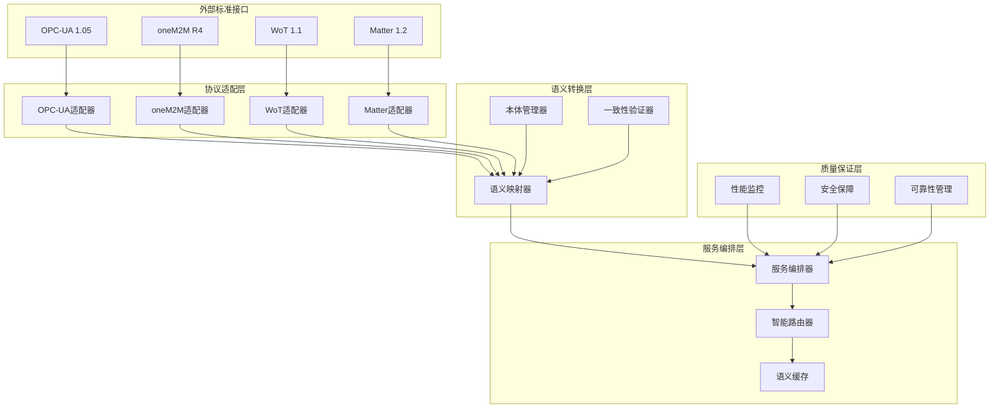

# IoT语义网关详细架构设计

## 1. 语义网关总体架构

### 1.1 架构层次设计

```rust
// 语义网关核心架构
pub struct SemanticGateway {
    // 协议适配层
    protocol_adapters: ProtocolAdapterLayer,
    // 语义转换层
    semantic_transformation: SemanticTransformationLayer,
    // 服务编排层
    service_orchestration: ServiceOrchestrationLayer,
    // 质量保证层
    quality_assurance: QualityAssuranceLayer,
    // 监控管理层
    monitoring_management: MonitoringManagementLayer,
}

// 架构层次接口定义
pub trait ArchitecturalLayer {
    type Input;
    type Output;
    type Config;
    type Error;
    
    fn initialize(&mut self, config: Self::Config) -> Result<(), Self::Error>;
    fn process(&self, input: Self::Input) -> Result<Self::Output, Self::Error>;
    fn shutdown(&mut self) -> Result<(), Self::Error>;
}
```

### 1.2 系统拓扑结构



## 2. 协议适配层设计

### 2.1 统一适配器接口

```rust
// 协议适配器统一接口
#[async_trait]
pub trait ProtocolAdapter: Send + Sync {
    type Message;
    type EntityType;
    type Error;
    
    // 基础通信方法
    async fn connect(&mut self) -> Result<(), Self::Error>;
    async fn disconnect(&mut self) -> Result<(), Self::Error>;
    async fn send_message(&self, msg: Self::Message) -> Result<(), Self::Error>;
    async fn receive_message(&self) -> Result<Self::Message, Self::Error>;
    
    // 语义转换方法
    async fn to_semantic_entity(&self, msg: Self::Message) -> Result<SemanticEntity, Self::Error>;
    async fn from_semantic_entity(&self, entity: SemanticEntity) -> Result<Self::Message, Self::Error>;
    
    // 协议特定方法
    fn get_protocol_info(&self) -> ProtocolInfo;
    fn get_capabilities(&self) -> Vec<Capability>;
    async fn health_check(&self) -> Result<HealthStatus, Self::Error>;
}

// OPC-UA适配器实现
#[derive(Debug)]
pub struct OPCUAAdapter {
    client: OPCUAClient,
    session: Option<Session>,
    namespace_map: HashMap<String, u16>,
    semantic_mapper: OPCUASemanticMapper,
}

#[async_trait]
impl ProtocolAdapter for OPCUAAdapter {
    type Message = OPCUAMessage;
    type EntityType = OPCUANode;
    type Error = OPCUAError;
    
    async fn connect(&mut self) -> Result<(), Self::Error> {
        let endpoint = self.get_secure_endpoint().await?;
        self.session = Some(self.client.connect_to_endpoint(endpoint).await?);
        Ok(())
    }
    
    async fn to_semantic_entity(&self, msg: Self::Message) -> Result<SemanticEntity, Self::Error> {
        match msg {
            OPCUAMessage::ReadResponse(node_id, data_value) => {
                let node_info = self.get_node_information(&node_id).await?;
                
                Ok(SemanticEntity {
                    id: format!("opcua:{}", node_id),
                    entity_type: self.map_node_type_to_semantic(&node_info.node_type),
                    attributes: self.extract_attributes(&node_info, &data_value)?,
                    relationships: self.extract_relationships(&node_id).await?,
                    metadata: self.create_metadata(&node_info),
                })
            },
            // 其他消息类型处理...
            _ => Err(OPCUAError::UnsupportedMessageType),
        }
    }
    
    async fn from_semantic_entity(&self, entity: SemanticEntity) -> Result<Self::Message, Self::Error> {
        // 验证语义实体
        self.semantic_mapper.validate_entity(&entity)?;
        
        // 转换为OPC-UA特定格式
        let node_id = self.parse_opcua_node_id(&entity.id)?;
        let data_value = self.semantic_mapper.create_data_value(&entity)?;
        
        Ok(OPCUAMessage::WriteRequest(node_id, data_value))
    }
}
```

### 2.2 oneM2M适配器设计

```rust
// oneM2M适配器实现
#[derive(Debug)]
pub struct OneM2MAdapter {
    cse_client: CSEClient,
    resource_tree: ResourceTree,
    subscription_manager: SubscriptionManager,
}

#[async_trait]
impl ProtocolAdapter for OneM2MAdapter {
    type Message = OneM2MRequest;
    type EntityType = OneM2MResource;
    type Error = OneM2MError;
    
    async fn to_semantic_entity(&self, msg: Self::Message) -> Result<SemanticEntity, Self::Error> {
        match msg {
            OneM2MRequest::Create { resource_type, attributes, parent } => {
                let semantic_type = self.map_resource_type_to_semantic(&resource_type);
                let relationships = self.build_resource_relationships(&parent).await?;
                
                Ok(SemanticEntity {
                    id: format!("onem2m:{}", self.generate_resource_id()),
                    entity_type: semantic_type,
                    attributes: self.normalize_attributes(attributes)?,
                    relationships,
                    metadata: self.create_onem2m_metadata(&resource_type),
                })
            },
            OneM2MRequest::Retrieve { resource_id } => {
                let resource = self.cse_client.retrieve_resource(&resource_id).await?;
                self.resource_to_semantic_entity(resource).await
            },
            // 其他oneM2M操作...
        }
    }
    
    async fn from_semantic_entity(&self, entity: SemanticEntity) -> Result<Self::Message, Self::Error> {
        let resource_type = self.semantic_to_resource_type(&entity.entity_type)?;
        let attributes = self.denormalize_attributes(&entity.attributes)?;
        let parent = self.resolve_parent_from_relationships(&entity.relationships)?;
        
        Ok(OneM2MRequest::Create {
            resource_type,
            attributes,
            parent,
        })
    }
}
```

## 3. 语义转换层设计

### 3.1 语义映射引擎

```rust
// 语义映射引擎核心
pub struct SemanticMappingEngine {
    ontology_manager: OntologyManager,
    mapping_rules: MappingRuleEngine,
    consistency_checker: ConsistencyChecker,
    cache: SemanticCache,
}

// 语义映射规则定义
#[derive(Debug, Clone)]
pub struct MappingRule {
    pub source_standard: Standard,
    pub target_standard: Standard,
    pub entity_type_mapping: HashMap<String, String>,
    pub attribute_mapping: HashMap<String, AttributeMapping>,
    pub relationship_mapping: HashMap<String, RelationshipMapping>,
    pub transformation_functions: Vec<TransformationFunction>,
}

// 属性映射定义
#[derive(Debug, Clone)]
pub struct AttributeMapping {
    pub source_attribute: String,
    pub target_attribute: String,
    pub transformation: Option<TransformationFunction>,
    pub validation_rules: Vec<ValidationRule>,
}

impl SemanticMappingEngine {
    pub async fn map_entity(&self, 
        entity: &SemanticEntity, 
        source_std: Standard, 
        target_std: Standard
    ) -> Result<SemanticEntity, MappingError> {
        
        // 1. 查找映射规则
        let mapping_rule = self.mapping_rules
            .get_rule(source_std, target_std, &entity.entity_type)
            .ok_or(MappingError::NoMappingRule)?;
        
        // 2. 验证源实体
        self.validate_source_entity(entity, &mapping_rule)?;
        
        // 3. 执行映射转换
        let mapped_entity = self.execute_mapping(entity, &mapping_rule).await?;
        
        // 4. 验证映射结果
        self.validate_mapped_entity(&mapped_entity, &mapping_rule)?;
        
        // 5. 一致性检查
        self.consistency_checker.check_consistency(entity, &mapped_entity)?;
        
        // 6. 缓存结果
        self.cache.store_mapping(entity.id.clone(), mapped_entity.clone()).await;
        
        Ok(mapped_entity)
    }
    
    async fn execute_mapping(&self, 
        entity: &SemanticEntity, 
        rule: &MappingRule
    ) -> Result<SemanticEntity, MappingError> {
        
        // 映射实体类型
        let target_type = rule.entity_type_mapping
            .get(&entity.entity_type)
            .cloned()
            .unwrap_or_else(|| entity.entity_type.clone());
        
        // 映射属性
        let mut target_attributes = HashMap::new();
        for (source_attr, value) in &entity.attributes {
            if let Some(attr_mapping) = rule.attribute_mapping.get(source_attr) {
                let transformed_value = self.apply_transformation(
                    value, 
                    &attr_mapping.transformation
                ).await?;
                target_attributes.insert(
                    attr_mapping.target_attribute.clone(), 
                    transformed_value
                );
            }
        }
        
        // 映射关系
        let target_relationships = self.map_relationships(
            &entity.relationships, 
            &rule.relationship_mapping
        ).await?;
        
        Ok(SemanticEntity {
            id: self.generate_target_id(&entity.id, rule.target_standard),
            entity_type: target_type,
            attributes: target_attributes,
            relationships: target_relationships,
            metadata: self.create_target_metadata(entity, rule.target_standard),
        })
    }
}
```

### 3.2 本体管理器设计

```rust
// 本体管理器
pub struct OntologyManager {
    ontology_store: OntologyStore,
    reasoner: OntologyReasoner,
    validator: OntologyValidator,
}

// 本体定义
#[derive(Debug, Clone)]
pub struct Ontology {
    pub id: String,
    pub version: String,
    pub concepts: HashMap<String, Concept>,
    pub properties: HashMap<String, Property>,
    pub relationships: HashMap<String, Relationship>,
    pub axioms: Vec<Axiom>,
}

#[derive(Debug, Clone)]
pub struct Concept {
    pub name: String,
    pub parent_concepts: Vec<String>,
    pub properties: Vec<String>,
    pub constraints: Vec<Constraint>,
    pub annotations: HashMap<String, String>,
}

impl OntologyManager {
    pub async fn load_standard_ontologies(&mut self) -> Result<(), OntologyError> {
        // 加载OPC-UA本体
        let opcua_ontology = self.load_opcua_ontology().await?;
        self.ontology_store.store("opcua", opcua_ontology).await?;
        
        // 加载oneM2M本体
        let onem2m_ontology = self.load_onem2m_ontology().await?;
        self.ontology_store.store("onem2m", onem2m_ontology).await?;
        
        // 加载WoT本体
        let wot_ontology = self.load_wot_ontology().await?;
        self.ontology_store.store("wot", wot_ontology).await?;
        
        // 加载Matter本体
        let matter_ontology = self.load_matter_ontology().await?;
        self.ontology_store.store("matter", matter_ontology).await?;
        
        // 建立跨本体映射
        self.establish_cross_ontology_mappings().await?;
        
        Ok(())
    }
    
    pub fn validate_entity_against_ontology(&self, 
        entity: &SemanticEntity, 
        standard: Standard
    ) -> Result<ValidationResult, OntologyError> {
        
        let ontology = self.ontology_store.get_ontology(&standard.to_string())?;
        
        // 验证概念存在性
        if !ontology.concepts.contains_key(&entity.entity_type) {
            return Ok(ValidationResult::Invalid(
                format!("Unknown concept: {}", entity.entity_type)
            ));
        }
        
        let concept = &ontology.concepts[&entity.entity_type];
        
        // 验证属性
        for (attr_name, _) in &entity.attributes {
            if !concept.properties.contains(attr_name) {
                return Ok(ValidationResult::Warning(
                    format!("Unknown property: {}", attr_name)
                ));
            }
        }
        
        // 验证约束
        for constraint in &concept.constraints {
            if !self.check_constraint(entity, constraint)? {
                return Ok(ValidationResult::Invalid(
                    format!("Constraint violation: {:?}", constraint)
                ));
            }
        }
        
        Ok(ValidationResult::Valid)
    }
}
```

## 4. 服务编排层设计

### 4.1 智能路由器设计

```rust
// 智能路由器
pub struct IntelligentRouter {
    routing_table: Arc<RwLock<RoutingTable>>,
    load_balancer: LoadBalancer,
    circuit_breaker: CircuitBreaker,
    metrics_collector: MetricsCollector,
}

#[derive(Debug, Clone)]
pub struct RoutingRule {
    pub source_pattern: EntityPattern,
    pub target_adapters: Vec<AdapterEndpoint>,
    pub routing_strategy: RoutingStrategy,
    pub priority: u8,
    pub conditions: Vec<RoutingCondition>,
}

#[derive(Debug, Clone)]
pub enum RoutingStrategy {
    RoundRobin,
    WeightedRoundRobin(HashMap<AdapterEndpoint, u32>),
    LeastConnections,
    LatencyBased,
    SemanticAffinity,
}

impl IntelligentRouter {
    pub async fn route_request(&self, 
        request: SemanticRequest
    ) -> Result<Vec<RoutingDecision>, RoutingError> {
        
        // 1. 获取路由表
        let routing_table = self.routing_table.read().await;
        
        // 2. 匹配路由规则
        let matching_rules = self.find_matching_rules(&request, &routing_table)?;
        
        // 3. 评估路由策略
        let mut routing_decisions = Vec::new();
        for rule in matching_rules {
            let decision = self.evaluate_routing_strategy(&request, &rule).await?;
            routing_decisions.push(decision);
        }
        
        // 4. 应用负载均衡
        let balanced_decisions = self.load_balancer
            .balance_load(routing_decisions).await?;
        
        // 5. 应用熔断器
        let final_decisions = self.circuit_breaker
            .filter_decisions(balanced_decisions).await?;
        
        // 6. 记录指标
        self.metrics_collector.record_routing_decision(&final_decisions).await;
        
        Ok(final_decisions)
    }
    
    async fn evaluate_routing_strategy(&self,
        request: &SemanticRequest,
        rule: &RoutingRule
    ) -> Result<RoutingDecision, RoutingError> {
        
        match &rule.routing_strategy {
            RoutingStrategy::SemanticAffinity => {
                // 基于语义亲和性的路由
                let semantic_scores = self.calculate_semantic_affinity(
                    &request.entity, 
                    &rule.target_adapters
                ).await?;
                
                let best_adapter = semantic_scores.into_iter()
                    .max_by(|a, b| a.1.partial_cmp(&b.1).unwrap())
                    .map(|(adapter, _)| adapter)
                    .ok_or(RoutingError::NoSuitableAdapter)?;
                
                Ok(RoutingDecision {
                    adapter: best_adapter,
                    confidence: 0.9,
                    reason: "Semantic affinity based".to_string(),
                })
            },
            RoutingStrategy::LatencyBased => {
                // 基于延迟的路由
                let latencies = self.measure_adapter_latencies(&rule.target_adapters).await?;
                let best_adapter = latencies.into_iter()
                    .min_by(|a, b| a.1.partial_cmp(&b.1).unwrap())
                    .map(|(adapter, _)| adapter)
                    .ok_or(RoutingError::NoSuitableAdapter)?;
                
                Ok(RoutingDecision {
                    adapter: best_adapter,
                    confidence: 0.8,
                    reason: "Latency optimized".to_string(),
                })
            },
            // 其他路由策略...
            _ => self.apply_standard_strategy(&rule.routing_strategy, &rule.target_adapters).await,
        }
    }
}
```

### 4.2 语义缓存设计

```rust
// 语义缓存管理器
pub struct SemanticCache {
    entity_cache: Arc<RwLock<LruCache<String, CachedEntity>>>,
    mapping_cache: Arc<RwLock<LruCache<MappingKey, CachedMapping>>>,
    ontology_cache: Arc<RwLock<LruCache<String, CachedOntology>>>,
    cache_policy: CachePolicy,
    metrics: CacheMetrics,
}

#[derive(Debug, Clone)]
pub struct CachedEntity {
    pub entity: SemanticEntity,
    pub timestamp: SystemTime,
    pub ttl: Duration,
    pub access_count: u64,
    pub standard: Standard,
}

#[derive(Debug, Clone)]
pub struct CachePolicy {
    pub max_entity_cache_size: usize,
    pub max_mapping_cache_size: usize,
    pub default_ttl: Duration,
    pub eviction_strategy: EvictionStrategy,
    pub consistency_check_interval: Duration,
}

impl SemanticCache {
    pub async fn get_entity(&self, entity_id: &str) -> Option<SemanticEntity> {
        let mut cache = self.entity_cache.write().await;
        
        if let Some(cached) = cache.get_mut(entity_id) {
            // 检查TTL
            if cached.timestamp.elapsed().unwrap() < cached.ttl {
                cached.access_count += 1;
                self.metrics.record_cache_hit().await;
                return Some(cached.entity.clone());
            } else {
                cache.pop(entity_id);
            }
        }
        
        self.metrics.record_cache_miss().await;
        None
    }
    
    pub async fn store_entity(&self, entity: SemanticEntity, standard: Standard) {
        let cached_entity = CachedEntity {
            entity: entity.clone(),
            timestamp: SystemTime::now(),
            ttl: self.cache_policy.default_ttl,
            access_count: 1,
            standard,
        };
        
        let mut cache = self.entity_cache.write().await;
        cache.put(entity.id.clone(), cached_entity);
        
        self.metrics.record_cache_store().await;
    }
    
    pub async fn invalidate_related_entities(&self, entity_id: &str) {
        // 基于语义关系失效相关实体
        let related_entities = self.find_semantically_related_entities(entity_id).await;
        
        let mut cache = self.entity_cache.write().await;
        for related_id in related_entities {
            cache.pop(&related_id);
        }
        
        self.metrics.record_cache_invalidation(related_entities.len()).await;
    }
}
```

## 5. 质量保证层设计

### 5.1 性能监控系统

```rust
// 性能监控系统
pub struct PerformanceMonitor {
    metrics_collector: MetricsCollector,
    performance_analyzer: PerformanceAnalyzer,
    alerting_system: AlertingSystem,
    optimization_engine: OptimizationEngine,
}

#[derive(Debug, Clone)]
pub struct PerformanceMetrics {
    pub response_time: Duration,
    pub throughput: f64,
    pub error_rate: f64,
    pub cpu_usage: f64,
    pub memory_usage: f64,
    pub cache_hit_rate: f64,
    pub semantic_consistency_score: f64,
}

impl PerformanceMonitor {
    pub async fn monitor_system_performance(&self) -> Result<(), MonitoringError> {
        loop {
            // 收集性能指标
            let metrics = self.collect_current_metrics().await?;
            
            // 分析性能趋势
            let analysis = self.performance_analyzer.analyze(&metrics).await?;
            
            // 检查性能阈值
            if let Some(alert) = self.check_performance_thresholds(&metrics) {
                self.alerting_system.send_alert(alert).await?;
            }
            
            // 性能优化建议
            if let Some(optimization) = self.optimization_engine
                .generate_optimization_suggestions(&analysis).await? {
                self.apply_optimization(optimization).await?;
            }
            
            // 记录历史数据
            self.store_performance_history(&metrics).await?;
            
            tokio::time::sleep(Duration::from_secs(10)).await;
        }
    }
    
    async fn collect_current_metrics(&self) -> Result<PerformanceMetrics, MonitoringError> {
        let response_time = self.measure_average_response_time().await?;
        let throughput = self.measure_current_throughput().await?;
        let error_rate = self.calculate_error_rate().await?;
        let (cpu_usage, memory_usage) = self.get_system_resources().await?;
        let cache_hit_rate = self.get_cache_hit_rate().await?;
        let semantic_consistency_score = self.measure_semantic_consistency().await?;
        
        Ok(PerformanceMetrics {
            response_time,
            throughput,
            error_rate,
            cpu_usage,
            memory_usage,
            cache_hit_rate,
            semantic_consistency_score,
        })
    }
}
```

## 6. 部署与配置

### 6.1 容器化部署配置

```yaml
# docker-compose.yml - 语义网关部署配置
version: '3.8'

services:
  semantic-gateway:
    build:
      context: .
      dockerfile: Dockerfile.semantic-gateway
    ports:
      - "8080:8080"
      - "8443:8443"
    environment:
      - RUST_LOG=info
      - GATEWAY_CONFIG_PATH=/config/gateway.toml
    volumes:
      - ./config:/config
      - ./ontologies:/ontologies
      - semantic_cache:/var/cache/semantic
    depends_on:
      - redis
      - postgres
      - elasticsearch
    networks:
      - iot-semantic-network

  redis:
    image: redis:7-alpine
    ports:
      - "6379:6379"
    volumes:
      - redis_data:/data
    networks:
      - iot-semantic-network

  postgres:
    image: postgres:15
    environment:
      POSTGRES_DB: semantic_gateway
      POSTGRES_USER: gateway
      POSTGRES_PASSWORD: gateway_password
    volumes:
      - postgres_data:/var/lib/postgresql/data
    networks:
      - iot-semantic-network

  elasticsearch:
    image: elasticsearch:8.8.0
    environment:
      - discovery.type=single-node
      - xpack.security.enabled=false
    volumes:
      - elasticsearch_data:/usr/share/elasticsearch/data
    networks:
      - iot-semantic-network

volumes:
  semantic_cache:
  redis_data:
  postgres_data:
  elasticsearch_data:

networks:
  iot-semantic-network:
    driver: bridge
```

### 6.2 网关配置文件

```toml
# gateway.toml - 语义网关配置
[gateway]
name = "IoT Semantic Gateway"
version = "1.0.0"
bind_address = "0.0.0.0:8080"
secure_bind_address = "0.0.0.0:8443"
max_connections = 10000
request_timeout = "30s"

[protocols.opcua]
enabled = true
endpoint = "opc.tcp://opcua-server:4840"
security_mode = "SignAndEncrypt"
security_policy = "Basic256Sha256"
certificate_path = "/certs/opcua_client.der"
private_key_path = "/certs/opcua_client.pem"

[protocols.onem2m]
enabled = true
cse_base = "http://onem2m-cse:8080/cse-in"
originator = "C_semantic_gateway"
request_identifier_prefix = "GW_"

[protocols.wot]
enabled = true
thing_description_directory = "http://wot-directory:8080"
forms_base_uri = "http://semantic-gateway:8080/wot"

[protocols.matter]
enabled = true
thread_network_key = "thread_network_key_here"
commissioner_credentials = "/certs/matter_commissioner.json"

[semantic_mapping]
ontology_directory = "/ontologies"
mapping_rules_directory = "/mappings"
cache_enabled = true
cache_ttl = "1h"
consistency_check_enabled = true

[performance]
enable_monitoring = true
metrics_interval = "10s"
performance_threshold_response_time = "100ms"
performance_threshold_throughput = 1000
performance_threshold_error_rate = 0.05

[security]
tls_enabled = true
certificate_path = "/certs/gateway.crt"
private_key_path = "/certs/gateway.key"
client_ca_path = "/certs/ca.crt"
authentication_required = true
authorization_enabled = true

[logging]
level = "info"
format = "json"
output = "/logs/gateway.log"
```

这个语义网关架构设计提供了完整的跨标准IoT语义互操作解决方案，具有高性能、高可靠性和强扩展性的特点。
