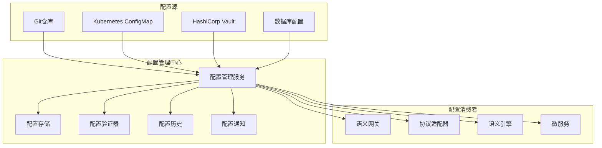

# IoT语义互操作配置管理中心详细实现

## 1. 配置管理架构设计

### 1.1 系统架构



### 1.2 核心数据结构

```rust
// src/config/types.rs
use std::collections::HashMap;
use serde::{Deserialize, Serialize};
use uuid::Uuid;

#[derive(Debug, Clone, Serialize, Deserialize)]
pub struct ConfigEntry {
    pub id: Uuid,
    pub key: String,
    pub value: serde_json::Value,
    pub version: u64,
    pub environment: String,
    pub namespace: String,
    pub created_at: chrono::DateTime<chrono::Utc>,
    pub updated_at: chrono::DateTime<chrono::Utc>,
    pub created_by: String,
    pub tags: HashMap<String, String>,
    pub schema_version: String,
}

#[derive(Debug, Clone, Serialize, Deserialize)]
pub struct ConfigVersion {
    pub version: u64,
    pub config_id: Uuid,
    pub changes: Vec<ConfigChange>,
    pub comment: String,
    pub created_at: chrono::DateTime<chrono::Utc>,
    pub created_by: String,
}

#[derive(Debug, Clone, Serialize, Deserialize)]
pub struct ConfigChange {
    pub field: String,
    pub old_value: Option<serde_json::Value>,
    pub new_value: serde_json::Value,
    pub operation: ChangeOperation,
}

#[derive(Debug, Clone, Serialize, Deserialize)]
pub enum ChangeOperation {
    Create,
    Update,
    Delete,
}

#[derive(Debug, Clone)]
pub enum ConfigEvent {
    Created(ConfigEntry),
    Updated(ConfigEntry, ConfigEntry), // (old, new)
    Deleted(ConfigEntry),
}

#[derive(Debug, Clone)]
pub struct ValidationResult {
    pub is_valid: bool,
    pub errors: Vec<String>,
    pub warnings: Vec<String>,
}

#[derive(Debug, thiserror::Error)]
pub enum ConfigError {
    #[error("Storage error: {0}")]
    Storage(String),
    #[error("Validation failed: {0:?}")]
    ValidationFailed(Vec<String>),
    #[error("Configuration not found")]
    NotFound,
    #[error("Serialization error: {0}")]
    Serialization(#[from] serde_json::Error),
}
```

## 2. 配置管理器核心实现

### 2.1 主要接口定义

```rust
// src/config/manager.rs
use std::sync::Arc;
use tokio::sync::RwLock;
use std::collections::HashMap;

#[async_trait::async_trait]
pub trait ConfigStorage: Send + Sync {
    async fn get(&self, key: &str, environment: &str) -> Result<Option<ConfigEntry>, ConfigError>;
    async fn set(&self, entry: &ConfigEntry) -> Result<(), ConfigError>;
    async fn delete(&self, key: &str, environment: &str) -> Result<(), ConfigError>;
    async fn list(&self, namespace: &str, environment: &str) -> Result<Vec<ConfigEntry>, ConfigError>;
    async fn get_history(&self, key: &str, environment: &str) -> Result<Vec<ConfigVersion>, ConfigError>;
}

#[async_trait::async_trait]
pub trait ConfigValidator: Send + Sync {
    async fn validate(&self, entry: &ConfigEntry) -> Result<ValidationResult, ConfigError>;
    async fn validate_schema(&self, value: &serde_json::Value, schema: &str) -> Result<bool, ConfigError>;
}

#[async_trait::async_trait]
pub trait ConfigNotifier: Send + Sync {
    async fn notify_change(&self, change: &ConfigChange, entry: &ConfigEntry) -> Result<(), ConfigError>;
}

pub type ConfigWatcher = tokio::sync::mpsc::UnboundedSender<ConfigEvent>;
```

### 2.2 配置管理器实现

```rust
// src/config/manager.rs (continued)
pub struct ConfigManager {
    storage: Arc<dyn ConfigStorage>,
    validator: Arc<dyn ConfigValidator>,
    notifier: Arc<dyn ConfigNotifier>,
    cache: Arc<RwLock<HashMap<String, ConfigEntry>>>,
    watchers: Arc<RwLock<HashMap<String, Vec<ConfigWatcher>>>>,
}

impl ConfigManager {
    pub fn new(
        storage: Arc<dyn ConfigStorage>,
        validator: Arc<dyn ConfigValidator>,
        notifier: Arc<dyn ConfigNotifier>,
    ) -> Self {
        Self {
            storage,
            validator,
            notifier,
            cache: Arc::new(RwLock::new(HashMap::new())),
            watchers: Arc::new(RwLock::new(HashMap::new())),
        }
    }
    
    pub async fn get_config(&self, key: &str, environment: &str) -> Result<Option<ConfigEntry>, ConfigError> {
        // 首先检查缓存
        let cache_key = format!("{}:{}", environment, key);
        {
            let cache = self.cache.read().await;
            if let Some(entry) = cache.get(&cache_key) {
                return Ok(Some(entry.clone()));
            }
        }
        
        // 从存储加载
        if let Some(entry) = self.storage.get(key, environment).await? {
            // 更新缓存
            let mut cache = self.cache.write().await;
            cache.insert(cache_key, entry.clone());
            Ok(Some(entry))
        } else {
            Ok(None)
        }
    }
    
    pub async fn set_config(&self, mut entry: ConfigEntry) -> Result<(), ConfigError> {
        // 验证配置
        let validation_result = self.validator.validate(&entry).await?;
        if !validation_result.is_valid {
            return Err(ConfigError::ValidationFailed(validation_result.errors));
        }
        
        // 获取旧版本（如果存在）
        let old_entry = self.get_config(&entry.key, &entry.environment).await?;
        
        // 设置版本号
        entry.version = old_entry.as_ref().map(|e| e.version + 1).unwrap_or(1);
        entry.updated_at = chrono::Utc::now();
        
        // 保存到存储
        self.storage.set(&entry).await?;
        
        // 更新缓存
        let cache_key = format!("{}:{}", entry.environment, entry.key);
        {
            let mut cache = self.cache.write().await;
            cache.insert(cache_key.clone(), entry.clone());
        }
        
        // 通知变更
        let change = if let Some(old) = old_entry {
            ConfigChange {
                field: "value".to_string(),
                old_value: Some(old.value),
                new_value: entry.value.clone(),
                operation: ChangeOperation::Update,
            }
        } else {
            ConfigChange {
                field: "value".to_string(),
                old_value: None,
                new_value: entry.value.clone(),
                operation: ChangeOperation::Create,
            }
        };
        
        self.notifier.notify_change(&change, &entry).await?;
        
        // 通知观察者
        self.notify_watchers(&entry, old_entry.as_ref()).await;
        
        Ok(())
    }
    
    pub async fn watch_config(&self, key: &str, environment: &str) -> tokio::sync::mpsc::UnboundedReceiver<ConfigEvent> {
        let (tx, rx) = tokio::sync::mpsc::unbounded_channel();
        let watch_key = format!("{}:{}", environment, key);
        
        let mut watchers = self.watchers.write().await;
        watchers.entry(watch_key).or_insert_with(Vec::new).push(tx);
        
        rx
    }
    
    async fn notify_watchers(&self, new_entry: &ConfigEntry, old_entry: Option<&ConfigEntry>) {
        let watch_key = format!("{}:{}", new_entry.environment, new_entry.key);
        let watchers = self.watchers.read().await;
        
        if let Some(watcher_list) = watchers.get(&watch_key) {
            let event = if let Some(old) = old_entry {
                ConfigEvent::Updated(old.clone(), new_entry.clone())
            } else {
                ConfigEvent::Created(new_entry.clone())
            };
            
            for watcher in watcher_list {
                let _ = watcher.send(event.clone());
            }
        }
    }
}
```

## 3. PostgreSQL存储实现

### 3.1 数据库模式

```sql
-- migrations/001_create_config_tables.sql
CREATE TABLE IF NOT EXISTS config_entries (
    id UUID PRIMARY KEY,
    key VARCHAR NOT NULL,
    value JSONB NOT NULL,
    version BIGINT NOT NULL,
    environment VARCHAR NOT NULL,
    namespace VARCHAR NOT NULL,
    created_at TIMESTAMPTZ NOT NULL,
    updated_at TIMESTAMPTZ NOT NULL,
    created_by VARCHAR NOT NULL,
    tags JSONB,
    schema_version VARCHAR NOT NULL,
    UNIQUE(key, environment)
);

CREATE TABLE IF NOT EXISTS config_versions (
    id UUID PRIMARY KEY,
    config_id UUID NOT NULL REFERENCES config_entries(id),
    version BIGINT NOT NULL,
    changes JSONB NOT NULL,
    comment TEXT,
    created_at TIMESTAMPTZ NOT NULL,
    created_by VARCHAR NOT NULL
);

CREATE INDEX IF NOT EXISTS idx_config_key_env ON config_entries(key, environment);
CREATE INDEX IF NOT EXISTS idx_config_namespace_env ON config_entries(namespace, environment);
CREATE INDEX IF NOT EXISTS idx_config_versions_config_id ON config_versions(config_id);
```

### 3.2 存储实现

```rust
// src/config/storage/postgres.rs
use sqlx::{PgPool, Row};
use uuid::Uuid;
use super::*;

pub struct PostgresConfigStorage {
    pool: PgPool,
}

impl PostgresConfigStorage {
    pub fn new(pool: PgPool) -> Self {
        Self { pool }
    }
    
    pub async fn init_schema(&self) -> Result<(), sqlx::Error> {
        sqlx::migrate!("./migrations").run(&self.pool).await?;
        Ok(())
    }
}

#[async_trait::async_trait]
impl ConfigStorage for PostgresConfigStorage {
    async fn get(&self, key: &str, environment: &str) -> Result<Option<ConfigEntry>, ConfigError> {
        let row = sqlx::query(
            "SELECT id, key, value, version, environment, namespace, created_at, updated_at, created_by, tags, schema_version 
             FROM config_entries WHERE key = $1 AND environment = $2"
        )
        .bind(key)
        .bind(environment)
        .fetch_optional(&self.pool)
        .await
        .map_err(|e| ConfigError::Storage(e.to_string()))?;
        
        if let Some(row) = row {
            let tags: serde_json::Value = row.get("tags");
            let tags: HashMap<String, String> = serde_json::from_value(tags)
                .unwrap_or_default();
            
            Ok(Some(ConfigEntry {
                id: row.get("id"),
                key: row.get("key"),
                value: row.get("value"),
                version: row.get::<i64, _>("version") as u64,
                environment: row.get("environment"),
                namespace: row.get("namespace"),
                created_at: row.get("created_at"),
                updated_at: row.get("updated_at"),
                created_by: row.get("created_by"),
                tags,
                schema_version: row.get("schema_version"),
            }))
        } else {
            Ok(None)
        }
    }
    
    async fn set(&self, entry: &ConfigEntry) -> Result<(), ConfigError> {
        sqlx::query(
            "INSERT INTO config_entries (id, key, value, version, environment, namespace, created_at, updated_at, created_by, tags, schema_version)
             VALUES ($1, $2, $3, $4, $5, $6, $7, $8, $9, $10, $11)
             ON CONFLICT (key, environment) DO UPDATE SET
             value = $3, version = $4, updated_at = $8, tags = $10"
        )
        .bind(entry.id)
        .bind(&entry.key)
        .bind(&entry.value)
        .bind(entry.version as i64)
        .bind(&entry.environment)
        .bind(&entry.namespace)
        .bind(entry.created_at)
        .bind(entry.updated_at)
        .bind(&entry.created_by)
        .bind(serde_json::to_value(&entry.tags).unwrap())
        .bind(&entry.schema_version)
        .execute(&self.pool)
        .await
        .map_err(|e| ConfigError::Storage(e.to_string()))?;
        
        Ok(())
    }
    
    async fn delete(&self, key: &str, environment: &str) -> Result<(), ConfigError> {
        sqlx::query("DELETE FROM config_entries WHERE key = $1 AND environment = $2")
            .bind(key)
            .bind(environment)
            .execute(&self.pool)
            .await
            .map_err(|e| ConfigError::Storage(e.to_string()))?;
            
        Ok(())
    }
    
    async fn list(&self, namespace: &str, environment: &str) -> Result<Vec<ConfigEntry>, ConfigError> {
        let rows = sqlx::query(
            "SELECT id, key, value, version, environment, namespace, created_at, updated_at, created_by, tags, schema_version 
             FROM config_entries WHERE namespace = $1 AND environment = $2"
        )
        .bind(namespace)
        .bind(environment)
        .fetch_all(&self.pool)
        .await
        .map_err(|e| ConfigError::Storage(e.to_string()))?;
        
        let mut entries = Vec::new();
        for row in rows {
            let tags: serde_json::Value = row.get("tags");
            let tags: HashMap<String, String> = serde_json::from_value(tags)
                .unwrap_or_default();
            
            entries.push(ConfigEntry {
                id: row.get("id"),
                key: row.get("key"),
                value: row.get("value"),
                version: row.get::<i64, _>("version") as u64,
                environment: row.get("environment"),
                namespace: row.get("namespace"),
                created_at: row.get("created_at"),
                updated_at: row.get("updated_at"),
                created_by: row.get("created_by"),
                tags,
                schema_version: row.get("schema_version"),
            });
        }
        
        Ok(entries)
    }
    
    async fn get_history(&self, key: &str, environment: &str) -> Result<Vec<ConfigVersion>, ConfigError> {
        let config_entry = self.get(key, environment).await?
            .ok_or(ConfigError::NotFound)?;
        
        let rows = sqlx::query(
            "SELECT id, config_id, version, changes, comment, created_at, created_by
             FROM config_versions WHERE config_id = $1 ORDER BY version DESC"
        )
        .bind(config_entry.id)
        .fetch_all(&self.pool)
        .await
        .map_err(|e| ConfigError::Storage(e.to_string()))?;
        
        let mut versions = Vec::new();
        for row in rows {
            let changes: serde_json::Value = row.get("changes");
            let changes: Vec<ConfigChange> = serde_json::from_value(changes)
                .map_err(|e| ConfigError::Storage(e.to_string()))?;
            
            versions.push(ConfigVersion {
                version: row.get::<i64, _>("version") as u64,
                config_id: row.get("config_id"),
                changes,
                comment: row.get("comment"),
                created_at: row.get("created_at"),
                created_by: row.get("created_by"),
            });
        }
        
        Ok(versions)
    }
}
```

## 4. 配置验证器

### 4.1 JSON Schema验证器

```rust
// src/config/validator.rs
use jsonschema::{JSONSchema, ValidationError};
use std::collections::HashMap;
use serde_json::json;

pub struct JsonSchemaValidator {
    schemas: HashMap<String, JSONSchema>,
}

impl JsonSchemaValidator {
    pub fn new() -> Self {
        let mut validator = Self {
            schemas: HashMap::new(),
        };
        
        validator.load_predefined_schemas();
        validator
    }
    
    fn load_predefined_schemas(&mut self) {
        // IoT网关配置模式
        let gateway_schema = json!({
            "type": "object",
            "properties": {
                "server": {
                    "type": "object",
                    "properties": {
                        "host": {"type": "string"},
                        "port": {"type": "integer", "minimum": 1, "maximum": 65535},
                        "https": {"type": "boolean"}
                    },
                    "required": ["host", "port"]
                },
                "protocols": {
                    "type": "object",
                    "properties": {
                        "opcua": {"$ref": "#/definitions/protocol_config"},
                        "onem2m": {"$ref": "#/definitions/protocol_config"},
                        "wot": {"$ref": "#/definitions/protocol_config"},
                        "matter": {"$ref": "#/definitions/protocol_config"}
                    }
                }
            },
            "definitions": {
                "protocol_config": {
                    "type": "object",
                    "properties": {
                        "enabled": {"type": "boolean"},
                        "endpoint": {"type": "string"},
                        "timeout_ms": {"type": "integer", "minimum": 100}
                    },
                    "required": ["enabled"]
                }
            },
            "required": ["server", "protocols"]
        });
        
        if let Ok(schema) = JSONSchema::compile(&gateway_schema) {
            self.schemas.insert("iot_gateway".to_string(), schema);
        }
    }
}

#[async_trait::async_trait]
impl ConfigValidator for JsonSchemaValidator {
    async fn validate(&self, entry: &ConfigEntry) -> Result<ValidationResult, ConfigError> {
        let mut errors = Vec::new();
        let mut warnings = Vec::new();
        
        // 基本验证
        if entry.key.is_empty() {
            errors.push("Configuration key cannot be empty".to_string());
        }
        
        // Schema验证
        if let Some(schema) = self.schemas.get(&entry.namespace) {
            if let Err(validation_errors) = schema.validate(&entry.value) {
                for error in validation_errors {
                    errors.push(format!("Schema validation error: {}", error));
                }
            }
        }
        
        Ok(ValidationResult {
            is_valid: errors.is_empty(),
            errors,
            warnings,
        })
    }
    
    async fn validate_schema(&self, value: &serde_json::Value, schema_name: &str) -> Result<bool, ConfigError> {
        if let Some(schema) = self.schemas.get(schema_name) {
            Ok(schema.validate(value).is_ok())
        } else {
            Err(ConfigError::Storage(format!("Schema not found: {}", schema_name)))
        }
    }
}
```

## 5. 配置文件示例

### 5.1 环境配置

```yaml
# config/development.yaml
server:
  host: "localhost"
  port: 8080
  https: false

protocols:
  opcua:
    enabled: true
    endpoint: "opc.tcp://localhost:4840"
    timeout_ms: 5000
  onem2m:
    enabled: true
    endpoint: "http://localhost:8282"
    timeout_ms: 3000
  wot:
    enabled: true
    endpoint: "http://localhost:8081"
    timeout_ms: 3000
  matter:
    enabled: false

semantic:
  reasoning_engine: "simple"
  cache_size: 1000
  timeout_ms: 1000

database:
  url: "postgresql://localhost:5432/iot_semantic_dev"
  pool_size: 10
  timeout_seconds: 30

monitoring:
  metrics:
    enabled: true
    interval_seconds: 10
    endpoint: "/metrics"
  logging:
    level: "debug"
    format: "json"
    output: "stdout"
```

这个配置管理中心提供了完整的配置生命周期管理、版本控制、验证和通知功能。
