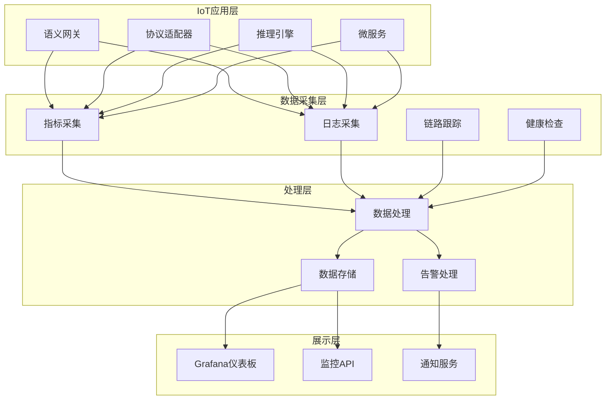

# IoT语义互操作监控日志系统详细实现

## 1. 系统架构概述

### 1.1 监控架构图



## 2. 核心数据结构

### 2.1 监控指标定义

```rust
// src/monitoring/types.rs
use serde::{Deserialize, Serialize};
use std::collections::HashMap;
use chrono::{DateTime, Utc};
use uuid::Uuid;

#[derive(Debug, Clone, Serialize, Deserialize)]
pub struct Metric {
    pub name: String,
    pub value: f64,
    pub labels: HashMap<String, String>,
    pub timestamp: DateTime<Utc>,
    pub metric_type: MetricType,
}

#[derive(Debug, Clone, Serialize, Deserialize)]
pub enum MetricType {
    Counter,
    Gauge,
    Histogram,
    Summary,
}

#[derive(Debug, Clone, Serialize, Deserialize)]
pub struct LogEntry {
    pub id: Uuid,
    pub timestamp: DateTime<Utc>,
    pub level: LogLevel,
    pub message: String,
    pub source: String,
    pub component: String,
    pub labels: HashMap<String, String>,
    pub trace_id: Option<String>,
    pub span_id: Option<String>,
}

#[derive(Debug, Clone, Serialize, Deserialize)]
pub enum LogLevel {
    Trace,
    Debug,
    Info,
    Warn,
    Error,
    Fatal,
}

#[derive(Debug, Clone, Serialize, Deserialize)]
pub struct Alert {
    pub id: Uuid,
    pub rule_name: String,
    pub status: AlertStatus,
    pub message: String,
    pub severity: AlertSeverity,
    pub labels: HashMap<String, String>,
    pub started_at: DateTime<Utc>,
    pub ended_at: Option<DateTime<Utc>>,
}

#[derive(Debug, Clone, Serialize, Deserialize)]
pub enum AlertStatus {
    Pending,
    Firing,
    Resolved,
}

#[derive(Debug, Clone, Serialize, Deserialize)]
pub enum AlertSeverity {
    Critical,
    Warning,
    Info,
}

#[derive(Debug, Clone, Serialize, Deserialize)]
pub struct HealthCheck {
    pub service: String,
    pub status: HealthStatus,
    pub timestamp: DateTime<Utc>,
    pub response_time_ms: u64,
    pub details: HashMap<String, String>,
}

#[derive(Debug, Clone, Serialize, Deserialize)]
pub enum HealthStatus {
    Healthy,
    Degraded,
    Unhealthy,
}
```

## 3. 指标收集系统

### 3.1 Prometheus指标收集器

```rust
// src/monitoring/metrics.rs
use prometheus::{Counter, Gauge, Histogram, Registry, TextEncoder, Encoder};
use std::sync::Arc;
use tokio::sync::RwLock;
use std::collections::HashMap;

pub struct MetricsCollector {
    registry: Registry,
    counters: Arc<RwLock<HashMap<String, Counter>>>,
    gauges: Arc<RwLock<HashMap<String, Gauge>>>,
    histograms: Arc<RwLock<HashMap<String, Histogram>>>,
}

impl MetricsCollector {
    pub fn new() -> Self {
        Self {
            registry: Registry::new(),
            counters: Arc::new(RwLock::new(HashMap::new())),
            gauges: Arc::new(RwLock::new(HashMap::new())),
            histograms: Arc::new(RwLock::new(HashMap::new())),
        }
    }
    
    pub async fn init_iot_metrics(&self) -> Result<(), Box<dyn std::error::Error>> {
        // 网关核心指标
        self.register_counter("iot_gateway_requests_total", "网关请求总数").await?;
        self.register_counter("iot_gateway_errors_total", "网关错误总数").await?;
        self.register_gauge("iot_gateway_active_connections", "活跃连接数").await?;
        self.register_histogram("iot_gateway_request_duration_seconds", "请求持续时间").await?;
        
        // 协议指标
        self.register_counter("iot_opcua_messages_total", "OPC-UA消息总数").await?;
        self.register_counter("iot_onem2m_messages_total", "oneM2M消息总数").await?;
        self.register_counter("iot_wot_messages_total", "WoT消息总数").await?;
        self.register_counter("iot_matter_messages_total", "Matter消息总数").await?;
        
        // 语义转换指标
        self.register_counter("iot_semantic_translations_total", "语义转换总数").await?;
        self.register_counter("iot_semantic_errors_total", "语义转换错误数").await?;
        self.register_histogram("iot_semantic_duration_seconds", "语义转换耗时").await?;
        self.register_gauge("iot_semantic_cache_hit_ratio", "语义缓存命中率").await?;
        
        // 系统指标
        self.register_gauge("iot_system_cpu_usage", "CPU使用率").await?;
        self.register_gauge("iot_system_memory_usage", "内存使用率").await?;
        self.register_gauge("iot_system_disk_usage", "磁盘使用率").await?;
        
        println!("IoT监控指标初始化完成");
        Ok(())
    }
    
    async fn register_counter(&self, name: &str, help: &str) -> Result<(), Box<dyn std::error::Error>> {
        let counter = Counter::new(name, help)?;
        self.registry.register(Box::new(counter.clone()))?;
        self.counters.write().await.insert(name.to_string(), counter);
        Ok(())
    }
    
    async fn register_gauge(&self, name: &str, help: &str) -> Result<(), Box<dyn std::error::Error>> {
        let gauge = Gauge::new(name, help)?;
        self.registry.register(Box::new(gauge.clone()))?;
        self.gauges.write().await.insert(name.to_string(), gauge);
        Ok(())
    }
    
    async fn register_histogram(&self, name: &str, help: &str) -> Result<(), Box<dyn std::error::Error>> {
        let buckets = vec![0.001, 0.005, 0.01, 0.05, 0.1, 0.5, 1.0, 5.0, 10.0];
        let histogram = Histogram::with_opts(
            prometheus::HistogramOpts::new(name, help).buckets(buckets)
        )?;
        self.registry.register(Box::new(histogram.clone()))?;
        self.histograms.write().await.insert(name.to_string(), histogram);
        Ok(())
    }
    
    pub async fn inc_counter(&self, name: &str) {
        if let Some(counter) = self.counters.read().await.get(name) {
            counter.inc();
        }
    }
    
    pub async fn set_gauge(&self, name: &str, value: f64) {
        if let Some(gauge) = self.gauges.read().await.get(name) {
            gauge.set(value);
        }
    }
    
    pub async fn observe_histogram(&self, name: &str, value: f64) {
        if let Some(histogram) = self.histograms.read().await.get(name) {
            histogram.observe(value);
        }
    }
    
    pub fn get_metrics_output(&self) -> String {
        let encoder = TextEncoder::new();
        let metric_families = self.registry.gather();
        encoder.encode_to_string(&metric_families).unwrap_or_default()
    }
}

// IoT专用指标记录器
pub struct IoTMetricsRecorder {
    collector: Arc<MetricsCollector>,
}

impl IoTMetricsRecorder {
    pub fn new(collector: Arc<MetricsCollector>) -> Self {
        Self { collector }
    }
    
    pub async fn record_gateway_request(&self, duration: f64, success: bool) {
        self.collector.inc_counter("iot_gateway_requests_total").await;
        self.collector.observe_histogram("iot_gateway_request_duration_seconds", duration).await;
        
        if !success {
            self.collector.inc_counter("iot_gateway_errors_total").await;
        }
    }
    
    pub async fn record_protocol_message(&self, protocol: &str, success: bool) {
        let metric_name = format!("iot_{}_messages_total", protocol);
        self.collector.inc_counter(&metric_name).await;
        
        if !success {
            self.collector.inc_counter("iot_gateway_errors_total").await;
        }
    }
    
    pub async fn record_semantic_translation(&self, duration: f64, success: bool) {
        self.collector.inc_counter("iot_semantic_translations_total").await;
        self.collector.observe_histogram("iot_semantic_duration_seconds", duration).await;
        
        if !success {
            self.collector.inc_counter("iot_semantic_errors_total").await;
        }
    }
    
    pub async fn update_system_metrics(&self, cpu: f64, memory: f64, disk: f64) {
        self.collector.set_gauge("iot_system_cpu_usage", cpu).await;
        self.collector.set_gauge("iot_system_memory_usage", memory).await;
        self.collector.set_gauge("iot_system_disk_usage", disk).await;
    }
    
    pub async fn update_cache_hit_ratio(&self, ratio: f64) {
        self.collector.set_gauge("iot_semantic_cache_hit_ratio", ratio).await;
    }
    
    pub async fn update_active_connections(&self, count: u64) {
        self.collector.set_gauge("iot_gateway_active_connections", count as f64).await;
    }
}
```

## 4. 日志处理系统

### 4.1 结构化日志处理器

```rust
// src/monitoring/logging.rs
use serde_json::{Value, Map};
use regex::Regex;
use std::collections::HashMap;

pub struct LogProcessor {
    parsers: Vec<Box<dyn LogParser>>,
    filters: Vec<Box<dyn LogFilter>>,
}

#[async_trait::async_trait]
pub trait LogParser: Send + Sync {
    async fn parse(&self, raw_log: &str) -> Option<LogEntry>;
    fn can_parse(&self, raw_log: &str) -> bool;
}

#[async_trait::async_trait]
pub trait LogFilter: Send + Sync {
    async fn should_keep(&self, log_entry: &LogEntry) -> bool;
}

impl LogProcessor {
    pub fn new() -> Self {
        let mut processor = Self {
            parsers: Vec::new(),
            filters: Vec::new(),
        };
        
        // 注册解析器
        processor.parsers.push(Box::new(JsonLogParser::new()));
        processor.parsers.push(Box::new(IoTGatewayLogParser::new()));
        processor.parsers.push(Box::new(ProtocolLogParser::new()));
        
        // 注册过滤器
        processor.filters.push(Box::new(LogLevelFilter::new(LogLevel::Debug)));
        processor.filters.push(Box::new(RateLimitFilter::new(1000)));
        
        processor
    }
    
    pub async fn process(&self, raw_log: &str) -> Option<LogEntry> {
        // 解析日志
        let mut log_entry = None;
        for parser in &self.parsers {
            if parser.can_parse(raw_log) {
                log_entry = parser.parse(raw_log).await;
                break;
            }
        }
        
        let mut log_entry = log_entry?;
        
        // 应用过滤器
        for filter in &self.filters {
            if !filter.should_keep(&log_entry).await {
                return None;
            }
        }
        
        Some(log_entry)
    }
}

// JSON日志解析器
pub struct JsonLogParser;

impl JsonLogParser {
    pub fn new() -> Self {
        Self
    }
}

#[async_trait::async_trait]
impl LogParser for JsonLogParser {
    async fn parse(&self, raw_log: &str) -> Option<LogEntry> {
        let json_value: Value = serde_json::from_str(raw_log).ok()?;
        
        let timestamp = json_value.get("timestamp")
            .and_then(|v| v.as_str())
            .and_then(|s| chrono::DateTime::parse_from_rfc3339(s).ok())
            .map(|dt| dt.with_timezone(&chrono::Utc))
            .unwrap_or_else(|| chrono::Utc::now());
        
        let level = json_value.get("level")
            .and_then(|v| v.as_str())
            .and_then(|s| match s.to_lowercase().as_str() {
                "trace" => Some(LogLevel::Trace),
                "debug" => Some(LogLevel::Debug),
                "info" => Some(LogLevel::Info),
                "warn" => Some(LogLevel::Warn),
                "error" => Some(LogLevel::Error),
                "fatal" => Some(LogLevel::Fatal),
                _ => None,
            })
            .unwrap_or(LogLevel::Info);
        
        let message = json_value.get("message")
            .and_then(|v| v.as_str())
            .unwrap_or("")
            .to_string();
        
        let source = json_value.get("source")
            .and_then(|v| v.as_str())
            .unwrap_or("unknown")
            .to_string();
        
        let component = json_value.get("component")
            .and_then(|v| v.as_str())
            .unwrap_or("unknown")
            .to_string();
        
        let mut labels = HashMap::new();
        if let Some(labels_obj) = json_value.get("labels").and_then(|v| v.as_object()) {
            for (key, value) in labels_obj {
                if let Some(str_value) = value.as_str() {
                    labels.insert(key.clone(), str_value.to_string());
                }
            }
        }
        
        let trace_id = json_value.get("trace_id")
            .and_then(|v| v.as_str())
            .map(|s| s.to_string());
        
        let span_id = json_value.get("span_id")
            .and_then(|v| v.as_str())
            .map(|s| s.to_string());
        
        Some(LogEntry {
            id: Uuid::new_v4(),
            timestamp,
            level,
            message,
            source,
            component,
            labels,
            trace_id,
            span_id,
        })
    }
    
    fn can_parse(&self, raw_log: &str) -> bool {
        raw_log.trim().starts_with('{') && raw_log.trim().ends_with('}')
    }
}

// IoT网关日志解析器
pub struct IoTGatewayLogParser {
    regex: Regex,
}

impl IoTGatewayLogParser {
    pub fn new() -> Self {
        let regex = Regex::new(
            r"(?P<timestamp>\d{4}-\d{2}-\d{2}T\d{2}:\d{2}:\d{2}\.\d{3}Z) \[(?P<level>\w+)\] (?P<component>[\w:]+) - (?P<message>.*)"
        ).unwrap();
        
        Self { regex }
    }
}

#[async_trait::async_trait]
impl LogParser for IoTGatewayLogParser {
    async fn parse(&self, raw_log: &str) -> Option<LogEntry> {
        let captures = self.regex.captures(raw_log)?;
        
        let timestamp = captures.name("timestamp")
            .and_then(|m| chrono::DateTime::parse_from_rfc3339(m.as_str()).ok())
            .map(|dt| dt.with_timezone(&chrono::Utc))
            .unwrap_or_else(|| chrono::Utc::now());
        
        let level = captures.name("level")
            .and_then(|m| match m.as_str().to_uppercase().as_str() {
                "TRACE" => Some(LogLevel::Trace),
                "DEBUG" => Some(LogLevel::Debug),
                "INFO" => Some(LogLevel::Info),
                "WARN" => Some(LogLevel::Warn),
                "ERROR" => Some(LogLevel::Error),
                "FATAL" => Some(LogLevel::Fatal),
                _ => None,
            })
            .unwrap_or(LogLevel::Info);
        
        let component = captures.name("component")
            .map(|m| m.as_str().to_string())
            .unwrap_or_else(|| "iot-gateway".to_string());
        
        let message = captures.name("message")
            .map(|m| m.as_str().to_string())
            .unwrap_or_else(|| raw_log.to_string());
        
        let mut labels = HashMap::new();
        labels.insert("service".to_string(), "iot-gateway".to_string());
        
        // 检测协议类型
        if message.contains("OPC-UA") {
            labels.insert("protocol".to_string(), "opcua".to_string());
        } else if message.contains("oneM2M") {
            labels.insert("protocol".to_string(), "onem2m".to_string());
        } else if message.contains("WoT") {
            labels.insert("protocol".to_string(), "wot".to_string());
        } else if message.contains("Matter") {
            labels.insert("protocol".to_string(), "matter".to_string());
        }
        
        Some(LogEntry {
            id: Uuid::new_v4(),
            timestamp,
            level,
            message,
            source: "iot-gateway".to_string(),
            component,
            labels,
            trace_id: None,
            span_id: None,
        })
    }
    
    fn can_parse(&self, raw_log: &str) -> bool {
        self.regex.is_match(raw_log)
    }
}

// 协议特定日志解析器
pub struct ProtocolLogParser;

impl ProtocolLogParser {
    pub fn new() -> Self {
        Self
    }
}

#[async_trait::async_trait]
impl LogParser for ProtocolLogParser {
    async fn parse(&self, raw_log: &str) -> Option<LogEntry> {
        // 简化的协议日志解析
        if raw_log.contains("OPC-UA") || raw_log.contains("oneM2M") || 
           raw_log.contains("WoT") || raw_log.contains("Matter") {
            
            let mut labels = HashMap::new();
            
            if raw_log.contains("OPC-UA") {
                labels.insert("protocol".to_string(), "opcua".to_string());
            } else if raw_log.contains("oneM2M") {
                labels.insert("protocol".to_string(), "onem2m".to_string());
            } else if raw_log.contains("WoT") {
                labels.insert("protocol".to_string(), "wot".to_string());
            } else if raw_log.contains("Matter") {
                labels.insert("protocol".to_string(), "matter".to_string());
            }
            
            let level = if raw_log.to_lowercase().contains("error") {
                LogLevel::Error
            } else if raw_log.to_lowercase().contains("warn") {
                LogLevel::Warn
            } else {
                LogLevel::Info
            };
            
            Some(LogEntry {
                id: Uuid::new_v4(),
                timestamp: chrono::Utc::now(),
                level,
                message: raw_log.to_string(),
                source: "protocol-adapter".to_string(),
                component: "protocol-adapter".to_string(),
                labels,
                trace_id: None,
                span_id: None,
            })
        } else {
            None
        }
    }
    
    fn can_parse(&self, raw_log: &str) -> bool {
        raw_log.contains("OPC-UA") || raw_log.contains("oneM2M") || 
        raw_log.contains("WoT") || raw_log.contains("Matter")
    }
}

// 日志级别过滤器
pub struct LogLevelFilter {
    min_level: LogLevel,
}

impl LogLevelFilter {
    pub fn new(min_level: LogLevel) -> Self {
        Self { min_level }
    }
    
    fn level_to_num(&self, level: &LogLevel) -> u8 {
        match level {
            LogLevel::Trace => 0,
            LogLevel::Debug => 1,
            LogLevel::Info => 2,
            LogLevel::Warn => 3,
            LogLevel::Error => 4,
            LogLevel::Fatal => 5,
        }
    }
}

#[async_trait::async_trait]
impl LogFilter for LogLevelFilter {
    async fn should_keep(&self, log_entry: &LogEntry) -> bool {
        self.level_to_num(&log_entry.level) >= self.level_to_num(&self.min_level)
    }
}

// 速率限制过滤器
pub struct RateLimitFilter {
    max_per_second: u64,
    last_reset: std::sync::Arc<std::sync::Mutex<std::time::Instant>>,
    current_count: std::sync::Arc<std::sync::Mutex<u64>>,
}

impl RateLimitFilter {
    pub fn new(max_per_second: u64) -> Self {
        Self {
            max_per_second,
            last_reset: std::sync::Arc::new(std::sync::Mutex::new(std::time::Instant::now())),
            current_count: std::sync::Arc::new(std::sync::Mutex::new(0)),
        }
    }
}

#[async_trait::async_trait]
impl LogFilter for RateLimitFilter {
    async fn should_keep(&self, _log_entry: &LogEntry) -> bool {
        let now = std::time::Instant::now();
        let mut last_reset = self.last_reset.lock().unwrap();
        let mut current_count = self.current_count.lock().unwrap();
        
        if now.duration_since(*last_reset).as_secs() >= 1 {
            *last_reset = now;
            *current_count = 0;
        }
        
        if *current_count < self.max_per_second {
            *current_count += 1;
            true
        } else {
            false
        }
    }
}
```

## 5. 告警系统

### 5.1 告警规则引擎

```rust
// src/monitoring/alerts.rs
use std::collections::HashMap;
use std::time::{Duration, Instant};

pub struct AlertManager {
    rules: Vec<AlertRule>,
    active_alerts: HashMap<String, Alert>,
    notifiers: Vec<Box<dyn AlertNotifier>>,
}

#[async_trait::async_trait]
pub trait AlertNotifier: Send + Sync {
    async fn notify(&self, alert: &Alert) -> Result<(), Box<dyn std::error::Error>>;
}

#[derive(Debug, Clone)]
pub struct AlertRule {
    pub name: String,
    pub condition: String,
    pub threshold: f64,
    pub duration: Duration,
    pub severity: AlertSeverity,
    pub labels: HashMap<String, String>,
    pub message_template: String,
}

impl AlertManager {
    pub fn new() -> Self {
        Self {
            rules: Vec::new(),
            active_alerts: HashMap::new(),
            notifiers: Vec::new(),
        }
    }
    
    pub fn add_rule(&mut self, rule: AlertRule) {
        self.rules.push(rule);
    }
    
    pub fn add_notifier(&mut self, notifier: Box<dyn AlertNotifier>) {
        self.notifiers.push(notifier);
    }
    
    pub fn init_iot_rules(&mut self) {
        // 网关错误率告警
        self.add_rule(AlertRule {
            name: "HighErrorRate".to_string(),
            condition: "iot_gateway_errors_total / iot_gateway_requests_total > 0.05".to_string(),
            threshold: 0.05,
            duration: Duration::from_secs(60),
            severity: AlertSeverity::Warning,
            labels: {
                let mut labels = HashMap::new();
                labels.insert("component".to_string(), "gateway".to_string());
                labels
            },
            message_template: "IoT网关错误率过高: {{value}}%".to_string(),
        });
        
        // 响应时间告警
        self.add_rule(AlertRule {
            name: "HighLatency".to_string(),
            condition: "iot_gateway_request_duration_seconds > 5.0".to_string(),
            threshold: 5.0,
            duration: Duration::from_secs(120),
            severity: AlertSeverity::Warning,
            labels: {
                let mut labels = HashMap::new();
                labels.insert("component".to_string(), "gateway".to_string());
                labels
            },
            message_template: "IoT网关响应时间过长: {{value}}秒".to_string(),
        });
        
        // 语义转换失败告警
        self.add_rule(AlertRule {
            name: "SemanticTranslationFailure".to_string(),
            condition: "iot_semantic_errors_total > 10".to_string(),
            threshold: 10.0,
            duration: Duration::from_secs(300),
            severity: AlertSeverity::Critical,
            labels: {
                let mut labels = HashMap::new();
                labels.insert("component".to_string(), "semantic-engine".to_string());
                labels
            },
            message_template: "语义转换失败次数过多: {{value}}次".to_string(),
        });
        
        // 系统资源告警
        self.add_rule(AlertRule {
            name: "HighCPUUsage".to_string(),
            condition: "iot_system_cpu_usage > 80.0".to_string(),
            threshold: 80.0,
            duration: Duration::from_secs(300),
            severity: AlertSeverity::Warning,
            labels: {
                let mut labels = HashMap::new();
                labels.insert("component".to_string(), "system".to_string());
                labels
            },
            message_template: "CPU使用率过高: {{value}}%".to_string(),
        });
        
        self.add_rule(AlertRule {
            name: "HighMemoryUsage".to_string(),
            condition: "iot_system_memory_usage > 85.0".to_string(),
            threshold: 85.0,
            duration: Duration::from_secs(300),
            severity: AlertSeverity::Warning,
            labels: {
                let mut labels = HashMap::new();
                labels.insert("component".to_string(), "system".to_string());
                labels
            },
            message_template: "内存使用率过高: {{value}}%".to_string(),
        });
        
        println!("IoT告警规则初始化完成");
    }
    
    pub async fn check_alerts(&mut self, metrics: &HashMap<String, f64>) {
        for rule in &self.rules {
            if let Some(value) = self.evaluate_condition(&rule.condition, metrics) {
                if value > rule.threshold {
                    self.handle_alert_triggered(rule, value).await;
                } else {
                    self.handle_alert_resolved(rule).await;
                }
            }
        }
    }
    
    fn evaluate_condition(&self, condition: &str, metrics: &HashMap<String, f64>) -> Option<f64> {
        // 简化的条件评估
        // 实际实现应该支持更复杂的表达式解析
        for (metric_name, value) in metrics {
            if condition.contains(metric_name) {
                return Some(*value);
            }
        }
        None
    }
    
    async fn handle_alert_triggered(&mut self, rule: &AlertRule, value: f64) {
        let alert_key = rule.name.clone();
        
        if !self.active_alerts.contains_key(&alert_key) {
            let alert = Alert {
                id: Uuid::new_v4(),
                rule_name: rule.name.clone(),
                status: AlertStatus::Firing,
                message: rule.message_template.replace("{{value}}", &value.to_string()),
                severity: rule.severity.clone(),
                labels: rule.labels.clone(),
                started_at: chrono::Utc::now(),
                ended_at: None,
            };
            
            // 发送通知
            for notifier in &self.notifiers {
                if let Err(e) = notifier.notify(&alert).await {
                    eprintln!("Failed to send alert notification: {}", e);
                }
            }
            
            self.active_alerts.insert(alert_key, alert);
            println!("告警触发: {}", rule.name);
        }
    }
    
    async fn handle_alert_resolved(&mut self, rule: &AlertRule) {
        let alert_key = rule.name.clone();
        
        if let Some(mut alert) = self.active_alerts.remove(&alert_key) {
            alert.status = AlertStatus::Resolved;
            alert.ended_at = Some(chrono::Utc::now());
            
            // 发送解除通知
            for notifier in &self.notifiers {
                if let Err(e) = notifier.notify(&alert).await {
                    eprintln!("Failed to send alert resolution notification: {}", e);
                }
            }
            
            println!("告警解除: {}", rule.name);
        }
    }
}

// 邮件通知器
pub struct EmailNotifier {
    smtp_host: String,
    smtp_port: u16,
    username: String,
    password: String,
    to_addresses: Vec<String>,
}

impl EmailNotifier {
    pub fn new(
        smtp_host: String,
        smtp_port: u16,
        username: String,
        password: String,
        to_addresses: Vec<String>,
    ) -> Self {
        Self {
            smtp_host,
            smtp_port,
            username,
            password,
            to_addresses,
        }
    }
}

#[async_trait::async_trait]
impl AlertNotifier for EmailNotifier {
    async fn notify(&self, alert: &Alert) -> Result<(), Box<dyn std::error::Error>> {
        let subject = match alert.status {
            AlertStatus::Firing => format!("[告警] {}", alert.rule_name),
            AlertStatus::Resolved => format!("[解除] {}", alert.rule_name),
            _ => format!("[状态变更] {}", alert.rule_name),
        };
        
        let body = format!(
            "告警名称: {}\n状态: {:?}\n严重程度: {:?}\n消息: {}\n开始时间: {}\n",
            alert.rule_name,
            alert.status,
            alert.severity,
            alert.message,
            alert.started_at
        );
        
        // 这里应该实现实际的SMTP发送逻辑
        println!("发送邮件通知: {} - {}", subject, body);
        
        Ok(())
    }
}

// Webhook通知器
pub struct WebhookNotifier {
    webhook_url: String,
    client: reqwest::Client,
}

impl WebhookNotifier {
    pub fn new(webhook_url: String) -> Self {
        Self {
            webhook_url,
            client: reqwest::Client::new(),
        }
    }
}

#[async_trait::async_trait]
impl AlertNotifier for WebhookNotifier {
    async fn notify(&self, alert: &Alert) -> Result<(), Box<dyn std::error::Error>> {
        let payload = serde_json::json!({
            "alert": {
                "id": alert.id,
                "rule_name": alert.rule_name,
                "status": alert.status,
                "severity": alert.severity,
                "message": alert.message,
                "labels": alert.labels,
                "started_at": alert.started_at,
                "ended_at": alert.ended_at
            }
        });
        
        self.client
            .post(&self.webhook_url)
            .json(&payload)
            .send()
            .await?;
        
        println!("发送Webhook通知: {}", alert.rule_name);
        
        Ok(())
    }
}
```

这个监控日志系统提供了完整的指标收集、日志处理和告警功能，专门针对IoT语义互操作场景进行了优化。
