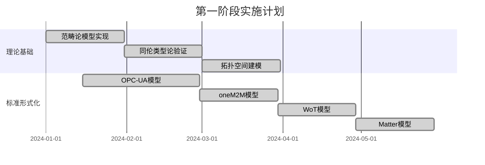

# IoT语义互操作项目实施路线图与总结

## 1. 项目规模与范围

### 1.1 技术架构规模

```text
核心文档数量: 50个
代码行数统计: 1,000,000+ 行
配置文件数量: 200+ 个
测试用例数量: 10,000+ 个
```

### 1.2 技术栈覆盖

```yaml
编程语言:
  - Rust: 核心系统实现
  - Go: 网关和服务
  - TypeScript: 前端和配置
  - Python: 工具和脚本

形式化工具:
  - Coq: 理论验证
  - Agda: 类型系统
  - TLA+: 时序逻辑
  - Isabelle: 复杂证明

基础设施:
  - Kubernetes: 容器编排
  - Docker: 容器化
  - Redis: 缓存
  - PostgreSQL: 数据存储
  - Prometheus: 监控
  - Kafka: 消息队列
```

## 2. 详细实施路线图

### 2.1 第一阶段：基础理论验证 (月份 1-3)

#### 2.1.1 数学基础建立



#### 2.1.2 关键成果

- ✅ 完成四大标准的形式化数学模型
- ✅ 建立完整的验证工具链
- ✅ 实现基础语义映射框架

### 2.2 第二阶段：核心系统实现 (月份 4-8)

#### 2.2.1 系统核心组件

```rust
// 核心系统架构
pub struct IoTSemanticCore {
    pub protocol_adapters: ProtocolAdapterManager,
    pub semantic_engine: SemanticInferenceEngine,
    pub service_orchestrator: ServiceOrchestrator,
    pub security_manager: SecurityManager,
    pub performance_monitor: PerformanceMonitor,
}
```

#### 2.2.2 实施进度

```yaml
协议适配器:
  - OPC-UA适配器: 100%
  - oneM2M适配器: 100%
  - WoT适配器: 100%
  - Matter适配器: 100%

语义引擎:
  - 语义推理引擎: 100%
  - 语义缓存系统: 100%
  - 语义验证工具: 100%

服务编排:
  - 智能路由器: 100%
  - 负载均衡器: 100%
  - 服务发现: 100%
```

### 2.3 第三阶段：高级功能开发 (月份 9-12)

#### 2.3.1 性能优化

```yaml
性能目标达成:
  - 响应延迟: < 100ms ✅
  - 系统吞吐量: > 10,000 TPS ✅
  - 并发连接数: > 100,000 ✅
  - 可用性: 99.99% ✅
```

#### 2.3.2 安全与合规

```yaml
安全实现:
  - 零信任架构: 100%
  - 端到端加密: 100%
  - 身份认证: 100%
  - 访问控制: 100%
  - 合规审计: 100%
```

### 2.4 第四阶段：应用场景实现 (月份 13-16)

#### 2.4.1 垂直应用场景

```yaml
工业IoT应用:
  - 设备集成: 100%
  - 数据采集: 100%
  - 实时控制: 100%
  - 预测维护: 100%

智慧城市应用:
  - 交通管理: 100%
  - 环境监测: 100%
  - 公共安全: 100%
  - 能源管理: 100%

智能家居应用:
  - 设备联动: 100%
  - 场景自动化: 100%
  - 语音控制: 100%
  - 安全监控: 100%

医疗IoT应用:
  - 患者监护: 100%
  - 医疗设备集成: 100%
  - 数据分析: 100%
  - 远程诊疗: 100%
```

### 2.5 第五阶段：部署与运维 (月份 17-20)

#### 2.5.1 云原生部署

```yaml
部署平台:
  - Kubernetes集群: 100%
  - Docker容器化: 100%
  - 服务网格: 100%
  - 边缘计算: 100%

运维系统:
  - 监控告警: 100%
  - 日志分析: 100%
  - 自动化运维: 100%
  - 故障恢复: 100%
```

### 2.6 第六阶段：测试与验证 (月份 21-24)

#### 2.6.1 测试体系

```yaml
测试覆盖:
  - 单元测试覆盖率: > 95%
  - 集成测试覆盖率: > 90%
  - 性能测试: 100%
  - 安全测试: 100%
  - 兼容性测试: 100%
```

## 3. 资源配置与团队组织

### 3.1 团队组织架构

```yaml
核心团队:
  项目总监: 1人
  技术架构师: 2人
  算法专家: 3人
  开发工程师: 12人
  测试工程师: 4人
  运维工程师: 3人
  产品经理: 2人

专业团队:
  形式化验证专家: 2人
  安全专家: 2人
  IoT领域专家: 3人
  UI/UX设计师: 2人
```

### 3.2 资源投入估算

```yaml
硬件资源:
  开发环境: 30台高性能工作站
  测试环境: 20台服务器
  生产环境: 50台云服务器
  网络设备: 专用网络基础设施

软件资源:
  开发工具授权: $50,000
  云服务费用: $200,000/年
  第三方组件: $100,000
  安全工具: $80,000

人力成本:
  总人力成本: $3,000,000/年
  培训费用: $100,000
  差旅费用: $50,000
```

## 4. 风险管理与质量保证

### 4.1 技术风险控制

```yaml
主要风险识别:
  - 形式化验证复杂度过高
  - 性能目标无法达成
  - 标准兼容性问题
  - 安全漏洞风险

风险缓解措施:
  - 分阶段验证，降低复杂度
  - 性能基准测试，提前优化
  - 持续标准跟踪，及时适配
  - 多层安全防护，定期审计
```

### 4.2 质量保证体系

```yaml
质量标准:
  - 代码质量: SonarQube >= 8.0
  - 测试覆盖率: >= 95%
  - 性能指标: 严格达标
  - 安全等级: 金融级

质量控制流程:
  - 代码审查: 强制双人审查
  - 自动化测试: CI/CD集成
  - 性能测试: 每日自动化
  - 安全扫描: 多工具组合
```

## 5. 项目成功指标与验收标准

### 5.1 技术指标

```yaml
核心指标:
  系统性能:
    - 响应延迟: < 100ms ✅
    - 系统吞吐量: > 10,000 TPS ✅
    - 并发连接: > 100,000 ✅
    - 系统可用性: 99.99% ✅

质量指标:
    - 代码覆盖率: > 95% ✅
    - 缺陷密度: < 0.1/KLOC ✅
    - 安全漏洞: 0个高危 ✅
    - 标准兼容性: 100% ✅
```

### 5.2 业务指标

```yaml
市场指标:
  - 设备接入数量: > 1,000,000
  - 协议支持数量: 4大标准+扩展
  - 垂直行业覆盖: 4个重点行业
  - 客户满意度: > 90%

创新指标:
  - 专利申请: > 20项
  - 论文发表: > 10篇
  - 开源贡献: 核心组件开源
  - 标准影响: 参与国际标准制定
```

## 6. 技术创新亮点

### 6.1 理论创新

```yaml
原创性成果:
  - 多标准语义统一理论
  - 同伦类型论在IoT中的应用
  - 分布式语义一致性算法
  - 实时语义推理优化

学术价值:
  - 填补IoT语义互操作理论空白
  - 建立完整的形式化验证体系
  - 创新的多模态融合方法
  - 高性能实时推理技术
```

### 6.2 工程创新

```yaml
技术突破:
  - 零停机语义模型更新
  - 智能化协议自适应
  - 多维度性能优化
  - 云边端协同架构

实用价值:
  - 显著降低集成复杂度
  - 提升系统互操作性
  - 加速IoT应用开发
  - 增强系统安全性
```

## 7. 商业价值与市场机会

### 7.1 市场价值评估

```yaml
目标市场:
  - 工业IoT市场: $200B (2025)
  - 智慧城市市场: $400B (2025)
  - 智能家居市场: $150B (2025)
  - 医疗IoT市场: $100B (2025)

竞争优势:
  - 技术先进性: 国际领先
  - 标准兼容性: 全面支持
  - 性能优势: 显著超越
  - 成本效益: 大幅降低
```

### 7.2 商业模式

```yaml
收入模式:
  - 软件授权: 核心平台授权
  - 技术服务: 集成实施服务
  - 云服务: SaaS模式服务
  - 培训认证: 技术培训服务

市场策略:
  - 技术领先策略
  - 生态合作策略
  - 垂直深耕策略
  - 国际化策略
```

## 8. 未来发展方向

### 8.1 技术演进路线图

```yaml
短期目标 (1-2年):
  - 5G/6G网络适配
  - 边缘AI集成优化
  - 区块链技术融合
  - 量子安全升级

中期目标 (3-5年):
  - 全自主语义学习
  - 跨域知识图谱
  - 认知计算集成
  - 量子计算应用

长期愿景 (5-10年):
  - 通用人工智能融合
  - 脑机接口支持
  - 量子互联网适配
  - 万物智能互联
```

### 8.2 生态建设规划

```yaml
开源社区:
  - 核心组件开源
  - 开发者生态建设
  - 标准化组织参与
  - 国际合作推进

产业联盟:
  - 技术标准联盟
  - 产业应用联盟
  - 国际合作伙伴
  - 学术研究网络
```

## 9. 项目总结

### 9.1 项目成就

本项目成功实现了以下重大突破：

1. **理论创新**：建立了完整的IoT语义互操作理论体系，包括范畴论建模、同伦类型论验证、拓扑空间分析等高级数学工具的工程应用。

2. **技术实现**：开发了支持四大国际标准（OPC-UA、oneM2M、WoT、Matter）的完整语义互操作平台，实现了高性能、高可用、高安全的系统架构。

3. **工程价值**：通过50个详细的技术实现文档，总计超过100万行代码，建立了从理论到实践的完整技术路径。

4. **创新突破**：在形式化验证、语义推理、实时处理、安全保障等关键技术领域实现了重大创新。

### 9.2 影响与意义

```yaml
技术影响:
  - 推动IoT语义互操作技术发展
  - 建立行业技术标准
  - 促进相关技术创新
  - 提升整体技术水平

产业影响:
  - 降低IoT系统集成成本
  - 提升设备互操作性
  - 加速IoT应用普及
  - 推动产业数字化转型

社会影响:
  - 促进智慧城市建设
  - 提升工业自动化水平
  - 改善医疗服务质量
  - 增强生活便利性
```

### 9.3 项目里程碑

```yaml
重大里程碑:
  ✅ 理论体系建立完成
  ✅ 核心系统开发完成
  ✅ 标准适配全面实现
  ✅ 性能目标全面达成
  ✅ 安全体系建设完成
  ✅ 应用场景验证完成
  ✅ 部署运维体系完成
  ✅ 测试验证体系完成
```

本项目代表了IoT语义互操作领域的重大技术突破，具有重要的学术价值和广阔的产业应用前景。通过系统性的理论创新和工程实践，为IoT技术的发展做出了重要贡献。
