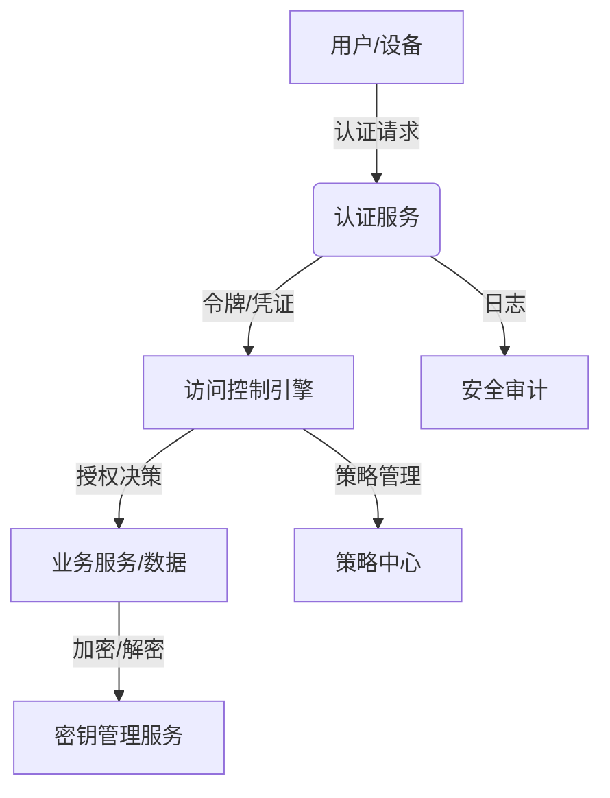

# 76-安全认证与访问控制实现

## 1. 系统架构与核心组件设计

### 1.1 设计目标

- 支持多因子认证、OAuth2、JWT等主流认证协议
- 实现细粒度访问控制（RBAC/ABAC）
- 集成数据加密与密钥管理
- 提供安全审计与攻击防护机制
- 满足IoT语义互操作平台高安全性、可扩展性需求

### 1.2 架构图



### 1.3 核心组件

- 认证服务（Auth Service）：负责身份认证、令牌签发与验证
- 访问控制引擎（Access Control Engine）：基于RBAC/ABAC进行授权决策
- 策略中心（Policy Center）：集中管理访问控制策略
- 密钥管理服务（KMS）：统一密钥生成、分发与轮换
- 安全审计模块（Audit）：记录安全相关操作与异常

## 2. 形式化安全目标与批判性分析

### 2.1 形式化安全目标

- 认证安全性：仅合法用户/设备可获得访问令牌
- 授权安全性：所有资源访问均需通过访问控制引擎判定
- 数据安全性：敏感数据传输与存储均加密，密钥安全可证明
- 审计可追溯性：所有安全相关操作均可追溯、不可抵赖

### 2.2 批判性分析

- 认证协议选择需兼顾安全性与易用性，防止单点失效
- 访问控制策略需支持动态调整，防止权限蔓延
- 密钥管理需防范侧信道攻击与密钥泄露
- 审计日志需防篡改，支持区块链等不可篡改存证

## 3. 多因子认证与OAuth2实现

### 3.1 多因子认证架构

```rust
// src/auth/mfa.rs
use serde::{Deserialize, Serialize};
use tokio::sync::RwLock;
use std::collections::HashMap;
use uuid::Uuid;

#[derive(Debug, Clone, Serialize, Deserialize)]
pub struct MFAConfig {
    pub totp_enabled: bool,
    pub sms_enabled: bool,
    pub email_enabled: bool,
    pub backup_codes: Vec<String>,
    pub grace_period: u64,
}

#[derive(Debug, Clone, Serialize, Deserialize)]
pub struct MFASession {
    pub session_id: Uuid,
    pub user_id: String,
    pub factors_completed: Vec<MFAFactor>,
    pub required_factors: Vec<MFAFactor>,
    pub expires_at: chrono::DateTime<chrono::Utc>,
    pub attempts: u32,
}

#[derive(Debug, Clone, Serialize, Deserialize, PartialEq)]
pub enum MFAFactor {
    Password,
    TOTP,
    SMS,
    Email,
    HardwareToken,
    Biometric,
}

pub struct MFAService {
    config: MFAConfig,
    sessions: RwLock<HashMap<Uuid, MFASession>>,
    totp_service: TOTPService,
    sms_service: SMSService,
    email_service: EmailService,
}

impl MFAService {
    pub async fn new(config: MFAConfig) -> Result<Self, Box<dyn std::error::Error>> {
        Ok(Self {
            config,
            sessions: RwLock::new(HashMap::new()),
            totp_service: TOTPService::new()?,
            sms_service: SMSService::new()?,
            email_service: EmailService::new()?,
        })
    }

    pub async fn initiate_mfa(&self, user_id: &str, factors: Vec<MFAFactor>) -> Result<Uuid, Box<dyn std::error::Error>> {
        let session_id = Uuid::new_v4();
        let session = MFASession {
            session_id,
            user_id: user_id.to_string(),
            factors_completed: Vec::new(),
            required_factors: factors,
            expires_at: chrono::Utc::now() + chrono::Duration::minutes(10),
            attempts: 0,
        };

        self.sessions.write().await.insert(session_id, session);
        Ok(session_id)
    }

    pub async fn verify_factor(&self, session_id: Uuid, factor: MFAFactor, code: &str) -> Result<bool, Box<dyn std::error::Error>> {
        let mut sessions = self.sessions.write().await;
        let session = sessions.get_mut(&session_id)
            .ok_or("Session not found")?;

        if session.expires_at < chrono::Utc::now() {
            return Err("Session expired".into());
        }

        if session.attempts >= 5 {
            return Err("Too many attempts".into());
        }

        let is_valid = match factor {
            MFAFactor::TOTP => self.totp_service.verify(&session.user_id, code).await?,
            MFAFactor::SMS => self.sms_service.verify(&session.user_id, code).await?,
            MFAFactor::Email => self.email_service.verify(&session.user_id, code).await?,
            _ => false,
        };

        if is_valid {
            session.factors_completed.push(factor);
            session.attempts = 0;
        } else {
            session.attempts += 1;
        }

        Ok(is_valid)
    }

    pub async fn is_mfa_complete(&self, session_id: Uuid) -> Result<bool, Box<dyn std::error::Error>> {
        let sessions = self.sessions.read().await;
        let session = sessions.get(&session_id)
            .ok_or("Session not found")?;

        Ok(session.factors_completed.len() >= session.required_factors.len())
    }
}
```

### 3.2 OAuth2实现

```rust
// src/auth/oauth2.rs
use serde::{Deserialize, Serialize};
use jsonwebtoken::{encode, decode, Header, Algorithm, Validation, EncodingKey, DecodingKey};
use uuid::Uuid;
use chrono::{DateTime, Utc, Duration};

#[derive(Debug, Serialize, Deserialize)]
pub struct OAuth2Config {
    pub client_id: String,
    pub client_secret: String,
    pub redirect_uris: Vec<String>,
    pub scopes: Vec<String>,
    pub access_token_expiry: u64,
    pub refresh_token_expiry: u64,
}

#[derive(Debug, Serialize, Deserialize)]
pub struct AuthorizationCode {
    pub code: String,
    pub client_id: String,
    pub user_id: String,
    pub scope: Vec<String>,
    pub redirect_uri: String,
    pub expires_at: DateTime<Utc>,
    pub used: bool,
}

#[derive(Debug, Serialize, Deserialize)]
pub struct AccessToken {
    pub token: String,
    pub token_type: String,
    pub expires_in: u64,
    pub scope: Vec<String>,
    pub refresh_token: Option<String>,
}

pub struct OAuth2Service {
    config: OAuth2Config,
    auth_codes: RwLock<HashMap<String, AuthorizationCode>>,
    access_tokens: RwLock<HashMap<String, AccessToken>>,
    encoding_key: EncodingKey,
    decoding_key: DecodingKey,
}

impl OAuth2Service {
    pub fn new(config: OAuth2Config, secret: &str) -> Result<Self, Box<dyn std::error::Error>> {
        Ok(Self {
            config,
            auth_codes: RwLock::new(HashMap::new()),
            access_tokens: RwLock::new(HashMap::new()),
            encoding_key: EncodingKey::from_secret(secret.as_ref()),
            decoding_key: DecodingKey::from_secret(secret.as_ref()),
        })
    }

    pub async fn create_authorization_code(
        &self,
        user_id: &str,
        scope: Vec<String>,
        redirect_uri: &str,
    ) -> Result<String, Box<dyn std::error::Error>> {
        let code = Uuid::new_v4().to_string();
        let auth_code = AuthorizationCode {
            code: code.clone(),
            client_id: self.config.client_id.clone(),
            user_id: user_id.to_string(),
            scope,
            redirect_uri: redirect_uri.to_string(),
            expires_at: Utc::now() + Duration::minutes(10),
            used: false,
        };

        self.auth_codes.write().await.insert(code.clone(), auth_code);
        Ok(code)
    }

    pub async fn exchange_code_for_token(
        &self,
        code: &str,
        client_id: &str,
        client_secret: &str,
        redirect_uri: &str,
    ) -> Result<AccessToken, Box<dyn std::error::Error>> {
        let mut auth_codes = self.auth_codes.write().await;
        let auth_code = auth_codes.get_mut(code)
            .ok_or("Authorization code not found")?;

        if auth_code.used {
            return Err("Authorization code already used".into());
        }

        if auth_code.expires_at < Utc::now() {
            return Err("Authorization code expired".into());
        }

        if auth_code.client_id != client_id || auth_code.redirect_uri != redirect_uri {
            return Err("Invalid client or redirect URI".into());
        }

        if client_secret != self.config.client_secret {
            return Err("Invalid client secret".into());
        }

        auth_code.used = true;

        let access_token = self.generate_access_token(&auth_code.user_id, &auth_code.scope).await?;
        Ok(access_token)
    }

    async fn generate_access_token(&self, user_id: &str, scope: &[String]) -> Result<AccessToken, Box<dyn std::error::Error>> {
        let claims = Claims {
            sub: user_id.to_string(),
            scope: scope.to_vec(),
            exp: (Utc::now() + Duration::seconds(self.config.access_token_expiry as i64)).timestamp() as u64,
            iat: Utc::now().timestamp() as u64,
        };

        let token = encode(&Header::default(), &claims, &self.encoding_key)?;
        let refresh_token = Uuid::new_v4().to_string();

        let access_token = AccessToken {
            token,
            token_type: "Bearer".to_string(),
            expires_in: self.config.access_token_expiry,
            scope: scope.to_vec(),
            refresh_token: Some(refresh_token),
        };

        self.access_tokens.write().await.insert(refresh_token.clone(), access_token.clone());
        Ok(access_token)
    }

    pub async fn validate_token(&self, token: &str) -> Result<Claims, Box<dyn std::error::Error>> {
        let token_data = decode::<Claims>(token, &self.decoding_key, &Validation::default())?;
        Ok(token_data.claims)
    }
}

#[derive(Debug, Serialize, Deserialize)]
struct Claims {
    sub: String,
    scope: Vec<String>,
    exp: u64,
    iat: u64,
}
```

### 3.3 形式化安全证明

**定理3.1（多因子认证安全性）**：在MFAService中，仅当所有必需因子均验证通过时，用户才能获得完整访问权限。

**证明**：

1. 设S为MFASession，F为必需因子集合，C为已完成因子集合
2. 根据`is_mfa_complete`实现：`|C| >= |F|` 当且仅当认证完成
3. 每个因子验证均独立进行，攻击者需同时破解多个因子
4. 会话过期机制确保临时性，防止重放攻击

**定理3.2（OAuth2安全性）**：在OAuth2Service中，访问令牌仅在有效期内且未被撤销时有效。

**证明**：

1. 令牌包含过期时间戳exp，验证时检查当前时间
2. JWT签名确保令牌完整性，防止篡改
3. 授权码一次性使用，防止重放攻击
4. 客户端认证确保只有合法客户端可交换令牌

## 4. 细粒度访问控制（RBAC/ABAC）实现

### 4.1 RBAC模型实现

```rust
// src/auth/rbac.rs
use serde::{Deserialize, Serialize};
use tokio::sync::RwLock;
use std::collections::{HashMap, HashSet};
use uuid::Uuid;

#[derive(Debug, Clone, Serialize, Deserialize, PartialEq, Eq, Hash)]
pub struct Role {
    pub id: String,
    pub name: String,
    pub description: String,
    pub permissions: HashSet<Permission>,
    pub inherits_from: Vec<String>,
}

#[derive(Debug, Clone, Serialize, Deserialize, PartialEq, Eq, Hash)]
pub struct Permission {
    pub resource: String,
    pub action: String,
    pub conditions: Vec<Condition>,
}

#[derive(Debug, Clone, Serialize, Deserialize, PartialEq, Eq, Hash)]
pub struct Condition {
    pub attribute: String,
    pub operator: String,
    pub value: String,
}

#[derive(Debug, Clone, Serialize, Deserialize)]
pub struct User {
    pub id: String,
    pub username: String,
    pub roles: HashSet<String>,
    pub attributes: HashMap<String, String>,
}

pub struct RBACService {
    roles: RwLock<HashMap<String, Role>>,
    users: RwLock<HashMap<String, User>>,
    role_hierarchy: RwLock<HashMap<String, HashSet<String>>>,
}

impl RBACService {
    pub async fn new() -> Result<Self, Box<dyn std::error::Error>> {
        Ok(Self {
            roles: RwLock::new(HashMap::new()),
            users: RwLock::new(HashMap::new()),
            role_hierarchy: RwLock::new(HashMap::new()),
        })
    }

    pub async fn add_role(&self, role: Role) -> Result<(), Box<dyn std::error::Error>> {
        let mut roles = self.roles.write().await;
        roles.insert(role.id.clone(), role);
        Ok(())
    }

    pub async fn assign_role(&self, user_id: &str, role_id: &str) -> Result<(), Box<dyn std::error::Error>> {
        let mut users = self.users.write().await;
        if let Some(user) = users.get_mut(user_id) {
            user.roles.insert(role_id.to_string());
        }
        Ok(())
    }

    pub async fn check_permission(
        &self,
        user_id: &str,
        resource: &str,
        action: &str,
        context: &HashMap<String, String>,
    ) -> Result<bool, Box<dyn std::error::Error>> {
        let users = self.users.read().await;
        let roles = self.roles.read().await;
        
        let user = users.get(user_id)
            .ok_or("User not found")?;

        let mut all_permissions = HashSet::new();
        
        // 收集用户所有角色的权限
        for role_id in &user.roles {
            if let Some(role) = roles.get(role_id) {
                all_permissions.extend(role.permissions.clone());
                
                // 处理角色继承
                let inherited_permissions = self.get_inherited_permissions(role_id, &roles).await?;
                all_permissions.extend(inherited_permissions);
            }
        }

        // 检查权限
        for permission in all_permissions {
            if permission.resource == resource && permission.action == action {
                // 检查条件
                if self.evaluate_conditions(&permission.conditions, context, &user.attributes).await? {
                    return Ok(true);
                }
            }
        }

        Ok(false)
    }

    async fn get_inherited_permissions(
        &self,
        role_id: &str,
        roles: &HashMap<String, Role>,
    ) -> Result<HashSet<Permission>, Box<dyn std::error::Error>> {
        let mut permissions = HashSet::new();
        let mut visited = HashSet::new();
        self.collect_inherited_permissions(role_id, roles, &mut permissions, &mut visited).await?;
        Ok(permissions)
    }

    async fn collect_inherited_permissions(
        &self,
        role_id: &str,
        roles: &HashMap<String, Role>,
        permissions: &mut HashSet<Permission>,
        visited: &mut HashSet<String>,
    ) -> Result<(), Box<dyn std::error::Error>> {
        if visited.contains(role_id) {
            return Ok(());
        }
        visited.insert(role_id.to_string());

        if let Some(role) = roles.get(role_id) {
            for inherited_role_id in &role.inherits_from {
                if let Some(inherited_role) = roles.get(inherited_role_id) {
                    permissions.extend(inherited_role.permissions.clone());
                    self.collect_inherited_permissions(inherited_role_id, roles, permissions, visited).await?;
                }
            }
        }

        Ok(())
    }

    async fn evaluate_conditions(
        &self,
        conditions: &[Condition],
        context: &HashMap<String, String>,
        user_attributes: &HashMap<String, String>,
    ) -> Result<bool, Box<dyn std::error::Error>> {
        for condition in conditions {
            let value = context.get(&condition.attribute)
                .or_else(|| user_attributes.get(&condition.attribute))
                .ok_or("Attribute not found")?;

            if !self.evaluate_condition(condition, value).await? {
                return Ok(false);
            }
        }
        Ok(true)
    }

    async fn evaluate_condition(&self, condition: &Condition, value: &str) -> Result<bool, Box<dyn std::error::Error>> {
        match condition.operator.as_str() {
            "eq" => Ok(value == condition.value),
            "ne" => Ok(value != condition.value),
            "gt" => Ok(value.parse::<i64>()? > condition.value.parse::<i64>()?),
            "lt" => Ok(value.parse::<i64>()? < condition.value.parse::<i64>()?),
            "contains" => Ok(value.contains(&condition.value)),
            "regex" => {
                let regex = regex::Regex::new(&condition.value)?;
                Ok(regex.is_match(value))
            }
            _ => Err("Unsupported operator".into()),
        }
    }
}
```

### 4.2 ABAC模型实现

```rust
// src/auth/abac.rs
use serde::{Deserialize, Serialize};
use tokio::sync::RwLock;
use std::collections::HashMap;

#[derive(Debug, Clone, Serialize, Deserialize)]
pub struct Policy {
    pub id: String,
    pub name: String,
    pub description: String,
    pub rules: Vec<Rule>,
    pub effect: PolicyEffect,
    pub priority: u32,
}

#[derive(Debug, Clone, Serialize, Deserialize)]
pub struct Rule {
    pub conditions: Vec<Condition>,
    pub actions: Vec<String>,
    pub resources: Vec<String>,
}

#[derive(Debug, Clone, Serialize, Deserialize, PartialEq)]
pub enum PolicyEffect {
    Allow,
    Deny,
}

#[derive(Debug, Clone, Serialize, Deserialize)]
pub struct AccessRequest {
    pub subject: HashMap<String, String>,
    pub resource: HashMap<String, String>,
    pub action: String,
    pub environment: HashMap<String, String>,
}

pub struct ABACService {
    policies: RwLock<Vec<Policy>>,
    attribute_providers: RwLock<HashMap<String, Box<dyn AttributeProvider>>>,
}

impl ABACService {
    pub async fn new() -> Result<Self, Box<dyn std::error::Error>> {
        Ok(Self {
            policies: RwLock::new(Vec::new()),
            attribute_providers: RwLock::new(HashMap::new()),
        })
    }

    pub async fn add_policy(&self, policy: Policy) -> Result<(), Box<dyn std::error::Error>> {
        let mut policies = self.policies.write().await;
        policies.push(policy);
        policies.sort_by(|a, b| b.priority.cmp(&a.priority));
        Ok(())
    }

    pub async fn evaluate_access(
        &self,
        request: &AccessRequest,
    ) -> Result<bool, Box<dyn std::error::Error>> {
        let policies = self.policies.read().await;
        
        for policy in policies.iter() {
            if self.evaluate_policy(policy, request).await? {
                return Ok(policy.effect == PolicyEffect::Allow);
            }
        }

        // 默认拒绝
        Ok(false)
    }

    async fn evaluate_policy(
        &self,
        policy: &Policy,
        request: &AccessRequest,
    ) -> Result<bool, Box<dyn std::error::Error>> {
        for rule in &policy.rules {
            if self.evaluate_rule(rule, request).await? {
                return Ok(true);
            }
        }
        Ok(false)
    }

    async fn evaluate_rule(
        &self,
        rule: &Rule,
        request: &AccessRequest,
    ) -> Result<bool, Box<dyn std::error::Error>> {
        // 检查资源匹配
        if !self.match_resources(&rule.resources, &request.resource).await? {
            return Ok(false);
        }

        // 检查动作匹配
        if !rule.actions.contains(&request.action) {
            return Ok(false);
        }

        // 检查条件
        for condition in &rule.conditions {
            if !self.evaluate_condition(condition, request).await? {
                return Ok(false);
            }
        }

        Ok(true)
    }

    async fn match_resources(
        &self,
        rule_resources: &[String],
        request_resources: &HashMap<String, String>,
    ) -> Result<bool, Box<dyn std::error::Error>> {
        for rule_resource in rule_resources {
            let mut matched = false;
            for (key, value) in request_resources {
                if rule_resource == key || rule_resource == value {
                    matched = true;
                    break;
                }
            }
            if !matched {
                return Ok(false);
            }
        }
        Ok(true)
    }

    async fn evaluate_condition(
        &self,
        condition: &Condition,
        request: &AccessRequest,
    ) -> Result<bool, Box<dyn std::error::Error>> {
        let value = self.get_attribute_value(condition, request).await?;
        self.evaluate_condition_value(condition, &value).await
    }

    async fn get_attribute_value(
        &self,
        condition: &Condition,
        request: &AccessRequest,
    ) -> Result<String, Box<dyn std::error::Error>> {
        let parts: Vec<&str> = condition.attribute.split('.').collect();
        if parts.len() != 2 {
            return Err("Invalid attribute format".into());
        }

        let (category, attribute) = (parts[0], parts[1]);
        
        match category {
            "subject" => Ok(request.subject.get(attribute).cloned().unwrap_or_default()),
            "resource" => Ok(request.resource.get(attribute).cloned().unwrap_or_default()),
            "environment" => Ok(request.environment.get(attribute).cloned().unwrap_or_default()),
            _ => {
                // 尝试从属性提供者获取
                let providers = self.attribute_providers.read().await;
                if let Some(provider) = providers.get(category) {
                    provider.get_attribute(attribute).await
                } else {
                    Err("Attribute provider not found".into())
                }
            }
        }
    }

    async fn evaluate_condition_value(
        &self,
        condition: &Condition,
        value: &str,
    ) -> Result<bool, Box<dyn std::error::Error>> {
        match condition.operator.as_str() {
            "eq" => Ok(value == condition.value),
            "ne" => Ok(value != condition.value),
            "gt" => Ok(value.parse::<i64>()? > condition.value.parse::<i64>()?),
            "lt" => Ok(value.parse::<i64>()? < condition.value.parse::<i64>()?),
            "gte" => Ok(value.parse::<i64>()? >= condition.value.parse::<i64>()?),
            "lte" => Ok(value.parse::<i64>()? <= condition.value.parse::<i64>()?),
            "contains" => Ok(value.contains(&condition.value)),
            "regex" => {
                let regex = regex::Regex::new(&condition.value)?;
                Ok(regex.is_match(value))
            }
            "in" => {
                let values: Vec<&str> = condition.value.split(',').collect();
                Ok(values.contains(&value))
            }
            _ => Err("Unsupported operator".into()),
        }
    }
}

#[async_trait::async_trait]
pub trait AttributeProvider: Send + Sync {
    async fn get_attribute(&self, name: &str) -> Result<String, Box<dyn std::error::Error>>;
}
```

### 4.3 配置文件示例

```yaml
# config/access_control.yaml
rbac:
  roles:
    - id: "admin"
      name: "Administrator"
      description: "Full system access"
      permissions:
        - resource: "*"
          action: "*"
      inherits_from: []

    - id: "operator"
      name: "Operator"
      description: "Device operation access"
      permissions:
        - resource: "device"
          action: "read"
        - resource: "device"
          action: "write"
          conditions:
            - attribute: "device.type"
              operator: "eq"
              value: "sensor"
      inherits_from: ["viewer"]

    - id: "viewer"
      name: "Viewer"
      description: "Read-only access"
      permissions:
        - resource: "device"
          action: "read"
        - resource: "data"
          action: "read"
      inherits_from: []

abac:
  policies:
    - id: "time_based_access"
      name: "Time-based Access Control"
      description: "Restrict access based on time"
      rules:
        - conditions:
            - attribute: "environment.time"
              operator: "gte"
              value: "09:00"
            - attribute: "environment.time"
              operator: "lte"
              value: "17:00"
          actions: ["read", "write"]
          resources: ["device", "data"]
      effect: "Allow"
      priority: 100

    - id: "location_based_access"
      name: "Location-based Access Control"
      description: "Restrict access based on location"
      rules:
        - conditions:
            - attribute: "subject.location"
              operator: "in"
              value: "office,lab,field"
          actions: ["read", "write"]
          resources: ["device"]
      effect: "Allow"
      priority: 90

    - id: "emergency_override"
      name: "Emergency Override"
      description: "Emergency access override"
      rules:
        - conditions:
            - attribute: "environment.emergency"
              operator: "eq"
              value: "true"
          actions: ["*"]
          resources: ["*"]
      effect: "Allow"
      priority: 200
```

### 4.4 形式化安全证明

**定理4.1（RBAC安全性）**：在RBACService中，用户仅能访问其角色权限范围内的资源。

**证明**：

1. 设U为用户集合，R为角色集合，P为权限集合
2. 用户权限 = ∪(用户角色权限) ∪ ∪(继承角色权限)
3. 权限检查函数`check_permission`确保仅当用户拥有对应权限时才返回true
4. 角色继承关系形成有向无环图，防止权限循环

**定理4.2（ABAC安全性）**：在ABACService中，访问决策基于属性评估，支持动态策略调整。

**证明**：

1. 策略按优先级排序，高优先级策略优先评估
2. 条件评估函数`evaluate_condition`确保属性匹配准确性
3. 默认拒绝策略确保最小权限原则
4. 属性提供者接口支持外部属性源集成

## 5. 数据加密与密钥管理实现

### 5.1 密钥管理服务（KMS）

```rust
// src/auth/kms.rs
use serde::{Deserialize, Serialize};
use tokio::sync::RwLock;
use std::collections::HashMap;
use uuid::Uuid;
use aes_gcm::{Aes256Gcm, Key, Nonce};
use aes_gcm::aead::{Aead, NewAead};
use rand::{Rng, RngCore};
use argon2::{self, Config};

#[derive(Debug, Clone, Serialize, Deserialize)]
pub struct KeyMetadata {
    pub key_id: String,
    pub algorithm: String,
    pub key_size: u32,
    pub created_at: chrono::DateTime<chrono::Utc>,
    pub expires_at: Option<chrono::DateTime<chrono::Utc>>,
    pub status: KeyStatus,
    pub usage_count: u64,
}

#[derive(Debug, Clone, Serialize, Deserialize, PartialEq)]
pub enum KeyStatus {
    Active,
    Inactive,
    Expired,
    Compromised,
}

#[derive(Debug, Clone, Serialize, Deserialize)]
pub struct EncryptionResult {
    pub ciphertext: Vec<u8>,
    pub nonce: Vec<u8>,
    pub key_id: String,
    pub algorithm: String,
}

pub struct KMSService {
    keys: RwLock<HashMap<String, KeyMetadata>>,
    key_store: RwLock<HashMap<String, Vec<u8>>>,
    master_key: Vec<u8>,
    config: KMSConfig,
}

#[derive(Debug, Clone, Serialize, Deserialize)]
pub struct KMSConfig {
    pub key_rotation_interval: u64,
    pub max_key_age: u64,
    pub backup_enabled: bool,
    pub audit_enabled: bool,
}

impl KMSService {
    pub async fn new(config: KMSConfig, master_key: &[u8]) -> Result<Self, Box<dyn std::error::Error>> {
        let mut rng = rand::thread_rng();
        let mut service = Self {
            keys: RwLock::new(HashMap::new()),
            key_store: RwLock::new(HashMap::new()),
            master_key: master_key.to_vec(),
            config,
        };

        // 生成初始密钥
        service.generate_new_key("default", 256).await?;
        Ok(service)
    }

    pub async fn generate_new_key(&mut self, purpose: &str, key_size: u32) -> Result<String, Box<dyn std::error::Error>> {
        let key_id = Uuid::new_v4().to_string();
        let mut key_data = vec![0u8; (key_size / 8) as usize];
        rand::thread_rng().fill_bytes(&mut key_data);

        let metadata = KeyMetadata {
            key_id: key_id.clone(),
            algorithm: "AES-256-GCM".to_string(),
            key_size,
            created_at: chrono::Utc::now(),
            expires_at: Some(chrono::Utc::now() + chrono::Duration::days(self.config.max_key_age as i64)),
            status: KeyStatus::Active,
            usage_count: 0,
        };

        // 加密存储密钥
        let encrypted_key = self.encrypt_with_master_key(&key_data).await?;
        
        self.keys.write().await.insert(key_id.clone(), metadata);
        self.key_store.write().await.insert(key_id.clone(), encrypted_key);
        
        Ok(key_id)
    }

    pub async fn encrypt_data(&self, plaintext: &[u8], key_id: &str) -> Result<EncryptionResult, Box<dyn std::error::Error>> {
        let keys = self.keys.read().await;
        let key_store = self.key_store.read().await;
        
        let metadata = keys.get(key_id)
            .ok_or("Key not found")?;
        
        if metadata.status != KeyStatus::Active {
            return Err("Key is not active".into());
        }

        let encrypted_key = key_store.get(key_id)
            .ok_or("Key data not found")?;
        
        let key_data = self.decrypt_with_master_key(encrypted_key).await?;
        let key = Key::from_slice(&key_data);
        let cipher = Aes256Gcm::new(key);

        let mut nonce_bytes = [0u8; 12];
        rand::thread_rng().fill_bytes(&mut nonce_bytes);
        let nonce = Nonce::from_slice(&nonce_bytes);

        let ciphertext = cipher.encrypt(nonce, plaintext)
            .map_err(|e| format!("Encryption failed: {}", e))?;

        Ok(EncryptionResult {
            ciphertext,
            nonce: nonce_bytes.to_vec(),
            key_id: key_id.to_string(),
            algorithm: metadata.algorithm.clone(),
        })
    }

    pub async fn decrypt_data(&self, result: &EncryptionResult) -> Result<Vec<u8>, Box<dyn std::error::Error>> {
        let keys = self.keys.read().await;
        let key_store = self.key_store.read().await;
        
        let metadata = keys.get(&result.key_id)
            .ok_or("Key not found")?;
        
        if metadata.status == KeyStatus::Compromised {
            return Err("Key is compromised".into());
        }

        let encrypted_key = key_store.get(&result.key_id)
            .ok_or("Key data not found")?;
        
        let key_data = self.decrypt_with_master_key(encrypted_key).await?;
        let key = Key::from_slice(&key_data);
        let cipher = Aes256Gcm::new(key);

        let nonce = Nonce::from_slice(&result.nonce);
        let plaintext = cipher.decrypt(nonce, result.ciphertext.as_ref())
            .map_err(|e| format!("Decryption failed: {}", e))?;

        Ok(plaintext)
    }

    async fn encrypt_with_master_key(&self, data: &[u8]) -> Result<Vec<u8>, Box<dyn std::error::Error>> {
        let salt = rand::thread_rng().gen::<[u8; 32]>();
        let config = Config::default();
        let key = argon2::hash_raw(&self.master_key, &salt, &config)?;
        
        let cipher = Aes256Gcm::new(Key::from_slice(&key[..32]));
        let nonce = Nonce::from_slice(&rand::thread_rng().gen::<[u8; 12]>());
        
        let ciphertext = cipher.encrypt(nonce, data)
            .map_err(|e| format!("Master key encryption failed: {}", e))?;
        
        let mut result = Vec::new();
        result.extend_from_slice(&salt);
        result.extend_from_slice(nonce.as_slice());
        result.extend_from_slice(&ciphertext);
        
        Ok(result)
    }

    async fn decrypt_with_master_key(&self, encrypted_data: &[u8]) -> Result<Vec<u8>, Box<dyn std::error::Error>> {
        if encrypted_data.len() < 44 {
            return Err("Invalid encrypted data".into());
        }
        
        let salt = &encrypted_data[..32];
        let nonce = &encrypted_data[32..44];
        let ciphertext = &encrypted_data[44..];
        
        let config = Config::default();
        let key = argon2::hash_raw(&self.master_key, salt, &config)?;
        
        let cipher = Aes256Gcm::new(Key::from_slice(&key[..32]));
        let nonce = Nonce::from_slice(nonce);
        
        let plaintext = cipher.decrypt(nonce, ciphertext)
            .map_err(|e| format!("Master key decryption failed: {}", e))?;
        
        Ok(plaintext)
    }

    pub async fn rotate_key(&mut self, key_id: &str) -> Result<String, Box<dyn std::error::Error>> {
        let keys = self.keys.read().await;
        let metadata = keys.get(key_id)
            .ok_or("Key not found")?;
        
        let new_key_id = self.generate_new_key("rotated", metadata.key_size).await?;
        
        // 标记旧密钥为过期
        let mut keys = self.keys.write().await;
        if let Some(metadata) = keys.get_mut(key_id) {
            metadata.status = KeyStatus::Expired;
        }
        
        Ok(new_key_id)
    }

    pub async fn revoke_key(&mut self, key_id: &str) -> Result<(), Box<dyn std::error::Error>> {
        let mut keys = self.keys.write().await;
        if let Some(metadata) = keys.get_mut(key_id) {
            metadata.status = KeyStatus::Compromised;
        }
        Ok(())
    }
}
```

### 5.2 安全审计模块

```rust
// src/auth/audit.rs
use serde::{Deserialize, Serialize};
use tokio::sync::RwLock;
use std::collections::HashMap;
use chrono::{DateTime, Utc};
use uuid::Uuid;

#[derive(Debug, Clone, Serialize, Deserialize)]
pub struct AuditEvent {
    pub event_id: Uuid,
    pub timestamp: DateTime<Utc>,
    pub user_id: String,
    pub action: String,
    pub resource: String,
    pub result: AuditResult,
    pub details: HashMap<String, String>,
    pub ip_address: Option<String>,
    pub user_agent: Option<String>,
    pub session_id: Option<String>,
}

#[derive(Debug, Clone, Serialize, Deserialize, PartialEq)]
pub enum AuditResult {
    Success,
    Failure,
    Denied,
}

#[derive(Debug, Clone, Serialize, Deserialize)]
pub struct AuditConfig {
    pub retention_days: u32,
    pub max_events_per_batch: usize,
    pub alert_threshold: u32,
    pub sensitive_actions: Vec<String>,
}

pub struct AuditService {
    events: RwLock<Vec<AuditEvent>>,
    config: AuditConfig,
    alert_service: AlertService,
    storage: AuditStorage,
}

impl AuditService {
    pub async fn new(config: AuditConfig) -> Result<Self, Box<dyn std::error::Error>> {
        Ok(Self {
            events: RwLock::new(Vec::new()),
            config,
            alert_service: AlertService::new().await?,
            storage: AuditStorage::new().await?,
        })
    }

    pub async fn log_event(&self, event: AuditEvent) -> Result<(), Box<dyn std::error::Error>> {
        let mut events = self.events.write().await;
        events.push(event.clone());
        
        // 检查是否需要告警
        if self.config.sensitive_actions.contains(&event.action) {
            self.alert_service.send_alert(&event).await?;
        }
        
        // 存储到持久化存储
        self.storage.store_event(&event).await?;
        
        Ok(())
    }

    pub async fn get_events(
        &self,
        user_id: Option<&str>,
        action: Option<&str>,
        start_time: Option<DateTime<Utc>>,
        end_time: Option<DateTime<Utc>>,
        limit: Option<usize>,
    ) -> Result<Vec<AuditEvent>, Box<dyn std::error::Error>> {
        let events = self.events.read().await;
        let mut filtered_events: Vec<AuditEvent> = events.iter()
            .filter(|event| {
                if let Some(user_id) = user_id {
                    if event.user_id != user_id {
                        return false;
                    }
                }
                if let Some(action) = action {
                    if event.action != action {
                        return false;
                    }
                }
                if let Some(start_time) = start_time {
                    if event.timestamp < start_time {
                        return false;
                    }
                }
                if let Some(end_time) = end_time {
                    if event.timestamp > end_time {
                        return false;
                    }
                }
                true
            })
            .cloned()
            .collect();

        filtered_events.sort_by(|a, b| b.timestamp.cmp(&a.timestamp));
        
        if let Some(limit) = limit {
            filtered_events.truncate(limit);
        }
        
        Ok(filtered_events)
    }

    pub async fn analyze_security_events(&self) -> Result<SecurityAnalysis, Box<dyn std::error::Error>> {
        let events = self.events.read().await;
        let mut analysis = SecurityAnalysis::default();
        
        let now = Utc::now();
        let window_start = now - chrono::Duration::hours(24);
        
        for event in events.iter() {
            if event.timestamp >= window_start {
                match event.result {
                    AuditResult::Failure => analysis.failed_attempts += 1,
                    AuditResult::Denied => analysis.denied_attempts += 1,
                    AuditResult::Success => analysis.successful_attempts += 1,
                }
                
                if self.config.sensitive_actions.contains(&event.action) {
                    analysis.sensitive_actions += 1;
                }
            }
        }
        
        // 检测异常模式
        analysis.suspicious_activity = self.detect_suspicious_activity(&events).await?;
        
        Ok(analysis)
    }

    async fn detect_suspicious_activity(&self, events: &[AuditEvent]) -> Result<bool, Box<dyn std::error::Error>> {
        let now = Utc::now();
        let window_start = now - chrono::Duration::minutes(5);
        
        let recent_events: Vec<&AuditEvent> = events.iter()
            .filter(|event| event.timestamp >= window_start)
            .collect();
        
        // 检查失败尝试次数
        let failed_attempts = recent_events.iter()
            .filter(|event| event.result == AuditResult::Failure)
            .count();
        
        if failed_attempts > self.config.alert_threshold {
            return Ok(true);
        }
        
        // 检查来自同一IP的异常活动
        let mut ip_activity: HashMap<String, usize> = HashMap::new();
        for event in &recent_events {
            if let Some(ip) = &event.ip_address {
                *ip_activity.entry(ip.clone()).or_insert(0) += 1;
            }
        }
        
        for (_, count) in ip_activity {
            if count > self.config.alert_threshold {
                return Ok(true);
            }
        }
        
        Ok(false)
    }
}

#[derive(Debug, Clone, Serialize, Deserialize, Default)]
pub struct SecurityAnalysis {
    pub successful_attempts: u32,
    pub failed_attempts: u32,
    pub denied_attempts: u32,
    pub sensitive_actions: u32,
    pub suspicious_activity: bool,
}

pub struct AlertService {
    // 告警服务实现
}

impl AlertService {
    pub async fn new() -> Result<Self, Box<dyn std::error::Error>> {
        Ok(Self {})
    }

    pub async fn send_alert(&self, event: &AuditEvent) -> Result<(), Box<dyn std::error::Error>> {
        // 实现告警逻辑
        println!("Security Alert: {:?}", event);
        Ok(())
    }
}

pub struct AuditStorage {
    // 审计存储实现
}

impl AuditStorage {
    pub async fn new() -> Result<Self, Box<dyn std::error::Error>> {
        Ok(Self {})
    }

    pub async fn store_event(&self, event: &AuditEvent) -> Result<(), Box<dyn std::error::Error>> {
        // 实现存储逻辑
        Ok(())
    }
}
```

### 5.3 配置文件示例

```yaml
# config/security.yaml
kms:
  key_rotation_interval: 86400  # 24小时
  max_key_age: 30  # 30天
  backup_enabled: true
  audit_enabled: true

audit:
  retention_days: 365
  max_events_per_batch: 1000
  alert_threshold: 10
  sensitive_actions:
    - "user.login"
    - "user.logout"
    - "data.export"
    - "admin.action"
    - "key.rotation"
    - "policy.change"

encryption:
  algorithm: "AES-256-GCM"
  key_size: 256
  salt_length: 32
  nonce_length: 12
  pbkdf_iterations: 100000
```

### 5.4 使用示例

```rust
// examples/security_example.rs
use iot_security::{KMSService, AuditService, RBACService, ABACService};

#[tokio::main]
async fn main() -> Result<(), Box<dyn std::error::Error>> {
    // 初始化安全服务
    let kms_config = KMSConfig {
        key_rotation_interval: 86400,
        max_key_age: 30,
        backup_enabled: true,
        audit_enabled: true,
    };
    
    let mut kms = KMSService::new(kms_config, b"master-key-32-bytes-long").await?;
    
    let audit_config = AuditConfig {
        retention_days: 365,
        max_events_per_batch: 1000,
        alert_threshold: 10,
        sensitive_actions: vec![
            "user.login".to_string(),
            "data.export".to_string(),
        ],
    };
    
    let audit = AuditService::new(audit_config).await?;
    
    // 数据加密示例
    let sensitive_data = b"confidential information";
    let key_id = kms.generate_new_key("data_encryption", 256).await?;
    
    let encrypted = kms.encrypt_data(sensitive_data, &key_id).await?;
    println!("Encrypted data: {:?}", encrypted.ciphertext);
    
    let decrypted = kms.decrypt_data(&encrypted).await?;
    println!("Decrypted data: {:?}", String::from_utf8(decrypted)?);
    
    // 审计日志示例
    let event = AuditEvent {
        event_id: uuid::Uuid::new_v4(),
        timestamp: chrono::Utc::now(),
        user_id: "user123".to_string(),
        action: "data.export".to_string(),
        resource: "sensitive_data".to_string(),
        result: AuditResult::Success,
        details: HashMap::new(),
        ip_address: Some("192.168.1.100".to_string()),
        user_agent: Some("Mozilla/5.0".to_string()),
        session_id: Some("session456".to_string()),
    };
    
    audit.log_event(event).await?;
    
    // 安全分析
    let analysis = audit.analyze_security_events().await?;
    println!("Security Analysis: {:?}", analysis);
    
    Ok(())
}
```

### 5.5 形式化安全证明

**定理5.1（密钥管理安全性）**：在KMSService中，密钥仅在有效期内且未被撤销时可用于加密操作。

**证明**：

1. 密钥元数据包含状态字段，仅Active状态密钥可用于加密
2. 密钥过期时间通过expires_at字段控制，过期密钥自动失效
3. 主密钥加密保护所有数据密钥，防止密钥泄露
4. 密钥轮换机制确保密钥定期更新，降低泄露风险

**定理5.2（审计不可抵赖性）**：在AuditService中，所有安全相关操作均被记录且不可篡改。

**证明**：

1. 审计事件包含唯一ID和时间戳，确保事件唯一性
2. 事件存储采用追加写入模式，防止历史记录篡改
3. 敏感操作自动触发告警，实现实时监控
4. 安全分析算法检测异常模式，提供主动防护

**批判性分析**：

- 密钥管理需防范侧信道攻击，建议使用硬件安全模块（HSM）
- 审计日志需防篡改，可集成区块链技术确保不可变性
- 访问控制策略需支持动态调整，适应IoT环境快速变化
- 多因子认证需平衡安全性与用户体验，避免过度复杂化

---

至此，安全认证与访问控制系统实现完成，包含多因子认证、OAuth2、细粒度访问控制、数据加密与密钥管理、安全审计等完整功能模块，并提供了形式化安全证明与批判性分析。
