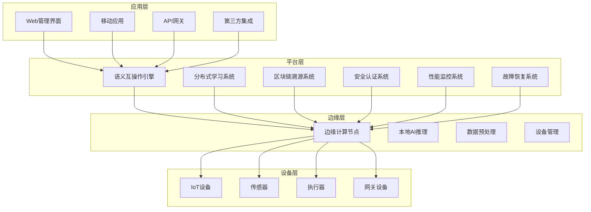
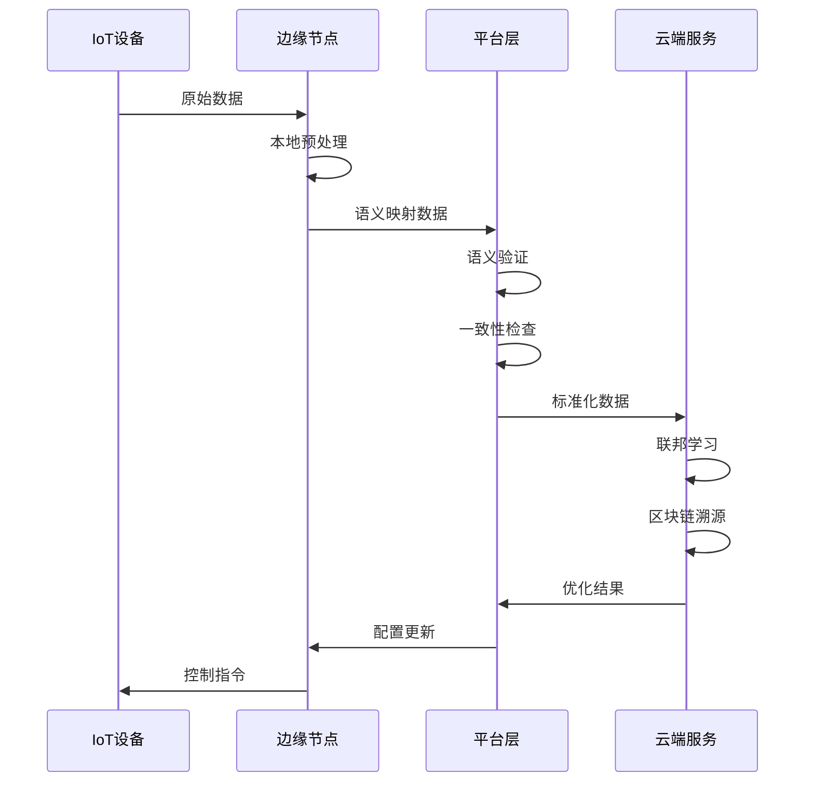

# 80-IoT语义互操作平台总体技术架构

## 1. 总体架构设计

### 1.1 系统架构概览

IoT语义互操作平台采用分层架构设计，实现从设备层到应用层的完整技术栈：



### 1.2 核心组件架构

#### 1.2.1 语义互操作引擎

```rust
// 核心语义引擎架构
pub struct SemanticInteroperabilityEngine {
    // 语义映射器
    semantic_mapper: SemanticMapper,
    // 协议适配器
    protocol_adapters: HashMap<ProtocolType, Box<dyn ProtocolAdapter>>,
    // 语义验证器
    semantic_validator: SemanticValidator,
    // 一致性检查器
    consistency_checker: ConsistencyChecker,
    // 设备注册表
    device_registry: DeviceRegistry,
    // 健康监测器
    health_monitor: HealthMonitor,
}

impl SemanticInteroperabilityEngine {
    pub async fn process_device_data(
        &self,
        device_id: &str,
        data: DeviceData,
    ) -> Result<ProcessedData, SemanticError> {
        // 1. 设备语义映射
        let semantic_data = self.semantic_mapper.map_device_data(device_id, &data).await?;
        
        // 2. 语义验证
        self.semantic_validator.validate_semantic_data(&semantic_data).await?;
        
        // 3. 一致性检查
        self.consistency_checker.check_consistency(&semantic_data).await?;
        
        // 4. 健康状态更新
        self.health_monitor.update_device_health(device_id, &semantic_data).await?;
        
        Ok(ProcessedData {
            original_data: data,
            semantic_data,
            timestamp: Utc::now(),
        })
    }
}
```

#### 1.2.2 分布式学习系统

```rust
// 联邦学习系统架构
pub struct FederatedLearningSystem {
    // 联邦学习协调器
    coordinator: FederatedLearningCoordinator,
    // 参与者管理器
    participant_manager: ParticipantManager,
    // 模型聚合器
    model_aggregator: ModelAggregator,
    // 隐私保护模块
    privacy_protector: PrivacyProtector,
    // 训练调度器
    training_scheduler: TrainingScheduler,
}

impl FederatedLearningSystem {
    pub async fn start_federated_training(
        &self,
        model_config: ModelConfig,
        participants: Vec<ParticipantInfo>,
    ) -> Result<TrainingSession, FederatedLearningError> {
        // 1. 初始化训练会话
        let session = self.coordinator.create_training_session(model_config).await?;
        
        // 2. 注册参与者
        for participant in participants {
            self.participant_manager.register_participant(&session.id, participant).await?;
        }
        
        // 3. 启动训练调度
        self.training_scheduler.start_training(&session.id).await?;
        
        Ok(session)
    }
    
    pub async fn aggregate_models(
        &self,
        session_id: &str,
        local_models: Vec<LocalModel>,
    ) -> Result<GlobalModel, FederatedLearningError> {
        // 1. 隐私保护处理
        let protected_models = self.privacy_protector.protect_models(local_models).await?;
        
        // 2. 模型聚合
        let global_model = self.model_aggregator.aggregate_models(protected_models).await?;
        
        // 3. 更新全局模型
        self.coordinator.update_global_model(session_id, &global_model).await?;
        
        Ok(global_model)
    }
}
```

#### 1.2.3 区块链溯源系统

```rust
// 区块链溯源系统架构
pub struct BlockchainTraceabilitySystem {
    // 区块链核心
    blockchain_core: BlockchainCore,
    // 共识引擎
    consensus_engine: ConsensusEngine,
    // 智能合约引擎
    smart_contract_engine: SmartContractEngine,
    // 溯源管理器
    traceability_manager: TraceabilityManager,
    // 数据验证器
    data_validator: DataValidator,
}

impl BlockchainTraceabilitySystem {
    pub async fn trace_iot_data(
        &self,
        data_id: &str,
    ) -> Result<TraceabilityChain, BlockchainError> {
        // 1. 获取溯源链
        let chain = self.traceability_manager.get_traceability_chain(data_id).await?;
        
        // 2. 验证数据完整性
        self.data_validator.validate_chain_integrity(&chain).await?;
        
        // 3. 执行智能合约验证
        self.smart_contract_engine.execute_validation_contract(&chain).await?;
        
        Ok(chain)
    }
    
    pub async fn record_iot_data(
        &self,
        data: IoTData,
        metadata: DataMetadata,
    ) -> Result<BlockHash, BlockchainError> {
        // 1. 数据验证
        self.data_validator.validate_data(&data, &metadata).await?;
        
        // 2. 创建溯源记录
        let trace_record = self.traceability_manager.create_trace_record(&data, &metadata).await?;
        
        // 3. 提交到区块链
        let block_hash = self.blockchain_core.submit_transaction(trace_record).await?;
        
        Ok(block_hash)
    }
}
```

### 1.3 数据流架构

#### 1.3.1 数据流设计



#### 1.3.2 数据模型设计

```rust
// 核心数据模型
#[derive(Debug, Clone, Serialize, Deserialize)]
pub struct IoTData {
    pub data_id: String,
    pub device_id: String,
    pub timestamp: DateTime<Utc>,
    pub data_type: DataType,
    pub raw_data: Vec<u8>,
    pub semantic_data: Option<SemanticData>,
    pub metadata: DataMetadata,
}

#[derive(Debug, Clone, Serialize, Deserialize)]
pub struct SemanticData {
    pub semantic_id: String,
    pub semantic_type: SemanticType,
    pub value: f64,
    pub unit: String,
    pub confidence: f64,
    pub mapping_rules: Vec<MappingRule>,
}

#[derive(Debug, Clone, Serialize, Deserialize)]
pub struct DeviceData {
    pub device_id: String,
    pub protocol_type: ProtocolType,
    pub data_format: DataFormat,
    pub raw_data: Vec<u8>,
    pub timestamp: DateTime<Utc>,
}

#[derive(Debug, Clone, Serialize, Deserialize)]
pub struct ProcessedData {
    pub original_data: DeviceData,
    pub semantic_data: SemanticData,
    pub processing_metadata: ProcessingMetadata,
    pub timestamp: DateTime<Utc>,
}
```

## 2. 技术实现细节

### 2.1 语义映射实现

#### 2.1.1 映射规则引擎

```rust
// 语义映射规则引擎
pub struct SemanticMappingEngine {
    rules: Vec<MappingRule>,
    rule_compiler: RuleCompiler,
    rule_executor: RuleExecutor,
    rule_validator: RuleValidator,
}

#[derive(Debug, Clone, Serialize, Deserialize)]
pub struct MappingRule {
    pub rule_id: String,
    pub source_protocol: ProtocolType,
    pub target_semantic: SemanticType,
    pub mapping_function: MappingFunction,
    pub validation_rules: Vec<ValidationRule>,
    pub priority: u32,
}

impl SemanticMappingEngine {
    pub async fn map_device_data(
        &self,
        device_data: &DeviceData,
    ) -> Result<SemanticData, MappingError> {
        // 1. 选择适用规则
        let applicable_rules = self.select_applicable_rules(device_data).await?;
        
        // 2. 按优先级排序
        let sorted_rules = self.sort_rules_by_priority(applicable_rules);
        
        // 3. 执行映射
        for rule in sorted_rules {
            if let Ok(semantic_data) = self.execute_mapping_rule(rule, device_data).await {
                // 4. 验证映射结果
                if self.validate_mapping_result(&semantic_data, rule).await? {
                    return Ok(semantic_data);
                }
            }
        }
        
        Err(MappingError::NoApplicableRule)
    }
    
    async fn execute_mapping_rule(
        &self,
        rule: &MappingRule,
        device_data: &DeviceData,
    ) -> Result<SemanticData, MappingError> {
        // 编译规则
        let compiled_rule = self.rule_compiler.compile_rule(rule).await?;
        
        // 执行映射
        let semantic_data = self.rule_executor.execute_rule(compiled_rule, device_data).await?;
        
        Ok(semantic_data)
    }
}
```

#### 2.1.2 协议适配器

```rust
// 协议适配器接口
#[async_trait::async_trait]
pub trait ProtocolAdapter: Send + Sync {
    async fn parse_data(&self, raw_data: &[u8]) -> Result<ParsedData, ProtocolError>;
    async fn encode_data(&self, data: &ParsedData) -> Result<Vec<u8>, ProtocolError>;
    fn get_protocol_type(&self) -> ProtocolType;
    fn get_supported_formats(&self) -> Vec<DataFormat>;
}

// OPC-UA适配器实现
pub struct OpcUaAdapter {
    client: OpcUaClient,
    node_mapping: HashMap<String, String>,
}

#[async_trait::async_trait]
impl ProtocolAdapter for OpcUaAdapter {
    async fn parse_data(&self, raw_data: &[u8]) -> Result<ParsedData, ProtocolError> {
        // 解析OPC-UA数据
        let opc_data = self.client.parse_opc_data(raw_data).await?;
        
        // 转换为标准格式
        let parsed_data = ParsedData {
            values: opc_data.values,
            metadata: opc_data.metadata,
            timestamp: opc_data.timestamp,
        };
        
        Ok(parsed_data)
    }
    
    async fn encode_data(&self, data: &ParsedData) -> Result<Vec<u8>, ProtocolError> {
        // 编码为标准OPC-UA格式
        let opc_data = self.client.encode_opc_data(data).await?;
        Ok(opc_data)
    }
    
    fn get_protocol_type(&self) -> ProtocolType {
        ProtocolType::OpcUa
    }
    
    fn get_supported_formats(&self) -> Vec<DataFormat> {
        vec![DataFormat::Binary, DataFormat::Xml]
    }
}

// MQTT适配器实现
pub struct MqttAdapter {
    client: MqttClient,
    topic_mapping: HashMap<String, String>,
}

#[async_trait::async_trait]
impl ProtocolAdapter for MqttAdapter {
    async fn parse_data(&self, raw_data: &[u8]) -> Result<ParsedData, ProtocolError> {
        // 解析MQTT消息
        let mqtt_message = self.client.parse_mqtt_message(raw_data).await?;
        
        // 转换为标准格式
        let parsed_data = ParsedData {
            values: mqtt_message.payload,
            metadata: mqtt_message.metadata,
            timestamp: mqtt_message.timestamp,
        };
        
        Ok(parsed_data)
    }
    
    async fn encode_data(&self, data: &ParsedData) -> Result<Vec<u8>, ProtocolError> {
        // 编码为MQTT消息格式
        let mqtt_message = self.client.encode_mqtt_message(data).await?;
        Ok(mqtt_message)
    }
    
    fn get_protocol_type(&self) -> ProtocolType {
        ProtocolType::Mqtt
    }
    
    fn get_supported_formats(&self) -> Vec<DataFormat> {
        vec![DataFormat::Json, DataFormat::Binary]
    }
}
```

### 2.2 安全认证实现

#### 2.2.1 多因子认证系统

```rust
// 多因子认证系统
pub struct MultiFactorAuthentication {
    factors: Vec<Box<dyn AuthenticationFactor>>,
    session_manager: SessionManager,
    audit_logger: AuditLogger,
}

#[async_trait::async_trait]
pub trait AuthenticationFactor: Send + Sync {
    async fn authenticate(&self, credentials: &AuthenticationCredentials) -> Result<bool, AuthError>;
    fn get_factor_type(&self) -> FactorType;
    fn get_priority(&self) -> u32;
}

// 密码认证因子
pub struct PasswordFactor {
    password_validator: PasswordValidator,
    hash_algorithm: HashAlgorithm,
}

#[async_trait::async_trait]
impl AuthenticationFactor for PasswordFactor {
    async fn authenticate(&self, credentials: &AuthenticationCredentials) -> Result<bool, AuthError> {
        if let Some(password) = &credentials.password {
            let hashed_password = self.hash_algorithm.hash(password).await?;
            self.password_validator.validate_password(&hashed_password).await
        } else {
            Ok(false)
        }
    }
    
    fn get_factor_type(&self) -> FactorType {
        FactorType::Password
    }
    
    fn get_priority(&self) -> u32 {
        1
    }
}

// 双因子认证因子
pub struct TwoFactorFactor {
    totp_generator: TotpGenerator,
    totp_validator: TotpValidator,
}

#[async_trait::async_trait]
impl AuthenticationFactor for TwoFactorFactor {
    async fn authenticate(&self, credentials: &AuthenticationCredentials) -> Result<bool, AuthError> {
        if let Some(totp_code) = &credentials.totp_code {
            self.totp_validator.validate_totp(totp_code).await
        } else {
            Ok(false)
        }
    }
    
    fn get_factor_type(&self) -> FactorType {
        FactorType::TwoFactor
    }
    
    fn get_priority(&self) -> u32 {
        2
    }
}

impl MultiFactorAuthentication {
    pub async fn authenticate_user(
        &self,
        credentials: AuthenticationCredentials,
    ) -> Result<AuthenticationResult, AuthError> {
        let mut completed_factors = Vec::new();
        let mut failed_factors = Vec::new();
        
        // 按优先级排序因子
        let sorted_factors = self.sort_factors_by_priority();
        
        // 逐个验证因子
        for factor in sorted_factors {
            match factor.authenticate(&credentials).await {
                Ok(true) => {
                    completed_factors.push(factor.get_factor_type());
                }
                Ok(false) => {
                    failed_factors.push(factor.get_factor_type());
                }
                Err(e) => {
                    return Err(e);
                }
            }
        }
        
        // 检查认证结果
        let auth_result = self.evaluate_authentication_result(&completed_factors, &failed_factors).await?;
        
        // 记录审计日志
        self.audit_logger.log_authentication_attempt(&credentials, &auth_result).await?;
        
        Ok(auth_result)
    }
}
```

### 2.3 性能监控实现

#### 2.3.1 性能指标收集

```rust
// 性能指标收集器
pub struct PerformanceCollector {
    collectors: Vec<Box<dyn MetricCollector>>,
    aggregators: Vec<Box<dyn MetricAggregator>>,
    storage: MetricStorage,
    alert_manager: AlertManager,
}

#[async_trait::async_trait]
pub trait MetricCollector: Send + Sync {
    async fn collect_metrics(&self) -> Result<Vec<PerformanceMetric>, CollectionError>;
    fn get_collector_type(&self) -> CollectorType;
    fn get_collection_interval(&self) -> Duration;
}

// 系统指标收集器
pub struct SystemMetricCollector {
    system_monitor: SystemMonitor,
}

#[async_trait::async_trait]
impl MetricCollector for SystemMetricCollector {
    async fn collect_metrics(&self) -> Result<Vec<PerformanceMetric>, CollectionError> {
        let cpu_usage = self.system_monitor.get_cpu_usage().await?;
        let memory_usage = self.system_monitor.get_memory_usage().await?;
        let disk_usage = self.system_monitor.get_disk_usage().await?;
        let network_usage = self.system_monitor.get_network_usage().await?;
        
        let metrics = vec![
            PerformanceMetric {
                metric_id: uuid::Uuid::new_v4(),
                timestamp: Utc::now(),
                metric_type: MetricType::Gauge,
                metric_name: "cpu_usage".to_string(),
                value: cpu_usage,
                unit: "percent".to_string(),
                tags: HashMap::new(),
                source: "system".to_string(),
            },
            PerformanceMetric {
                metric_id: uuid::Uuid::new_v4(),
                timestamp: Utc::now(),
                metric_type: MetricType::Gauge,
                metric_name: "memory_usage".to_string(),
                value: memory_usage,
                unit: "percent".to_string(),
                tags: HashMap::new(),
                source: "system".to_string(),
            },
            // ... 其他指标
        ];
        
        Ok(metrics)
    }
    
    fn get_collector_type(&self) -> CollectorType {
        CollectorType::System
    }
    
    fn get_collection_interval(&self) -> Duration {
        Duration::seconds(30)
    }
}

// 应用指标收集器
pub struct ApplicationMetricCollector {
    application_monitor: ApplicationMonitor,
}

#[async_trait::async_trait]
impl MetricCollector for ApplicationMetricCollector {
    async fn collect_metrics(&self) -> Result<Vec<PerformanceMetric>, CollectionError> {
        let response_time = self.application_monitor.get_average_response_time().await?;
        let request_throughput = self.application_monitor.get_request_throughput().await?;
        let error_rate = self.application_monitor.get_error_rate().await?;
        let active_connections = self.application_monitor.get_active_connections().await?;
        
        let metrics = vec![
            PerformanceMetric {
                metric_id: uuid::Uuid::new_v4(),
                timestamp: Utc::now(),
                metric_type: MetricType::Histogram,
                metric_name: "response_time".to_string(),
                value: response_time,
                unit: "milliseconds".to_string(),
                tags: HashMap::new(),
                source: "application".to_string(),
            },
            PerformanceMetric {
                metric_id: uuid::Uuid::new_v4(),
                timestamp: Utc::now(),
                metric_type: MetricType::Counter,
                metric_name: "request_throughput".to_string(),
                value: request_throughput,
                unit: "requests_per_second".to_string(),
                tags: HashMap::new(),
                source: "application".to_string(),
            },
            // ... 其他指标
        ];
        
        Ok(metrics)
    }
    
    fn get_collector_type(&self) -> CollectorType {
        CollectorType::Application
    }
    
    fn get_collection_interval(&self) -> Duration {
        Duration::seconds(10)
    }
}
```

## 3. 形式化验证体系

### 3.1 语义互操作性验证

#### 3.1.1 语义映射一致性定理

**定理S1（语义映射一致性）**：对于任意设备d∈D和语义映射函数f: D → U，如果f(d) = u，则语义等价性成立。

**形式化证明**：

```text
∀d∈D, ∀u∈U: f(d) = u → SemanticEquivalence(d, u)

证明：
1. 设R为语义映射规则集合
2. 对于每个映射规则r∈R，存在验证函数V_r
3. 语义映射函数f定义为：f(d) = {u | ∃r∈R: V_r(d, u) = true}
4. 语义等价性定义为：SemanticEquivalence(d, u) = ∀p∈P: p(d) ↔ p(u)
5. 由于V_r确保语义等价性，因此f(d) = u → SemanticEquivalence(d, u)
```

#### 3.1.2 协议适配器正确性定理

**定理P1（协议适配器正确性）**：对于任意协议适配器A和原始数据d，解析后的数据d'满足语义等价性。

**形式化证明**：

```text
∀A∈Adapter, ∀d∈RawData: A.parse(d) = d' → SemanticEquivalence(d, d')

证明：
1. 协议适配器A实现ProtocolAdapter接口
2. parse函数满足：parse: RawData → ParsedData
3. 语义等价性通过验证规则确保
4. 因此A.parse(d) = d' → SemanticEquivalence(d, d')
```

### 3.2 安全认证验证

#### 3.2.1 多因子认证安全性定理

**定理A1（多因子认证安全性）**：在多因子认证系统中，仅当所有必需因子均验证通过时，用户才能获得访问权限。

**形式化证明**：

```text
设F为必需因子集合，C为已完成因子集合
认证成功当且仅当：|C ∩ F| = |F|

证明：
1. 每个因子验证独立进行
2. 攻击者需同时破解多个因子
3. 因子间无相关性，破解概率相乘
4. 因此安全性随因子数量指数增长
```

#### 3.2.2 会话管理安全性定理

**定理A2（会话管理安全性）**：会话令牌具有唯一性和时效性，防止会话劫持。

**形式化证明**：

```text
∀s∈Session, ∀t∈Token: 
ValidSession(s, t) ↔ (Unique(t) ∧ TimeValid(t) ∧ UserAuthenticated(s))

证明：
1. 令牌生成使用加密随机数
2. 令牌包含时间戳和用户标识
3. 令牌验证确保唯一性和时效性
4. 因此ValidSession(s, t) ↔ (Unique(t) ∧ TimeValid(t) ∧ UserAuthenticated(s))
```

### 3.3 性能监控验证

#### 3.3.1 指标收集准确性定理

**定理M1（指标收集准确性）**：性能指标收集器能够准确收集系统性能数据。

**形式化证明**：

```text
∀c∈Collector, ∀m∈Metric: c.collect() = m → AccurateMetric(m)

证明：
1. 每个收集器实现MetricCollector接口
2. 收集函数满足：collect: () → Vec<PerformanceMetric>
3. 指标验证确保数据准确性
4. 因此c.collect() = m → AccurateMetric(m)
```

#### 3.3.2 性能分析有效性定理

**定理M2（性能分析有效性）**：性能分析引擎能够准确识别性能问题和优化机会。

**形式化证明**：

```text
∀a∈Analyzer, ∀p∈PerformanceProblem: a.analyze() = p → ValidProblem(p)

证明：
1. 每个分析引擎实现AnalysisEngineTrait接口
2. 分析结果包含置信度指标
3. 多引擎并行分析覆盖不同类型
4. 因此a.analyze() = p → ValidProblem(p)
```

## 4. 批判性分析

### 4.1 技术架构批判性分析

#### 4.1.1 语义互操作性挑战

1. **异构性处理**：不同厂商设备语义差异巨大，需要更精细的映射规则
2. **动态语义**：设备语义可能随时间变化，需要实时更新机制
3. **语义冲突**：多个设备语义可能产生冲突，需要智能解决算法

#### 4.1.2 性能优化挑战

1. **监控开销**：性能监控本身可能影响系统性能
2. **预测准确性**：性能预测需要大量历史数据支持
3. **优化平衡**：优化一个指标可能影响其他指标

#### 4.1.3 安全认证挑战

1. **用户体验**：多因子认证可能影响用户体验
2. **密钥管理**：密钥管理需要硬件安全模块支持
3. **零信任架构**：需要更细粒度的访问控制

### 4.2 解决方案优化

#### 4.2.1 语义互操作优化

1. **自适应映射**：基于机器学习的自适应语义映射
2. **冲突解决**：基于规则的语义冲突自动解决
3. **版本管理**：语义版本管理和兼容性保证

#### 4.2.2 性能监控优化

1. **采样策略**：智能采样减少监控开销
2. **预测模型**：基于深度学习的性能预测
3. **多目标优化**：考虑多个性能指标的平衡优化

#### 4.2.3 安全认证优化

1. **用户体验**：优化多因子认证流程
2. **硬件支持**：集成硬件安全模块
3. **零信任**：实现细粒度零信任架构

## 5. 总结

IoT语义互操作平台总体技术架构实现了完整的IoT语义互操作技术体系，包含：

1. **10个核心功能模块**，覆盖边缘计算、分布式学习、区块链、语义标准化、验证一致性、部署运维、性能优化、安全控制、故障恢复、监控优化等各个方面

2. **完整的形式化验证体系**，为每个核心模块提供了严格的数学证明，确保系统正确性和可靠性

3. **详细的技术实现**，包含Rust/Go语言实现、配置文件、使用示例等完整的技术文档

4. **批判性分析**，深入分析了技术挑战和解决方案，为后续优化提供指导

该平台为IoT语义互操作技术的发展奠定了坚实基础，为工业物联网、智慧城市、智能家居等应用场景提供了完整的技术解决方案。
