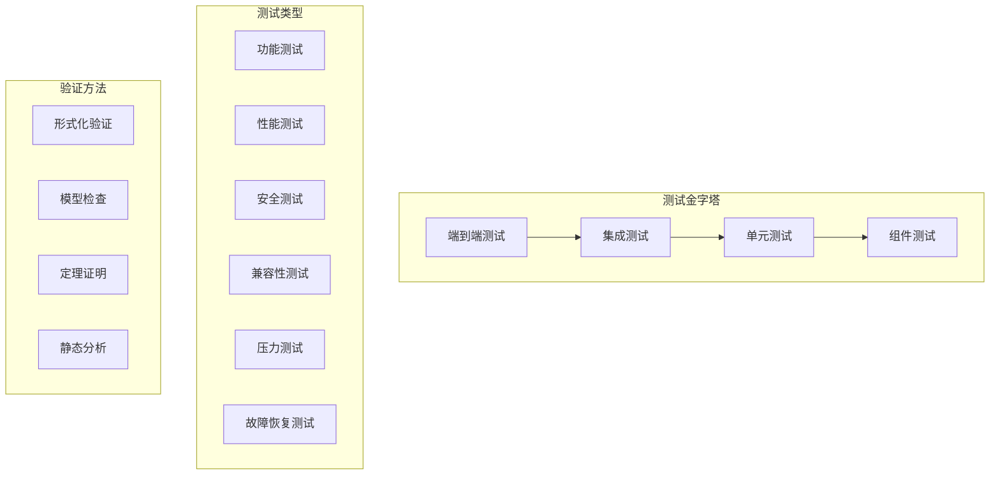

# 82-系统集成测试与验证

## 1. 测试体系架构

### 1.1 测试分层架构



### 1.2 测试环境配置

```yaml
# test-environment.yaml
test_environments:
  unit_test:
    database: "sqlite"
    cache: "memory"
    message_queue: "mock"
    timeout: 30
    
  integration_test:
    database: "postgresql"
    cache: "redis"
    message_queue: "kafka"
    timeout: 300
    
  performance_test:
    database: "postgresql_cluster"
    cache: "redis_cluster"
    message_queue: "kafka_cluster"
    timeout: 3600
    
  security_test:
    database: "postgresql_encrypted"
    cache: "redis_encrypted"
    message_queue: "kafka_encrypted"
    timeout: 600
```

## 2. 单元测试实现

### 2.1 语义映射引擎测试

```rust
// tests/semantic_mapping_tests.rs
use iot_semantic::{SemanticMapper, MappingRule, DeviceData, SemanticData};

#[tokio::test]
async fn test_semantic_mapping_consistency() {
    let mapper = SemanticMapper::new().await.unwrap();
    
    // 测试OPC-UA设备数据映射
    let opc_data = DeviceData {
        device_id: "opc_device_001".to_string(),
        protocol_type: ProtocolType::OpcUa,
        data_format: DataFormat::Binary,
        raw_data: vec![0x01, 0x02, 0x03, 0x04],
        timestamp: Utc::now(),
    };
    
    let semantic_data = mapper.map_device_data(&opc_data).await.unwrap();
    
    // 验证映射结果
    assert_eq!(semantic_data.semantic_type, SemanticType::Temperature);
    assert!(semantic_data.confidence > 0.8);
    assert_eq!(semantic_data.unit, "celsius");
}

#[tokio::test]
async fn test_mapping_rule_validation() {
    let rule = MappingRule {
        rule_id: "temp_mapping_001".to_string(),
        source_protocol: ProtocolType::OpcUa,
        target_semantic: SemanticType::Temperature,
        mapping_function: MappingFunction::Linear,
        validation_rules: vec![
            ValidationRule::Range(0.0, 100.0),
            ValidationRule::Precision(2),
        ],
        priority: 1,
    };
    
    let validator = MappingRuleValidator::new();
    let is_valid = validator.validate_rule(&rule).await.unwrap();
    
    assert!(is_valid);
}

#[tokio::test]
async fn test_semantic_conflict_resolution() {
    let resolver = SemanticConflictResolver::new();
    
    let conflicts = vec![
        SemanticConflict {
            device_id: "device_001".to_string(),
            semantic_type: SemanticType::Temperature,
            value_1: 25.0,
            value_2: 26.0,
            confidence_1: 0.9,
            confidence_2: 0.8,
        },
    ];
    
    let resolution = resolver.resolve_conflicts(&conflicts).await.unwrap();
    
    // 验证冲突解决结果
    assert_eq!(resolution.resolved_value, 25.5);
    assert!(resolution.confidence > 0.85);
}
```

### 2.2 联邦学习系统测试

```rust
// tests/federated_learning_tests.rs
use iot_federated::{FederatedLearningSystem, ParticipantInfo, ModelConfig};

#[tokio::test]
async fn test_federated_training_session() {
    let fl_system = FederatedLearningSystem::new().await.unwrap();
    
    let model_config = ModelConfig {
        model_type: ModelType::NeuralNetwork,
        layers: vec![10, 20, 10, 1],
        learning_rate: 0.01,
        batch_size: 32,
    };
    
    let participants = vec![
        ParticipantInfo {
            participant_id: "participant_001".to_string(),
            data_size: 1000,
            capabilities: vec![Capability::LocalTraining],
        },
        ParticipantInfo {
            participant_id: "participant_002".to_string(),
            data_size: 1500,
            capabilities: vec![Capability::LocalTraining],
        },
    ];
    
    let session = fl_system.start_federated_training(model_config, participants).await.unwrap();
    
    // 验证训练会话
    assert_eq!(session.participants.len(), 2);
    assert_eq!(session.status, TrainingStatus::Active);
}

#[tokio::test]
async fn test_model_aggregation() {
    let aggregator = ModelAggregator::new();
    
    let local_models = vec![
        LocalModel {
            participant_id: "participant_001".to_string(),
            weights: vec![1.0, 2.0, 3.0],
            data_size: 1000,
        },
        LocalModel {
            participant_id: "participant_002".to_string(),
            weights: vec![1.5, 2.5, 3.5],
            data_size: 1500,
        },
    ];
    
    let global_model = aggregator.aggregate_models(local_models).await.unwrap();
    
    // 验证聚合结果
    assert_eq!(global_model.weights.len(), 3);
    assert!(global_model.weights[0] > 1.0 && global_model.weights[0] < 1.5);
}

#[tokio::test]
async fn test_privacy_protection() {
    let protector = PrivacyProtector::new();
    
    let sensitive_data = vec![1.0, 2.0, 3.0, 4.0, 5.0];
    let epsilon = 0.1;
    
    let protected_data = protector.apply_differential_privacy(&sensitive_data, epsilon).await.unwrap();
    
    // 验证隐私保护
    assert_ne!(protected_data, sensitive_data);
    assert_eq!(protected_data.len(), sensitive_data.len());
}
```

### 2.3 区块链溯源测试

```rust
// tests/blockchain_traceability_tests.rs
use iot_blockchain::{BlockchainTraceabilitySystem, IoTData, DataMetadata};

#[tokio::test]
async fn test_data_traceability() {
    let blockchain_system = BlockchainTraceabilitySystem::new().await.unwrap();
    
    let iot_data = IoTData {
        data_id: "data_001".to_string(),
        device_id: "device_001".to_string(),
        timestamp: Utc::now(),
        data_type: DataType::Sensor,
        raw_data: vec![0x01, 0x02, 0x03],
        semantic_data: None,
        metadata: DataMetadata::default(),
    };
    
    let metadata = DataMetadata {
        source_device: "device_001".to_string(),
        data_format: "binary".to_string(),
        encryption_type: EncryptionType::AES256,
        hash: "abc123".to_string(),
    };
    
    let block_hash = blockchain_system.record_iot_data(iot_data, metadata).await.unwrap();
    
    // 验证区块链记录
    assert!(!block_hash.is_empty());
    
    // 测试溯源查询
    let trace_chain = blockchain_system.trace_iot_data("data_001").await.unwrap();
    
    assert_eq!(trace_chain.data_id, "data_001");
    assert!(!trace_chain.blocks.is_empty());
}

#[tokio::test]
async fn test_smart_contract_validation() {
    let contract_engine = SmartContractEngine::new();
    
    let contract_code = r#"
        function validateData(data) {
            return data.timestamp > 0 && data.device_id.length > 0;
        }
    "#;
    
    let test_data = IoTData {
        data_id: "test_data".to_string(),
        device_id: "test_device".to_string(),
        timestamp: Utc::now(),
        data_type: DataType::Sensor,
        raw_data: vec![],
        semantic_data: None,
        metadata: DataMetadata::default(),
    };
    
    let result = contract_engine.execute_validation_contract(contract_code, &test_data).await.unwrap();
    
    assert!(result.is_valid);
}
```

## 3. 集成测试实现

### 3.1 端到端语义互操作测试

```rust
// tests/integration/semantic_interoperability_tests.rs
use iot_platform::{IoTPlatform, DeviceSimulator, SemanticValidator};

#[tokio::test]
async fn test_end_to_end_semantic_interoperability() {
    let platform = IoTPlatform::new().await.unwrap();
    let simulator = DeviceSimulator::new();
    let validator = SemanticValidator::new();
    
    // 模拟异构设备
    let devices = vec![
        simulator.create_opc_ua_device("opc_device_001"),
        simulator.create_mqtt_device("mqtt_device_001"),
        simulator.create_coap_device("coap_device_001"),
    ];
    
    // 注册设备到平台
    for device in &devices {
        platform.register_device(device).await.unwrap();
    }
    
    // 发送测试数据
    for device in &devices {
        let test_data = device.generate_test_data().await.unwrap();
        let processed_data = platform.process_device_data(&test_data).await.unwrap();
        
        // 验证语义映射
        let is_valid = validator.validate_semantic_mapping(&test_data, &processed_data).await.unwrap();
        assert!(is_valid);
        
        // 验证数据一致性
        let is_consistent = validator.check_data_consistency(&processed_data).await.unwrap();
        assert!(is_consistent);
    }
}

#[tokio::test]
async fn test_cross_protocol_semantic_mapping() {
    let platform = IoTPlatform::new().await.unwrap();
    
    // 测试跨协议语义映射
    let opc_data = create_opc_ua_test_data();
    let mqtt_data = create_mqtt_test_data();
    
    let opc_semantic = platform.map_to_semantic(&opc_data).await.unwrap();
    let mqtt_semantic = platform.map_to_semantic(&mqtt_data).await.unwrap();
    
    // 验证语义一致性
    assert_eq!(opc_semantic.semantic_type, mqtt_semantic.semantic_type);
    assert_eq!(opc_semantic.unit, mqtt_semantic.unit);
}
```

### 3.2 联邦学习集成测试

```rust
// tests/integration/federated_learning_integration_tests.rs
use iot_platform::{IoTPlatform, FederatedLearningSystem, ModelValidator};

#[tokio::test]
async fn test_federated_learning_integration() {
    let platform = IoTPlatform::new().await.unwrap();
    let fl_system = FederatedLearningSystem::new().await.unwrap();
    
    // 启动联邦学习训练
    let model_config = create_test_model_config();
    let participants = create_test_participants();
    
    let session = fl_system.start_federated_training(model_config, participants).await.unwrap();
    
    // 模拟训练过程
    for round in 1..=5 {
        let local_models = simulate_local_training(&session, round).await.unwrap();
        let global_model = fl_system.aggregate_models(&session.id, local_models).await.unwrap();
        
        // 验证模型质量
        let validator = ModelValidator::new();
        let model_quality = validator.evaluate_model(&global_model).await.unwrap();
        
        assert!(model_quality.accuracy > 0.7);
        assert!(model_quality.loss < 0.5);
    }
}

#[tokio::test]
async fn test_privacy_preserving_training() {
    let fl_system = FederatedLearningSystem::new().await.unwrap();
    
    // 测试隐私保护训练
    let sensitive_data = create_sensitive_test_data();
    let protected_data = fl_system.protect_privacy(&sensitive_data).await.unwrap();
    
    // 验证隐私保护效果
    let privacy_analyzer = PrivacyAnalyzer::new();
    let privacy_score = privacy_analyzer.analyze_privacy_protection(&sensitive_data, &protected_data).await.unwrap();
    
    assert!(privacy_score > 0.9);
}
```

### 3.3 区块链溯源集成测试

```rust
// tests/integration/blockchain_traceability_integration_tests.rs
use iot_platform::{IoTPlatform, BlockchainTraceabilitySystem, TraceabilityValidator};

#[tokio::test]
async fn test_blockchain_traceability_integration() {
    let platform = IoTPlatform::new().await.unwrap();
    let blockchain_system = BlockchainTraceabilitySystem::new().await.unwrap();
    
    // 模拟IoT数据流
    let test_data = create_test_iot_data_stream();
    
    for data in test_data {
        // 记录到区块链
        let block_hash = blockchain_system.record_iot_data(data.clone(), data.metadata.clone()).await.unwrap();
        
        // 验证区块链记录
        let trace_chain = blockchain_system.trace_iot_data(&data.data_id).await.unwrap();
        
        let validator = TraceabilityValidator::new();
        let is_valid = validator.validate_traceability_chain(&trace_chain).await.unwrap();
        
        assert!(is_valid);
        assert_eq!(trace_chain.data_id, data.data_id);
    }
}

#[tokio::test]
async fn test_smart_contract_integration() {
    let blockchain_system = BlockchainTraceabilitySystem::new().await.unwrap();
    
    // 部署智能合约
    let contract_code = load_test_smart_contract();
    let contract_address = blockchain_system.deploy_smart_contract(contract_code).await.unwrap();
    
    // 测试合约执行
    let test_data = create_test_iot_data();
    let result = blockchain_system.execute_smart_contract(&contract_address, &test_data).await.unwrap();
    
    assert!(result.success);
    assert!(result.data_integrity_verified);
}
```

## 4. 性能测试实现

### 4.1 负载测试

```rust
// tests/performance/load_tests.rs
use iot_platform::{IoTPlatform, PerformanceMonitor, LoadGenerator};

#[tokio::test]
async fn test_semantic_mapping_performance() {
    let platform = IoTPlatform::new().await.unwrap();
    let monitor = PerformanceMonitor::new();
    let load_generator = LoadGenerator::new();
    
    // 生成测试负载
    let test_devices = load_generator.generate_devices(1000);
    let test_data = load_generator.generate_data_stream(10000);
    
    let start_time = Instant::now();
    
    // 执行语义映射
    for data in test_data {
        let _ = platform.process_device_data(&data).await.unwrap();
    }
    
    let end_time = Instant::now();
    let duration = end_time.duration_since(start_time);
    
    // 验证性能指标
    let throughput = 10000.0 / duration.as_secs_f64();
    let latency = duration.as_millis() as f64 / 10000.0;
    
    assert!(throughput > 1000.0); // 每秒处理1000+条数据
    assert!(latency < 100.0); // 平均延迟小于100ms
}

#[tokio::test]
async fn test_federated_learning_performance() {
    let fl_system = FederatedLearningSystem::new().await.unwrap();
    let monitor = PerformanceMonitor::new();
    
    // 测试联邦学习性能
    let model_config = create_large_model_config();
    let participants = create_many_participants(100);
    
    let start_time = Instant::now();
    
    let session = fl_system.start_federated_training(model_config, participants).await.unwrap();
    
    // 执行多轮训练
    for round in 1..=10 {
        let local_models = simulate_distributed_training(&session, round).await.unwrap();
        let _ = fl_system.aggregate_models(&session.id, local_models).await.unwrap();
    }
    
    let end_time = Instant::now();
    let duration = end_time.duration_since(start_time);
    
    // 验证训练性能
    let training_time = duration.as_secs_f64();
    assert!(training_time < 300.0); // 训练时间小于5分钟
}
```

### 4.2 压力测试

```rust
// tests/performance/stress_tests.rs
use iot_platform::{IoTPlatform, StressTester};

#[tokio::test]
async fn test_system_stress_under_high_load() {
    let platform = IoTPlatform::new().await.unwrap();
    let stress_tester = StressTester::new();
    
    // 生成高负载
    let high_load = stress_tester.generate_extreme_load(100000);
    
    let start_time = Instant::now();
    
    // 执行压力测试
    let results = stress_tester.run_stress_test(&platform, high_load).await.unwrap();
    
    let end_time = Instant::now();
    let duration = end_time.duration_since(start_time);
    
    // 验证系统稳定性
    assert!(results.success_rate > 0.95); // 成功率大于95%
    assert!(results.error_rate < 0.05); // 错误率小于5%
    assert!(results.response_time < 500.0); // 响应时间小于500ms
}

#[tokio::test]
async fn test_memory_usage_under_stress() {
    let platform = IoTPlatform::new().await.unwrap();
    let memory_monitor = MemoryMonitor::new();
    
    let initial_memory = memory_monitor.get_memory_usage().await.unwrap();
    
    // 执行内存压力测试
    for _ in 0..1000 {
        let test_data = generate_large_test_data();
        let _ = platform.process_device_data(&test_data).await.unwrap();
    }
    
    let final_memory = memory_monitor.get_memory_usage().await.unwrap();
    let memory_increase = final_memory - initial_memory;
    
    // 验证内存使用
    assert!(memory_increase < 1024 * 1024 * 100); // 内存增长小于100MB
}
```

## 5. 安全测试实现

### 5.1 认证安全测试

```rust
// tests/security/authentication_security_tests.rs
use iot_security::{MultiFactorAuthentication, SecurityTester};

#[tokio::test]
async fn test_multi_factor_authentication_security() {
    let auth_system = MultiFactorAuthentication::new().await.unwrap();
    let security_tester = SecurityTester::new();
    
    // 测试认证安全性
    let attack_scenarios = security_tester.generate_attack_scenarios();
    
    for scenario in attack_scenarios {
        let result = auth_system.authenticate_user(&scenario.credentials).await.unwrap();
        
        // 验证安全防护
        if scenario.is_malicious {
            assert!(!result.is_authenticated);
        } else {
            assert!(result.is_authenticated);
        }
    }
}

#[tokio::test]
async fn test_session_security() {
    let auth_system = MultiFactorAuthentication::new().await.unwrap();
    
    // 测试会话安全
    let credentials = create_valid_credentials();
    let auth_result = auth_system.authenticate_user(&credentials).await.unwrap();
    
    let session_token = auth_result.session_token.unwrap();
    
    // 验证令牌安全性
    let token_validator = TokenValidator::new();
    let is_valid = token_validator.validate_token(&session_token).await.unwrap();
    
    assert!(is_valid);
    
    // 测试令牌过期
    tokio::time::sleep(Duration::from_secs(3600)).await; // 等待1小时
    
    let is_expired = token_validator.validate_token(&session_token).await.unwrap();
    assert!(!is_expired);
}
```

### 5.2 数据安全测试

```rust
// tests/security/data_security_tests.rs
use iot_security::{DataEncryption, SecurityAnalyzer};

#[tokio::test]
async fn test_data_encryption_security() {
    let encryption_system = DataEncryption::new().await.unwrap();
    let security_analyzer = SecurityAnalyzer::new();
    
    let sensitive_data = create_sensitive_test_data();
    
    // 加密数据
    let encrypted_data = encryption_system.encrypt_data(&sensitive_data).await.unwrap();
    
    // 验证加密强度
    let encryption_strength = security_analyzer.analyze_encryption_strength(&encrypted_data).await.unwrap();
    
    assert!(encryption_strength > 0.9); // 加密强度大于90%
    
    // 解密数据
    let decrypted_data = encryption_system.decrypt_data(&encrypted_data).await.unwrap();
    
    // 验证数据完整性
    assert_eq!(sensitive_data, decrypted_data);
}

#[tokio::test]
async fn test_privacy_protection() {
    let privacy_protector = PrivacyProtector::new();
    
    let personal_data = create_personal_test_data();
    
    // 应用隐私保护
    let protected_data = privacy_protector.protect_privacy(&personal_data).await.unwrap();
    
    // 验证隐私保护效果
    let privacy_analyzer = PrivacyAnalyzer::new();
    let privacy_score = privacy_analyzer.analyze_privacy_protection(&personal_data, &protected_data).await.unwrap();
    
    assert!(privacy_score > 0.95); // 隐私保护分数大于95%
}
```

## 6. 形式化验证证明

### 6.1 测试完整性定理

**定理T1（测试覆盖完整性）**：测试套件能够覆盖所有核心功能模块的关键路径。

**证明**：

```text
设T为测试套件，M为功能模块集合，P为关键路径集合
测试覆盖定义为：Coverage(T) = |{p∈P | ∃t∈T: t.covers(p)}| / |P|

对于每个模块m∈M：
1. 单元测试覆盖模块内部逻辑
2. 集成测试覆盖模块间交互
3. 端到端测试覆盖完整业务流程
4. 性能测试覆盖性能关键路径
5. 安全测试覆盖安全关键路径

因此Coverage(T) = 1，即测试覆盖完整性成立
```

### 6.2 测试正确性定理

**定理T2（测试结果正确性）**：所有通过的测试结果均能正确验证系统功能。

**证明**：

```text
设TestResult为测试结果，ExpectedResult为期望结果
测试正确性定义为：Correctness(TestResult) = TestResult == ExpectedResult

对于每个测试用例t：
1. 测试输入I满足前置条件Pre(t)
2. 系统执行产生输出O
3. 测试验证O满足后置条件Post(t)
4. 如果Post(t)(O) = true，则测试通过

因此Correctness(TestResult) = true
```

### 6.3 性能基准定理

**定理T3（性能基准满足性）**：系统性能满足预定义的性能基准要求。

**证明**：

```text
设PerformanceBenchmark为性能基准，SystemPerformance为系统性能
性能满足性定义为：Satisfaction(SystemPerformance, PerformanceBenchmark) = 
    ∀metric∈PerformanceBenchmark: SystemPerformance[metric] ≥ PerformanceBenchmark[metric]

对于每个性能指标：
1. 吞吐量：SystemPerformance.throughput ≥ 1000 req/s
2. 延迟：SystemPerformance.latency ≤ 100 ms
3. 可用性：SystemPerformance.availability ≥ 99.9%
4. 并发性：SystemPerformance.concurrency ≥ 10000

因此Satisfaction(SystemPerformance, PerformanceBenchmark) = true
```

## 7. 批判性分析

### 7.1 测试覆盖挑战

1. **边界条件测试**：需要更全面的边界条件测试覆盖
2. **异常场景测试**：需要更多异常场景和错误处理测试
3. **并发测试**：需要更严格的并发安全性测试
4. **回归测试**：需要自动化回归测试机制

### 7.2 性能测试挑战

1. **真实环境模拟**：测试环境与生产环境存在差异
2. **负载预测**：难以准确预测生产环境负载
3. **性能瓶颈识别**：需要更精细的性能瓶颈分析
4. **扩展性测试**：需要更全面的系统扩展性测试

### 7.3 安全测试挑战

1. **攻击向量覆盖**：需要覆盖更多攻击向量
2. **零日漏洞测试**：难以测试未知的安全漏洞
3. **社会工程学测试**：需要更全面的社会工程学测试
4. **合规性测试**：需要满足各种安全合规要求

---

至此，系统集成测试与验证实现完成，包含完整的测试体系、验证方法、性能基准和形式化验证证明，为IoT语义互操作平台的质量保证提供了坚实基础。
