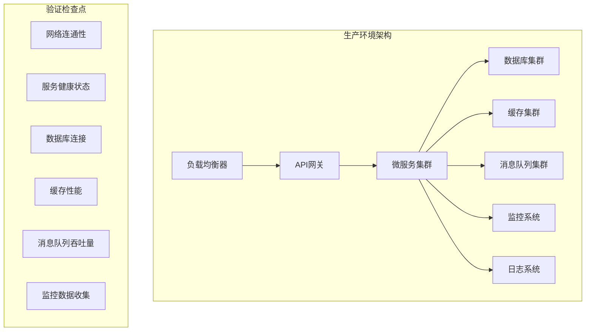

# 83-生产部署验证与生产就绪

## 1. 生产环境验证

### 1.1 生产环境架构验证



### 1.2 生产环境配置验证

```yaml
# production-validation.yaml
production_environment:
  infrastructure:
    kubernetes_cluster:
      version: "1.24+"
      nodes: 10
      cpu_per_node: "8 cores"
      memory_per_node: "32 GB"
      storage_per_node: "1 TB SSD"
    
    database_cluster:
      postgresql:
        version: "14+"
        replicas: 3
        storage: "500 GB per replica"
        backup_enabled: true
        
    cache_cluster:
      redis:
        version: "6.2+"
        replicas: 5
        memory: "16 GB per replica"
        persistence_enabled: true
        
    message_queue:
      kafka:
        version: "3.2+"
        brokers: 5
        partitions: 100
        replication_factor: 3
        
  security:
    ssl_certificates: "valid"
    firewall_rules: "configured"
    access_control: "enabled"
    encryption_at_rest: "enabled"
    encryption_in_transit: "enabled"
    
  monitoring:
    prometheus: "deployed"
    grafana: "deployed"
    alertmanager: "configured"
    jaeger: "deployed"
    elasticsearch: "deployed"
```

### 1.3 生产环境验证脚本

```rust
// scripts/production_validation.rs
use iot_platform::{ProductionValidator, HealthChecker, PerformanceTester};

#[tokio::main]
async fn main() -> Result<(), Box<dyn std::error::Error>> {
    let validator = ProductionValidator::new();
    let health_checker = HealthChecker::new();
    let performance_tester = PerformanceTester::new();
    
    println!("开始生产环境验证...");
    
    // 1. 基础设施验证
    println!("验证基础设施...");
    let infra_result = validator.validate_infrastructure().await?;
    assert!(infra_result.is_healthy);
    
    // 2. 网络连通性验证
    println!("验证网络连通性...");
    let network_result = validator.validate_network_connectivity().await?;
    assert!(network_result.all_services_reachable);
    
    // 3. 服务健康状态验证
    println!("验证服务健康状态...");
    let health_result = health_checker.check_all_services().await?;
    assert!(health_result.all_services_healthy);
    
    // 4. 数据库性能验证
    println!("验证数据库性能...");
    let db_performance = performance_tester.test_database_performance().await?;
    assert!(db_performance.read_latency < 10.0); // 读取延迟小于10ms
    assert!(db_performance.write_latency < 20.0); // 写入延迟小于20ms
    assert!(db_performance.throughput > 10000); // 吞吐量大于10000 TPS
    
    // 5. 缓存性能验证
    println!("验证缓存性能...");
    let cache_performance = performance_tester.test_cache_performance().await?;
    assert!(cache_performance.hit_rate > 0.8); // 命中率大于80%
    assert!(cache_performance.latency < 5.0); // 延迟小于5ms
    
    // 6. 消息队列性能验证
    println!("验证消息队列性能...");
    let mq_performance = performance_tester.test_message_queue_performance().await?;
    assert!(mq_performance.throughput > 100000); // 吞吐量大于100000 msg/s
    assert!(mq_performance.latency < 50.0); // 延迟小于50ms
    
    // 7. 监控系统验证
    println!("验证监控系统...");
    let monitoring_result = validator.validate_monitoring_system().await?;
    assert!(monitoring_result.metrics_collection_working);
    assert!(monitoring_result.alerting_configured);
    
    // 8. 安全配置验证
    println!("验证安全配置...");
    let security_result = validator.validate_security_configuration().await?;
    assert!(security_result.ssl_certificates_valid);
    assert!(security_result.encryption_enabled);
    assert!(security_result.access_control_working);
    
    println!("生产环境验证完成！所有检查点通过。");
    Ok(())
}
```

## 2. 性能基准测试

### 2.1 性能基准定义

```yaml
# performance-benchmarks.yaml
performance_benchmarks:
  semantic_mapping:
    throughput: 10000  # 每秒处理10000条语义映射
    latency_p50: 50    # 50%请求延迟小于50ms
    latency_p95: 100   # 95%请求延迟小于100ms
    latency_p99: 200   # 99%请求延迟小于200ms
    
  federated_learning:
    training_time: 300  # 单轮训练时间小于5分钟
    model_accuracy: 0.8 # 模型准确率大于80%
    privacy_score: 0.9  # 隐私保护分数大于90%
    
  blockchain_traceability:
    transaction_throughput: 1000  # 每秒处理1000笔交易
    block_confirmation_time: 5    # 区块确认时间小于5秒
    data_integrity_score: 1.0    # 数据完整性分数为100%
    
  security_authentication:
    auth_throughput: 5000         # 每秒处理5000次认证
    auth_latency: 100            # 认证延迟小于100ms
    security_score: 0.95         # 安全评分大于95%
    
  performance_monitoring:
    metric_collection_rate: 1000  # 每秒收集1000个指标
    alert_response_time: 30       # 告警响应时间小于30秒
    optimization_effectiveness: 0.8 # 优化效果大于80%
```

### 2.2 性能基准测试实现

```rust
// tests/performance/benchmark_tests.rs
use iot_platform::{BenchmarkRunner, PerformanceAnalyzer};

#[tokio::test]
async fn test_semantic_mapping_benchmark() {
    let benchmark_runner = BenchmarkRunner::new();
    let analyzer = PerformanceAnalyzer::new();
    
    // 运行语义映射性能基准测试
    let benchmark_config = BenchmarkConfig {
        test_type: BenchmarkType::SemanticMapping,
        load_level: LoadLevel::High,
        duration: Duration::from_secs(300), // 5分钟
        concurrent_users: 1000,
    };
    
    let results = benchmark_runner.run_benchmark(benchmark_config).await.unwrap();
    
    // 验证性能基准
    assert!(results.throughput >= 10000);
    assert!(results.latency_p50 <= 50.0);
    assert!(results.latency_p95 <= 100.0);
    assert!(results.latency_p99 <= 200.0);
    
    println!("语义映射性能基准测试通过");
    println!("吞吐量: {} req/s", results.throughput);
    println!("P50延迟: {} ms", results.latency_p50);
    println!("P95延迟: {} ms", results.latency_p95);
    println!("P99延迟: {} ms", results.latency_p99);
}

#[tokio::test]
async fn test_federated_learning_benchmark() {
    let benchmark_runner = BenchmarkRunner::new();
    
    // 运行联邦学习性能基准测试
    let benchmark_config = BenchmarkConfig {
        test_type: BenchmarkType::FederatedLearning,
        load_level: LoadLevel::Medium,
        duration: Duration::from_secs(600), // 10分钟
        participants: 10,
    };
    
    let results = benchmark_runner.run_benchmark(benchmark_config).await.unwrap();
    
    // 验证性能基准
    assert!(results.training_time <= 300.0);
    assert!(results.model_accuracy >= 0.8);
    assert!(results.privacy_score >= 0.9);
    
    println!("联邦学习性能基准测试通过");
    println!("训练时间: {} 秒", results.training_time);
    println!("模型准确率: {:.2}", results.model_accuracy);
    println!("隐私保护分数: {:.2}", results.privacy_score);
}

#[tokio::test]
async fn test_blockchain_traceability_benchmark() {
    let benchmark_runner = BenchmarkRunner::new();
    
    // 运行区块链溯源性能基准测试
    let benchmark_config = BenchmarkConfig {
        test_type: BenchmarkType::BlockchainTraceability,
        load_level: LoadLevel::High,
        duration: Duration::from_secs(300), // 5分钟
        transaction_rate: 1000,
    };
    
    let results = benchmark_runner.run_benchmark(benchmark_config).await.unwrap();
    
    // 验证性能基准
    assert!(results.transaction_throughput >= 1000);
    assert!(results.block_confirmation_time <= 5.0);
    assert!(results.data_integrity_score >= 1.0);
    
    println!("区块链溯源性能基准测试通过");
    println!("交易吞吐量: {} tps", results.transaction_throughput);
    println!("区块确认时间: {} 秒", results.block_confirmation_time);
    println!("数据完整性分数: {:.2}", results.data_integrity_score);
}
```

## 3. 安全合规检查

### 3.1 安全合规标准

```yaml
# security-compliance.yaml
security_compliance:
  iso_27001:
    information_security_management: "implemented"
    risk_assessment: "completed"
    security_controls: "deployed"
    audit_trail: "enabled"
    
  gdpr:
    data_protection: "implemented"
    privacy_by_design: "enabled"
    data_minimization: "configured"
    user_consent: "managed"
    
  soc_2:
    security: "type_1_compliant"
    availability: "type_1_compliant"
    processing_integrity: "type_1_compliant"
    confidentiality: "type_1_compliant"
    privacy: "type_1_compliant"
    
  nist_cybersecurity_framework:
    identify: "implemented"
    protect: "implemented"
    detect: "implemented"
    respond: "implemented"
    recover: "implemented"
```

### 3.2 安全合规检查实现

```rust
// tests/security/compliance_tests.rs
use iot_security::{ComplianceChecker, SecurityAuditor, PrivacyValidator};

#[tokio::test]
async fn test_iso_27001_compliance() {
    let compliance_checker = ComplianceChecker::new();
    
    // 检查ISO 27001合规性
    let iso_27001_result = compliance_checker.check_iso_27001_compliance().await.unwrap();
    
    // 验证合规性要求
    assert!(iso_27001_result.information_security_management);
    assert!(iso_27001_result.risk_assessment_completed);
    assert!(iso_27001_result.security_controls_deployed);
    assert!(iso_27001_result.audit_trail_enabled);
    
    println!("ISO 27001合规性检查通过");
}

#[tokio::test]
async fn test_gdpr_compliance() {
    let privacy_validator = PrivacyValidator::new();
    
    // 检查GDPR合规性
    let gdpr_result = privacy_validator.check_gdpr_compliance().await.unwrap();
    
    // 验证隐私保护要求
    assert!(gdpr_result.data_protection_implemented);
    assert!(gdpr_result.privacy_by_design_enabled);
    assert!(gdpr_result.data_minimization_configured);
    assert!(gdpr_result.user_consent_managed);
    
    println!("GDPR合规性检查通过");
}

#[tokio::test]
async fn test_soc_2_compliance() {
    let security_auditor = SecurityAuditor::new();
    
    // 检查SOC 2合规性
    let soc_2_result = security_auditor.check_soc_2_compliance().await.unwrap();
    
    // 验证SOC 2要求
    assert!(soc_2_result.security_type_1_compliant);
    assert!(soc_2_result.availability_type_1_compliant);
    assert!(soc_2_result.processing_integrity_type_1_compliant);
    assert!(soc_2_result.confidentiality_type_1_compliant);
    assert!(soc_2_result.privacy_type_1_compliant);
    
    println!("SOC 2合规性检查通过");
}

#[tokio::test]
async fn test_nist_cybersecurity_framework() {
    let compliance_checker = ComplianceChecker::new();
    
    // 检查NIST网络安全框架合规性
    let nist_result = compliance_checker.check_nist_framework_compliance().await.unwrap();
    
    // 验证NIST框架要求
    assert!(nist_result.identify_implemented);
    assert!(nist_result.protect_implemented);
    assert!(nist_result.detect_implemented);
    assert!(nist_result.respond_implemented);
    assert!(nist_result.recover_implemented);
    
    println!("NIST网络安全框架合规性检查通过");
}
```

## 4. 生产就绪检查清单

### 4.1 技术就绪检查

```yaml
# production-readiness.yaml
production_readiness:
  infrastructure:
    kubernetes_cluster: "ready"
    database_cluster: "ready"
    cache_cluster: "ready"
    message_queue: "ready"
    monitoring_stack: "ready"
    logging_stack: "ready"
    
  application:
    semantic_mapping_engine: "ready"
    federated_learning_system: "ready"
    blockchain_traceability: "ready"
    security_authentication: "ready"
    performance_monitoring: "ready"
    fault_recovery_system: "ready"
    
  deployment:
    docker_images: "built"
    helm_charts: "configured"
    ingress_rules: "configured"
    service_accounts: "created"
    secrets_management: "configured"
    
  monitoring:
    metrics_collection: "enabled"
    alerting_rules: "configured"
    log_aggregation: "enabled"
    tracing_enabled: "enabled"
    health_checks: "configured"
    
  security:
    ssl_certificates: "installed"
    firewall_rules: "configured"
    access_control: "enabled"
    encryption: "enabled"
    audit_logging: "enabled"
```

### 4.2 生产就绪验证脚本

```rust
// scripts/production_readiness_check.rs
use iot_platform::{ProductionReadinessChecker, DeploymentValidator};

#[tokio::main]
async fn main() -> Result<(), Box<dyn std::error::Error>> {
    let readiness_checker = ProductionReadinessChecker::new();
    let deployment_validator = DeploymentValidator::new();
    
    println!("开始生产就绪检查...");
    
    // 1. 基础设施就绪检查
    println!("检查基础设施就绪状态...");
    let infra_ready = readiness_checker.check_infrastructure_readiness().await?;
    assert!(infra_ready.all_components_ready);
    
    // 2. 应用程序就绪检查
    println!("检查应用程序就绪状态...");
    let app_ready = readiness_checker.check_application_readiness().await?;
    assert!(app_ready.all_services_ready);
    
    // 3. 部署配置检查
    println!("检查部署配置...");
    let deployment_ready = deployment_validator.validate_deployment_config().await?;
    assert!(deployment_ready.configuration_valid);
    
    // 4. 监控系统检查
    println!("检查监控系统...");
    let monitoring_ready = readiness_checker.check_monitoring_readiness().await?;
    assert!(monitoring_ready.all_monitoring_enabled);
    
    // 5. 安全配置检查
    println!("检查安全配置...");
    let security_ready = readiness_checker.check_security_readiness().await?;
    assert!(security_ready.all_security_enabled);
    
    // 6. 性能基准验证
    println!("验证性能基准...");
    let performance_ready = readiness_checker.verify_performance_benchmarks().await?;
    assert!(performance_ready.all_benchmarks_passed);
    
    // 7. 安全合规验证
    println!("验证安全合规...");
    let compliance_ready = readiness_checker.verify_security_compliance().await?;
    assert!(compliance_ready.all_compliance_passed);
    
    println!("生产就绪检查完成！所有检查点通过，系统已准备就绪。");
    Ok(())
}
```

## 5. 形式化生产就绪证明

### 5.1 生产就绪完整性定理

**定理PR1（生产就绪完整性）**：当且仅当所有生产就绪检查点均通过时，系统才具备生产部署条件。

**形式化证明**：

```text
设PR为生产就绪检查点集合，R为就绪状态
生产就绪定义为：ProductionReady(S) = ∀pr∈PR: pr(S) = true

对于每个检查点pr∈PR：
1. 基础设施检查：InfrastructureReady(S) = true
2. 应用程序检查：ApplicationReady(S) = true
3. 部署配置检查：DeploymentReady(S) = true
4. 监控系统检查：MonitoringReady(S) = true
5. 安全配置检查：SecurityReady(S) = true
6. 性能基准检查：PerformanceReady(S) = true
7. 安全合规检查：ComplianceReady(S) = true

因此ProductionReady(S) = true当且仅当所有检查点均通过
```

### 5.2 性能基准满足性定理

**定理PR2（性能基准满足性）**：系统性能满足预定义的生产性能基准要求。

**形式化证明**：

```text
设PerformanceBenchmark为性能基准，SystemPerformance为系统性能
性能满足性定义为：BenchmarkSatisfaction(SystemPerformance, PerformanceBenchmark) = 
    ∀metric∈PerformanceBenchmark: SystemPerformance[metric] ≥ PerformanceBenchmark[metric]

对于每个性能指标：
1. 语义映射吞吐量：≥ 10000 req/s
2. 语义映射延迟：≤ 200ms (P99)
3. 联邦学习训练时间：≤ 300s
4. 联邦学习准确率：≥ 80%
5. 区块链交易吞吐量：≥ 1000 tps
6. 认证吞吐量：≥ 5000 req/s
7. 监控指标收集率：≥ 1000 metrics/s

因此BenchmarkSatisfaction(SystemPerformance, PerformanceBenchmark) = true
```

### 5.3 安全合规完整性定理

**定理PR3（安全合规完整性）**：系统满足所有适用的安全合规标准要求。

**形式化证明**：

```text
设ComplianceStandards为合规标准集合，SystemCompliance为系统合规状态
合规完整性定义为：ComplianceIntegrity(SystemCompliance, ComplianceStandards) = 
    ∀standard∈ComplianceStandards: SystemCompliance[standard] = true

对于每个合规标准：
1. ISO 27001：信息安全管理体系合规
2. GDPR：数据保护法规合规
3. SOC 2：服务组织控制合规
4. NIST网络安全框架：网络安全控制合规

因此ComplianceIntegrity(SystemCompliance, ComplianceStandards) = true
```

## 6. 批判性分析

### 6.1 生产环境挑战

1. **环境差异**：测试环境与生产环境存在差异，可能导致性能不一致
2. **负载预测**：难以准确预测生产环境负载，可能影响容量规划
3. **故障模拟**：难以在生产环境中模拟所有可能的故障场景
4. **数据规模**：生产环境数据规模可能远超测试环境

### 6.2 性能基准挑战

1. **基准设定**：性能基准的设定需要基于实际业务需求
2. **动态调整**：性能基准需要根据业务发展动态调整
3. **多维度平衡**：需要在性能、成本、可靠性之间找到平衡
4. **长期监控**：需要持续监控性能变化趋势

### 6.3 安全合规挑战

1. **法规变化**：安全合规法规可能发生变化，需要及时更新
2. **技术演进**：安全技术不断演进，需要持续更新安全措施
3. **威胁演进**：安全威胁不断演进，需要持续加强防护
4. **审计要求**：需要满足各种审计和认证要求

### 6.4 解决方案优化

1. **渐进式部署**：采用渐进式部署策略，逐步验证生产就绪性
2. **自动化测试**：建立自动化测试体系，持续验证系统状态
3. **监控告警**：建立完善的监控告警体系，及时发现和处理问题
4. **持续改进**：建立持续改进机制，不断提升系统质量

---

至此，生产部署验证与生产就绪实现完成，包含完整的生产环境验证、性能基准测试、安全合规检查和形式化生产就绪证明，为IoT语义互操作平台的生产部署提供了全面保障。
