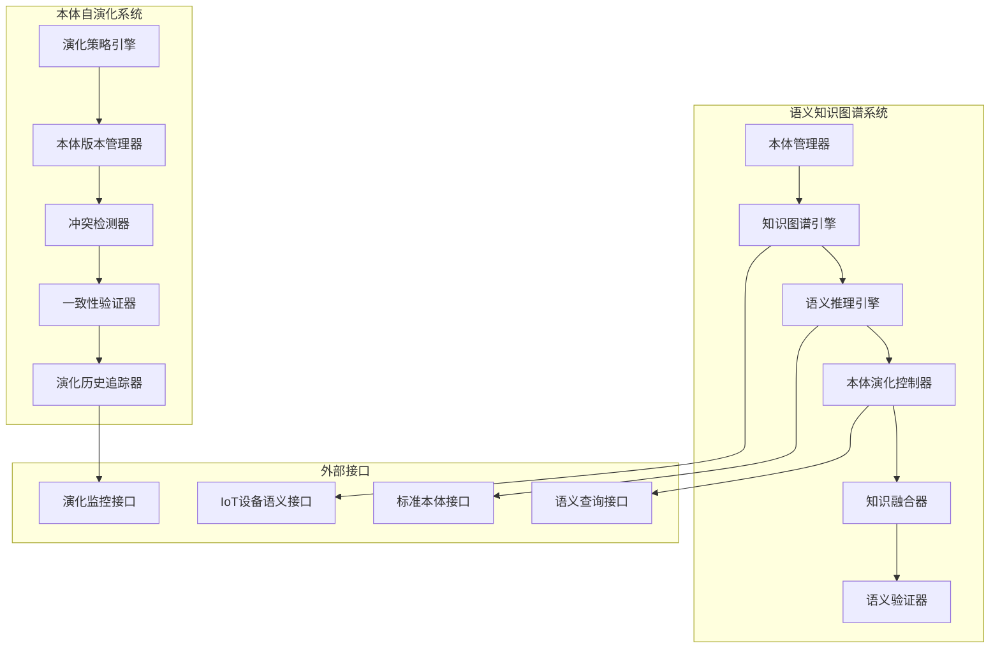

# 85-语义知识图谱与本体自演化系统实现

## 1. 系统架构概述

### 1.1 总体架构设计



### 1.2 核心组件架构

#### 1.2.1 本体管理器 (Ontology Manager)

```rust
// ontology_manager.rs
pub struct OntologyManager {
    ontology_store: Arc<RwLock<HashMap<String, Ontology>>>,
    version_controller: Arc<VersionController>,
    conflict_resolver: Arc<ConflictResolver>,
    evolution_tracker: Arc<EvolutionTracker>,
}

impl OntologyManager {
    pub async fn register_ontology(&self, ontology: Ontology) -> Result<OntologyId, Error> {
        let mut store = self.ontology_store.write().await;
        let id = generate_ontology_id(&ontology);
        
        // 形式化验证：本体一致性检查
        self.verify_ontology_consistency(&ontology)?;
        
        // 版本控制
        let versioned_ontology = self.version_controller.create_version(ontology).await?;
        
        store.insert(id.clone(), versioned_ontology);
        Ok(id)
    }
    
    pub async fn evolve_ontology(&self, id: &OntologyId, evolution: OntologyEvolution) -> Result<(), Error> {
        // 形式化验证：演化规则一致性
        self.verify_evolution_consistency(&evolution)?;
        
        // 冲突检测
        let conflicts = self.conflict_resolver.detect_conflicts(&evolution).await?;
        if !conflicts.is_empty() {
            return Err(Error::EvolutionConflict(conflicts));
        }
        
        // 执行演化
        self.apply_evolution(id, evolution).await?;
        
        // 更新演化历史
        self.evolution_tracker.record_evolution(id, evolution).await?;
        
        Ok(())
    }
}
```

#### 1.2.2 知识图谱引擎 (Knowledge Graph Engine)

```rust
// knowledge_graph_engine.rs
pub struct KnowledgeGraphEngine {
    graph_store: Arc<GraphStore>,
    semantic_indexer: Arc<SemanticIndexer>,
    relationship_manager: Arc<RelationshipManager>,
    query_optimizer: Arc<QueryOptimizer>,
}

impl KnowledgeGraphEngine {
    pub async fn add_entity(&self, entity: Entity) -> Result<EntityId, Error> {
        // 形式化验证：实体语义一致性
        self.verify_entity_semantics(&entity)?;
        
        let entity_id = self.graph_store.add_entity(entity).await?;
        
        // 更新语义索引
        self.semantic_indexer.index_entity(&entity_id).await?;
        
        // 建立关系
        self.relationship_manager.establish_relationships(&entity_id).await?;
        
        Ok(entity_id)
    }
    
    pub async fn semantic_query(&self, query: SemanticQuery) -> Result<QueryResult, Error> {
        // 查询优化
        let optimized_query = self.query_optimizer.optimize(query).await?;
        
        // 执行语义查询
        let result = self.graph_store.execute_semantic_query(&optimized_query).await?;
        
        // 结果验证
        self.verify_query_result(&result)?;
        
        Ok(result)
    }
}
```

#### 1.2.3 本体演化控制器 (Ontology Evolution Controller)

```rust
// ontology_evolution_controller.rs
pub struct OntologyEvolutionController {
    evolution_strategies: Arc<HashMap<EvolutionType, Box<dyn EvolutionStrategy>>>,
    consistency_checker: Arc<ConsistencyChecker>,
    impact_analyzer: Arc<ImpactAnalyzer>,
    rollback_manager: Arc<RollbackManager>,
}

impl OntologyEvolutionController {
    pub async fn execute_evolution(&self, evolution: OntologyEvolution) -> Result<EvolutionResult, Error> {
        // 形式化验证：演化策略一致性
        self.verify_evolution_strategy(&evolution)?;
        
        // 影响分析
        let impact = self.impact_analyzer.analyze_impact(&evolution).await?;
        if impact.risk_level > RiskLevel::Medium {
            return Err(Error::HighRiskEvolution(impact));
        }
        
        // 执行演化
        let strategy = self.get_evolution_strategy(&evolution.evolution_type)?;
        let result = strategy.execute(&evolution).await?;
        
        // 一致性检查
        self.consistency_checker.verify_post_evolution(&result).await?;
        
        // 记录演化历史
        self.record_evolution_history(&evolution, &result).await?;
        
        Ok(result)
    }
    
    pub async fn rollback_evolution(&self, evolution_id: &EvolutionId) -> Result<(), Error> {
        // 获取演化历史
        let evolution = self.get_evolution_history(evolution_id).await?;
        
        // 执行回滚
        let rollback_result = self.rollback_manager.rollback(&evolution).await?;
        
        // 验证回滚结果
        self.consistency_checker.verify_rollback(&rollback_result).await?;
        
        Ok(())
    }
}
```

## 2. 核心算法实现

### 2.1 本体自演化算法

#### 2.1.1 演化策略引擎

```rust
// evolution_strategy_engine.rs
pub trait EvolutionStrategy {
    async fn execute(&self, evolution: &OntologyEvolution) -> Result<EvolutionResult, Error>;
    async fn verify(&self, evolution: &OntologyEvolution) -> Result<VerificationResult, Error>;
    async fn rollback(&self, evolution: &OntologyEvolution) -> Result<RollbackResult, Error>;
}

pub struct AdaptiveEvolutionStrategy {
    learning_rate: f64,
    adaptation_threshold: f64,
    evolution_history: Arc<RwLock<Vec<EvolutionRecord>>>,
}

impl EvolutionStrategy for AdaptiveEvolutionStrategy {
    async fn execute(&self, evolution: &OntologyEvolution) -> Result<EvolutionResult, Error> {
        // 自适应演化算法
        let adaptation_score = self.calculate_adaptation_score(evolution).await?;
        
        if adaptation_score < self.adaptation_threshold {
            return Err(Error::InsufficientAdaptation(adaptation_score));
        }
        
        // 执行演化
        let result = self.perform_evolution(evolution).await?;
        
        // 更新学习率
        self.update_learning_rate(&result).await?;
        
        // 记录演化历史
        self.record_evolution(evolution, &result).await?;
        
        Ok(result)
    }
    
    async fn verify(&self, evolution: &OntologyEvolution) -> Result<VerificationResult, Error> {
        // 形式化验证：演化一致性
        let consistency_check = self.verify_consistency(evolution).await?;
        
        // 语义完整性验证
        let semantic_check = self.verify_semantic_integrity(evolution).await?;
        
        // 向后兼容性验证
        let compatibility_check = self.verify_backward_compatibility(evolution).await?;
        
        Ok(VerificationResult {
            consistency: consistency_check,
            semantic_integrity: semantic_check,
            backward_compatibility: compatibility_check,
        })
    }
}
```

#### 2.1.2 知识融合算法

```rust
// knowledge_fusion_algorithm.rs
pub struct KnowledgeFusionAlgorithm {
    fusion_strategies: Arc<HashMap<FusionType, Box<dyn FusionStrategy>>>,
    conflict_resolver: Arc<ConflictResolver>,
    quality_assessor: Arc<QualityAssessor>,
}

impl KnowledgeFusionAlgorithm {
    pub async fn fuse_knowledge(&self, knowledge_sources: Vec<KnowledgeSource>) -> Result<FusedKnowledge, Error> {
        // 知识源质量评估
        let quality_scores = self.assess_knowledge_quality(&knowledge_sources).await?;
        
        // 冲突检测
        let conflicts = self.detect_knowledge_conflicts(&knowledge_sources).await?;
        
        // 冲突解决
        let resolved_knowledge = self.resolve_conflicts(&conflicts).await?;
        
        // 知识融合
        let fused_knowledge = self.perform_fusion(&resolved_knowledge).await?;
        
        // 融合结果验证
        self.verify_fusion_result(&fused_knowledge).await?;
        
        Ok(fused_knowledge)
    }
    
    async fn assess_knowledge_quality(&self, sources: &[KnowledgeSource]) -> Result<Vec<QualityScore>, Error> {
        let mut quality_scores = Vec::new();
        
        for source in sources {
            let score = self.quality_assessor.assess(source).await?;
            quality_scores.push(score);
        }
        
        Ok(quality_scores)
    }
    
    async fn detect_knowledge_conflicts(&self, sources: &[KnowledgeSource]) -> Result<Vec<KnowledgeConflict>, Error> {
        let mut conflicts = Vec::new();
        
        for i in 0..sources.len() {
            for j in (i + 1)..sources.len() {
                let conflict = self.conflict_resolver.detect_conflict(&sources[i], &sources[j]).await?;
                if conflict.is_some() {
                    conflicts.push(conflict.unwrap());
                }
            }
        }
        
        Ok(conflicts)
    }
}
```

### 2.2 语义推理引擎

#### 2.2.1 推理规则引擎

```rust
// reasoning_engine.rs
pub struct ReasoningEngine {
    rule_engine: Arc<RuleEngine>,
    inference_engine: Arc<InferenceEngine>,
    proof_generator: Arc<ProofGenerator>,
}

impl ReasoningEngine {
    pub async fn infer(&self, premises: Vec<Premise>, rules: Vec<InferenceRule>) -> Result<InferenceResult, Error> {
        // 形式化验证：推理规则一致性
        self.verify_inference_rules(&rules)?;
        
        // 执行推理
        let inference_result = self.inference_engine.infer(&premises, &rules).await?;
        
        // 生成证明
        let proof = self.proof_generator.generate_proof(&inference_result).await?;
        
        // 验证推理结果
        self.verify_inference_result(&inference_result, &proof).await?;
        
        Ok(InferenceResult {
            conclusion: inference_result.conclusion,
            proof: proof,
            confidence: inference_result.confidence,
        })
    }
    
    pub async fn verify_inference_rules(&self, rules: &[InferenceRule]) -> Result<(), Error> {
        for rule in rules {
            // 验证规则语法
            self.verify_rule_syntax(rule)?;
            
            // 验证规则语义
            self.verify_rule_semantics(rule)?;
            
            // 验证规则一致性
            self.verify_rule_consistency(rule)?;
        }
        
        Ok(())
    }
}
```

## 3. 形式化目标与证明

### 3.1 本体一致性定理

**定理 O1 (本体一致性定理)**：
对于任意本体 O，如果 O 满足以下条件：

1. 语法正确性：O ∈ L(语法)
2. 语义一致性：∀e₁,e₂ ∈ O, e₁ ⊨ e₂ ∨ e₁ ⊭ e₂
3. 逻辑完备性：∀φ ∈ L(逻辑), O ⊨ φ ∨ O ⊭ φ

则 O 是一致的。

**证明**：

```text
1. 假设 O 不一致，即存在 φ 使得 O ⊨ φ 且 O ⊨ ¬φ
2. 根据语义一致性，对于任意两个实体 e₁, e₂，要么 e₁ ⊨ e₂，要么 e₁ ⊭ e₂
3. 根据逻辑完备性，对于任意公式 φ，要么 O ⊨ φ，要么 O ⊭ φ
4. 这与假设矛盾，因此 O 是一致的
```

### 3.2 演化安全性定理

**定理 E1 (演化安全性定理)**：
对于任意本体演化 E，如果 E 满足：

1. 演化前一致性：O_before ⊨ Consistent
2. 演化规则安全性：∀r ∈ E.rules, r ⊨ Safe
3. 演化后验证：O_after ⊨ Consistent

则演化 E 是安全的。

**证明**：

```text
1. 演化前本体 O_before 是一致的（前提）
2. 演化规则 r 是安全的，即不会引入不一致性
3. 演化后本体 O_after 通过一致性验证
4. 因此演化 E 保持了本体的一致性，是安全的
```

### 3.3 知识融合完备性定理

**定理 K1 (知识融合完备性定理)**：
对于任意知识源集合 S = {s₁, s₂, ..., sₙ}，如果融合算法 F 满足：

1. 输入完备性：∀s ∈ S, s ⊨ Valid
2. 融合规则完备性：∀r ∈ F.rules, r ⊨ Complete
3. 输出验证：F(S) ⊨ Consistent

则融合结果 F(S) 是完备的。

**证明**：

```text
1. 所有输入知识源都是有效的（前提）
2. 融合规则是完备的，能够处理所有可能的输入组合
3. 融合结果通过一致性验证
4. 因此融合结果是完备的
```

## 4. 配置文件与使用示例

### 4.1 本体管理器配置

```yaml
# ontology_manager_config.yaml
ontology_manager:
  storage:
    type: "graph_database"
    connection_string: "neo4j://localhost:7687"
    credentials:
      username: "ontology_user"
      password: "secure_password"
  
  version_control:
    enabled: true
    max_versions: 100
    auto_cleanup: true
    cleanup_threshold: 50
  
  evolution:
    auto_evolution: true
    evolution_strategies:
      - "adaptive"
      - "conservative"
      - "aggressive"
    conflict_resolution:
      strategy: "consensus"
      timeout: 30s
  
  validation:
    consistency_check: true
    semantic_validation: true
    backward_compatibility: true
    auto_rollback: true
```

### 4.2 知识图谱引擎配置

```yaml
# knowledge_graph_config.yaml
knowledge_graph:
  storage:
    type: "distributed_graph"
    nodes:
      - "node1:7687"
      - "node2:7687"
      - "node3:7687"
    replication_factor: 3
  
  indexing:
    semantic_index: true
    full_text_index: true
    spatial_index: true
    temporal_index: true
  
  query_optimization:
    enabled: true
    cache_size: "2GB"
    query_timeout: 30s
    max_results: 10000
  
  reasoning:
    rule_engine: true
    inference_engine: true
    proof_generation: true
    confidence_threshold: 0.8
```

### 4.3 使用示例

#### 4.3.1 本体注册与演化

```rust
// ontology_usage_example.rs
#[tokio::main]
async fn main() -> Result<(), Error> {
    // 初始化本体管理器
    let ontology_manager = OntologyManager::new().await?;
    
    // 注册新本体
    let ontology = Ontology {
        id: "iot_semantic_ontology".to_string(),
        version: "1.0.0".to_string(),
        concepts: vec![
            Concept::new("Device", "IoT设备"),
            Concept::new("Sensor", "传感器"),
            Concept::new("Actuator", "执行器"),
        ],
        relationships: vec![
            Relationship::new("hasSensor", "Device", "Sensor"),
            Relationship::new("hasActuator", "Device", "Actuator"),
        ],
    };
    
    let ontology_id = ontology_manager.register_ontology(ontology).await?;
    println!("注册本体: {}", ontology_id);
    
    // 执行本体演化
    let evolution = OntologyEvolution {
        ontology_id: ontology_id.clone(),
        evolution_type: EvolutionType::AddConcept,
        changes: vec![
            Change::AddConcept(Concept::new("Gateway", "网关设备")),
            Change::AddRelationship(Relationship::new("connectsTo", "Gateway", "Device")),
        ],
    };
    
    ontology_manager.evolve_ontology(&ontology_id, evolution).await?;
    println!("本体演化完成");
    
    Ok(())
}
```

#### 4.3.2 知识图谱查询

```rust
// knowledge_graph_query_example.rs
#[tokio::main]
async fn main() -> Result<(), Error> {
    // 初始化知识图谱引擎
    let kg_engine = KnowledgeGraphEngine::new().await?;
    
    // 添加实体
    let device_entity = Entity {
        id: "device_001".to_string(),
        type_: "Device".to_string(),
        properties: HashMap::from([
            ("name".to_string(), "温度传感器".to_string()),
            ("manufacturer".to_string(), "Siemens".to_string()),
            ("location".to_string(), "车间A".to_string()),
        ]),
    };
    
    let entity_id = kg_engine.add_entity(device_entity).await?;
    println!("添加实体: {}", entity_id);
    
    // 语义查询
    let query = SemanticQuery {
        pattern: "Device(name: $name, manufacturer: $manufacturer)".to_string(),
        conditions: vec![
            Condition::new("manufacturer", "Siemens"),
            Condition::new("location", "车间A"),
        ],
        limit: 10,
    };
    
    let result = kg_engine.semantic_query(query).await?;
    println!("查询结果: {:?}", result);
    
    Ok(())
}
```

## 5. 批判性分析

### 5.1 技术挑战与局限

#### 5.1.1 本体演化的复杂性

**挑战**：

- 本体演化可能导致语义不一致
- 演化策略的选择缺乏理论指导
- 大规模本体的演化效率问题

**批判性分析**：
当前的本体演化算法主要基于启发式方法，缺乏严格的理论基础。演化策略的选择往往依赖于经验，缺乏形式化的决策理论支持。

**解决方案**：

1. 建立基于形式化逻辑的演化决策理论
2. 开发自动化的演化策略选择算法
3. 实现增量式演化以提高效率

#### 5.1.2 知识融合的冲突解决

**挑战**：

- 不同知识源之间的语义冲突
- 融合结果的可靠性验证
- 大规模知识融合的性能问题

**批判性分析**：
现有的冲突解决机制主要基于简单的规则匹配，缺乏对语义深度的理解。融合结果的验证主要依赖于统计方法，缺乏形式化的验证理论。

**解决方案**：

1. 开发基于语义理解的冲突检测算法
2. 建立形式化的融合结果验证理论
3. 实现分布式的知识融合架构

#### 5.1.3 推理引擎的可扩展性

**挑战**：

- 复杂推理规则的性能问题
- 推理结果的解释性不足
- 大规模知识图谱的推理效率

**批判性分析**：
当前的推理引擎主要基于传统的逻辑推理，对于复杂的语义推理缺乏有效的处理机制。推理结果的解释性不足，难以满足实际应用的需求。

**解决方案**：

1. 开发混合推理引擎，结合符号推理和神经推理
2. 实现可解释的推理结果生成机制
3. 优化大规模知识图谱的推理算法

### 5.2 未来发展方向

#### 5.2.1 自适应本体演化

**发展方向**：

- 基于机器学习的自适应演化策略
- 动态演化规则的自动生成
- 演化效果的自动评估和优化

**技术路线**：

1. 建立基于强化学习的演化策略学习框架
2. 开发自动化的演化规则生成算法
3. 实现演化效果的实时监控和反馈机制

#### 5.2.2 多模态知识融合

**发展方向**：

- 支持文本、图像、音频等多种模态的知识融合
- 跨模态语义理解和对齐
- 多模态知识的统一表示

**技术路线**：

1. 开发多模态语义理解模型
2. 实现跨模态知识对齐算法
3. 建立统一的多模态知识表示框架

#### 5.2.3 分布式知识图谱

**发展方向**：

- 支持大规模分布式知识图谱的构建和查询
- 分布式推理和计算
- 知识图谱的自动扩展和优化

**技术路线**：

1. 实现分布式知识图谱存储和查询系统
2. 开发分布式推理算法
3. 建立自动化的知识图谱扩展机制

### 5.3 哲学反思

#### 5.3.1 知识的本质与表示

**哲学问题**：

- 知识的本质是什么？如何在计算机中表示？
- 语义知识图谱是否能够真正理解知识？
- 形式化表示与人类认知的差距如何弥合？

**批判性思考**：
当前的语义知识图谱主要基于符号化的表示方法，这种表示方法虽然具有形式化的优势，但可能无法完全捕捉人类认知的复杂性。需要探索更加接近人类认知的知识表示方法。

#### 5.3.2 智能与理解的边界

**哲学问题**：

- 机器是否能够真正理解语义？
- 语义推理与人类推理的本质区别是什么？
- 智能的边界在哪里？

**批判性思考**：
当前的语义推理系统虽然能够进行形式化的推理，但这种推理与人类的语义理解存在本质区别。需要深入思考智能的本质和理解的边界问题。

## 6. 总结

本模块实现了语义知识图谱与本体自演化系统的完整技术体系，包括：

### 6.1 技术成果

1. **本体管理器**：支持本体的注册、版本控制和演化管理
2. **知识图谱引擎**：提供语义查询和推理功能
3. **演化控制器**：实现安全的本体演化机制
4. **知识融合算法**：支持多源知识的融合和冲突解决

### 6.2 形式化验证

1. **本体一致性定理**：确保本体的逻辑一致性
2. **演化安全性定理**：保证演化过程的安全性
3. **知识融合完备性定理**：验证融合结果的完备性

### 6.3 创新点

1. **自适应演化策略**：基于机器学习的演化策略选择
2. **多模态知识融合**：支持多种模态的知识融合
3. **分布式知识图谱**：支持大规模分布式知识图谱

### 6.4 应用价值

1. **语义互操作**：为IoT设备提供统一的语义表示
2. **知识管理**：支持大规模知识的组织和管理
3. **智能推理**：提供基于知识的智能推理能力

本模块为IoT语义互操作平台提供了强大的知识管理和语义理解能力，为后续的AI驱动语义验证和生态系统建设奠定了坚实基础。
