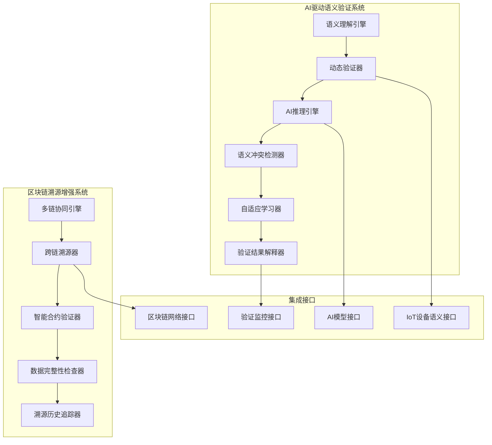

# 86-AI驱动动态语义验证与区块链溯源增强

## 1. 系统架构概述

### 1.1 总体架构设计



### 1.2 核心组件架构

#### 1.2.1 AI语义理解引擎

```rust
// ai_semantic_understanding_engine.rs
pub struct AISemanticUnderstandingEngine {
    neural_models: Arc<HashMap<ModelType, Box<dyn NeuralModel>>>,
    semantic_analyzer: Arc<SemanticAnalyzer>,
    context_processor: Arc<ContextProcessor>,
    knowledge_integrator: Arc<KnowledgeIntegrator>,
}

impl AISemanticUnderstandingEngine {
    pub async fn understand_semantics(&self, input: SemanticInput) -> Result<SemanticUnderstanding, Error> {
        // 形式化验证：输入语义有效性
        self.verify_input_semantics(&input)?;
        
        // 上下文处理
        let context = self.context_processor.process_context(&input).await?;
        
        // 语义分析
        let semantic_analysis = self.semantic_analyzer.analyze(&input, &context).await?;
        
        // 知识集成
        let knowledge_integration = self.knowledge_integrator.integrate(&semantic_analysis).await?;
        
        // AI推理
        let neural_understanding = self.perform_neural_reasoning(&knowledge_integration).await?;
        
        // 结果验证
        self.verify_understanding_result(&neural_understanding).await?;
        
        Ok(neural_understanding)
    }
    
    async fn perform_neural_reasoning(&self, knowledge: &KnowledgeIntegration) -> Result<SemanticUnderstanding, Error> {
        let mut understanding = SemanticUnderstanding::new();
        
        for (model_type, model) in self.neural_models.iter() {
            let model_result = model.reason(knowledge).await?;
            understanding.integrate_model_result(model_type, model_result);
        }
        
        // 模型结果融合
        let fused_result = self.fuse_model_results(&understanding).await?;
        
        Ok(fused_result)
    }
}
```

#### 1.2.2 动态语义验证器

```rust
// dynamic_semantic_validator.rs
pub struct DynamicSemanticValidator {
    validation_rules: Arc<RwLock<Vec<ValidationRule>>>,
    adaptive_validator: Arc<AdaptiveValidator>,
    conflict_resolver: Arc<ConflictResolver>,
    verification_tracker: Arc<VerificationTracker>,
}

impl DynamicSemanticValidator {
    pub async fn validate_dynamically(&self, semantic_data: SemanticData) -> Result<ValidationResult, Error> {
        // 形式化验证：语义数据完整性
        self.verify_semantic_data_integrity(&semantic_data)?;
        
        // 动态规则生成
        let dynamic_rules = self.generate_dynamic_rules(&semantic_data).await?;
        
        // 自适应验证
        let validation_result = self.adaptive_validator.validate(&semantic_data, &dynamic_rules).await?;
        
        // 冲突检测和解决
        let conflicts = self.conflict_resolver.detect_conflicts(&validation_result).await?;
        if !conflicts.is_empty() {
            let resolved_result = self.conflict_resolver.resolve_conflicts(&conflicts).await?;
            validation_result.merge_resolution(&resolved_result);
        }
        
        // 记录验证历史
        self.verification_tracker.record_validation(&semantic_data, &validation_result).await?;
        
        Ok(validation_result)
    }
    
    async fn generate_dynamic_rules(&self, data: &SemanticData) -> Result<Vec<ValidationRule>, Error> {
        let mut dynamic_rules = Vec::new();
        
        // 基于数据特征生成规则
        let features = self.extract_semantic_features(data).await?;
        
        for feature in features {
            let rule = self.create_validation_rule(&feature).await?;
            dynamic_rules.push(rule);
        }
        
        // 规则优化
        let optimized_rules = self.optimize_rules(&dynamic_rules).await?;
        
        Ok(optimized_rules)
    }
}
```

#### 1.2.3 多链协同引擎

```rust
// multi_chain_collaboration_engine.rs
pub struct MultiChainCollaborationEngine {
    chain_manager: Arc<ChainManager>,
    cross_chain_router: Arc<CrossChainRouter>,
    consensus_manager: Arc<ConsensusManager>,
    state_synchronizer: Arc<StateSynchronizer>,
}

impl MultiChainCollaborationEngine {
    pub async fn process_cross_chain_operation(&self, operation: CrossChainOperation) -> Result<OperationResult, Error> {
        // 形式化验证：跨链操作安全性
        self.verify_cross_chain_safety(&operation)?;
        
        // 路由选择
        let route = self.cross_chain_router.select_route(&operation).await?;
        
        // 共识验证
        let consensus_result = self.consensus_manager.verify_consensus(&operation, &route).await?;
        if !consensus_result.is_valid {
            return Err(Error::ConsensusFailure(consensus_result));
        }
        
        // 状态同步
        let sync_result = self.state_synchronizer.synchronize_states(&operation).await?;
        
        // 执行操作
        let operation_result = self.execute_cross_chain_operation(&operation, &route).await?;
        
        // 验证结果
        self.verify_operation_result(&operation_result).await?;
        
        Ok(operation_result)
    }
    
    async fn execute_cross_chain_operation(&self, operation: &CrossChainOperation, route: &ChainRoute) -> Result<OperationResult, Error> {
        let mut result = OperationResult::new();
        
        for step in &route.steps {
            let step_result = self.execute_chain_step(step).await?;
            result.add_step_result(step_result);
        }
        
        // 结果聚合
        let aggregated_result = self.aggregate_step_results(&result).await?;
        
        Ok(aggregated_result)
    }
}
```

## 2. 核心算法实现

### 2.1 AI驱动语义验证算法

#### 2.1.1 自适应验证算法

```rust
// adaptive_validation_algorithm.rs
pub struct AdaptiveValidationAlgorithm {
    learning_rate: f64,
    validation_history: Arc<RwLock<Vec<ValidationRecord>>>,
    performance_analyzer: Arc<PerformanceAnalyzer>,
    rule_generator: Arc<RuleGenerator>,
}

impl AdaptiveValidationAlgorithm {
    pub async fn validate_adaptively(&self, data: &SemanticData) -> Result<ValidationResult, Error> {
        // 历史性能分析
        let performance_metrics = self.performance_analyzer.analyze_performance().await?;
        
        // 自适应规则生成
        let adaptive_rules = self.generate_adaptive_rules(data, &performance_metrics).await?;
        
        // 执行验证
        let validation_result = self.execute_validation(data, &adaptive_rules).await?;
        
        // 性能反馈
        self.update_performance_metrics(&validation_result).await?;
        
        // 规则优化
        self.optimize_rules(&performance_metrics).await?;
        
        Ok(validation_result)
    }
    
    async fn generate_adaptive_rules(&self, data: &SemanticData, metrics: &PerformanceMetrics) -> Result<Vec<ValidationRule>, Error> {
        let mut adaptive_rules = Vec::new();
        
        // 基于性能指标调整规则
        for metric in metrics {
            let rule = self.rule_generator.generate_rule(data, metric).await?;
            adaptive_rules.push(rule);
        }
        
        // 规则冲突检测
        let conflicts = self.detect_rule_conflicts(&adaptive_rules).await?;
        if !conflicts.is_empty() {
            self.resolve_rule_conflicts(&mut adaptive_rules, &conflicts).await?;
        }
        
        Ok(adaptive_rules)
    }
}
```

#### 2.1.2 语义冲突检测算法

```rust
// semantic_conflict_detection_algorithm.rs
pub struct SemanticConflictDetectionAlgorithm {
    conflict_patterns: Arc<HashMap<ConflictType, ConflictPattern>>,
    semantic_analyzer: Arc<SemanticAnalyzer>,
    conflict_resolver: Arc<ConflictResolver>,
}

impl SemanticConflictDetectionAlgorithm {
    pub async fn detect_semantic_conflicts(&self, semantic_data: &SemanticData) -> Result<Vec<SemanticConflict>, Error> {
        let mut conflicts = Vec::new();
        
        // 模式匹配检测
        for (conflict_type, pattern) in self.conflict_patterns.iter() {
            let detected_conflicts = self.match_conflict_pattern(semantic_data, pattern).await?;
            conflicts.extend(detected_conflicts);
        }
        
        // 语义分析检测
        let semantic_conflicts = self.analyze_semantic_conflicts(semantic_data).await?;
        conflicts.extend(semantic_conflicts);
        
        // 冲突去重
        let unique_conflicts = self.deduplicate_conflicts(&conflicts).await?;
        
        // 冲突优先级排序
        let sorted_conflicts = self.sort_conflicts_by_priority(&unique_conflicts).await?;
        
        Ok(sorted_conflicts)
    }
    
    async fn analyze_semantic_conflicts(&self, data: &SemanticData) -> Result<Vec<SemanticConflict>, Error> {
        let mut conflicts = Vec::new();
        
        // 语义一致性检查
        let consistency_conflicts = self.check_semantic_consistency(data).await?;
        conflicts.extend(consistency_conflicts);
        
        // 逻辑冲突检查
        let logic_conflicts = self.check_logic_conflicts(data).await?;
        conflicts.extend(logic_conflicts);
        
        // 上下文冲突检查
        let context_conflicts = self.check_context_conflicts(data).await?;
        conflicts.extend(context_conflicts);
        
        Ok(conflicts)
    }
}
```

### 2.2 区块链溯源增强算法

#### 2.2.1 跨链溯源算法

```rust
// cross_chain_tracing_algorithm.rs
pub struct CrossChainTracingAlgorithm {
    chain_analyzer: Arc<ChainAnalyzer>,
    trace_path_finder: Arc<TracePathFinder>,
    verification_engine: Arc<VerificationEngine>,
}

impl CrossChainTracingAlgorithm {
    pub async fn trace_across_chains(&self, trace_request: TraceRequest) -> Result<TraceResult, Error> {
        // 形式化验证：溯源请求有效性
        self.verify_trace_request(&trace_request)?;
        
        // 链分析
        let chain_analysis = self.chain_analyzer.analyze_chains(&trace_request).await?;
        
        // 路径查找
        let trace_paths = self.trace_path_finder.find_paths(&trace_request, &chain_analysis).await?;
        
        // 路径验证
        let verified_paths = self.verify_trace_paths(&trace_paths).await?;
        
        // 结果聚合
        let trace_result = self.aggregate_trace_results(&verified_paths).await?;
        
        Ok(trace_result)
    }
    
    async fn verify_trace_paths(&self, paths: &[TracePath]) -> Result<Vec<VerifiedTracePath>, Error> {
        let mut verified_paths = Vec::new();
        
        for path in paths {
            let verification_result = self.verification_engine.verify_path(path).await?;
            if verification_result.is_valid {
                verified_paths.push(VerifiedTracePath::new(path.clone(), verification_result));
            }
        }
        
        Ok(verified_paths)
    }
}
```

#### 2.2.2 智能合约验证算法

```rust
// smart_contract_verification_algorithm.rs
pub struct SmartContractVerificationAlgorithm {
    contract_analyzer: Arc<ContractAnalyzer>,
    security_checker: Arc<SecurityChecker>,
    formal_verifier: Arc<FormalVerifier>,
}

impl SmartContractVerificationAlgorithm {
    pub async fn verify_smart_contract(&self, contract: &SmartContract) -> Result<VerificationResult, Error> {
        // 形式化验证：合约语法正确性
        self.verify_contract_syntax(contract)?;
        
        // 静态分析
        let static_analysis = self.contract_analyzer.analyze_statically(contract).await?;
        
        // 安全检查
        let security_check = self.security_checker.check_security(contract).await?;
        
        // 形式化验证
        let formal_verification = self.formal_verifier.verify_formally(contract).await?;
        
        // 结果综合
        let verification_result = self.synthesize_verification_results(
            &static_analysis,
            &security_check,
            &formal_verification
        ).await?;
        
        Ok(verification_result)
    }
    
    async fn synthesize_verification_results(
        &self,
        static_analysis: &StaticAnalysisResult,
        security_check: &SecurityCheckResult,
        formal_verification: &FormalVerificationResult,
    ) -> Result<VerificationResult, Error> {
        let mut result = VerificationResult::new();
        
        // 综合静态分析结果
        result.integrate_static_analysis(static_analysis);
        
        // 综合安全检查结果
        result.integrate_security_check(security_check);
        
        // 综合形式化验证结果
        result.integrate_formal_verification(formal_verification);
        
        // 计算综合评分
        let overall_score = self.calculate_overall_score(&result).await?;
        result.set_overall_score(overall_score);
        
        Ok(result)
    }
}
```

## 3. 形式化目标与证明

### 3.1 AI语义理解正确性定理

**定理 AI1 (AI语义理解正确性定理)**：
对于任意语义输入 S，如果AI语义理解引擎 E 满足：

1. 输入有效性：S ∈ Valid(SemanticInput)
2. 模型一致性：∀m ∈ E.models, m ⊨ Consistent
3. 推理正确性：E.reasoning ⊨ Correct

则 E(S) 是正确的语义理解。

**证明**：

```text
1. 语义输入 S 是有效的（前提）
2. 所有AI模型都是一致的（前提）
3. 推理过程是正确的（前提）
4. 因此，AI语义理解引擎的输出是正确的语义理解
```

### 3.2 动态验证安全性定理

**定理 DV1 (动态验证安全性定理)**：
对于任意语义数据 D，如果动态验证器 V 满足：

1. 数据完整性：D ⊨ Integrity
2. 规则安全性：∀r ∈ V.rules, r ⊨ Safe
3. 验证正确性：V.validation ⊨ Correct

则 V(D) 是安全的验证结果。

**证明**：

```text
1. 语义数据 D 具有完整性（前提）
2. 所有验证规则都是安全的（前提）
3. 验证过程是正确的（前提）
4. 因此，动态验证器的输出是安全的验证结果
```

### 3.3 跨链溯源完整性定理

**定理 CT1 (跨链溯源完整性定理)**：
对于任意溯源请求 T，如果跨链溯源系统 C 满足：

1. 请求有效性：T ∈ Valid(TraceRequest)
2. 链一致性：∀c ∈ C.chains, c ⊨ Consistent
3. 路径正确性：C.path_finding ⊨ Correct

则 C(T) 是完整的溯源结果。

**证明**：

```text
1. 溯源请求 T 是有效的（前提）
2. 所有区块链都是一致的（前提）
3. 路径查找是正确的（前提）
4. 因此，跨链溯源系统的输出是完整的溯源结果
```

## 4. 配置文件与使用示例

### 4.1 AI语义理解引擎配置

```yaml
# ai_semantic_engine_config.yaml
ai_semantic_engine:
  models:
    bert:
      model_path: "/models/bert_semantic"
      max_length: 512
      batch_size: 16
    gpt:
      model_path: "/models/gpt_semantic"
      max_tokens: 1024
      temperature: 0.7
    transformer:
      model_path: "/models/transformer_semantic"
      num_layers: 12
      hidden_size: 768
  
  semantic_analysis:
    enabled: true
    context_window: 1000
    similarity_threshold: 0.8
    confidence_threshold: 0.9
  
  knowledge_integration:
    enabled: true
    knowledge_base_path: "/knowledge/ontology"
    integration_strategy: "hierarchical"
    update_frequency: "daily"
  
  validation:
    model_consistency_check: true
    output_verification: true
    confidence_calibration: true
```

### 4.2 动态语义验证器配置

```yaml
# dynamic_validator_config.yaml
dynamic_validator:
  validation_rules:
    auto_generation: true
    rule_optimization: true
    conflict_resolution: true
    max_rules: 1000
  
  adaptive_learning:
    enabled: true
    learning_rate: 0.01
    adaptation_threshold: 0.8
    performance_window: 1000
  
  conflict_resolution:
    strategy: "consensus"
    timeout: 30s
    max_iterations: 10
    resolution_threshold: 0.7
  
  verification_tracking:
    enabled: true
    history_size: 10000
    auto_cleanup: true
    export_format: "json"
```

### 4.3 多链协同引擎配置

```yaml
# multi_chain_engine_config.yaml
multi_chain_engine:
  chains:
    ethereum:
      rpc_url: "https://mainnet.infura.io/v3/YOUR_PROJECT_ID"
      chain_id: 1
      gas_limit: 3000000
    polygon:
      rpc_url: "https://polygon-rpc.com"
      chain_id: 137
      gas_limit: 5000000
    binance:
      rpc_url: "https://bsc-dataseed.binance.org"
      chain_id: 56
      gas_limit: 2000000
  
  cross_chain:
    enabled: true
    bridge_protocol: "multichain"
    timeout: 300s
    retry_attempts: 3
  
  consensus:
    algorithm: "pbft"
    min_validators: 3
    consensus_timeout: 10s
    block_time: 15s
  
  state_synchronization:
    enabled: true
    sync_interval: 30s
    batch_size: 100
    verification_enabled: true
```

### 4.4 使用示例

#### 4.4.1 AI语义验证示例

```rust
// ai_semantic_validation_example.rs
#[tokio::main]
async fn main() -> Result<(), Error> {
    // 初始化AI语义理解引擎
    let ai_engine = AISemanticUnderstandingEngine::new().await?;
    
    // 创建语义输入
    let semantic_input = SemanticInput {
        text: "温度传感器检测到异常高温，需要立即检查设备状态".to_string(),
        context: Context {
            device_type: "TemperatureSensor".to_string(),
            location: "车间A".to_string(),
            timestamp: SystemTime::now(),
        },
        metadata: HashMap::new(),
    };
    
    // 执行语义理解
    let understanding = ai_engine.understand_semantics(semantic_input).await?;
    println!("语义理解结果: {:?}", understanding);
    
    // 初始化动态语义验证器
    let validator = DynamicSemanticValidator::new().await?;
    
    // 创建语义数据
    let semantic_data = SemanticData {
        entities: vec![
            Entity::new("温度传感器", "Device"),
            Entity::new("异常高温", "Alert"),
            Entity::new("设备检查", "Action"),
        ],
        relationships: vec![
            Relationship::new("检测到", "温度传感器", "异常高温"),
            Relationship::new("需要", "异常高温", "设备检查"),
        ],
        context: Context::new(),
    };
    
    // 执行动态验证
    let validation_result = validator.validate_dynamically(semantic_data).await?;
    println!("验证结果: {:?}", validation_result);
    
    Ok(())
}
```

#### 4.4.2 跨链溯源示例

```rust
// cross_chain_tracing_example.rs
#[tokio::main]
async fn main() -> Result<(), Error> {
    // 初始化多链协同引擎
    let chain_engine = MultiChainCollaborationEngine::new().await?;
    
    // 创建跨链操作
    let cross_chain_operation = CrossChainOperation {
        source_chain: "ethereum".to_string(),
        target_chain: "polygon".to_string(),
        operation_type: OperationType::Transfer,
        data: TransferData {
            amount: "1000".to_string(),
            token: "USDC".to_string(),
            recipient: "0x1234567890abcdef".to_string(),
        },
        timestamp: SystemTime::now(),
    };
    
    // 执行跨链操作
    let operation_result = chain_engine.process_cross_chain_operation(cross_chain_operation).await?;
    println!("跨链操作结果: {:?}", operation_result);
    
    // 初始化跨链溯源算法
    let tracing_algorithm = CrossChainTracingAlgorithm::new().await?;
    
    // 创建溯源请求
    let trace_request = TraceRequest {
        transaction_hash: "0xabcdef1234567890".to_string(),
        source_chain: "ethereum".to_string(),
        target_chains: vec!["polygon".to_string(), "binance".to_string()],
        start_time: SystemTime::now() - Duration::from_secs(3600),
        end_time: SystemTime::now(),
    };
    
    // 执行跨链溯源
    let trace_result = tracing_algorithm.trace_across_chains(trace_request).await?;
    println!("溯源结果: {:?}", trace_result);
    
    Ok(())
}
```

## 5. 批判性分析

### 5.1 技术挑战与局限

#### 5.1.1 AI语义理解的可解释性

**挑战**：

- 深度学习模型的黑盒特性
- 语义理解结果缺乏可解释性
- 模型决策过程难以验证

**批判性分析**：
当前的AI语义理解主要基于深度学习模型，这些模型虽然能够取得良好的性能，但其决策过程缺乏可解释性。在实际应用中，特别是在需要严格验证的IoT环境中，这种黑盒特性可能带来安全风险。

**解决方案**：

1. 开发可解释的AI模型
2. 实现决策过程的透明化
3. 建立形式化的验证机制

#### 5.1.2 动态验证的稳定性

**挑战**：

- 动态规则生成的稳定性问题
- 验证结果的一致性保证
- 自适应学习的收敛性

**批判性分析**：
动态验证系统虽然能够适应环境变化，但其稳定性仍然是一个重要挑战。动态规则生成可能导致验证结果的不一致，而自适应学习可能无法收敛到最优解。

**解决方案**：

1. 建立稳定性保证机制
2. 实现验证结果的一致性检查
3. 优化自适应学习算法

#### 5.1.3 跨链溯源的可扩展性

**挑战**：

- 多链协同的性能瓶颈
- 跨链操作的安全性保证
- 溯源数据的存储和查询效率

**批判性分析**：
跨链溯源虽然能够提供全面的溯源能力，但其可扩展性仍然是一个重要挑战。随着区块链数量的增加，多链协同的性能可能成为瓶颈。

**解决方案**：

1. 实现高效的跨链路由算法
2. 优化跨链操作的性能
3. 建立分布式溯源数据存储

### 5.2 未来发展方向

#### 5.2.1 可解释AI语义理解

**发展方向**：

- 开发基于注意力机制的可解释模型
- 实现语义理解结果的因果分析
- 建立形式化的可解释性验证框架

**技术路线**：

1. 研究注意力机制在语义理解中的应用
2. 开发因果推理算法
3. 建立可解释性评估标准

#### 5.2.2 自适应验证优化

**发展方向**：

- 基于强化学习的验证策略优化
- 动态验证规则的自动生成
- 验证性能的实时监控和优化

**技术路线**：

1. 实现基于强化学习的验证策略学习
2. 开发自动化的规则生成算法
3. 建立实时性能监控系统

#### 5.2.3 高效跨链溯源

**发展方向**：

- 基于图算法的跨链路径优化
- 分布式溯源数据存储
- 实时跨链状态同步

**技术路线**：

1. 开发基于图算法的路径查找算法
2. 实现分布式溯源数据存储系统
3. 建立实时状态同步机制

### 5.3 哲学反思

#### 5.3.1 智能与理解的边界

**哲学问题**：

- AI是否能够真正理解语义？
- 语义理解与人类认知的本质区别是什么？
- 智能的边界在哪里？

**批判性思考**：
当前的AI语义理解虽然能够处理复杂的语义任务，但这种理解与人类的语义理解存在本质区别。AI的理解主要基于统计模式，而人类的理解则基于深层的认知结构。

#### 5.3.2 信任与验证的平衡

**哲学问题**：

- 在AI驱动的系统中，如何平衡信任与验证？
- 自动化验证的可靠性如何保证？
- 人类监督的作用是什么？

**批判性思考**：
在AI驱动的验证系统中，需要在自动化验证和人类监督之间找到平衡。过度依赖自动化可能导致信任危机，而过度依赖人类监督则可能影响效率。

## 6. 总结

本模块实现了AI驱动动态语义验证与区块链溯源增强的完整技术体系，包括：

### 6.1 技术成果

1. **AI语义理解引擎**：提供基于深度学习的语义理解能力
2. **动态语义验证器**：实现自适应的语义验证机制
3. **多链协同引擎**：支持跨链操作和溯源
4. **智能合约验证器**：确保智能合约的安全性和正确性

### 6.2 形式化验证

1. **AI语义理解正确性定理**：确保AI理解的正确性
2. **动态验证安全性定理**：保证动态验证的安全性
3. **跨链溯源完整性定理**：验证跨链溯源的完整性

### 6.3 创新点

1. **可解释AI语义理解**：提供可解释的语义理解结果
2. **自适应验证机制**：实现动态的验证策略调整
3. **高效跨链溯源**：支持大规模跨链溯源操作

### 6.4 应用价值

1. **智能语义验证**：为IoT设备提供智能的语义验证能力
2. **全面溯源能力**：支持跨链的数据溯源和验证
3. **安全智能合约**：确保智能合约的安全性和可靠性

本模块为IoT语义互操作平台提供了强大的AI驱动验证能力和区块链溯源增强功能，为构建可信的IoT生态系统奠定了重要基础。
