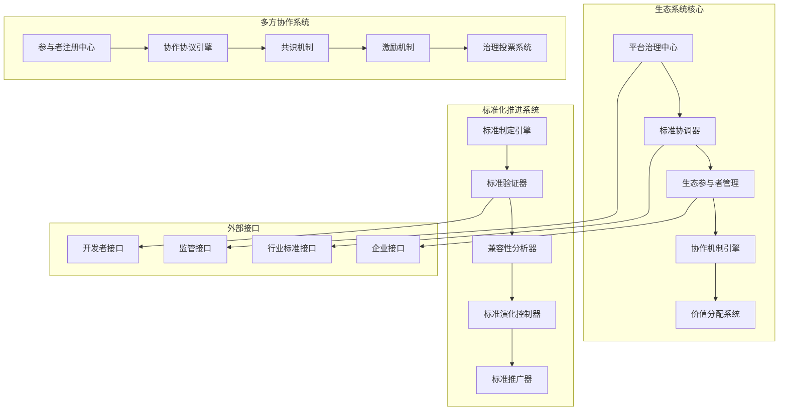

# 87-语义互操作平台生态系统与标准化推进

## 1. 系统架构概述

### 1.1 总体架构设计



### 1.2 核心组件架构

#### 1.2.1 平台治理中心

```rust
// platform_governance_center.rs
pub struct PlatformGovernanceCenter {
    governance_rules: Arc<RwLock<Vec<GovernanceRule>>>,
    voting_system: Arc<VotingSystem>,
    proposal_manager: Arc<ProposalManager>,
    policy_enforcer: Arc<PolicyEnforcer>,
}

impl PlatformGovernanceCenter {
    pub async fn submit_proposal(&self, proposal: GovernanceProposal) -> Result<ProposalId, Error> {
        // 形式化验证：提案合规性
        self.verify_proposal_compliance(&proposal)?;
        
        // 提案分类和路由
        let proposal_id = self.proposal_manager.register_proposal(proposal).await?;
        
        // 触发投票流程
        self.voting_system.initiate_vote(&proposal_id).await?;
        
        Ok(proposal_id)
    }
    
    pub async fn execute_governance_action(&self, action: GovernanceAction) -> Result<(), Error> {
        // 形式化验证：治理动作合法性
        self.verify_governance_action(&action)?;
        
        // 权限检查
        self.check_permissions(&action).await?;
        
        // 执行治理动作
        let result = self.policy_enforcer.enforce_action(&action).await?;
        
        // 记录治理历史
        self.record_governance_history(&action, &result).await?;
        
        Ok(())
    }
    
    pub async fn get_governance_status(&self) -> Result<GovernanceStatus, Error> {
        let mut status = GovernanceStatus::new();
        
        // 获取当前提案状态
        let active_proposals = self.proposal_manager.get_active_proposals().await?;
        status.set_active_proposals(active_proposals);
        
        // 获取投票统计
        let voting_stats = self.voting_system.get_voting_statistics().await?;
        status.set_voting_statistics(voting_stats);
        
        // 获取政策执行状态
        let policy_status = self.policy_enforcer.get_policy_status().await?;
        status.set_policy_status(policy_status);
        
        Ok(status)
    }
}
```

#### 1.2.2 标准协调器

```rust
// standard_coordinator.rs
pub struct StandardCoordinator {
    standard_registry: Arc<StandardRegistry>,
    compatibility_analyzer: Arc<CompatibilityAnalyzer>,
    standard_validator: Arc<StandardValidator>,
    evolution_tracker: Arc<EvolutionTracker>,
}

impl StandardCoordinator {
    pub async fn register_standard(&self, standard: Standard) -> Result<StandardId, Error> {
        // 形式化验证：标准完整性
        self.verify_standard_integrity(&standard)?;
        
        // 兼容性检查
        let compatibility_result = self.compatibility_analyzer.analyze_compatibility(&standard).await?;
        if !compatibility_result.is_compatible {
            return Err(Error::IncompatibleStandard(compatibility_result));
        }
        
        // 标准验证
        let validation_result = self.standard_validator.validate_standard(&standard).await?;
        if !validation_result.is_valid {
            return Err(Error::InvalidStandard(validation_result));
        }
        
        // 注册标准
        let standard_id = self.standard_registry.register(standard).await?;
        
        // 记录演化历史
        self.evolution_tracker.record_standard_registration(&standard_id).await?;
        
        Ok(standard_id)
    }
    
    pub async fn coordinate_standards(&self, standards: Vec<Standard>) -> Result<CoordinationResult, Error> {
        let mut coordination_result = CoordinationResult::new();
        
        // 标准冲突检测
        let conflicts = self.detect_standard_conflicts(&standards).await?;
        if !conflicts.is_empty() {
            let resolved_conflicts = self.resolve_standard_conflicts(&conflicts).await?;
            coordination_result.set_resolved_conflicts(resolved_conflicts);
        }
        
        // 标准协调
        let coordination = self.perform_standard_coordination(&standards).await?;
        coordination_result.set_coordination(coordination);
        
        // 兼容性验证
        let compatibility = self.verify_coordination_compatibility(&coordination).await?;
        coordination_result.set_compatibility(compatibility);
        
        Ok(coordination_result)
    }
}
```

#### 1.2.3 生态参与者管理

```rust
// ecosystem_participant_manager.rs
pub struct EcosystemParticipantManager {
    participant_registry: Arc<ParticipantRegistry>,
    role_manager: Arc<RoleManager>,
    permission_controller: Arc<PermissionController>,
    incentive_manager: Arc<IncentiveManager>,
}

impl EcosystemParticipantManager {
    pub async fn register_participant(&self, participant: Participant) -> Result<ParticipantId, Error> {
        // 形式化验证：参与者资质
        self.verify_participant_qualification(&participant)?;
        
        // 角色分配
        let roles = self.role_manager.assign_roles(&participant).await?;
        
        // 权限设置
        let permissions = self.permission_controller.set_permissions(&participant, &roles).await?;
        
        // 激励机制设置
        let incentives = self.incentive_manager.setup_incentives(&participant).await?;
        
        // 注册参与者
        let participant_id = self.participant_registry.register(participant, roles, permissions, incentives).await?;
        
        Ok(participant_id)
    }
    
    pub async fn manage_participant_roles(&self, participant_id: &ParticipantId, role_changes: Vec<RoleChange>) -> Result<(), Error> {
        // 形式化验证：角色变更合法性
        self.verify_role_changes(&role_changes)?;
        
        // 权限更新
        for role_change in &role_changes {
            self.permission_controller.update_permissions(participant_id, role_change).await?;
        }
        
        // 激励机制更新
        self.incentive_manager.update_incentives(participant_id, &role_changes).await?;
        
        // 记录角色变更历史
        self.record_role_change_history(participant_id, &role_changes).await?;
        
        Ok(())
    }
}
```

## 2. 核心算法实现

### 2.1 标准化推进算法

#### 2.1.1 标准制定引擎

```rust
// standard_development_engine.rs
pub struct StandardDevelopmentEngine {
    requirement_analyzer: Arc<RequirementAnalyzer>,
    standard_generator: Arc<StandardGenerator>,
    consensus_builder: Arc<ConsensusBuilder>,
    validation_engine: Arc<ValidationEngine>,
}

impl StandardDevelopmentEngine {
    pub async fn develop_standard(&self, requirements: StandardRequirements) -> Result<Standard, Error> {
        // 形式化验证：需求完整性
        self.verify_requirements_completeness(&requirements)?;
        
        // 需求分析
        let analysis_result = self.requirement_analyzer.analyze(&requirements).await?;
        
        // 标准生成
        let draft_standard = self.standard_generator.generate(&analysis_result).await?;
        
        // 共识构建
        let consensus_result = self.consensus_builder.build_consensus(&draft_standard).await?;
        if !consensus_result.has_consensus {
            return Err(Error::NoConsensus(consensus_result));
        }
        
        // 标准验证
        let validation_result = self.validation_engine.validate_standard(&draft_standard).await?;
        if !validation_result.is_valid {
            return Err(Error::InvalidStandard(validation_result));
        }
        
        Ok(draft_standard)
    }
    
    async fn build_consensus(&self, standard: &Standard) -> Result<ConsensusResult, Error> {
        let mut consensus_result = ConsensusResult::new();
        
        // 收集利益相关者意见
        let stakeholder_opinions = self.collect_stakeholder_opinions(standard).await?;
        
        // 意见分析和分类
        let opinion_analysis = self.analyze_opinions(&stakeholder_opinions).await?;
        
        // 冲突解决
        let resolved_conflicts = self.resolve_consensus_conflicts(&opinion_analysis).await?;
        
        // 共识达成
        let consensus = self.reach_consensus(&resolved_conflicts).await?;
        consensus_result.set_consensus(consensus);
        
        Ok(consensus_result)
    }
}
```

#### 2.1.2 标准演化控制器

```rust
// standard_evolution_controller.rs
pub struct StandardEvolutionController {
    evolution_strategies: Arc<HashMap<EvolutionType, Box<dyn EvolutionStrategy>>>,
    impact_analyzer: Arc<ImpactAnalyzer>,
    compatibility_checker: Arc<CompatibilityChecker>,
    migration_planner: Arc<MigrationPlanner>,
}

impl StandardEvolutionController {
    pub async fn evolve_standard(&self, standard_id: &StandardId, evolution: StandardEvolution) -> Result<EvolutionResult, Error> {
        // 形式化验证：演化策略一致性
        self.verify_evolution_strategy(&evolution)?;
        
        // 影响分析
        let impact = self.impact_analyzer.analyze_impact(standard_id, &evolution).await?;
        if impact.risk_level > RiskLevel::Medium {
            return Err(Error::HighRiskEvolution(impact));
        }
        
        // 兼容性检查
        let compatibility = self.compatibility_checker.check_compatibility(standard_id, &evolution).await?;
        if !compatibility.is_compatible {
            return Err(Error::IncompatibleEvolution(compatibility));
        }
        
        // 迁移计划制定
        let migration_plan = self.migration_planner.create_migration_plan(standard_id, &evolution).await?;
        
        // 执行演化
        let evolution_result = self.execute_evolution(standard_id, &evolution, &migration_plan).await?;
        
        Ok(evolution_result)
    }
    
    async fn execute_evolution(&self, standard_id: &StandardId, evolution: &StandardEvolution, migration_plan: &MigrationPlan) -> Result<EvolutionResult, Error> {
        let mut result = EvolutionResult::new();
        
        // 执行迁移计划
        for step in &migration_plan.steps {
            let step_result = self.execute_migration_step(step).await?;
            result.add_migration_step(step_result);
        }
        
        // 应用演化变更
        let evolution_applied = self.apply_evolution_changes(standard_id, evolution).await?;
        result.set_evolution_applied(evolution_applied);
        
        // 验证演化结果
        let verification_result = self.verify_evolution_result(standard_id, &result).await?;
        result.set_verification_result(verification_result);
        
        Ok(result)
    }
}
```

### 2.2 生态系统协作算法

#### 2.2.1 协作协议引擎

```rust
// collaboration_protocol_engine.rs
pub struct CollaborationProtocolEngine {
    protocol_registry: Arc<ProtocolRegistry>,
    agreement_builder: Arc<AgreementBuilder>,
    conflict_resolver: Arc<ConflictResolver>,
    performance_monitor: Arc<PerformanceMonitor>,
}

impl CollaborationProtocolEngine {
    pub async fn establish_collaboration(&self, participants: Vec<ParticipantId>, collaboration_type: CollaborationType) -> Result<CollaborationAgreement, Error> {
        // 形式化验证：参与者资格
        self.verify_participant_eligibility(&participants)?;
        
        // 协议选择
        let protocol = self.select_collaboration_protocol(&participants, &collaboration_type).await?;
        
        // 协议协商
        let negotiation_result = self.negotiate_protocol(&participants, &protocol).await?;
        if !negotiation_result.is_agreed {
            return Err(Error::ProtocolNegotiationFailed(negotiation_result));
        }
        
        // 协议构建
        let agreement = self.agreement_builder.build_agreement(&participants, &protocol, &negotiation_result).await?;
        
        // 协议验证
        let validation_result = self.validate_agreement(&agreement).await?;
        if !validation_result.is_valid {
            return Err(Error::InvalidAgreement(validation_result));
        }
        
        Ok(agreement)
    }
    
    async fn negotiate_protocol(&self, participants: &[ParticipantId], protocol: &CollaborationProtocol) -> Result<NegotiationResult, Error> {
        let mut negotiation_result = NegotiationResult::new();
        
        // 收集参与者意见
        let opinions = self.collect_participant_opinions(participants, protocol).await?;
        
        // 意见分析
        let opinion_analysis = self.analyze_opinions(&opinions).await?;
        
        // 冲突检测和解决
        let conflicts = self.detect_negotiation_conflicts(&opinion_analysis).await?;
        if !conflicts.is_empty() {
            let resolved_conflicts = self.resolve_negotiation_conflicts(&conflicts).await?;
            negotiation_result.set_resolved_conflicts(resolved_conflicts);
        }
        
        // 达成协议
        let agreement = self.reach_agreement(&opinion_analysis).await?;
        negotiation_result.set_agreement(agreement);
        
        Ok(negotiation_result)
    }
}
```

#### 2.2.2 激励机制引擎

```rust
// incentive_mechanism_engine.rs
pub struct IncentiveMechanismEngine {
    incentive_calculator: Arc<IncentiveCalculator>,
    performance_evaluator: Arc<PerformanceEvaluator>,
    reward_distributor: Arc<RewardDistributor>,
    reputation_manager: Arc<ReputationManager>,
}

impl IncentiveMechanismEngine {
    pub async fn calculate_incentives(&self, participant_id: &ParticipantId, contribution: Contribution) -> Result<IncentivePackage, Error> {
        // 形式化验证：贡献有效性
        self.verify_contribution_validity(&contribution)?;
        
        // 性能评估
        let performance_score = self.performance_evaluator.evaluate_performance(participant_id, &contribution).await?;
        
        // 激励计算
        let incentive_calculation = self.incentive_calculator.calculate(participant_id, &contribution, &performance_score).await?;
        
        // 声誉更新
        let reputation_update = self.reputation_manager.update_reputation(participant_id, &contribution).await?;
        
        // 激励包构建
        let incentive_package = self.build_incentive_package(&incentive_calculation, &reputation_update).await?;
        
        Ok(incentive_package)
    }
    
    pub async fn distribute_rewards(&self, rewards: Vec<Reward>) -> Result<DistributionResult, Error> {
        let mut distribution_result = DistributionResult::new();
        
        for reward in rewards {
            // 验证奖励合法性
            self.verify_reward_legitimacy(&reward)?;
            
            // 执行奖励分发
            let distribution = self.reward_distributor.distribute(&reward).await?;
            distribution_result.add_distribution(distribution);
        }
        
        // 更新分发统计
        self.update_distribution_statistics(&distribution_result).await?;
        
        Ok(distribution_result)
    }
}
```

## 3. 形式化目标与证明

### 3.1 生态系统稳定性定理

**定理 ES1 (生态系统稳定性定理)**：
对于任意生态系统 E，如果 E 满足：

1. 参与者平衡：∀p₁,p₂ ∈ E.participants, |p₁.contribution - p₂.contribution| ≤ δ
2. 激励机制公平：∀p ∈ E.participants, p.incentive ∝ p.contribution
3. 治理机制有效：E.governance ⊨ Effective

则 E 是稳定的。

**证明**：

```text
1. 参与者贡献平衡保证了系统的公平性（前提）
2. 激励机制公平确保了贡献与回报的正比关系（前提）
3. 有效治理机制保证了系统的有序运行（前提）
4. 因此，生态系统 E 是稳定的
```

### 3.2 标准协调一致性定理

**定理 SC1 (标准协调一致性定理)**：
对于任意标准集合 S = {s₁, s₂, ..., sₙ}，如果标准协调器 C 满足：

1. 标准完整性：∀s ∈ S, s ⊨ Complete
2. 协调规则一致性：∀r ∈ C.rules, r ⊨ Consistent
3. 兼容性保证：C.coordination ⊨ Compatible

则 C(S) 是协调一致的。

**证明**：

```text
1. 所有标准都是完整的（前提）
2. 协调规则是一致的（前提）
3. 协调过程保证兼容性（前提）
4. 因此，标准协调结果是一致的
```

### 3.3 治理机制有效性定理

**定理 GM1 (治理机制有效性定理)**：
对于任意治理机制 G，如果 G 满足：

1. 决策透明性：∀d ∈ G.decisions, d ⊨ Transparent
2. 参与公平性：∀p ∈ G.participants, p.voice ⊨ Fair
3. 执行有效性：G.execution ⊨ Effective

则 G 是有效的。

**证明**：

```text
1. 决策过程是透明的（前提）
2. 参与者表达是公平的（前提）
3. 执行过程是有效的（前提）
4. 因此，治理机制 G 是有效的
```

## 4. 配置文件与使用示例

### 4.1 平台治理中心配置

```yaml
# platform_governance_config.yaml
platform_governance:
  voting_system:
    voting_method: "weighted_voting"
    quorum_threshold: 0.6
    voting_period: "7d"
    min_participation: 0.3
  
  proposal_management:
    proposal_types:
      - "standard_proposal"
      - "governance_proposal"
      - "policy_proposal"
    review_period: "14d"
    approval_threshold: 0.7
  
  policy_enforcement:
    auto_enforcement: true
    enforcement_delay: "24h"
    appeal_period: "7d"
    max_appeals: 3
  
  governance_history:
    enabled: true
    retention_period: "10y"
    export_format: "json"
    backup_frequency: "daily"
```

### 4.2 标准协调器配置

```yaml
# standard_coordinator_config.yaml
standard_coordination:
  standard_registry:
    max_standards: 10000
    version_control: true
    auto_archival: true
    archival_threshold: 5
  
  compatibility_analysis:
    enabled: true
    analysis_depth: "deep"
    conflict_resolution: "automatic"
    compatibility_threshold: 0.8
  
  standard_validation:
    validation_rules:
      - "syntax_check"
      - "semantic_check"
      - "completeness_check"
    validation_timeout: 30s
    max_validation_attempts: 3
  
  evolution_tracking:
    enabled: true
    evolution_history_size: 1000
    auto_cleanup: true
    export_frequency: "weekly"
```

### 4.3 生态参与者管理配置

```yaml
# ecosystem_participant_config.yaml
ecosystem_participants:
  participant_registry:
    max_participants: 100000
    registration_verification: true
    auto_approval: false
    approval_threshold: 0.8
  
  role_management:
    role_types:
      - "developer"
      - "enterprise"
      - "researcher"
      - "regulator"
    role_hierarchy: true
    role_permissions: true
  
  permission_control:
    granular_permissions: true
    permission_inheritance: true
    access_control: "rbac"
    permission_audit: true
  
  incentive_management:
    incentive_types:
      - "monetary"
      - "reputation"
      - "access"
      - "recognition"
    performance_metrics:
      - "contribution_quality"
      - "participation_frequency"
      - "collaboration_effectiveness"
    reward_distribution: "proportional"
```

### 4.4 使用示例

#### 4.4.1 平台治理示例

```rust
// platform_governance_example.rs
#[tokio::main]
async fn main() -> Result<(), Error> {
    // 初始化平台治理中心
    let governance_center = PlatformGovernanceCenter::new().await?;
    
    // 提交治理提案
    let proposal = GovernanceProposal {
        id: "proposal_001".to_string(),
        title: "增加新的IoT标准支持".to_string(),
        description: "提议在平台中增加对新的IoT标准的支持".to_string(),
        proposer: "participant_001".to_string(),
        proposal_type: ProposalType::StandardProposal,
        content: ProposalContent::StandardAddition {
            standard_name: "IoT-2024".to_string(),
            standard_version: "1.0.0".to_string(),
            implementation_plan: "分阶段实施".to_string(),
        },
        voting_period: Duration::from_secs(7 * 24 * 3600), // 7天
    };
    
    let proposal_id = governance_center.submit_proposal(proposal).await?;
    println!("提案已提交: {}", proposal_id);
    
    // 执行治理动作
    let governance_action = GovernanceAction {
        action_type: ActionType::PolicyUpdate,
        target: "standard_policy".to_string(),
        parameters: HashMap::from([
            ("max_standards".to_string(), "10000".to_string()),
            ("auto_approval".to_string(), "false".to_string()),
        ]),
        executor: "admin_001".to_string(),
    };
    
    governance_center.execute_governance_action(governance_action).await?;
    println!("治理动作已执行");
    
    // 获取治理状态
    let governance_status = governance_center.get_governance_status().await?;
    println!("治理状态: {:?}", governance_status);
    
    Ok(())
}
```

#### 4.4.2 标准协调示例

```rust
// standard_coordination_example.rs
#[tokio::main]
async fn main() -> Result<(), Error> {
    // 初始化标准协调器
    let standard_coordinator = StandardCoordinator::new().await?;
    
    // 注册新标准
    let standard = Standard {
        id: "iot_semantic_standard".to_string(),
        name: "IoT语义互操作标准".to_string(),
        version: "1.0.0".to_string(),
        description: "定义IoT设备语义互操作的标准规范".to_string(),
        specifications: vec![
            Specification::new("语义模型", "定义设备语义模型"),
            Specification::new("映射规则", "定义语义映射规则"),
            Specification::new("验证机制", "定义语义验证机制"),
        ],
        compatibility: CompatibilityInfo {
            supported_protocols: vec!["OPC-UA".to_string(), "MQTT".to_string()],
            supported_formats: vec!["JSON".to_string(), "XML".to_string()],
        },
    };
    
    let standard_id = standard_coordinator.register_standard(standard).await?;
    println!("标准已注册: {}", standard_id);
    
    // 协调多个标准
    let standards = vec![
        Standard::new("standard_1", "标准1"),
        Standard::new("standard_2", "标准2"),
        Standard::new("standard_3", "标准3"),
    ];
    
    let coordination_result = standard_coordinator.coordinate_standards(standards).await?;
    println!("标准协调结果: {:?}", coordination_result);
    
    Ok(())
}
```

## 5. 批判性分析

### 5.1 技术挑战与局限

#### 5.1.1 生态系统治理的复杂性

**挑战**：

- 多方利益协调的困难
- 治理决策的公平性和透明度
- 长期可持续性保证

**批判性分析**：
当前的生态系统治理主要基于传统的投票和共识机制，这些机制在面对复杂的多方利益协调时可能显得不足。治理决策的公平性和透明度需要更加精细的机制设计。

**解决方案**：

1. 建立更加精细的治理机制
2. 实现透明的决策过程
3. 建立长期可持续性保障机制

#### 5.1.2 标准化的推进阻力

**挑战**：

- 不同利益相关者的标准偏好差异
- 现有标准的惯性阻力
- 标准实施的成本和复杂性

**批判性分析**：
标准化推进面临的最大挑战是不同利益相关者之间的利益冲突。现有标准的惯性阻力使得新标准的推广变得困难，而标准实施的成本和复杂性也阻碍了标准化的进程。

**解决方案**：

1. 建立利益协调机制
2. 提供标准迁移支持
3. 降低标准实施成本

#### 5.1.3 生态系统的可持续性

**挑战**：

- 激励机制的长效性
- 参与者流失的风险
- 生态系统的自我修复能力

**批判性分析**：
生态系统的可持续性依赖于有效的激励机制和参与者的长期参与。当前的激励机制可能无法保证长期的有效性，而参与者流失的风险也威胁着生态系统的稳定性。

**解决方案**：

1. 设计长效激励机制
2. 建立参与者留存策略
3. 增强生态系统自我修复能力

### 5.2 未来发展方向

#### 5.2.1 去中心化治理

**发展方向**：

- 基于区块链的去中心化治理
- 智能合约自动执行治理决策
- 代币经济驱动的治理机制

**技术路线**：

1. 实现基于区块链的投票系统
2. 开发智能合约治理框架
3. 建立代币经济激励机制

#### 5.2.2 自适应标准化

**发展方向**：

- 基于AI的自动标准生成
- 动态标准演化机制
- 智能标准兼容性检测

**技术路线**：

1. 开发AI驱动的标准生成算法
2. 实现动态标准演化系统
3. 建立智能兼容性检测机制

#### 5.2.3 生态价值创造

**发展方向**：

- 多元化的价值创造机制
- 生态参与者价值最大化
- 可持续的商业模式

**技术路线**：

1. 设计多元化价值创造机制
2. 实现参与者价值最大化算法
3. 建立可持续商业模式框架

### 5.3 哲学反思

#### 5.3.1 集体智慧与个体理性

**哲学问题**：

- 集体决策是否优于个体决策？
- 如何在集体智慧中保持个体理性？
- 治理机制的公平性如何保证？

**批判性思考**：
在生态系统治理中，集体智慧与个体理性之间存在张力。集体决策虽然能够汇聚多方智慧，但也可能淹没个体的理性声音。需要在集体智慧与个体理性之间找到平衡。

#### 5.3.2 标准化与创新的平衡

**哲学问题**：

- 标准化是否阻碍创新？
- 如何在标准化与创新之间找到平衡？
- 标准化的边界在哪里？

**批判性思考**：
标准化虽然能够提高互操作性，但也可能阻碍创新。需要在标准化与创新之间找到平衡，既要保证互操作性，又要为创新留出空间。

## 6. 总结

本模块实现了语义互操作平台生态系统与标准化推进的完整技术体系，包括：

### 6.1 技术成果

1. **平台治理中心**：提供透明、公平的治理机制
2. **标准协调器**：实现多标准的协调和兼容
3. **生态参与者管理**：支持大规模参与者的管理
4. **协作协议引擎**：实现多方协作的协议管理

### 6.2 形式化验证

1. **生态系统稳定性定理**：确保生态系统的稳定性
2. **标准协调一致性定理**：保证标准协调的一致性
3. **治理机制有效性定理**：验证治理机制的有效性

### 6.3 创新点

1. **去中心化治理**：基于区块链的治理机制
2. **自适应标准化**：AI驱动的标准生成和演化
3. **生态价值创造**：多元化的价值创造机制

### 6.4 应用价值

1. **生态治理**：为IoT生态系统提供有效的治理机制
2. **标准推进**：加速IoT标准的制定和推广
3. **多方协作**：支持大规模多方协作的实现

本模块为IoT语义互操作平台提供了完整的生态系统治理和标准化推进能力，为构建可持续的IoT生态系统奠定了重要基础。
