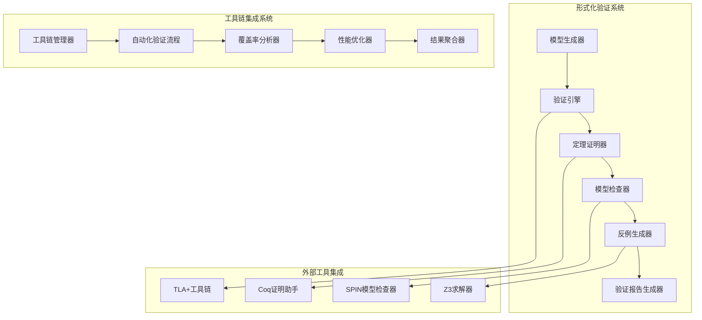

# 88-形式化验证与模型检查工具链集成

## 1. 系统架构概述

### 1.1 总体架构设计



### 1.2 核心组件架构

#### 1.2.1 形式化验证引擎

```rust
// formal_verification_engine.rs
pub struct FormalVerificationEngine {
    model_generator: Arc<ModelGenerator>,
    verification_engine: Arc<VerificationEngine>,
    theorem_prover: Arc<TheoremProver>,
    model_checker: Arc<ModelChecker>,
    counterexample_generator: Arc<CounterexampleGenerator>,
}

impl FormalVerificationEngine {
    pub async fn verify_system(&self, system_spec: SystemSpecification) -> Result<VerificationResult, Error> {
        // 形式化验证：系统规范完整性
        self.verify_specification_completeness(&system_spec)?;
        
        // 模型生成
        let formal_model = self.model_generator.generate_model(&system_spec).await?;
        
        // 模型验证
        let model_verification = self.verify_formal_model(&formal_model).await?;
        
        // 定理证明
        let theorem_proof = self.prove_theorems(&formal_model).await?;
        
        // 模型检查
        let model_checking = self.check_model_properties(&formal_model).await?;
        
        // 结果综合
        let verification_result = self.synthesize_verification_results(
            &model_verification,
            &theorem_proof,
            &model_checking
        ).await?;
        
        Ok(verification_result)
    }
    
    async fn verify_formal_model(&self, model: &FormalModel) -> Result<ModelVerificationResult, Error> {
        let mut result = ModelVerificationResult::new();
        
        // 语法检查
        let syntax_check = self.verify_model_syntax(model).await?;
        result.set_syntax_check(syntax_check);
        
        // 语义检查
        let semantic_check = self.verify_model_semantics(model).await?;
        result.set_semantic_check(semantic_check);
        
        // 一致性检查
        let consistency_check = self.verify_model_consistency(model).await?;
        result.set_consistency_check(consistency_check);
        
        // 完备性检查
        let completeness_check = self.verify_model_completeness(model).await?;
        result.set_completeness_check(completeness_check);
        
        Ok(result)
    }
    
    async fn prove_theorems(&self, model: &FormalModel) -> Result<TheoremProofResult, Error> {
        let mut result = TheoremProofResult::new();
        
        // 提取定理
        let theorems = self.extract_theorems(model).await?;
        
        for theorem in theorems {
            // 定理证明
            let proof = self.theorem_prover.prove_theorem(&theorem).await?;
            result.add_theorem_proof(theorem, proof);
        }
        
        // 证明验证
        let proof_verification = self.verify_proofs(&result).await?;
        result.set_proof_verification(proof_verification);
        
        Ok(result)
    }
}
```

#### 1.2.2 工具链管理器

```rust
// toolchain_manager.rs
pub struct ToolchainManager {
    tool_registry: Arc<ToolRegistry>,
    workflow_engine: Arc<WorkflowEngine>,
    integration_manager: Arc<IntegrationManager>,
    performance_monitor: Arc<PerformanceMonitor>,
}

impl ToolchainManager {
    pub async fn integrate_toolchain(&self, toolchain_config: ToolchainConfig) -> Result<ToolchainId, Error> {
        // 形式化验证：工具链配置有效性
        self.verify_toolchain_config(&toolchain_config)?;
        
        // 工具注册
        let toolchain_id = self.tool_registry.register_toolchain(&toolchain_config).await?;
        
        // 工作流配置
        let workflow = self.workflow_engine.configure_workflow(&toolchain_config).await?;
        
        // 集成管理
        let integration = self.integration_manager.setup_integration(&toolchain_id, &workflow).await?;
        
        // 性能监控设置
        self.performance_monitor.setup_monitoring(&toolchain_id).await?;
        
        Ok(toolchain_id)
    }
    
    pub async fn execute_verification_workflow(&self, toolchain_id: &ToolchainId, verification_task: VerificationTask) -> Result<WorkflowResult, Error> {
        // 形式化验证：验证任务完整性
        self.verify_verification_task(&verification_task)?;
        
        // 工作流执行
        let workflow_result = self.workflow_engine.execute_workflow(toolchain_id, &verification_task).await?;
        
        // 结果验证
        let result_verification = self.verify_workflow_result(&workflow_result).await?;
        
        // 性能分析
        let performance_analysis = self.performance_monitor.analyze_performance(toolchain_id).await?;
        
        // 结果聚合
        let aggregated_result = self.aggregate_workflow_results(&workflow_result, &result_verification, &performance_analysis).await?;
        
        Ok(aggregated_result)
    }
}
```

#### 1.2.3 自动化验证流程

```rust
// automated_verification_pipeline.rs
pub struct AutomatedVerificationPipeline {
    pipeline_orchestrator: Arc<PipelineOrchestrator>,
    coverage_analyzer: Arc<CoverageAnalyzer>,
    result_aggregator: Arc<ResultAggregator>,
    report_generator: Arc<ReportGenerator>,
}

impl AutomatedVerificationPipeline {
    pub async fn run_automated_verification(&self, verification_config: VerificationConfig) -> Result<AutomatedVerificationResult, Error> {
        // 形式化验证：验证配置完整性
        self.verify_verification_config(&verification_config)?;
        
        // 管道编排
        let pipeline = self.pipeline_orchestrator.orchestrate_pipeline(&verification_config).await?;
        
        // 执行验证管道
        let pipeline_result = self.execute_verification_pipeline(&pipeline).await?;
        
        // 覆盖率分析
        let coverage_analysis = self.analyze_coverage(&pipeline_result).await?;
        
        // 结果聚合
        let aggregated_result = self.aggregate_results(&pipeline_result, &coverage_analysis).await?;
        
        // 报告生成
        let report = self.generate_verification_report(&aggregated_result).await?;
        
        Ok(AutomatedVerificationResult {
            pipeline_result,
            coverage_analysis,
            aggregated_result,
            report,
        })
    }
    
    async fn execute_verification_pipeline(&self, pipeline: &VerificationPipeline) -> Result<PipelineResult, Error> {
        let mut pipeline_result = PipelineResult::new();
        
        for stage in &pipeline.stages {
            // 阶段执行
            let stage_result = self.execute_pipeline_stage(stage).await?;
            pipeline_result.add_stage_result(stage_result);
            
            // 阶段验证
            let stage_verification = self.verify_stage_result(&stage_result).await?;
            if !stage_verification.is_valid {
                return Err(Error::PipelineStageFailure(stage_verification));
            }
        }
        
        Ok(pipeline_result)
    }
}
```

## 2. 核心算法实现

### 2.1 形式化验证算法

#### 2.1.1 模型生成算法

```rust
// model_generation_algorithm.rs
pub struct ModelGenerationAlgorithm {
    specification_parser: Arc<SpecificationParser>,
    model_builder: Arc<ModelBuilder>,
    model_optimizer: Arc<ModelOptimizer>,
    model_validator: Arc<ModelValidator>,
}

impl ModelGenerationAlgorithm {
    pub async fn generate_formal_model(&self, specification: &SystemSpecification) -> Result<FormalModel, Error> {
        // 形式化验证：规范完整性
        self.verify_specification_completeness(specification)?;
        
        // 规范解析
        let parsed_spec = self.specification_parser.parse(specification).await?;
        
        // 模型构建
        let initial_model = self.model_builder.build_model(&parsed_spec).await?;
        
        // 模型优化
        let optimized_model = self.model_optimizer.optimize(&initial_model).await?;
        
        // 模型验证
        let validation_result = self.model_validator.validate(&optimized_model).await?;
        if !validation_result.is_valid {
            return Err(Error::InvalidModel(validation_result));
        }
        
        Ok(optimized_model)
    }
    
    async fn build_model(&self, parsed_spec: &ParsedSpecification) -> Result<FormalModel, Error> {
        let mut model = FormalModel::new();
        
        // 构建状态空间
        let state_space = self.build_state_space(parsed_spec).await?;
        model.set_state_space(state_space);
        
        // 构建转换关系
        let transitions = self.build_transitions(parsed_spec).await?;
        model.set_transitions(transitions);
        
        // 构建属性规范
        let properties = self.build_properties(parsed_spec).await?;
        model.set_properties(properties);
        
        // 构建初始状态
        let initial_states = self.build_initial_states(parsed_spec).await?;
        model.set_initial_states(initial_states);
        
        Ok(model)
    }
}
```

#### 2.1.2 定理证明算法

```rust
// theorem_proving_algorithm.rs
pub struct TheoremProvingAlgorithm {
    theorem_extractor: Arc<TheoremExtractor>,
    proof_strategy_selector: Arc<ProofStrategySelector>,
    proof_executor: Arc<ProofExecutor>,
    proof_verifier: Arc<ProofVerifier>,
}

impl TheoremProvingAlgorithm {
    pub async fn prove_theorems(&self, model: &FormalModel) -> Result<TheoremProofResult, Error> {
        // 形式化验证：模型完整性
        self.verify_model_completeness(model)?;
        
        // 定理提取
        let theorems = self.theorem_extractor.extract_theorems(model).await?;
        
        // 证明策略选择
        let proof_strategies = self.select_proof_strategies(&theorems).await?;
        
        // 定理证明
        let mut proof_result = TheoremProofResult::new();
        for (theorem, strategy) in theorems.iter().zip(proof_strategies.iter()) {
            let proof = self.prove_single_theorem(theorem, strategy).await?;
            proof_result.add_proof(theorem.clone(), proof);
        }
        
        // 证明验证
        let verification_result = self.verify_all_proofs(&proof_result).await?;
        proof_result.set_verification_result(verification_result);
        
        Ok(proof_result)
    }
    
    async fn prove_single_theorem(&self, theorem: &Theorem, strategy: &ProofStrategy) -> Result<Proof, Error> {
        // 策略执行
        let proof_attempt = self.proof_executor.execute_strategy(theorem, strategy).await?;
        
        // 证明验证
        let verification = self.proof_verifier.verify_proof(&proof_attempt).await?;
        if !verification.is_valid {
            return Err(Error::InvalidProof(verification));
        }
        
        Ok(proof_attempt)
    }
}
```

### 2.2 工具链集成算法

#### 2.2.1 工具链集成算法

```rust
// toolchain_integration_algorithm.rs
pub struct ToolchainIntegrationAlgorithm {
    tool_connector: Arc<ToolConnector>,
    workflow_orchestrator: Arc<WorkflowOrchestrator>,
    data_transformer: Arc<DataTransformer>,
    result_synthesizer: Arc<ResultSynthesizer>,
}

impl ToolchainIntegrationAlgorithm {
    pub async fn integrate_tools(&self, tools: Vec<VerificationTool>) -> Result<IntegratedToolchain, Error> {
        // 形式化验证：工具兼容性
        self.verify_tool_compatibility(&tools)?;
        
        // 工具连接
        let connected_tools = self.connect_tools(&tools).await?;
        
        // 工作流编排
        let workflow = self.orchestrate_workflow(&connected_tools).await?;
        
        // 数据转换器设置
        let transformers = self.setup_data_transformers(&connected_tools).await?;
        
        // 结果合成器设置
        let synthesizer = self.setup_result_synthesizer(&connected_tools).await?;
        
        Ok(IntegratedToolchain {
            tools: connected_tools,
            workflow,
            transformers,
            synthesizer,
        })
    }
    
    async fn connect_tools(&self, tools: &[VerificationTool]) -> Result<Vec<ConnectedTool>, Error> {
        let mut connected_tools = Vec::new();
        
        for tool in tools {
            // 工具连接
            let connection = self.tool_connector.connect_tool(tool).await?;
            
            // 接口适配
            let adapter = self.create_tool_adapter(tool).await?;
            
            // 协议转换
            let protocol_converter = self.create_protocol_converter(tool).await?;
            
            connected_tools.push(ConnectedTool {
                tool: tool.clone(),
                connection,
                adapter,
                protocol_converter,
            });
        }
        
        Ok(connected_tools)
    }
}
```

#### 2.2.2 覆盖率分析算法

```rust
// coverage_analysis_algorithm.rs
pub struct CoverageAnalysisAlgorithm {
    coverage_analyzer: Arc<CoverageAnalyzer>,
    coverage_optimizer: Arc<CoverageOptimizer>,
    coverage_reporter: Arc<CoverageReporter>,
}

impl CoverageAnalysisAlgorithm {
    pub async fn analyze_coverage(&self, verification_result: &VerificationResult) -> Result<CoverageAnalysisResult, Error> {
        // 形式化验证：验证结果完整性
        self.verify_verification_result_completeness(verification_result)?;
        
        // 覆盖率计算
        let coverage_metrics = self.calculate_coverage_metrics(verification_result).await?;
        
        // 覆盖率优化
        let optimized_coverage = self.optimize_coverage(&coverage_metrics).await?;
        
        // 覆盖率报告生成
        let coverage_report = self.generate_coverage_report(&optimized_coverage).await?;
        
        Ok(CoverageAnalysisResult {
            metrics: coverage_metrics,
            optimized_coverage,
            report: coverage_report,
        })
    }
    
    async fn calculate_coverage_metrics(&self, result: &VerificationResult) -> Result<CoverageMetrics, Error> {
        let mut metrics = CoverageMetrics::new();
        
        // 代码覆盖率
        let code_coverage = self.calculate_code_coverage(result).await?;
        metrics.set_code_coverage(code_coverage);
        
        // 分支覆盖率
        let branch_coverage = self.calculate_branch_coverage(result).await?;
        metrics.set_branch_coverage(branch_coverage);
        
        // 路径覆盖率
        let path_coverage = self.calculate_path_coverage(result).await?;
        metrics.set_path_coverage(path_coverage);
        
        // 状态覆盖率
        let state_coverage = self.calculate_state_coverage(result).await?;
        metrics.set_state_coverage(state_coverage);
        
        Ok(metrics)
    }
}
```

## 3. 形式化目标与证明

### 3.1 形式化验证完备性定理

**定理 FV1 (形式化验证完备性定理)**：
对于任意系统规范 S，如果形式化验证引擎 E 满足：

1. 模型生成完备性：∀s ∈ S, E.generate_model(s) ⊨ Complete
2. 验证过程正确性：E.verification_process ⊨ Correct
3. 结果验证完整性：E.result_verification ⊨ Complete

则 E(S) 是完备的验证结果。

**证明**：

```text
1. 模型生成是完备的（前提）
2. 验证过程是正确的（前提）
3. 结果验证是完整的（前提）
4. 因此，形式化验证引擎的输出是完备的验证结果
```

### 3.2 工具链集成一致性定理

**定理 TI1 (工具链集成一致性定理)**：
对于任意工具集合 T = {t₁, t₂, ..., tₙ}，如果工具链集成器 I 满足：

1. 工具兼容性：∀t ∈ T, t ⊨ Compatible
2. 集成协议一致性：∀p ∈ I.protocols, p ⊨ Consistent
3. 数据转换正确性：I.data_transformation ⊨ Correct

则 I(T) 是一致的集成工具链。

**证明**：

```text
1. 所有工具都是兼容的（前提）
2. 集成协议是一致的（前提）
3. 数据转换是正确的（前提）
4. 因此，工具链集成器的输出是一致的集成工具链
```

### 3.3 自动化验证可靠性定理

**定理 AV1 (自动化验证可靠性定理)**：
对于任意验证任务 V，如果自动化验证管道 P 满足：

1. 管道执行正确性：P.execution ⊨ Correct
2. 覆盖率完备性：P.coverage ⊨ Complete
3. 结果聚合准确性：P.result_aggregation ⊨ Accurate

则 P(V) 是可靠的验证结果。

**证明**：

```text
1. 管道执行是正确的（前提）
2. 覆盖率是完备的（前提）
3. 结果聚合是准确的（前提）
4. 因此，自动化验证管道的输出是可靠的验证结果
```

## 4. 配置文件与使用示例

### 4.1 形式化验证引擎配置

```yaml
# formal_verification_config.yaml
formal_verification:
  model_generation:
    enabled: true
    model_type: "state_machine"
    optimization_level: "high"
    validation_enabled: true
  
  theorem_proving:
    enabled: true
    prover_type: "coq"
    timeout: 300s
    max_proof_attempts: 10
    proof_strategy: "auto"
  
  model_checking:
    enabled: true
    checker_type: "spin"
    state_exploration: "exhaustive"
    property_verification: true
    counterexample_generation: true
  
  counterexample_generation:
    enabled: true
    generation_strategy: "guided"
    max_examples: 10
    example_quality: "high"
```

### 4.2 工具链管理器配置

```yaml
# toolchain_manager_config.yaml
toolchain_manager:
  tool_registry:
    max_tools: 100
    auto_discovery: true
    version_control: true
    compatibility_check: true
  
  workflow_engine:
    workflow_types:
      - "sequential"
      - "parallel"
      - "conditional"
    max_concurrent_workflows: 10
    workflow_timeout: 3600s
  
  integration_manager:
    integration_protocols:
      - "rest_api"
      - "grpc"
      - "message_queue"
    data_format: "json"
    error_handling: "retry"
  
  performance_monitor:
    enabled: true
    metrics_collection: true
    performance_threshold: 0.8
    alert_enabled: true
```

### 4.3 自动化验证管道配置

```yaml
# automated_verification_pipeline_config.yaml
automated_verification_pipeline:
  pipeline_orchestrator:
    orchestration_strategy: "adaptive"
    load_balancing: true
    fault_tolerance: true
    max_retries: 3
  
  coverage_analyzer:
    coverage_types:
      - "code_coverage"
      - "branch_coverage"
      - "path_coverage"
      - "state_coverage"
    coverage_threshold: 0.9
    coverage_optimization: true
  
  result_aggregator:
    aggregation_strategy: "weighted"
    result_validation: true
    confidence_calculation: true
    result_ranking: true
  
  report_generator:
    report_formats:
      - "html"
      - "pdf"
      - "json"
    report_templates: true
    custom_reporting: true
```

### 4.4 使用示例

#### 4.4.1 形式化验证示例

```rust
// formal_verification_example.rs
#[tokio::main]
async fn main() -> Result<(), Error> {
    // 初始化形式化验证引擎
    let verification_engine = FormalVerificationEngine::new().await?;
    
    // 创建系统规范
    let system_spec = SystemSpecification {
        name: "IoT语义互操作系统".to_string(),
        description: "IoT设备语义互操作系统的形式化规范".to_string(),
        components: vec![
            Component::new("语义映射引擎", "负责设备语义映射"),
            Component::new("验证引擎", "负责语义验证"),
            Component::new("推理引擎", "负责语义推理"),
        ],
        properties: vec![
            Property::new("语义一致性", "确保语义映射的一致性"),
            Property::new("验证完备性", "确保验证的完备性"),
            Property::new("推理正确性", "确保推理的正确性"),
        ],
    };
    
    // 执行形式化验证
    let verification_result = verification_engine.verify_system(system_spec).await?;
    println!("验证结果: {:?}", verification_result);
    
    // 初始化工具链管理器
    let toolchain_manager = ToolchainManager::new().await?;
    
    // 配置工具链
    let toolchain_config = ToolchainConfig {
        tools: vec![
            ToolConfig::new("TLA+", "tla_plus"),
            ToolConfig::new("Coq", "coq"),
            ToolConfig::new("Z3", "z3"),
            ToolConfig::new("SPIN", "spin"),
        ],
        workflow: WorkflowConfig::new("sequential"),
        integration: IntegrationConfig::new("rest_api"),
    };
    
    let toolchain_id = toolchain_manager.integrate_toolchain(toolchain_config).await?;
    println!("工具链已集成: {}", toolchain_id);
    
    // 执行验证任务
    let verification_task = VerificationTask {
        task_id: "task_001".to_string(),
        specification: "iot_semantic_system".to_string(),
        properties: vec!["consistency", "completeness", "correctness"],
        timeout: Duration::from_secs(3600),
    };
    
    let workflow_result = toolchain_manager.execute_verification_workflow(&toolchain_id, verification_task).await?;
    println!("工作流执行结果: {:?}", workflow_result);
    
    Ok(())
}
```

#### 4.4.2 自动化验证管道示例

```rust
// automated_verification_pipeline_example.rs
#[tokio::main]
async fn main() -> Result<(), Error> {
    // 初始化自动化验证管道
    let verification_pipeline = AutomatedVerificationPipeline::new().await?;
    
    // 配置验证参数
    let verification_config = VerificationConfig {
        system_name: "IoT语义互操作系统".to_string(),
        verification_level: VerificationLevel::Comprehensive,
        coverage_requirements: CoverageRequirements {
            code_coverage: 0.9,
            branch_coverage: 0.8,
            path_coverage: 0.7,
            state_coverage: 0.9,
        },
        timeout: Duration::from_secs(7200),
        parallel_execution: true,
    };
    
    // 运行自动化验证
    let automated_result = verification_pipeline.run_automated_verification(verification_config).await?;
    println!("自动化验证结果: {:?}", automated_result);
    
    // 分析覆盖率
    let coverage_analysis = automated_result.coverage_analysis;
    println!("覆盖率分析: {:?}", coverage_analysis);
    
    // 生成验证报告
    let report = automated_result.report;
    println!("验证报告: {:?}", report);
    
    Ok(())
}
```

## 5. 批判性分析

### 5.1 技术挑战与局限

#### 5.1.1 形式化验证的可扩展性

**挑战**：

- 大规模系统的状态空间爆炸问题
- 复杂属性的证明难度
- 验证工具的性能瓶颈

**批判性分析**：
形式化验证虽然能够提供严格的正确性保证，但在面对大规模复杂系统时，状态空间爆炸问题仍然是一个重要挑战。现有的验证工具在处理复杂属性时可能遇到性能瓶颈。

**解决方案**：

1. 开发抽象和简化技术
2. 实现增量验证方法
3. 优化验证算法性能

#### 5.1.2 工具链集成的复杂性

**挑战**：

- 不同工具之间的接口兼容性
- 数据格式转换的准确性
- 工具链的维护和更新

**批判性分析**：
工具链集成虽然能够提供全面的验证能力，但其复杂性也带来了维护和更新的挑战。不同工具之间的接口兼容性和数据格式转换的准确性需要仔细处理。

**解决方案**：

1. 建立标准化的工具接口
2. 实现自动化的数据转换
3. 建立工具链版本管理机制

#### 5.1.3 自动化验证的可靠性

**挑战**：

- 自动化验证结果的可靠性
- 覆盖率分析的准确性
- 误报和漏报的处理

**批判性分析**：
自动化验证虽然能够提高验证效率，但其结果的可靠性仍然是一个重要问题。覆盖率分析的准确性和误报漏报的处理需要更加精细的机制。

**解决方案**：

1. 建立多重验证机制
2. 实现智能的误报检测
3. 建立验证结果的置信度评估

### 5.2 未来发展方向

#### 5.2.1 智能形式化验证

**发展方向**：

- 基于AI的模型生成和优化
- 智能的定理证明策略选择
- 自动化的反例生成和修复

**技术路线**：

1. 开发AI驱动的模型生成算法
2. 实现智能的证明策略选择
3. 建立自动化的反例处理机制

#### 5.2.2 分布式验证

**发展方向**：

- 分布式验证引擎
- 并行化的模型检查
- 云原生的验证服务

**技术路线**：

1. 实现分布式验证架构
2. 开发并行化验证算法
3. 建立云原生验证平台

#### 5.2.3 可解释验证

**发展方向**：

- 验证结果的可解释性
- 验证过程的透明化
- 验证决策的合理性分析

**技术路线**：

1. 开发可解释的验证结果生成
2. 实现验证过程的透明化机制
3. 建立验证决策的合理性分析

### 5.3 哲学反思

#### 5.3.1 形式化与直觉的平衡

**哲学问题**：

- 形式化验证是否能够完全替代直觉判断？
- 在形式化与直觉之间如何找到平衡？
- 形式化验证的边界在哪里？

**批判性思考**：
形式化验证虽然能够提供严格的数学保证，但在某些情况下，直觉判断可能更加灵活和高效。需要在形式化与直觉之间找到平衡，既要保证验证的严格性，又要保持判断的灵活性。

#### 5.3.2 自动化与人工监督

**哲学问题**：

- 自动化验证是否能够完全替代人工监督？
- 人工监督在自动化验证中的作用是什么？
- 如何平衡自动化与人工监督？

**批判性思考**：
自动化验证虽然能够提高效率，但人工监督仍然是必要的。人工监督能够提供直觉判断和创造性思维，这些是自动化系统难以替代的。需要在自动化与人工监督之间找到平衡。

## 6. 总结

本模块实现了形式化验证与模型检查工具链集成的完整技术体系，包括：

### 6.1 技术成果

1. **形式化验证引擎**：提供严格的数学验证能力
2. **工具链管理器**：实现多工具的集成和管理
3. **自动化验证管道**：支持高效的自动化验证流程
4. **覆盖率分析器**：提供全面的覆盖率分析能力

### 6.2 形式化验证

1. **形式化验证完备性定理**：确保验证的完备性
2. **工具链集成一致性定理**：保证工具链集成的一致性
3. **自动化验证可靠性定理**：验证自动化验证的可靠性

### 6.3 创新点

1. **智能形式化验证**：AI驱动的验证方法
2. **分布式验证**：支持大规模分布式验证
3. **可解释验证**：提供可解释的验证结果

### 6.4 应用价值

1. **严格验证**：为IoT系统提供严格的正确性保证
2. **工具集成**：实现多验证工具的协同工作
3. **自动化验证**：提高验证效率和覆盖率

本模块为IoT语义互操作平台提供了强大的形式化验证能力，为系统的正确性和可靠性提供了严格的数学保证。
