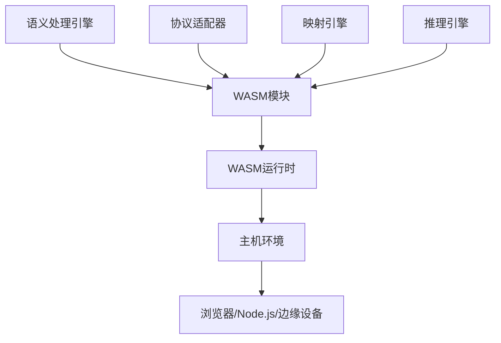

# WebAssembly 实现模块

## 概述

WebAssembly (WASM) 实现模块为IoT语义互操作网关提供了跨平台、高性能的运行时环境，支持在浏览器、边缘设备和嵌入式系统中运行语义处理逻辑。

## 核心特性

### 🌐 跨平台运行

- **浏览器环境** - 在Web浏览器中运行语义处理
- **边缘计算** - 在边缘节点上执行语义转换
- **嵌入式系统** - 在资源受限设备上运行
- **云原生环境** - 在容器化环境中部署

### ⚡ 高性能执行

- **接近原生性能** - 编译后的字节码执行
- **内存安全** - 沙箱化执行环境
- **并发支持** - 支持多线程和异步操作
- **即时编译** - JIT编译优化

### 🔧 多语言支持

- **Rust → WASM** - 高性能语义处理
- **C/C++ → WASM** - 传统IoT协议适配
- **AssemblyScript** - TypeScript语法编译到WASM
- **Go → WASM** - 云原生服务WASM化

## 架构设计

### 1. WASM运行时架构



### 2. 模块组织

```text
04-实现与开发/05-WebAssembly实现/
├── 01-Rust-WASM/
│   ├── src/
│   │   ├── lib.rs              # WASM模块入口
│   │   ├── semantic_engine.rs  # 语义处理引擎
│   │   ├── protocol_adapter.rs # 协议适配器
│   │   ├── mapping_engine.rs   # 映射引擎
│   │   └── inference_engine.rs # 推理引擎
│   ├── Cargo.toml
│   ├── wasm-pack.toml
│   └── README.md
├── 02-AssemblyScript/
│   ├── src/
│   │   ├── index.ts            # 主入口
│   │   ├── semantic.ts         # 语义处理
│   │   ├── protocol.ts         # 协议处理
│   │   └── utils.ts            # 工具函数
│   ├── package.json
│   ├── asconfig.json
│   └── README.md
├── 03-Go-WASM/
│   ├── cmd/
│   │   └── wasm/
│   │       └── main.go         # WASM入口
│   ├── internal/
│   │   ├── semantic/           # 语义处理
│   │   ├── protocol/           # 协议适配
│   │   └── mapping/            # 映射引擎
│   ├── go.mod
│   └── README.md
├── 04-运行时/
│   ├── browser/                # 浏览器运行时
│   ├── nodejs/                 # Node.js运行时
│   ├── edge/                   # 边缘运行时
│   └── embedded/               # 嵌入式运行时
├── 05-工具链/
│   ├── build/                  # 构建工具
│   ├── test/                   # 测试工具
│   └── deploy/                 # 部署工具
└── 06-示例/
    ├── browser-demo/           # 浏览器示例
    ├── edge-demo/              # 边缘计算示例
    └── embedded-demo/          # 嵌入式示例
```

## Rust WASM实现

### 1. 核心模块设计

```rust
// lib.rs - WASM模块入口
use wasm_bindgen::prelude::*;
use serde::{Deserialize, Serialize};

#[wasm_bindgen]
pub struct SemanticGateway {
    semantic_engine: SemanticEngine,
    protocol_adapters: ProtocolAdapters,
    mapping_engine: MappingEngine,
    inference_engine: InferenceEngine,
}

#[wasm_bindgen]
impl SemanticGateway {
    pub fn new() -> Self {
        Self {
            semantic_engine: SemanticEngine::new(),
            protocol_adapters: ProtocolAdapters::new(),
            mapping_engine: MappingEngine::new(),
            inference_engine: InferenceEngine::new(),
        }
    }

    pub fn process_semantic_mapping(&self, input: JsValue) -> Result<JsValue, JsValue> {
        let input_data: SemanticInput = serde_wasm_bindgen::from_value(input)?;
        let result = self.semantic_engine.process(input_data)?;
        Ok(serde_wasm_bindgen::to_value(&result)?)
    }

    pub fn adapt_protocol(&self, protocol: &str, data: JsValue) -> Result<JsValue, JsValue> {
        let adapter = self.protocol_adapters.get_adapter(protocol)?;
        let result = adapter.adapt(data)?;
        Ok(result)
    }

    pub fn map_between_standards(&self, source: &str, target: &str, data: JsValue) -> Result<JsValue, JsValue> {
        let mapping = self.mapping_engine.create_mapping(source, target)?;
        let result = mapping.transform(data)?;
        Ok(result)
    }
}
```

### 2. 语义处理引擎

```rust
// semantic_engine.rs
pub struct SemanticEngine {
    ontology_manager: OntologyManager,
    semantic_processor: SemanticProcessor,
    cache: SemanticCache,
}

impl SemanticEngine {
    pub fn new() -> Self {
        Self {
            ontology_manager: OntologyManager::new(),
            semantic_processor: SemanticProcessor::new(),
            cache: SemanticCache::new(),
        }
    }

    pub fn process(&self, input: SemanticInput) -> Result<SemanticOutput, SemanticError> {
        // 检查缓存
        if let Some(cached) = self.cache.get(&input.hash()) {
            return Ok(cached);
        }

        // 加载本体
        let ontology = self.ontology_manager.load_ontology(&input.ontology_uri)?;
        
        // 语义处理
        let processed = self.semantic_processor.process(input, &ontology)?;
        
        // 缓存结果
        self.cache.set(input.hash(), processed.clone());
        
        Ok(processed)
    }

    pub fn validate_semantic_consistency(&self, data: &SemanticData) -> Result<bool, SemanticError> {
        self.semantic_processor.validate_consistency(data)
    }
}
```

### 3. 协议适配器

```rust
// protocol_adapter.rs
pub struct ProtocolAdapters {
    adapters: HashMap<String, Box<dyn ProtocolAdapter>>,
}

impl ProtocolAdapters {
    pub fn new() -> Self {
        let mut adapters = HashMap::new();
        
        // 注册协议适配器
        adapters.insert("opcua".to_string(), Box::new(OPCUAAdapter::new()));
        adapters.insert("onem2m".to_string(), Box::new(OneM2MAdapter::new()));
        adapters.insert("wot".to_string(), Box::new(WoTAdapter::new()));
        adapters.insert("matter".to_string(), Box::new(MatterAdapter::new()));
        
        Self { adapters }
    }

    pub fn get_adapter(&self, protocol: &str) -> Result<&Box<dyn ProtocolAdapter>, ProtocolError> {
        self.adapters.get(protocol)
            .ok_or_else(|| ProtocolError::UnsupportedProtocol(protocol.to_string()))
    }
}

pub trait ProtocolAdapter {
    fn adapt(&self, data: JsValue) -> Result<JsValue, ProtocolError>;
    fn validate(&self, data: &JsValue) -> Result<bool, ProtocolError>;
    fn get_capabilities(&self) -> ProtocolCapabilities;
}
```

## AssemblyScript实现

### 1. 语义处理模块

```typescript
// semantic.ts
export class SemanticProcessor {
  private ontologyManager: OntologyManager;
  private cache: SemanticCache;

  constructor() {
    this.ontologyManager = new OntologyManager();
    this.cache = new SemanticCache();
  }

  process(input: SemanticInput): SemanticOutput {
    // 检查缓存
    const cacheKey = this.generateCacheKey(input);
    if (this.cache.has(cacheKey)) {
      return this.cache.get(cacheKey);
    }

    // 语义处理逻辑
    const ontology = this.ontologyManager.loadOntology(input.ontologyUri);
    const processed = this.processSemanticData(input, ontology);
    
    // 缓存结果
    this.cache.set(cacheKey, processed);
    
    return processed;
  }

  private processSemanticData(input: SemanticInput, ontology: Ontology): SemanticOutput {
    // 实现语义处理逻辑
    const entities = this.extractEntities(input.data);
    const relationships = this.extractRelationships(input.data);
    const semanticGraph = this.buildSemanticGraph(entities, relationships, ontology);
    
    return {
      semanticGraph,
      confidence: this.calculateConfidence(semanticGraph),
      metadata: this.generateMetadata(input, ontology)
    };
  }

  private extractEntities(data: string): Entity[] {
    // 实体提取逻辑
    const entities: Entity[] = [];
    // 实现实体识别算法
    return entities;
  }

  private extractRelationships(data: string): Relationship[] {
    // 关系提取逻辑
    const relationships: Relationship[] = [];
    // 实现关系识别算法
    return relationships;
  }
}
```

### 2. 协议适配模块

```typescript
// protocol.ts
export class ProtocolAdapter {
  private adapters: Map<string, IProtocolHandler>;

  constructor() {
    this.adapters = new Map();
    this.registerDefaultAdapters();
  }

  private registerDefaultAdapters(): void {
    this.adapters.set("opcua", new OPCUAHandler());
    this.adapters.set("onem2m", new OneM2MHandler());
    this.adapters.set("wot", new WoTHandler());
    this.adapters.set("matter", new MatterHandler());
  }

  adapt(protocol: string, data: string): string {
    const handler = this.adapters.get(protocol);
    if (!handler) {
      throw new Error(`Unsupported protocol: ${protocol}`);
    }
    
    return handler.adapt(data);
  }

  validate(protocol: string, data: string): boolean {
    const handler = this.adapters.get(protocol);
    if (!handler) {
      return false;
    }
    
    return handler.validate(data);
  }
}

interface IProtocolHandler {
  adapt(data: string): string;
  validate(data: string): boolean;
  getCapabilities(): ProtocolCapabilities;
}

class OPCUAHandler implements IProtocolHandler {
  adapt(data: string): string {
    // OPC UA协议适配逻辑
    const opcuaData = this.parseOPCUA(data);
    return this.convertToStandard(opcuaData);
  }

  validate(data: string): boolean {
    // OPC UA数据验证
    return this.validateOPCUAFormat(data);
  }

  getCapabilities(): ProtocolCapabilities {
    return {
      supportedVersions: ["1.05"],
      features: ["read", "write", "subscribe", "method"],
      security: ["basic256", "basic256sha256", "aes128sha256rsaoaep"]
    };
  }
}
```

## Go WASM实现

### 1. 主入口

```go
// main.go
package main

import (
    "syscall/js"
    "github.com/your-org/iot-semantic-gateway/internal/semantic"
    "github.com/your-org/iot-semantic-gateway/internal/protocol"
    "github.com/your-org/iot-semantic-gateway/internal/mapping"
)

func main() {
    // 创建语义网关实例
    gateway := semantic.NewGateway()
    
    // 注册JavaScript函数
    js.Global().Set("semanticGateway", map[string]interface{}{
        "process": js.FuncOf(gateway.Process),
        "adapt":   js.FuncOf(gateway.Adapt),
        "map":     js.FuncOf(gateway.Map),
    })
    
    // 保持WASM模块运行
    select {}
}
```

### 2. 语义处理

```go
// internal/semantic/gateway.go
package semantic

import (
    "syscall/js"
    "encoding/json"
)

type Gateway struct {
    engine    *Engine
    adapters  *protocol.Adapters
    mapper    *mapping.Engine
}

func NewGateway() *Gateway {
    return &Gateway{
        engine:   NewEngine(),
        adapters: protocol.NewAdapters(),
        mapper:   mapping.NewEngine(),
    }
}

func (g *Gateway) Process(this js.Value, args []js.Value) interface{} {
    if len(args) != 1 {
        return js.ValueOf("error: invalid arguments")
    }
    
    // 解析输入数据
    var input SemanticInput
    if err := json.Unmarshal([]byte(args[0].String()), &input); err != nil {
        return js.ValueOf("error: invalid input format")
    }
    
    // 处理语义数据
    result, err := g.engine.Process(input)
    if err != nil {
        return js.ValueOf("error: " + err.Error())
    }
    
    // 返回结果
    output, _ := json.Marshal(result)
    return js.ValueOf(string(output))
}

func (g *Gateway) Adapt(this js.Value, args []js.Value) interface{} {
    if len(args) != 2 {
        return js.ValueOf("error: invalid arguments")
    }
    
    protocol := args[0].String()
    data := args[1].String()
    
    result, err := g.adapters.Adapt(protocol, data)
    if err != nil {
        return js.ValueOf("error: " + err.Error())
    }
    
    return js.ValueOf(result)
}
```

## 运行时环境

### 1. 浏览器运行时

```javascript
// browser/runtime.js
class WASMRuntime {
    constructor() {
        this.modules = new Map();
        this.instances = new Map();
    }

    async loadModule(name, wasmPath) {
        try {
            // 加载WASM模块
            const response = await fetch(wasmPath);
            const wasmBuffer = await response.arrayBuffer();
            
            // 实例化模块
            const wasmModule = await WebAssembly.instantiate(wasmBuffer, {
                env: this.getEnvironment()
            });
            
            this.modules.set(name, wasmModule.instance);
            return wasmModule.instance;
        } catch (error) {
            console.error(`Failed to load WASM module ${name}:`, error);
            throw error;
        }
    }

    getEnvironment() {
        return {
            // 内存管理
            memory: new WebAssembly.Memory({ initial: 256 }),
            
            // 数学函数
            Math: Math,
            
            // 控制台输出
            console_log: (ptr, len) => {
                const str = this.readString(ptr, len);
                console.log(str);
            },
            
            // 错误处理
            throw_error: (ptr, len) => {
                const error = this.readString(ptr, len);
                throw new Error(error);
            }
        };
    }

    readString(ptr, len) {
        const bytes = new Uint8Array(this.memory.buffer, ptr, len);
        return new TextDecoder().decode(bytes);
    }

    writeString(str) {
        const bytes = new TextEncoder().encode(str);
        const ptr = this.allocate(bytes.length);
        new Uint8Array(this.memory.buffer, ptr, bytes.length).set(bytes);
        return ptr;
    }
}
```

### 2. Node.js运行时

```javascript
// nodejs/runtime.js
const fs = require('fs');
const path = require('path');

class NodeWASMRuntime {
    constructor() {
        this.modules = new Map();
        this.instances = new Map();
    }

    async loadModule(name, wasmPath) {
        try {
            // 读取WASM文件
            const wasmBuffer = fs.readFileSync(wasmPath);
            
            // 实例化模块
            const wasmModule = await WebAssembly.instantiate(wasmBuffer, {
                env: this.getNodeEnvironment()
            });
            
            this.modules.set(name, wasmModule.instance);
            return wasmModule.instance;
        } catch (error) {
            console.error(`Failed to load WASM module ${name}:`, error);
            throw error;
        }
    }

    getNodeEnvironment() {
        return {
            // 内存管理
            memory: new WebAssembly.Memory({ initial: 256 }),
            
            // 文件系统访问
            fs_read: (pathPtr, pathLen) => {
                const path = this.readString(pathPtr, pathLen);
                return this.writeString(fs.readFileSync(path, 'utf8'));
            },
            
            // 网络请求
            http_request: (urlPtr, urlLen) => {
                const url = this.readString(urlPtr, urlLen);
                // 实现HTTP请求逻辑
                return this.writeString('{"status": "success"}');
            },
            
            // 日志记录
            console_log: (ptr, len) => {
                const str = this.readString(ptr, len);
                console.log(`[WASM] ${str}`);
            }
        };
    }
}
```

## 构建和部署

### 1. Rust WASM构建

```toml
# Cargo.toml
[package]
name = "iot-semantic-gateway-wasm"
version = "0.1.0"
edition = "2021"

[lib]
crate-type = ["cdylib"]

[dependencies]
wasm-bindgen = "0.2"
serde = { version = "1.0", features = ["derive"] }
serde-wasm-bindgen = "0.6"
js-sys = "0.3"
web-sys = { version = "0.3", features = ["console"] }
```

```bash
# 构建命令
wasm-pack build --target web
wasm-pack build --target nodejs
wasm-pack build --target bundler
```

### 2. AssemblyScript构建

```json
// asconfig.json
{
  "targets": {
    "debug": {
      "outFile": "build/debug.wasm",
      "textFile": "build/debug.wat",
      "sourceMap": true,
      "debug": true
    },
    "release": {
      "outFile": "build/release.wasm",
      "sourceMap": true,
      "optimizeLevel": 3,
      "shrinkLevel": 0,
      "converge": false,
      "noAssert": false
    }
  },
  "options": {
    "bindings": "esm",
    "importMemory": true,
    "initialMemory": 256,
    "maximumMemory": 512,
    "stackSize": 1024,
    "exportRuntime": true
  }
}
```

### 3. Go WASM构建

```bash
# 构建命令
GOOS=js GOARCH=wasm go build -o main.wasm cmd/wasm/main.go
```

## 性能优化

### 1. 内存管理

```rust
// 内存池管理
pub struct MemoryPool {
    pools: HashMap<usize, Vec<*mut u8>>,
    max_size: usize,
}

impl MemoryPool {
    pub fn allocate(&mut self, size: usize) -> *mut u8 {
        if let Some(pool) = self.pools.get_mut(&size) {
            if let Some(ptr) = pool.pop() {
                return ptr;
            }
        }
        
        // 分配新内存
        let layout = Layout::from_size_align(size, 8).unwrap();
        unsafe { alloc(layout) }
    }

    pub fn deallocate(&mut self, ptr: *mut u8, size: usize) {
        if let Some(pool) = self.pools.get_mut(&size) {
            if pool.len() < self.max_size {
                pool.push(ptr);
                return;
            }
        }
        
        // 释放内存
        let layout = Layout::from_size_align(size, 8).unwrap();
        unsafe { dealloc(ptr, layout) }
    }
}
```

### 2. 并行处理

```rust
// 并行语义处理
pub struct ParallelProcessor {
    thread_pool: ThreadPool,
    chunk_size: usize,
}

impl ParallelProcessor {
    pub fn process_parallel(&self, data: Vec<SemanticData>) -> Vec<SemanticResult> {
        let chunks: Vec<Vec<SemanticData>> = data
            .chunks(self.chunk_size)
            .map(|chunk| chunk.to_vec())
            .collect();
        
        let results: Vec<Vec<SemanticResult>> = chunks
            .into_par_iter()
            .map(|chunk| {
                chunk.into_iter()
                    .map(|item| self.process_item(item))
                    .collect()
            })
            .collect();
        
        results.into_iter().flatten().collect()
    }
}
```

## 测试和验证

### 1. 单元测试

```rust
#[cfg(test)]
mod tests {
    use super::*;
    use wasm_bindgen_test::*;

    wasm_bindgen_test_configure!(run_in_browser);

    #[wasm_bindgen_test]
    fn test_semantic_processing() {
        let gateway = SemanticGateway::new();
        let input = SemanticInput {
            data: "temperature sensor reading 25.5°C".to_string(),
            ontology_uri: "http://example.com/iot-ontology".to_string(),
        };
        
        let result = gateway.process_semantic_mapping(serde_wasm_bindgen::to_value(&input).unwrap());
        assert!(result.is_ok());
    }
}
```

### 2. 性能测试

```rust
#[bench]
fn bench_semantic_mapping(b: &mut Bencher) {
    let gateway = SemanticGateway::new();
    let input = SemanticInput {
        data: "large semantic data".to_string(),
        ontology_uri: "http://example.com/ontology".to_string(),
    };
    
    b.iter(|| {
        gateway.process_semantic_mapping(serde_wasm_bindgen::to_value(&input).unwrap())
    });
}
```

## 部署方案

### 1. CDN部署

```html
<!-- 浏览器中使用 -->
<script type="module">
    import init, { SemanticGateway } from 'https://cdn.jsdelivr.net/npm/iot-semantic-gateway-wasm@0.1.0/dist/index.js';
    
    async function run() {
        await init();
        const gateway = new SemanticGateway();
        
        const result = gateway.process_semantic_mapping({
            data: "sensor data",
            ontology: "iot-ontology"
        });
        
        console.log(result);
    }
    
    run();
</script>
```

### 2. 边缘部署

```javascript
// 边缘节点部署
const { SemanticGateway } = require('./iot-semantic-gateway-wasm');

class EdgeWASMRuntime {
    constructor() {
        this.gateway = new SemanticGateway();
    }
    
    async processEdgeData(data) {
        return this.gateway.process_semantic_mapping(data);
    }
}
```

## 总结

WebAssembly实现为IoT语义互操作网关提供了：

1. **跨平台能力** - 在浏览器、边缘设备、嵌入式系统中运行
2. **高性能执行** - 接近原生性能的语义处理
3. **多语言支持** - Rust、AssemblyScript、Go等多种语言
4. **安全隔离** - 沙箱化执行环境
5. **模块化设计** - 可插拔的语义处理模块

通过WASM技术，我们实现了真正的"一次编写，到处运行"的语义处理能力，为IoT语义互操作提供了强大的技术支撑。
