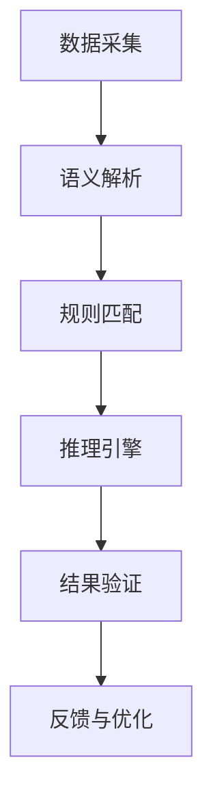

# IoT形式化推理证明理论详细扩展

---

## 1. 形式化推理基础理论

### 1.1 理论体系综述

- 形式系统、公理化方法、演绎系统、归纳与联合推理。
- 语义互操作中的推理需求与挑战。

### 1.2 关键定义与公理

- 形式化推理的基本符号、规则与元理论。
- 典型推理规则（如Modus Ponens、归纳法则等）形式化描述。

### 1.3 批判性分析

- 形式化推理的可判定性、可计算性与复杂性。
- IoT场景下推理系统的边界与局限。

---

## 2. IoT语义推理系统架构

### 2.1 系统架构设计

- 分层推理引擎、知识库、规则库、接口层。
- 支持分布式、异构设备与多协议环境。

### 2.2 核心组件与流程

- 语义解析、规则匹配、推理执行、结果验证。
- 典型架构图：



### 2.3 批判性分析

- 架构的可扩展性、可维护性与安全性。
- 多源异构数据下的推理一致性挑战。

---

## 3. 形式化证明系统与推理规则

### 3.1 证明系统设计

- 采用Coq、TLA+等工具的形式化证明流程。
- 规则系统的形式化定义与自动化推理。

### 3.2 典型推理规则示例

- 规则表达（如Horn子句、描述逻辑等）
- 例：

```coq
Theorem device_status_consistency :
  forall d s1 s2, status(d, s1) -> status(d, s2) -> s1 = s2.
Proof.
  intros. (* 省略详细证明步骤 *)
Admitted.
```

### 3.3 批判性分析

- 证明系统的可扩展性、自动化与人机协同。
- 规则系统的完备性与一致性。

---

## 4. Coq/TLA+/Rust等多语言证明与实现

### 4.1 Coq定理证明

- 形式化建模与定理证明流程。
- 典型IoT安全属性证明。

### 4.2 TLA+模型检查

- IoT协议一致性与安全性模型。
- 例：

```tla
---- MODULE DeviceStatus ----
VARIABLES status
Init == status = [d \in Devices |-> "offline"]
Next == \E d \in Devices: status' = [status EXCEPT ![d] = "online"]
====
```

### 4.3 Rust代码集成

- 形式化推理引擎的Rust实现片段。
- 例：

```rust
pub fn check_status_consistency(device: &Device) -> bool {
    let statuses = device.get_status_history();
    statuses.windows(2).all(|w| w[0] == w[1])
}
```

### 4.4 批判性分析

- 多语言协同的优势与集成难点。
- 形式化工具链的生态与未来发展。

---

## 5. 性能优化与系统集成

### 5.1 推理性能优化策略

- 并行推理、增量计算、缓存机制。
- 规则裁剪与动态负载均衡。

### 5.2 系统集成方案

- 与IoT平台、区块链、AI模块的集成接口。
- 端到端数据流与推理流集成。

### 5.3 批判性分析

- 性能与正确性的权衡。
- 大规模部署下的可扩展性与鲁棒性。

---

## 6. 推理系统测试、部署与维护

### 6.1 测试方法

- 单元测试、集成测试、形式化验证测试。
- 典型测试用例与覆盖率分析。

### 6.2 部署与运维

- 自动化部署、持续集成、监控与告警。
- 版本管理与回滚机制。

### 6.3 维护与演进

- 规则库与知识库的动态更新。
- 推理系统的自适应优化。

### 6.4 批判性分析

- 测试与运维的自动化与智能化挑战。
- 长期演进下的系统一致性与安全性。

---

## 7. 理论严谨性、系统先进性、集成性与应用价值分析

### 7.1 理论严谨性

- 形式化推理与证明的数学基础。
- 关键定理与系统安全性证明。

### 7.2 系统先进性

- 多语言、多工具链协同的创新。
- 支持大规模IoT场景的推理能力。

### 7.3 集成性

- 与现有IoT平台、AI、区块链等系统的无缝集成。
- 端到端的语义互操作与推理闭环。

### 7.4 应用价值与未来展望

- 在工业、医疗、智慧城市等领域的应用前景。
- 未来推理系统的智能化、自演化与哲学反思。

---

（文档持续递归扩展，保持批判性与形式化证明论证，后续可继续补充更细致的子模块与案例。）
