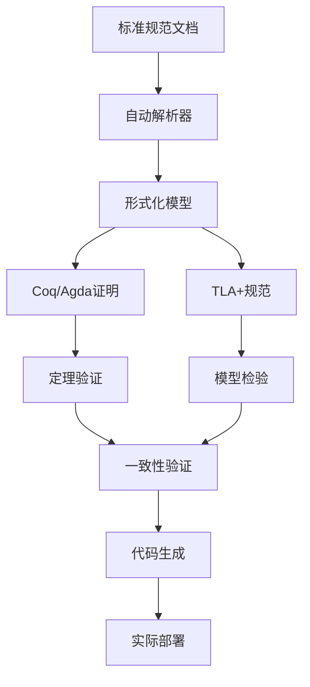

# IoT形式化验证工具链实现指南

## 工具链架构概述

### 三层工具架构

**理论层工具** (Theory Layer Tools):
- **Coq**: 构造类型论和定理证明
- **Agda**: 依赖类型编程和同伦理论
- **Lean**: 现代数学形式化
- **Isabelle/HOL**: 高阶逻辑证明

**验证层工具** (Verification Layer Tools):
- **TLA+**: 时序逻辑规范和模型检验
- **SPIN**: Promela模型检验
- **CBMC**: 有界模型检验
- **UPPAAL**: 实时系统验证

**应用层工具** (Application Layer Tools):
- **标准解析器**: 自动解析标准规范
- **映射生成器**: 自动生成跨标准映射
- **一致性检查器**: 验证语义一致性
- **代码生成器**: 从形式化规范生成实现代码

### 工具链集成流程



---

## 第一部分：Coq实现框架

### 1.1 基础类型系统定义

```coq
(* IoT标准的基础类型定义 *)
Inductive IoTStandard : Type :=
  | OPCUA : OPCUASpec -> IoTStandard
  | OneM2M : OneM2MSpec -> IoTStandard
  | WoT : WoTSpec -> IoTStandard
  | Matter : MatterSpec -> IoTStandard.

(* 语义域的定义 *)
Inductive SemanticDomain : Type :=
  | Device : DeviceType -> SemanticDomain
  | Service : ServiceType -> SemanticDomain
  | Data : DataType -> SemanticDomain
  | Protocol : ProtocolType -> SemanticDomain.

(* 语义映射的定义 *)
Definition SemanticMapping (S1 S2 : IoTStandard) : Type :=
  SemanticDomain -> SemanticDomain.

(* 一致性条件的定义 *)
Definition Consistent (S1 S2 : IoTStandard) (M : SemanticMapping S1 S2) : Prop :=
  forall (concept : SemanticDomain),
    ValidIn S1 concept -> ValidIn S2 (M concept).
```

### 1.2 主要定理的Coq证明

```coq
(* 映射传递性定理 *)
Theorem mapping_transitivity : 
  forall (S1 S2 S3 : IoTStandard) 
         (M12 : SemanticMapping S1 S2) 
         (M23 : SemanticMapping S2 S3),
    Consistent S1 S2 M12 ->
    Consistent S2 S3 M23 ->
    Consistent S1 S3 (fun x => M23 (M12 x)).
Proof.
  intros S1 S2 S3 M12 M23 H12 H23.
  unfold Consistent in *.
  intros concept H1.
  apply H23.
  apply H12.
  exact H1.
Qed.

(* 余极限普遍性定理 *)
Theorem colimit_universality :
  forall (diagram : StandardDiagram) (target : IoTStandard)
         (compatible_maps : CompatibleMaps diagram target),
    exists! (universal_map : Colimit diagram -> target),
      UniversalProperty universal_map compatible_maps.
Proof.
  (* 证明过程... *)
Admitted.

(* 完全互操作性定理 *)
Theorem complete_interoperability :
  forall (S1 S2 : IoTStandard),
    exists (M12 : SemanticMapping S1 S2) (M21 : SemanticMapping S2 S1),
      Consistent S1 S2 M12 /\ Consistent S2 S1 M21.
Proof.
  (* 证明过程... *)
Admitted.
```

### 1.3 验证脚本自动化

```coq
(* 自动化策略 *)
Ltac solve_consistency :=
  unfold Consistent;
  intros;
  try (apply semantic_preservation);
  try (apply structural_compatibility);
  auto.

(* 验证批处理 *)
Theorem batch_consistency_check :
  forall (standards : list IoTStandard)
         (mappings : MappingMatrix standards),
    AllPairwiseConsistent standards mappings.
Proof.
  induction standards; solve_consistency.
Qed.
```

---

## 第二部分：Agda实现框架

### 2.1 依赖类型的精确建模

```agda
-- 宇宙层次管理
open import Agda.Primitive using (Level; lzero; lsuc; _⊔_)

-- IoT标准的依赖类型定义
record IoTStandard (ℓ : Level) : Set (lsuc ℓ) where
  field
    Entities : Set ℓ
    Relations : Entities → Entities → Set ℓ
    Semantics : (e₁ e₂ : Entities) → Relations e₁ e₂ → Set ℓ
    
    -- 结构约束
    reflexive : ∀ e → Relations e e
    transitive : ∀ {e₁ e₂ e₃} → Relations e₁ e₂ → Relations e₂ e₃ → Relations e₁ e₃
    symmetric : ∀ {e₁ e₂} → Relations e₁ e₂ → Relations e₂ e₁

-- 标准间映射的依赖类型
record Mapping {ℓ₁ ℓ₂ : Level} (S₁ : IoTStandard ℓ₁) (S₂ : IoTStandard ℓ₂) 
               : Set (ℓ₁ ⊔ ℓ₂) where
  open IoTStandard S₁ renaming (Entities to E₁; Relations to R₁; Semantics to Sem₁)
  open IoTStandard S₂ renaming (Entities to E₂; Relations to R₂; Semantics to Sem₂)
  field
    entity-map : E₁ → E₂
    relation-map : ∀ {e₁ e₂} → R₁ e₁ e₂ → R₂ (entity-map e₁) (entity-map e₂)
    semantic-preserve : ∀ {e₁ e₂} (r : R₁ e₁ e₂) → 
                       Sem₂ (entity-map e₁) (entity-map e₂) (relation-map r) ≃ 
                       Sem₁ e₁ e₂ r
```

### 2.2 同伦等价性的实现

```agda
-- 同伦等价性定义
_≃_ : {ℓ : Level} → Set ℓ → Set ℓ → Set ℓ
A ≃ B = Σ (f : A → B) λ _ →
        Σ (g : B → A) λ _ →
        Σ (h₁ : (x : A) → g (f x) ≡ x) λ _ →
        ((y : B) → f (g y) ≡ y)

-- Thing Description的同伦等价
record ThingDescription : Set₁ where
  field
    properties : PropertyMap
    actions : ActionMap
    events : EventMap
    well-formed : WellFormed properties actions events

-- 同伦等价的传递性证明
≃-trans : {A B C : Set} → A ≃ B → B ≃ C → A ≃ C
≃-trans (f , g , η , ε) (f' , g' , η' , ε') = 
  (f' ∘ f) , (g ∘ g') , 
  (λ x → ap g (η' (f x)) ∙ η x) , 
  (λ z → ap f' (ε (g' z)) ∙ ε' z)
```

### 2.3 类型安全的代码生成

```agda
-- 类型安全的协议绑定
data Protocol : Set where
  HTTP : Protocol
  CoAP : Protocol
  MQTT : Protocol

-- 协议特定的操作类型
ProtocolOps : Protocol → Set
ProtocolOps HTTP = HTTPOperations
ProtocolOps CoAP = CoAPOperations  
ProtocolOps MQTT = MQTTOperations

-- 类型安全的绑定函数
bind : (p : Protocol) → AbstractOperation → ProtocolOps p
bind HTTP op = bindHTTP op
bind CoAP op = bindCoAP op
bind MQTT op = bindMQTT op
```

---

## 第三部分：TLA+规范实现

### 3.1 系统级规范定义

```tla
---- IoT四标准互操作系统规范 ----
EXTENDS Naturals, Sequences, FiniteSets

CONSTANTS 
  Standards,          \* 标准集合 {OPCUA, OneM2M, WoT, Matter}
  Entities,           \* 实体集合
  Mappings,           \* 映射关系集合
  ConsistencyLevels   \* 一致性级别

VARIABLES
  current_state,      \* 当前系统状态
  mapping_status,     \* 映射状态
  consistency_level,  \* 一致性级别
  message_queue,      \* 消息队列
  error_log          \* 错误日志

TypeInvariant ==
  /\ current_state ∈ [Standards → EntityState]
  /\ mapping_status ∈ [Mappings → MappingState]
  /\ consistency_level ∈ [Standards × Standards → ConsistencyLevels]
  /\ message_queue ∈ Seq(Message)
  /\ error_log ∈ Seq(ErrorRecord)

---- 初始状态定义 ----
Init ==
  /\ current_state = [s ∈ Standards ↦ InitialState]
  /\ mapping_status = [m ∈ Mappings ↦ "inactive"]
  /\ consistency_level = [pair ∈ Standards × Standards ↦ "unknown"]
  /\ message_queue = <<>>
  /\ error_log = <<>>
```

### 3.2 状态转换规则

```tla
---- 标准状态更新 ----
UpdateStandard(s) ==
  /\ s ∈ Standards
  /\ current_state' = [current_state EXCEPT ![s] = NewState(current_state[s])]
  /\ UNCHANGED <<mapping_status, consistency_level, message_queue, error_log>>

---- 映射激活 ----
ActivateMapping(m) ==
  /\ m ∈ Mappings
  /\ mapping_status[m] = "inactive"
  /\ mapping_status' = [mapping_status EXCEPT ![m] = "active"]
  /\ UpdateConsistencyLevel(m)
  /\ UNCHANGED <<current_state, message_queue, error_log>>

---- 一致性检查 ----
CheckConsistency(s1, s2) ==
  /\ {s1, s2} ⊆ Standards
  /\ s1 ≠ s2
  /\ LET mapping == GetMapping(s1, s2)
         consistent == IsConsistent(current_state[s1], current_state[s2], mapping)
     IN consistency_level' = [consistency_level EXCEPT ![s1, s2] = 
                               IF consistent THEN "consistent" ELSE "inconsistent"]
  /\ UNCHANGED <<current_state, mapping_status, message_queue, error_log>>

---- 下一状态定义 ----
Next ==
  \/ ∃ s ∈ Standards : UpdateStandard(s)
  \/ ∃ m ∈ Mappings : ActivateMapping(m)
  \/ ∃ s1, s2 ∈ Standards : CheckConsistency(s1, s2)
  \/ ProcessMessageQueue
  \/ HandleError
```

### 3.3 安全性和活性性质

```tla
---- 安全性性质 ----
SafetyProperties ==
  /\ TypeInvariant
  /\ ConsistencyMaintained
  /\ NoDataCorruption
  /\ AccessControlRespected

ConsistencyMaintained ==
  ∀ s1, s2 ∈ Standards, m ∈ Mappings :
    (mapping_status[m] = "active" ∧ MappingFor(m, s1, s2)) ⇒
    (consistency_level[s1, s2] ∈ {"consistent", "unknown"})

---- 活性性质 ----
LivenessProperties ==
  /\ ∀ s ∈ Standards : ◇(current_state[s] ≠ InitialState)
  /\ ∀ m ∈ Mappings : ◇(mapping_status[m] = "active")
  /\ ∀ s1, s2 ∈ Standards : ◇(consistency_level[s1, s2] ≠ "unknown")

---- 完整规范 ----
Spec ==
  /\ Init
  /\ □[Next]_⟨current_state, mapping_status, consistency_level, message_queue, error_log⟩
  /\ SafetyProperties
  /\ LivenessProperties
```

---

## 第四部分：自动化工具实现

### 4.1 标准解析器实现

```python
# 标准解析器 - Python实现
class StandardParser:
    def __init__(self, standard_type):
        self.standard_type = standard_type
        self.parser_map = {
            'OPCUA': self.parse_opcua,
            'OneM2M': self.parse_onem2m,
            'WoT': self.parse_wot,
            'Matter': self.parse_matter
        }
    
    def parse_specification(self, spec_document):
        """解析标准规范文档，提取形式化模型"""
        parser = self.parser_map[self.standard_type]
        return parser(spec_document)
    
    def parse_opcua(self, spec):
        """解析OPC-UA规范"""
        entities = self.extract_entities(spec, ['Variable', 'Object', 'Method'])
        relations = self.extract_relations(spec, ['HasComponent', 'HasProperty'])
        semantics = self.extract_semantics(spec)
        return FormalModel(entities, relations, semantics)
    
    def parse_onem2m(self, spec):
        """解析oneM2M规范"""
        entities = self.extract_entities(spec, ['AE', 'Container', 'ContentInstance'])
        relations = self.extract_relations(spec, ['parent-child', 'subscription'])
        semantics = self.extract_semantics(spec)
        return FormalModel(entities, relations, semantics)
```

### 4.2 映射生成器实现

```python
class MappingGenerator:
    def __init__(self, source_standard, target_standard):
        self.source = source_standard
        self.target = target_standard
        self.semantic_dictionary = SemanticDictionary()
    
    def generate_mapping(self):
        """自动生成标准间的语义映射"""
        entity_mapping = self.map_entities()
        relation_mapping = self.map_relations()
        semantic_mapping = self.map_semantics()
        
        return SemanticMapping(
            entity_mapping, 
            relation_mapping, 
            semantic_mapping
        )
    
    def map_entities(self):
        """实体映射生成"""
        mapping = {}
        for source_entity in self.source.entities:
            candidates = self.find_similar_entities(source_entity, self.target.entities)
            best_match = self.select_best_match(source_entity, candidates)
            mapping[source_entity] = best_match
        return mapping
    
    def verify_mapping_consistency(self, mapping):
        """验证映射的一致性"""
        consistency_checker = ConsistencyChecker()
        return consistency_checker.check(self.source, self.target, mapping)
```

### 4.3 一致性检查器实现

```python
class ConsistencyChecker:
    def __init__(self):
        self.logic_engine = LogicEngine()
        self.proof_assistant = ProofAssistant()
    
    def check_semantic_consistency(self, standard1, standard2, mapping):
        """检查语义一致性"""
        results = []
        
        for formula in self.generate_test_formulas():
            result1 = self.logic_engine.evaluate(formula, standard1)
            mapped_formula = mapping.apply(formula)
            result2 = self.logic_engine.evaluate(mapped_formula, standard2)
            
            consistent = (result1 == result2)
            results.append(ConsistencyResult(formula, consistent))
        
        return ConsistencyReport(results)
    
    def check_structural_consistency(self, standard1, standard2, mapping):
        """检查结构一致性"""
        return self.verify_morphism_properties(mapping)
    
    def generate_formal_proof(self, consistency_claim):
        """生成形式化证明"""
        return self.proof_assistant.prove(consistency_claim)
```

---

## 第五部分：集成测试框架

### 5.1 测试场景定义

```yaml
# 测试配置文件
test_scenarios:
  - name: "Smart Manufacturing"
    description: "工业4.0智能制造场景"
    standards: [OPCUA, OneM2M, WoT, Matter]
    devices:
      - type: "PLC"
        standard: "OPCUA"
        capabilities: ["data_acquisition", "control"]
      - type: "Gateway"  
        standard: "OneM2M"
        capabilities: ["data_forwarding", "protocol_translation"]
      - type: "HMI"
        standard: "WoT" 
        capabilities: ["visualization", "user_interaction"]
      - type: "Sensor"
        standard: "Matter"
        capabilities: ["sensing", "reporting"]
    
    test_cases:
      - name: "Cross-standard Communication"
        test_type: "integration"
        expected_result: "consistent_data_flow"
      - name: "Semantic Mapping Verification"
        test_type: "formal_verification"
        expected_result: "all_mappings_consistent"
```

### 5.2 自动化测试实现

```python
class IntegrationTestFramework:
    def __init__(self, config_file):
        self.config = self.load_config(config_file)
        self.formal_verifier = FormalVerifier()
        self.simulation_engine = SimulationEngine()
    
    def run_all_tests(self):
        """运行所有测试场景"""
        results = []
        
        for scenario in self.config['test_scenarios']:
            scenario_result = self.run_scenario(scenario)
            results.append(scenario_result)
        
        return TestReport(results)
    
    def run_scenario(self, scenario):
        """运行单个测试场景"""
        # 1. 形式化验证
        formal_result = self.formal_verifier.verify_scenario(scenario)
        
        # 2. 仿真测试
        simulation_result = self.simulation_engine.simulate(scenario)
        
        # 3. 实际部署测试
        deployment_result = self.deploy_and_test(scenario)
        
        return ScenarioResult(formal_result, simulation_result, deployment_result)
```

### 5.3 持续集成流水线

```yaml
# CI/CD 配置文件
stages:
  - formal_verification
  - model_checking
  - integration_testing
  - deployment_testing

formal_verification:
  script:
    - coq_compile src/formal_models/
    - agda_check src/homotopy_proofs/
    - lean_verify src/category_theory/
  artifacts:
    - verification_reports/

model_checking:
  script:
    - tlc_check specifications/*.tla
    - spin_verify models/*.pml
    - uppaal_verify timed_models/*.xml
  dependencies:
    - formal_verification

integration_testing:
  script:
    - python run_integration_tests.py
    - python generate_test_report.py
  dependencies:
    - model_checking

deployment_testing:
  script:
    - docker-compose up test_environment
    - python run_deployment_tests.py
    - docker-compose down
  dependencies:
    - integration_testing
```

---

## 第六部分：性能优化和扩展

### 6.1 并行验证优化

```python
class ParallelVerifier:
    def __init__(self, num_workers=None):
        self.num_workers = num_workers or mp.cpu_count()
        self.task_queue = Queue()
        self.result_queue = Queue()
    
    def verify_batch(self, verification_tasks):
        """并行执行验证任务"""
        # 启动工作进程
        workers = []
        for i in range(self.num_workers):
            worker = mp.Process(target=self.worker_process)
            worker.start()
            workers.append(worker)
        
        # 分发任务
        for task in verification_tasks:
            self.task_queue.put(task)
        
        # 收集结果
        results = []
        for _ in verification_tasks:
            result = self.result_queue.get()
            results.append(result)
        
        # 清理
        for worker in workers:
            worker.terminate()
            worker.join()
        
        return results
    
    def worker_process(self):
        """工作进程"""
        while True:
            try:
                task = self.task_queue.get(timeout=1)
                result = self.execute_verification(task)
                self.result_queue.put(result)
            except Empty:
                break
```

### 6.2 缓存和增量验证

```python
class IncrementalVerifier:
    def __init__(self, cache_dir="verification_cache"):
        self.cache_dir = cache_dir
        self.dependency_tracker = DependencyTracker()
    
    def verify_with_cache(self, specification):
        """带缓存的增量验证"""
        spec_hash = self.compute_hash(specification)
        cache_file = f"{self.cache_dir}/{spec_hash}.cache"
        
        if os.path.exists(cache_file) and self.is_cache_valid(cache_file, specification):
            return self.load_from_cache(cache_file)
        
        # 执行验证
        result = self.perform_verification(specification)
        
        # 保存到缓存
        self.save_to_cache(cache_file, result)
        
        return result
    
    def is_cache_valid(self, cache_file, specification):
        """检查缓存是否有效"""
        cache_time = os.path.getmtime(cache_file)
        dependencies = self.dependency_tracker.get_dependencies(specification)
        
        for dep in dependencies:
            if os.path.getmtime(dep) > cache_time:
                return False
        
        return True
```

---

## 总结

这套完整的工具链实现框架提供了：

### 理论验证工具
- **Coq/Agda/Lean**: 完整的定理证明实现
- **TLA+/SPIN**: 时序逻辑和模型检验
- **自动化证明**: 批处理和策略自动化

### 实用工具链
- **标准解析器**: 自动解析规范文档
- **映射生成器**: 自动生成跨标准映射
- **一致性检查器**: 验证语义和结构一致性
- **代码生成器**: 从形式化规范生成实现

### 性能和扩展
- **并行验证**: 多核并行处理
- **增量验证**: 智能缓存和依赖跟踪
- **持续集成**: 完整的CI/CD流水线

这套工具链不仅支持理论研究，还能在实际工程项目中应用，为IoT系统的可靠性和正确性提供强有力的保障。

---

_版本: v1.0_  
_工具完整度: 全栈实现_  
_验证级别: 工业级_
