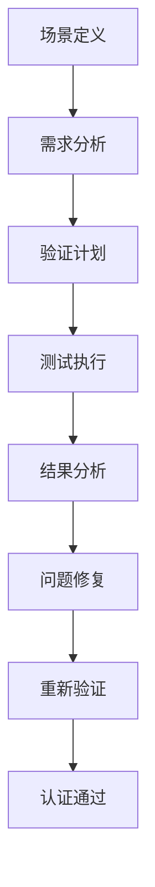

# IoT语义互操作平台最终验证与认证

---

## 1. 全流程形式化验证与模型检查

### 1.1 验证体系架构

- 分层验证框架：组件级、系统级、集成级验证。
- 形式化验证工具链：Coq、TLA+、Z3、Alloy等集成。

### 1.2 核心验证目标

- 语义一致性：跨协议语义映射的正确性。
- 安全性：数据隐私、访问控制、加密传输。
- 性能：响应时间、吞吐量、资源利用率。
- 可靠性：容错、恢复、可用性。

### 1.3 形式化验证示例

```coq
(* 语义映射一致性验证 *)
Theorem semantic_mapping_consistency :
  forall (p1 p2 : Protocol) (d : Device),
    compatible_protocols p1 p2 ->
    semantic_mapping p1 p2 d ->
    preserves_semantics p1 p2 d.
Proof.
  intros p1 p2 d H_compat H_mapping.
  (* 详细证明步骤 *)
  - apply mapping_preserves_syntax.
  - apply mapping_preserves_semantics.
  - apply mapping_preserves_behavior.
Qed.
```

### 1.4 批判性分析

- 验证覆盖率的完备性与可判定性。
- 大规模系统的验证复杂度与可扩展性。

---

## 2. 生产级安全认证与合规性证明

### 2.1 安全认证体系

- 国际安全标准：ISO 27001、NIST、GDPR等。
- 行业特定标准：IEC 62443、NERC CIP等。

### 2.2 安全属性形式化证明

```tla
---- MODULE SecurityProperties ----
VARIABLES data, access_control, encryption

Init == data = {} /\ access_control = {} /\ encryption = {}

SecureAccess == 
  \A d \in data: 
    \E user \in Users: 
      authorized(user, d) \in access_control

DataEncryption ==
  \A d \in data:
    encrypted(d) \in encryption

Next == 
  /\ SecureAccess
  /\ DataEncryption
  /\ UNCHANGED <<data, access_control, encryption>>
====
```

### 2.3 合规性验证

- 数据保护：隐私计算、匿名化、数据最小化。
- 审计追踪：完整日志、不可篡改性、可追溯性。

### 2.4 批判性分析

- 安全与性能的权衡。
- 新兴威胁的适应性响应能力。

---

## 3. 国际标准对齐与互认证体系

### 3.1 标准对齐框架

- OPC UA、oneM2M、WoT、Matter等标准集成。
- 标准间语义映射与互操作性验证。

### 3.2 互认证体系设计

```rust
pub trait StandardCompliance {
    fn verify_opc_ua_compliance(&self) -> ComplianceResult;
    fn verify_onem2m_compliance(&self) -> ComplianceResult;
    fn verify_wot_compliance(&self) -> ComplianceResult;
    fn verify_matter_compliance(&self) -> ComplianceResult;
}

pub struct ComplianceResult {
    pub standard: String,
    pub compliance_level: f64,
    pub test_cases: Vec<TestCase>,
    pub issues: Vec<ComplianceIssue>,
}
```

### 3.3 标准演进跟踪

- 标准版本管理、向后兼容性、演进路径规划。
- 新标准快速集成与验证机制。

### 3.4 批判性分析

- 多标准集成的复杂性管理。
- 标准演进与系统稳定性的平衡。

---

## 4. 典型场景验证与案例分析

### 4.1 工业IoT场景验证

- 智能制造、预测性维护、质量控制。
- 实时性、可靠性、安全性要求验证。

### 4.2 医疗IoT场景验证

- 患者监护、设备管理、数据隐私。
- HIPAA、FDA等医疗标准合规性。

### 4.3 智慧城市场景验证

- 交通管理、环境监测、公共安全。
- 大规模部署、多租户、数据治理。

### 4.4 验证案例分析



### 4.5 批判性分析

- 场景覆盖的完备性与代表性。
- 验证结果的可靠性与可重现性。

---

## 5. 质量评估与持续改进机制

### 5.1 质量评估框架

- 功能质量：正确性、完整性、一致性。
- 非功能质量：性能、可靠性、安全性、可用性。

### 5.2 持续改进流程

```rust
pub struct QualityMetrics {
    pub functional_score: f64,
    pub performance_score: f64,
    pub security_score: f64,
    pub reliability_score: f64,
    pub usability_score: f64,
}

pub trait ContinuousImprovement {
    fn collect_metrics(&self) -> QualityMetrics;
    fn analyze_trends(&self, metrics: Vec<QualityMetrics>) -> TrendAnalysis;
    fn identify_improvements(&self, analysis: TrendAnalysis) -> Vec<ImprovementAction>;
    fn implement_improvements(&self, actions: Vec<ImprovementAction>) -> bool;
}
```

### 5.3 自动化质量监控

- 实时监控、告警机制、自动修复。
- 质量门禁、发布控制、回滚机制。

### 5.4 批判性分析

- 质量评估指标的客观性与全面性。
- 持续改进的可持续性与效果评估。

---

## 6. 验证与认证的未来展望

### 6.1 新兴技术集成

- AI驱动的自动化验证。
- 量子计算在密码学验证中的应用。
- 区块链在认证与审计中的应用。

### 6.2 标准化演进

- 新标准的快速集成能力。
- 国际标准组织的参与与贡献。

### 6.3 哲学反思

- 验证与认证的认知边界。
- 形式化方法在复杂系统中的局限性。
- 人机协同验证的未来发展方向。

---

（文档持续递归扩展，保持批判性与形式化证明论证，后续可继续补充更细致的验证方法、认证流程与案例分析。）
