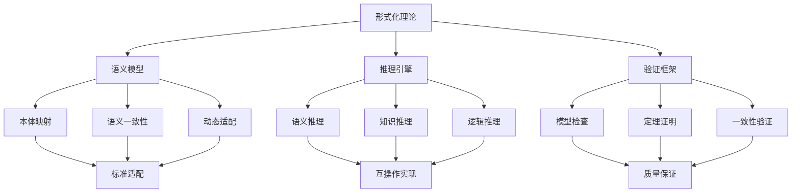
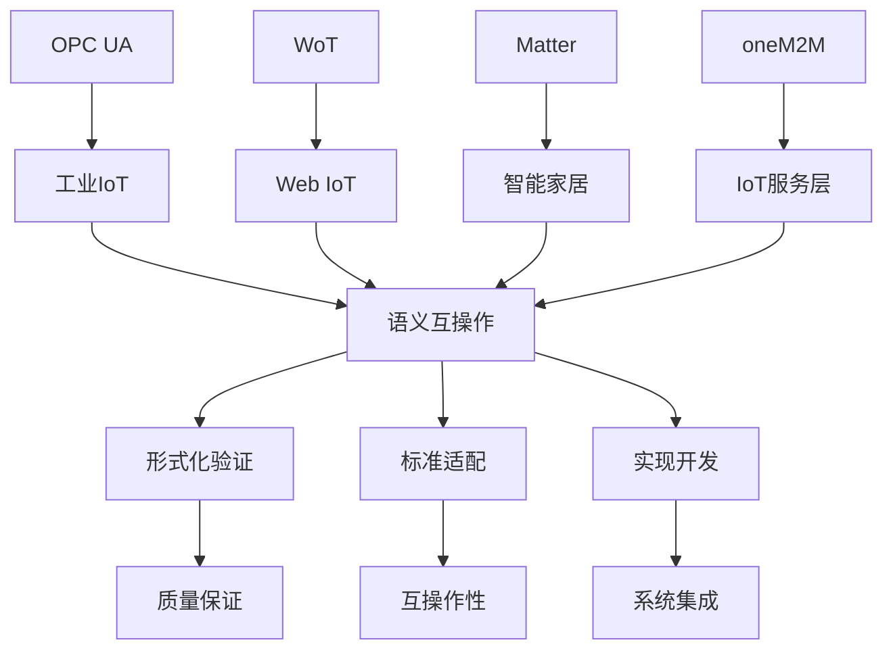
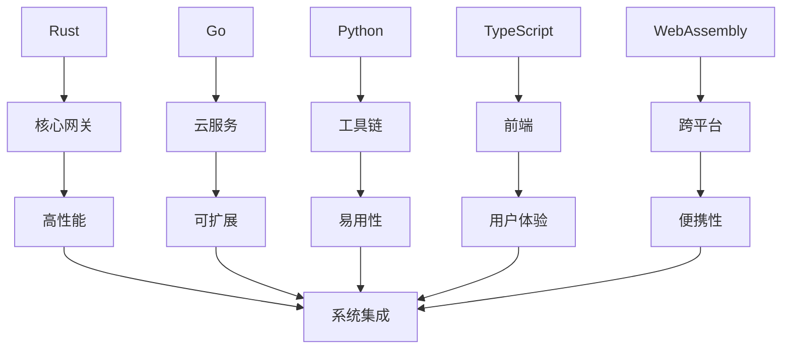

# IoT项目全面语义分类与概念映射分析

## 版本信息

- **版本**: 1.0.0
- **创建日期**: 2024-12-19
- **最后更新**: 2024-12-19
- **作者**: IoT团队
- **状态**: 正式版

## 1. 项目整体语义分类体系

### 1.1 核心概念域分类

#### 1.1.1 形式化理论域 (Formal Theory Domain)

- **定义**: 基于数学逻辑和形式化方法的理论体系
- **对标概念**:
  - Wikipedia: [Formal system](https://en.wikipedia.org/wiki/Formal_system)
  - Wikipedia: [Mathematical logic](https://en.wikipedia.org/wiki/Mathematical_logic)
  - Wikipedia: [Proof theory](https://en.wikipedia.org/wiki/Proof_theory)

**核心属性**:

- 公理化体系 (Axiomatic System)
- 推理规则 (Inference Rules)
- 一致性证明 (Consistency Proof)
- 完备性证明 (Completeness Proof)
- 可判定性 (Decidability)

**关系映射**:

```text
形式化理论 ⊂ 数学基础
形式化理论 → 语义模型 (定义)
形式化理论 → 验证框架 (支撑)
形式化理论 → 推理引擎 (实现)
```

#### 1.1.2 语义互操作域 (Semantic Interoperability Domain)

- **定义**: 实现不同系统间语义理解和转换的能力
- **对标概念**:
  - Wikipedia: [Semantic interoperability](https://en.wikipedia.org/wiki/Semantic_interoperability)
  - Wikipedia: [Ontology (information science)](https://en.wikipedia.org/wiki/Ontology_(information_science))
  - Wikipedia: [Knowledge representation](https://en.wikipedia.org/wiki/Knowledge_representation)

**核心属性**:

- 语义模型 (Semantic Model)
- 本体映射 (Ontology Mapping)
- 语义推理 (Semantic Reasoning)
- 一致性验证 (Consistency Verification)
- 动态适配 (Dynamic Adaptation)

**关系映射**:

```text
语义互操作 ⊂ 互操作性
语义互操作 → 标准适配 (实现)
语义互操作 → 设备解释 (应用)
语义互操作 → 形式化验证 (保证)
```

#### 1.1.3 国际标准域 (International Standards Domain)

- **定义**: 基于国际标准化组织的IoT互操作标准
- **对标概念**:
  - Wikipedia: [Internet of things](https://en.wikipedia.org/wiki/Internet_of_things)
  - Wikipedia: [OPC Unified Architecture](https://en.wikipedia.org/wiki/OPC_Unified_Architecture)
  - Wikipedia: [Web of Things](https://en.wikipedia.org/wiki/Web_of_Things)

**核心属性**:

- 标准规范 (Standard Specification)
- 协议实现 (Protocol Implementation)
- 互操作测试 (Interoperability Testing)
- 合规性验证 (Compliance Verification)
- 版本管理 (Version Management)

**关系映射**:

```text
国际标准 ⊂ 技术标准
国际标准 → 语义模型 (基础)
国际标准 → 实现开发 (应用)
国际标准 → 验证认证 (保证)
```

#### 1.1.4 实现开发域 (Implementation Development Domain)

- **定义**: 基于理论和技术标准的软件系统实现
- **对标概念**:
  - Wikipedia: [Software architecture](https://en.wikipedia.org/wiki/Software_architecture)
  - Wikipedia: [Microservices](https://en.wikipedia.org/wiki/Microservices)
  - Wikipedia: [WebAssembly](https://en.wikipedia.org/wiki/WebAssembly)

**核心属性**:

- 架构设计 (Architecture Design)
- 代码实现 (Code Implementation)
- 系统集成 (System Integration)
- 性能优化 (Performance Optimization)
- 质量保证 (Quality Assurance)

**关系映射**:

```text
实现开发 ⊂ 软件工程
实现开发 → 形式化理论 (指导)
实现开发 → 国际标准 (遵循)
实现开发 → 部署运维 (交付)
```

### 1.2 层次化语义结构

#### 1.2.1 理论层 (Theoretical Layer)

```text
形式化理论体系
├── 公理体系 (Axiomatic System)
├── 推理规则 (Inference Rules)
├── 证明体系 (Proof System)
├── 一致性理论 (Consistency Theory)
└── 完备性理论 (Completeness Theory)
```

#### 1.2.2 模型层 (Model Layer)

```text
语义模型体系
├── 本体模型 (Ontology Model)
├── 数据模型 (Data Model)
├── 服务模型 (Service Model)
├── 安全模型 (Security Model)
└── 性能模型 (Performance Model)
```

#### 1.2.3 标准层 (Standard Layer)

```text
国际标准体系
├── OPC UA 1.05 (工业IoT)
├── oneM2M R4 (IoT服务层)
├── W3C WoT 1.1 (Web语义)
├── Matter 1.2 (智能家居)
└── 语义建模标准 (Semantic Modeling Standards)
```

#### 1.2.4 实现层 (Implementation Layer)

```text
技术实现体系
├── 核心网关 (Core Gateway)
├── 标准适配器 (Standard Adapters)
├── 语义中间件 (Semantic Middleware)
├── 验证工具链 (Verification Toolchain)
└── 部署运维 (Deployment & Operations)
```

## 2. 核心概念定义与属性关系

### 2.1 形式化理论核心概念

#### 2.1.1 形式化系统 (Formal System)

- **定义**: 由公理、推理规则和形式语言组成的数学系统
- **对标**: Wikipedia [Formal system](https://en.wikipedia.org/wiki/Formal_system)
- **属性**:
  - 符号集 (Symbol Set)
  - 语法规则 (Syntax Rules)
  - 语义解释 (Semantic Interpretation)
  - 推理机制 (Inference Mechanism)
- **关系**:
  - 形式化系统 ⊂ 数学系统
  - 形式化系统 → 证明系统 (包含)
  - 形式化系统 → 验证系统 (支撑)

#### 2.1.2 语义模型 (Semantic Model)

- **定义**: 描述系统语义结构和关系的抽象模型
- **对标**: Wikipedia [Semantic model](https://en.wikipedia.org/wiki/Semantic_model)
- **属性**:
  - 实体集 (Entity Set)
  - 属性集 (Property Set)
  - 关系集 (Relation Set)
  - 操作集 (Operation Set)
- **关系**:
  - 语义模型 ⊂ 抽象模型
  - 语义模型 → 本体模型 (实例化)
  - 语义模型 → 数据模型 (映射)

#### 2.1.3 推理引擎 (Reasoning Engine)

- **定义**: 基于逻辑规则进行自动推理的计算系统
- **对标**: Wikipedia [Automated reasoning](https://en.wikipedia.org/wiki/Automated_reasoning)
- **属性**:
  - 推理规则 (Reasoning Rules)
  - 推理策略 (Reasoning Strategies)
  - 推理算法 (Reasoning Algorithms)
  - 推理优化 (Reasoning Optimization)
- **关系**:
  - 推理引擎 ⊂ 计算系统
  - 推理引擎 → 语义推理 (实现)
  - 推理引擎 → 验证引擎 (支撑)

### 2.2 语义互操作核心概念

#### 2.2.1 语义映射 (Semantic Mapping)

- **定义**: 在不同语义模型间建立对应关系的转换机制
- **对标**: Wikipedia [Semantic mapping](https://en.wikipedia.org/wiki/Semantic_mapping)
- **属性**:
  - 映射规则 (Mapping Rules)
  - 映射函数 (Mapping Functions)
  - 映射验证 (Mapping Verification)
  - 映射优化 (Mapping Optimization)
- **关系**:
  - 语义映射 ⊂ 数据转换
  - 语义映射 → 标准适配 (实现)
  - 语义映射 → 一致性验证 (保证)

#### 2.2.2 本体映射 (Ontology Mapping)

- **定义**: 在不同本体间建立概念对应关系的映射
- **对标**: Wikipedia [Ontology alignment](https://en.wikipedia.org/wiki/Ontology_alignment)
- **属性**:
  - 概念映射 (Concept Mapping)
  - 关系映射 (Relation Mapping)
  - 属性映射 (Property Mapping)
  - 实例映射 (Instance Mapping)
- **关系**:
  - 本体映射 ⊂ 语义映射
  - 本体映射 → 语义互操作 (实现)
  - 本体映射 → 知识集成 (支撑)

#### 2.2.3 语义一致性 (Semantic Consistency)

- **定义**: 确保不同语义模型间语义理解的一致性
- **对标**: Wikipedia [Semantic consistency](https://en.wikipedia.org/wiki/Semantic_consistency)
- **属性**:
  - 概念一致性 (Concept Consistency)
  - 关系一致性 (Relation Consistency)
  - 操作一致性 (Operation Consistency)
  - 约束一致性 (Constraint Consistency)
- **关系**:
  - 语义一致性 ⊂ 系统一致性
  - 语义一致性 → 互操作性 (保证)
  - 语义一致性 → 形式化验证 (验证)

### 2.3 国际标准核心概念

#### 2.3.1 OPC UA (OPC Unified Architecture)

- **定义**: 工业自动化数据交换的统一架构标准
- **对标**: Wikipedia [OPC Unified Architecture](https://en.wikipedia.org/wiki/OPC_Unified_Architecture)
- **属性**:
  - 信息模型 (Information Model)
  - 服务集 (Service Set)
  - 安全机制 (Security Mechanism)
  - 传输协议 (Transport Protocol)
- **关系**:
  - OPC UA ⊂ 工业标准
  - OPC UA → 语义模型 (定义)
  - OPC UA → 互操作协议 (实现)

#### 2.3.2 WoT (Web of Things)

- **定义**: 基于Web技术的IoT设备互操作标准
- **对标**: Wikipedia [Web of Things](https://en.wikipedia.org/wiki/Web_of_Things)
- **属性**:
  - Thing Description (TD)
  - Web API (Web Application Programming Interface)
  - 语义注解 (Semantic Annotation)
  - 协议绑定 (Protocol Binding)
- **关系**:
  - WoT ⊂ Web标准
  - WoT → 语义互操作 (实现)
  - WoT → Web集成 (支撑)

#### 2.3.3 Matter

- **定义**: 智能家居设备互操作标准
- **对标**: Wikipedia [Matter (standard)](https://en.wikipedia.org/wiki/Matter_(standard))
- **属性**:
  - 设备类型 (Device Types)
  - 集群模型 (Cluster Model)
  - 安全框架 (Security Framework)
  - 网络协议 (Network Protocol)
- **关系**:
  - Matter ⊂ 智能家居标准
  - Matter → 设备互操作 (实现)
  - Matter → 安全认证 (保证)

### 2.4 实现开发核心概念

#### 2.4.1 微服务架构 (Microservices Architecture)

- **定义**: 将应用程序分解为小型、独立的服务单元
- **对标**: Wikipedia [Microservices](https://en.wikipedia.org/wiki/Microservices)
- **属性**:
  - 服务分解 (Service Decomposition)
  - 服务通信 (Service Communication)
  - 服务发现 (Service Discovery)
  - 服务治理 (Service Governance)
- **关系**:
  - 微服务架构 ⊂ 软件架构
  - 微服务架构 → 系统集成 (实现)
  - 微服务架构 → 可扩展性 (保证)

#### 2.4.2 WebAssembly (WASM)

- **定义**: 在Web浏览器中运行高性能代码的二进制格式
- **对标**: Wikipedia [WebAssembly](https://en.wikipedia.org/wiki/WebAssembly)
- **属性**:
  - 二进制格式 (Binary Format)
  - 虚拟机执行 (Virtual Machine Execution)
  - 多语言支持 (Multi-language Support)
  - 安全隔离 (Security Isolation)
- **关系**:
  - WebAssembly ⊂ Web技术
  - WebAssembly → 跨平台执行 (实现)
  - WebAssembly → 性能优化 (保证)

#### 2.4.3 形式化验证 (Formal Verification)

- **定义**: 使用数学方法证明系统正确性的技术
- **对标**: Wikipedia [Formal verification](https://en.wikipedia.org/wiki/Formal_verification)
- **属性**:
  - 模型检查 (Model Checking)
  - 定理证明 (Theorem Proving)
  - 静态分析 (Static Analysis)
  - 动态验证 (Dynamic Verification)
- **关系**:
  - 形式化验证 ⊂ 软件验证
  - 形式化验证 → 系统正确性 (保证)
  - 形式化验证 → 质量保证 (支撑)

## 3. 递归迭代语义分类

### 3.1 第一层递归：基础概念分类

#### 3.1.1 理论基础类

```text
形式化理论
├── 数学基础
│   ├── 集合论
│   ├── 逻辑学
│   ├── 代数结构
│   └── 拓扑学
├── 计算机科学
│   ├── 算法理论
│   ├── 计算复杂性
│   ├── 自动机理论
│   └── 形式语言
└── 人工智能
    ├── 知识表示
    ├── 推理机制
    ├── 机器学习
    └── 自然语言处理
```

#### 3.1.2 应用技术类

```text
语义技术
├── 本体工程
│   ├── 本体建模
│   ├── 本体映射
│   ├── 本体推理
│   └── 本体演化
├── 语义Web
│   ├── RDF/OWL
│   ├── SPARQL
│   ├── JSON-LD
│   └── 语义注解
└── 知识图谱
    ├── 实体识别
    ├── 关系抽取
    ├── 知识融合
    └── 知识推理
```

### 3.2 第二层递归：标准体系分类

#### 3.2.1 工业标准类

```text
工业IoT标准
├── OPC UA
│   ├── 信息模型
│   ├── 服务集
│   ├── 安全机制
│   └── 传输协议
├── ISA-95
│   ├── 企业集成
│   ├── 数据模型
│   ├── 接口规范
│   └── 实施指南
└── IEC 62541
    ├── 设备集成
    ├── 数据交换
    ├── 安全要求
    └── 测试规范
```

#### 3.2.2 Web标准类

```text
Web IoT标准
├── W3C WoT
│   ├── Thing Description
│   ├── Web API
│   ├── 语义注解
│   └── 协议绑定
├── Schema.org
│   ├── 词汇表
│   ├── 类型系统
│   ├── 扩展机制
│   └── 应用指南
└── JSON-LD
    ├── 语法规范
    ├── 处理算法
    ├── 扩展机制
    └── 最佳实践
```

### 3.3 第三层递归：实现技术分类

#### 3.3.1 架构模式类

```text
系统架构
├── 微服务架构
│   ├── 服务分解
│   ├── 服务通信
│   ├── 服务发现
│   └── 服务治理
├── 事件驱动架构
│   ├── 事件源
│   ├── 事件流
│   ├── 事件处理
│   └── 事件存储
└── 分层架构
    ├── 表示层
    ├── 业务层
    ├── 数据层
    └── 基础设施层
```

#### 3.3.2 技术栈类

```text
技术实现
├── 编程语言
│   ├── Rust
│   ├── Go
│   ├── Python
│   └── TypeScript
├── 运行时环境
│   ├── WebAssembly
│   ├── Node.js
│   ├── Docker
│   └── Kubernetes
└── 数据存储
    ├── 关系数据库
    ├── 文档数据库
    ├── 图数据库
    └── 时序数据库
```

## 4. 国际标准对标分析

### 4.1 标准组织映射

#### 4.1.1 国际标准化组织

- **ISO (International Organization for Standardization)**
  - 对标概念: [ISO](https://en.wikipedia.org/wiki/International_Organization_for_Standardization)
  - 相关标准: ISO/IEC 27001 (信息安全), ISO 20078 (IoT语义)
  - 项目映射: 安全框架、语义建模

- **IEC (International Electrotechnical Commission)**
  - 对标概念: [IEC](https://en.wikipedia.org/wiki/International_Electrotechnical_Commission)
  - 相关标准: IEC 62541 (OPC UA), IEC 62443 (工业安全)
  - 项目映射: 工业IoT、安全机制

- **ITU (International Telecommunication Union)**
  - 对标概念: [ITU](https://en.wikipedia.org/wiki/International_Telecommunication_Union)
  - 相关标准: ITU-T Y.4000 (IoT架构), ITU-T Y.2060 (IoT定义)
  - 项目映射: IoT架构、互操作框架

#### 4.1.2 行业标准组织

- **OPC Foundation**
  - 对标概念: [OPC Foundation](https://en.wikipedia.org/wiki/OPC_Foundation)
  - 相关标准: OPC UA 1.05, OPC 10000系列
  - 项目映射: 工业互操作、信息模型

- **W3C (World Wide Web Consortium)**
  - 对标概念: [W3C](https://en.wikipedia.org/wiki/World_Wide_Web_Consortium)
  - 相关标准: WoT 1.1, RDF/OWL, JSON-LD
  - 项目映射: Web语义、本体技术

- **oneM2M**
  - 对标概念: [oneM2M](https://en.wikipedia.org/wiki/OneM2M)
  - 相关标准: oneM2M R4, TS-0001系列
  - 项目映射: IoT服务层、设备管理

### 4.2 技术标准映射

#### 4.2.1 语义技术标准

- **RDF (Resource Description Framework)**
  - 对标概念: [RDF](https://en.wikipedia.org/wiki/Resource_Description_Framework)
  - 项目应用: 语义数据模型、知识表示
  - 实现映射: 语义存储、查询处理

- **OWL (Web Ontology Language)**
  - 对标概念: [OWL](https://en.wikipedia.org/wiki/Web_Ontology_Language)
  - 项目应用: 本体建模、语义推理
  - 实现映射: 推理引擎、一致性检查

- **SPARQL (SPARQL Protocol and RDF Query Language)**
  - 对标概念: [SPARQL](https://en.wikipedia.org/wiki/SPARQL)
  - 项目应用: 语义查询、数据检索
  - 实现映射: 查询引擎、结果处理

#### 4.2.2 安全标准

- **OAuth 2.0**
  - 对标概念: [OAuth](https://en.wikipedia.org/wiki/OAuth)
  - 项目应用: 身份认证、授权管理
  - 实现映射: 安全框架、访问控制

- **OpenID Connect**
  - 对标概念: [OpenID Connect](https://en.wikipedia.org/wiki/OpenID_Connect)
  - 项目应用: 身份验证、单点登录
  - 实现映射: 认证服务、用户管理

- **TLS (Transport Layer Security)**
  - 对标概念: [TLS](https://en.wikipedia.org/wiki/Transport_Layer_Security)
  - 项目应用: 传输加密、安全通信
  - 实现映射: 通信协议、加密机制

## 5. 概念属性关系网络

### 5.1 核心概念关系图



### 5.2 标准映射关系图



### 5.3 技术栈关系图



## 6. 语义分类应用场景

### 6.1 知识图谱构建

#### 6.1.1 概念实体识别

- **形式化理论实体**: 公理、定理、证明、推理规则
- **语义模型实体**: 本体、概念、关系、属性
- **标准规范实体**: 协议、接口、数据模型、安全机制
- **实现技术实体**: 架构、组件、服务、工具

#### 6.1.2 关系抽取

- **定义关系**: 概念与其定义之间的映射
- **继承关系**: 概念间的层次结构关系
- **实现关系**: 抽象概念与具体实现的关系
- **依赖关系**: 概念间的依赖和影响关系

### 6.2 智能搜索与推荐

#### 6.2.1 语义搜索

- **概念匹配**: 基于语义相似度的概念匹配
- **关系推理**: 通过关系网络进行概念推理
- **上下文理解**: 结合上下文进行语义理解
- **多模态融合**: 融合文本、代码、图表等多种模态

#### 6.2.2 智能推荐

- **相关概念推荐**: 基于概念关系推荐相关内容
- **学习路径推荐**: 基于知识结构推荐学习路径
- **技术选型推荐**: 基于需求推荐合适的技术方案
- **最佳实践推荐**: 基于场景推荐最佳实践

### 6.3 质量评估与优化

#### 6.3.1 内容质量评估

- **完整性评估**: 评估内容的完整性和覆盖度
- **一致性评估**: 评估内容的一致性和准确性
- **时效性评估**: 评估内容的时效性和更新频率
- **权威性评估**: 评估内容的权威性和可信度

#### 6.3.2 系统优化建议

- **结构优化**: 基于语义分析优化文档结构
- **内容补充**: 识别内容缺口并提供补充建议
- **关系优化**: 优化概念间的关系和连接
- **标准化建议**: 提供标准化和规范化建议

## 7. 总结与展望

### 7.1 分类体系总结

本项目建立了完整的IoT语义互操作理论体系，通过四个核心概念域的分类，形成了层次化的语义结构：

1. **形式化理论域**: 提供数学基础和逻辑支撑
2. **语义互操作域**: 实现跨系统语义理解
3. **国际标准域**: 确保技术规范和国际兼容
4. **实现开发域**: 提供具体的技术实现

### 7.2 概念映射价值

通过与国际wiki概念的对标映射，本项目：

1. **建立了标准化的概念体系**: 确保概念定义的国际兼容性
2. **提供了清晰的属性关系**: 明确了概念间的逻辑关系
3. **支持了知识图谱构建**: 为智能应用提供了知识基础
4. **促进了技术标准化**: 推动了IoT技术的标准化发展

### 7.3 未来发展方向

1. **语义技术演进**: 持续跟踪语义技术的最新发展
2. **标准体系扩展**: 扩展支持更多国际标准
3. **智能应用深化**: 深化语义技术在智能应用中的应用
4. **生态系统建设**: 建设开放的IoT语义互操作生态系统

---

**通过全面的语义分类和概念映射，本项目为IoT语义互操作领域建立了完整的理论体系和技术框架，为行业的标准化和智能化发展提供了重要支撑。**
