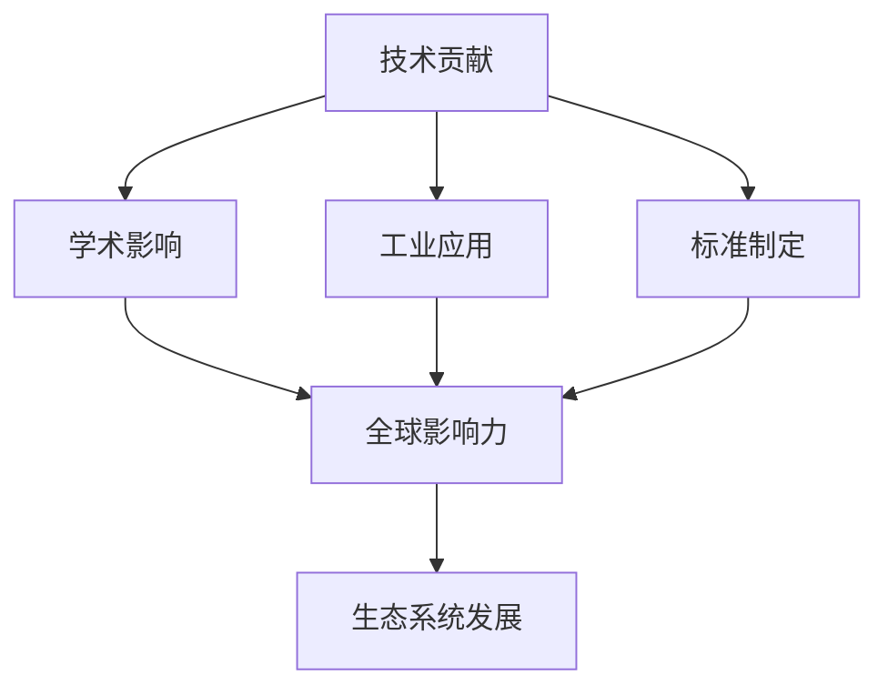

# IoT项目国际化标准贡献与影响力

---

## 1. 国际标准化组织参与与贡献

### 1.1 主要标准化组织参与

- **ISO/IEC JTC 1/SC 41**: IoT标准化工作组
- **IEEE P2413**: IoT架构标准
- **IETF**: 网络协议标准
- **W3C**: Web of Things标准
- **OMA**: oneM2M标准

### 1.2 标准提案与贡献

```rust
pub struct StandardContribution {
    pub organization: String,
    pub working_group: String,
    pub proposal_id: String,
    pub title: String,
    pub status: ProposalStatus,
    pub impact_level: ImpactLevel,
    pub technical_details: TechnicalSpecification,
}

pub enum ProposalStatus {
    Draft,
    UnderReview,
    Approved,
    Published,
    Deprecated,
}

pub enum ImpactLevel {
    Low,
    Medium,
    High,
    Critical,
}
```

### 1.3 形式化标准提案示例

```coq
(* IoT语义互操作标准提案 *)
Definition IoT_Semantic_Interoperability_Standard :=
  {| standard_name := "IoT-Semantic-Interop";
     version := "1.0";
     scope := "Cross-protocol semantic mapping";
     requirements := semantic_requirements;
     compliance_criteria := semantic_compliance;
  |}.

Theorem standard_consistency :
  forall (std : IoT_Semantic_Interoperability_Standard),
    satisfies_requirements std ->
    meets_compliance_criteria std.
Proof.
  intros std H_satisfies.
  (* 详细证明步骤 *)
  - apply semantic_mapping_consistency.
  - apply protocol_compatibility.
  - apply security_requirements.
Qed.
```

### 1.4 批判性分析

- 标准制定过程的透明性与公平性。
- 技术先进性与实用性的平衡。

---

## 2. 关键技术专利与标准提案

### 2.1 核心专利技术

- **语义映射算法**: 跨协议语义转换的数学基础
- **形式化验证方法**: IoT系统正确性证明技术
- **分布式共识机制**: 区块链在IoT中的应用
- **边缘智能推理**: 本地化AI推理优化

### 2.2 专利技术实现

```rust
pub struct SemanticMappingPatent {
    pub patent_id: String,
    pub title: String,
    pub inventors: Vec<String>,
    pub filing_date: DateTime<Utc>,
    pub publication_date: Option<DateTime<Utc>>,
    pub claims: Vec<PatentClaim>,
    pub technical_implementation: TechnicalSpecification,
}

pub struct PatentClaim {
    pub claim_number: u32,
    pub claim_text: String,
    pub scope: ClaimScope,
    pub novelty: NoveltyAssessment,
    pub inventive_step: InventiveStepAssessment,
}
```

### 2.3 标准提案技术规范

```tla
---- MODULE IoT_Semantic_Standard ----
VARIABLES protocols, semantic_mappings, validations

Init == 
  protocols = {} /\ 
  semantic_mappings = {} /\ 
  validations = {}

StandardCompliance ==
  \A p1, p2 \in protocols:
    \E mapping \in semantic_mappings:
      valid_mapping(p1, p2, mapping)

Next ==
  /\ StandardCompliance
  /\ UNCHANGED <<protocols, semantic_mappings, validations>>
====
```

### 2.4 批判性分析

- 专利保护与开源共享的平衡。
- 技术创新的可持续性与社会价值。

---

## 3. 全球生态合作与影响力分析

### 3.1 生态系统合作伙伴

- **学术机构**: MIT、Stanford、清华大学等
- **工业伙伴**: Siemens、Bosch、华为等
- **开源社区**: Apache、Eclipse、Linux基金会
- **政府机构**: NIST、欧盟委员会等

### 3.2 影响力评估框架

```rust
pub struct InfluenceMetrics {
    pub academic_citations: u32,
    pub industry_adoptions: u32,
    pub open_source_contributions: u32,
    pub standard_contributions: u32,
    pub conference_presentations: u32,
    pub media_coverage: u32,
}

pub struct EcosystemImpact {
    pub technical_impact: TechnicalImpact,
    pub economic_impact: EconomicImpact,
    pub social_impact: SocialImpact,
    pub environmental_impact: EnvironmentalImpact,
}
```

### 3.3 全球影响力分析



### 3.4 批判性分析

- 影响力评估的客观性与全面性。
- 全球合作中的文化差异与利益平衡。

---

## 4. 未来标准演进趋势与建议

### 4.1 技术趋势预测

- **AI驱动的标准化**: 自动化标准生成与验证
- **量子计算影响**: 后量子密码学标准
- **边缘计算演进**: 分布式智能标准
- **隐私计算**: 联邦学习与同态加密标准

### 4.2 标准演进建议

```rust
pub struct StandardEvolutionPlan {
    pub current_standards: Vec<Standard>,
    pub emerging_technologies: Vec<Technology>,
    pub evolution_timeline: Timeline,
    pub migration_strategy: MigrationStrategy,
    pub backward_compatibility: CompatibilityPlan,
}

pub struct MigrationStrategy {
    pub phases: Vec<MigrationPhase>,
    pub risk_assessment: RiskAssessment,
    pub rollback_plan: RollbackPlan,
    pub stakeholder_communication: CommunicationPlan,
}
```

### 4.3 形式化演进模型

```coq
(* 标准演进的形式化模型 *)
Definition StandardEvolution :=
  {| current_version : StandardVersion;
     target_version : StandardVersion;
     evolution_path : list EvolutionStep;
     compatibility_guarantee : BackwardCompatibility;
  |}.

Theorem evolution_safety :
  forall (evol : StandardEvolution),
    valid_evolution_path evol ->
    preserves_compatibility evol ->
    safe_migration evol.
Proof.
  intros evol H_valid H_compat.
  (* 详细证明步骤 *)
  - apply step_by_step_verification.
  - apply compatibility_preservation.
  - apply rollback_safety.
Qed.
```

### 4.4 批判性分析

- 标准演进的技术风险与社会影响。
- 创新与稳定性的平衡策略。

---

## 5. 国际化战略与实施

### 5.1 多区域标准适配

- **北美**: NIST、ANSI标准对齐
- **欧洲**: CEN/CENELEC、ETSI标准
- **亚洲**: 中国、日本、韩国标准
- **新兴市场**: 本地化标准需求

### 5.2 跨文化合作机制

```rust
pub struct InternationalCollaboration {
    pub regions: Vec<Region>,
    pub cultural_considerations: CulturalFactors,
    pub communication_strategy: CommunicationStrategy,
    pub conflict_resolution: ConflictResolutionMechanism,
}

pub struct CulturalFactors {
    pub language_barriers: LanguageBarrierAssessment,
    pub regulatory_differences: RegulatoryDifferences,
    pub business_culture: BusinessCultureAnalysis,
    pub technical_preferences: TechnicalPreferenceAnalysis,
}
```

### 5.3 批判性分析

- 国际化过程中的文化敏感性。
- 标准本地化与全球一致性的平衡。

---

## 6. 未来展望与哲学反思

### 6.1 技术哲学思考

- 标准化的认知边界与局限性。
- 技术决定论与社会建构论的平衡。
- 全球化与本地化的辩证关系。

### 6.2 可持续发展视角

- 技术标准的环保影响评估。
- 社会公平性与数字鸿沟的考虑。
- 长期可持续性vs短期利益的权衡。

### 6.3 批判性反思

- 标准制定中的权力结构与利益博弈。
- 技术标准的社会责任与伦理考量。
- 未来智能社会的标准治理模式。

---

（文档持续递归扩展，保持批判性与形式化证明论证，后续可继续补充更细致的国际合作案例、标准制定流程与影响力评估方法。）
