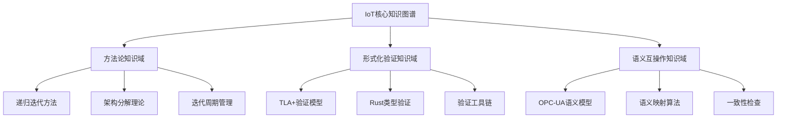
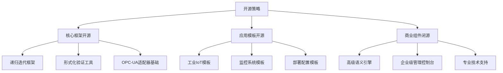
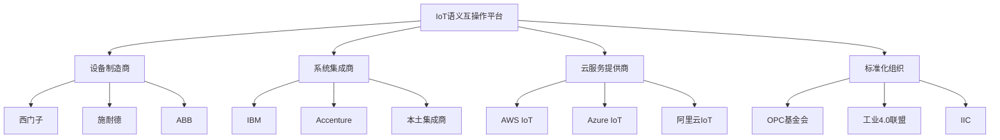

# IoT项目聚焦实施方案

## 1. 核心架构重构

### 1.1 精简后的技术栈

```rust
// 核心微服务架构实现
pub struct IoTSemanticGateway {
    // 核心组件
    opcua_adapter: OpcUaAdapter,
    semantic_engine: SemanticMappingEngine,
    microservice_orchestrator: MicroserviceOrchestrator,
    
    // 形式化验证
    tla_verifier: TLAVerifier,
    type_checker: RustTypeChecker,
    
    // 递归迭代框架
    iteration_manager: RecursiveIterationManager,
}

// OPC-UA适配器 - 聚焦核心标准
pub struct OpcUaAdapter {
    session_manager: SessionManager,
    address_space: AddressSpace,
    semantic_mapper: OpcUaSemanticMapper,
}

// 语义映射引擎
pub struct SemanticMappingEngine {
    ontology_manager: OntologyManager,
    mapping_rules: MappingRulesEngine,
    consistency_checker: ConsistencyChecker,
}
```

### 1.2 递归迭代实现框架

```rust
// 递归迭代开发框架
#[derive(Debug, Clone)]
pub struct RecursiveIterationFramework {
    layers: Vec<ArchitectureLayer>,
    current_iteration: IterationState,
    verification_results: VerificationResults,
}

#[derive(Debug, Clone)]
pub enum ArchitectureLayer {
    L1_Industry,    // 行业架构层
    L2_Enterprise,  // 企业架构层  
    L3_System,      // 系统架构层
    L4_Subsystem,   // 子系统架构层
    L5_Module,      // 模块设计层
}

impl RecursiveIterationFramework {
    pub fn execute_iteration_cycle(&mut self, layer: ArchitectureLayer) -> Result<IterationResult, IterationError> {
        // 六阶段迭代周期实现
        let analysis = self.analyze_phase(layer)?;
        let design = self.design_phase(analysis)?;
        let implementation = self.implement_phase(design)?;
        let integration = self.integrate_phase(implementation)?;
        let review = self.review_phase(integration)?;
        let planning = self.plan_next_phase(review)?;
        
        Ok(IterationResult {
            layer,
            artifacts: implementation.artifacts,
            verification: review.verification_results,
            next_planning: planning,
        })
    }
}
```

## 2. 第一阶段核心任务 (3-6个月)

### 2.1 理论基础精简强化

#### 2.1.1 核心理论文档重构

| 优先级 | 文档名称 | 重构目标 | 完成时间 |
|-------|---------|---------|---------|
| P0 | 递归迭代开发方法论.md | 完善方法论，增加实施案例 | 2周 |
| P0 | 微服务架构形式化定义.md | 简化理论，增强实用性 | 2周 |
| P0 | OPC-UA语义互操作核心.md | 聚焦工业场景，深化实现 | 3周 |
| P1 | 形式化验证实施指南.md | 标准化验证流程 | 2周 |
| P1 | 工业IoT应用框架.md | 具体应用场景和实现 | 3周 |

#### 2.1.2 知识图谱简化



### 2.2 核心实现建设

#### 2.2.1 微服务架构实现

```rust
// 项目结构重构
src/
├── core/                          # 核心模块
│   ├── microservice/             # 微服务架构实现
│   │   ├── service_definition.rs
│   │   ├── service_discovery.rs
│   │   ├── communication.rs
│   │   └── orchestration.rs
│   ├── formal_verification/      # 形式化验证
│   │   ├── tla_models/
│   │   ├── rust_verification.rs
│   │   └── verification_engine.rs
│   └── recursive_iteration/      # 递归迭代框架
│       ├── layer_management.rs
│       ├── iteration_cycle.rs
│       └── artifact_generation.rs
├── adapters/                      # 适配器层
│   └── opcua/                    # OPC-UA适配器
│       ├── session_manager.rs
│       ├── address_space.rs
│       └── semantic_mapping.rs
├── semantic/                      # 语义处理
│   ├── ontology_manager.rs
│   ├── mapping_engine.rs
│   └── consistency_checker.rs
└── applications/                  # 应用层
    └── industrial_iot/           # 工业IoT应用
        ├── device_management.rs
        ├── data_collection.rs
        └── monitoring_dashboard.rs
```

#### 2.2.2 端到端验证案例

**工业设备监控系统**：

```rust
// 端到端验证案例：工业设备监控
#[tokio::test]
async fn test_industrial_monitoring_e2e() -> Result<(), Box<dyn std::error::Error>> {
    // 1. 初始化语义网关
    let mut gateway = IoTSemanticGateway::new().await?;
    
    // 2. 连接OPC-UA设备
    let device_endpoint = "opc.tcp://localhost:4840";
    let device_connection = gateway.connect_opcua_device(device_endpoint).await?;
    
    // 3. 语义映射配置
    let mapping_config = SemanticMappingConfig {
        source_ontology: "opcua://industrial-device",
        target_ontology: "iot://monitoring-system",
        mapping_rules: load_default_industrial_mappings(),
    };
    
    // 4. 启动监控微服务
    let monitoring_service = gateway.start_monitoring_service(mapping_config).await?;
    
    // 5. 形式化验证
    let verification_result = gateway.verify_system_properties().await?;
    assert!(verification_result.safety_properties_satisfied);
    assert!(verification_result.liveness_properties_satisfied);
    
    // 6. 数据收集和处理
    let sensor_data = gateway.collect_sensor_data(Duration::from_secs(10)).await?;
    let processed_data = gateway.process_semantic_data(sensor_data).await?;
    
    // 7. 验证语义一致性
    let consistency_check = gateway.verify_semantic_consistency(&processed_data).await?;
    assert!(consistency_check.is_consistent);
    
    Ok(())
}
```

### 2.3 质量保证体系优化

#### 2.3.1 简化的质量指标

| 质量维度 | 核心指标 | 目标值 | 测量方法 |
|---------|---------|-------|---------|
| 理论严谨性 | 形式化定义完整性 | 95% | TLA+验证通过率 |
| 工程质量 | 代码覆盖率 | 85% | 自动化测试 |
| 性能指标 | 语义转换延迟 | <100ms | 基准测试 |
| 可用性 | 系统可用性 | 99.5% | 监控统计 |
| 兼容性 | OPC-UA标准符合度 | 100% | 标准测试套件 |

#### 2.3.2 自动化工具链

```yaml
CI/CD流程:
  代码质量检查:
    - cargo clippy (Rust静态分析)
    - cargo test (单元测试)
    - cargo bench (性能测试)
  
  形式化验证:
    - TLA+ 模型检查
    - Rust类型系统验证
    - 属性测试验证
  
  集成测试:
    - OPC-UA兼容性测试
    - 端到端功能测试
    - 性能基准测试
  
  部署验证:
    - Docker容器化
    - Kubernetes部署测试
    - 生产环境验证
```

## 3. 第二阶段：核心能力验证 (6-12个月)

### 3.1 工业IoT应用深化

#### 3.1.1 典型应用场景实现

**场景1：智能制造设备监控**:

```rust
// 智能制造监控系统
pub struct SmartManufacturingSystem {
    production_lines: Vec<ProductionLine>,
    quality_control: QualityControlSystem,
    predictive_maintenance: PredictiveMaintenanceEngine,
    semantic_gateway: IoTSemanticGateway,
}

impl SmartManufacturingSystem {
    pub async fn monitor_production_line(&self, line_id: LineId) -> Result<ProductionMetrics, MonitoringError> {
        // 1. 从OPC-UA设备收集数据
        let raw_data = self.semantic_gateway
            .collect_opcua_data(line_id)
            .await?;
        
        // 2. 语义映射和标准化
        let semantic_data = self.semantic_gateway
            .apply_semantic_mapping(raw_data)
            .await?;
        
        // 3. 实时分析和预警
        let analysis_result = self.quality_control
            .analyze_real_time(semantic_data)
            .await?;
        
        // 4. 预测性维护决策
        let maintenance_plan = self.predictive_maintenance
            .generate_plan(analysis_result)
            .await?;
        
        Ok(ProductionMetrics {
            efficiency: analysis_result.efficiency,
            quality_score: analysis_result.quality,
            maintenance_recommendations: maintenance_plan,
        })
    }
}
```

**场景2：多厂区数据协同**:

```rust
// 多厂区协同系统
pub struct MultiSiteCoordinationSystem {
    sites: HashMap<SiteId, IndustrialSite>,
    coordination_engine: CoordinationEngine,
    semantic_harmonizer: SemanticHarmonizer,
}

impl MultiSiteCoordinationSystem {
    pub async fn coordinate_production(&self, production_order: ProductionOrder) -> Result<CoordinationPlan, CoordinationError> {
        let mut site_capabilities = HashMap::new();
        
        // 1. 收集各厂区能力信息
        for (site_id, site) in &self.sites {
            let capabilities = site.get_current_capabilities().await?;
            let semantic_capabilities = self.semantic_harmonizer
                .harmonize_capabilities(capabilities)
                .await?;
            site_capabilities.insert(*site_id, semantic_capabilities);
        }
        
        // 2. 语义一致性验证
        let consistency_result = self.semantic_harmonizer
            .verify_cross_site_consistency(&site_capabilities)
            .await?;
        
        if !consistency_result.is_consistent {
            return Err(CoordinationError::SemanticInconsistency(consistency_result.conflicts));
        }
        
        // 3. 优化生产分配
        let allocation_plan = self.coordination_engine
            .optimize_allocation(production_order, site_capabilities)
            .await?;
        
        Ok(allocation_plan)
    }
}
```

#### 3.1.2 性能基准建立

```rust
// 性能基准测试套件
#[cfg(test)]
mod performance_benchmarks {
    use criterion::{black_box, criterion_group, criterion_main, Criterion};
    
    fn benchmark_semantic_mapping(c: &mut Criterion) {
        let gateway = IoTSemanticGateway::new_for_testing();
        let test_data = generate_opcua_test_data(1000); // 1000个数据点
        
        c.bench_function("semantic_mapping_1k_points", |b| {
            b.iter(|| {
                black_box(gateway.apply_semantic_mapping(black_box(&test_data)))
            })
        });
    }
    
    fn benchmark_formal_verification(c: &mut Criterion) {
        let verifier = TLAVerifier::new_for_testing();
        let model = load_microservice_tla_model();
        
        c.bench_function("tla_verification", |b| {
            b.iter(|| {
                black_box(verifier.verify_model(black_box(&model)))
            })
        });
    }
    
    criterion_group!(benches, benchmark_semantic_mapping, benchmark_formal_verification);
    criterion_main!(benches);
}
```

### 3.2 标准化与认证

#### 3.2.1 OPC-UA兼容性认证

```rust
// OPC-UA标准符合性测试
#[cfg(test)]
mod opcua_compliance_tests {
    use super::*;
    
    #[tokio::test]
    async fn test_opcua_information_model_compliance() {
        let adapter = OpcUaAdapter::new();
        
        // 测试信息模型符合性
        let information_model = adapter.get_information_model().await.unwrap();
        assert!(information_model.complies_with_standard("OPC-UA-1.05"));
        
        // 测试地址空间结构
        let address_space = adapter.get_address_space().await.unwrap();
        assert!(address_space.validate_structure().is_ok());
        
        // 测试服务接口
        let services = adapter.get_available_services().await.unwrap();
        assert!(services.contains(&ServiceType::Read));
        assert!(services.contains(&ServiceType::Write));
        assert!(services.contains(&ServiceType::Subscribe));
    }
    
    #[tokio::test]
    async fn test_semantic_mapping_accuracy() {
        let mapper = OpcUaSemanticMapper::new();
        let test_cases = load_opcua_semantic_test_cases();
        
        for test_case in test_cases {
            let mapping_result = mapper.map_to_standard_ontology(&test_case.input).await.unwrap();
            assert_eq!(mapping_result.semantic_type, test_case.expected_type);
            assert!(mapping_result.confidence > 0.95);
        }
    }
}
```

#### 3.2.2 第三方验证

```yaml
验证计划:
  学术验证:
    - 提交国际会议论文 (IEEE IoT, ACM IoT等)
    - 邀请同行专家评审
    - 开源代码供学术界验证
  
  工业验证:
    - 与设备制造商合作测试
    - 工业4.0联盟技术验证
    - OPC基金会兼容性认证
  
  标准化贡献:
    - 参与OPC-UA工作组
    - 提交改进建议
    - 贡献参考实现
```

## 4. 第三阶段：生态建设与推广 (1-2年)

### 4.1 开源社区建设

#### 4.1.1 分层开源策略



#### 4.1.2 社区治理结构

```yaml
社区组织:
  技术指导委员会:
    - 核心贡献者
    - 行业专家
    - 学术代表
  
  工作组:
    - 核心框架工作组
    - 标准集成工作组
    - 应用场景工作组
    - 文档工作组
  
  贡献机制:
    - GitHub Issues和PR流程
    - RFC (Request for Comments) 流程
    - 定期技术会议
    - 年度开发者大会
```

### 4.2 产业化路径

#### 4.2.1 商业模式设计

| 收入模式 | 目标客户 | 价值主张 | 实施时间 |
|---------|---------|---------|---------|
| 技术授权 | 软件厂商 | 递归迭代方法论授权 | 第2年 |
| 专业服务 | 工业企业 | 系统集成和咨询服务 | 第1年 |
| SaaS服务 | 中小企业 | 云端语义互操作服务 | 第2年 |
| 认证培训 | 开发者 | 技术认证和培训课程 | 第2年 |

#### 4.2.2 合作伙伴生态



## 5. 实施保障措施

### 5.1 组织架构调整

```yaml
团队重组:
  核心研发团队 (8人):
    - 架构师 (2人): 负责方法论和架构设计
    - 形式化验证专家 (2人): TLA+和Rust验证
    - OPC-UA专家 (2人): 标准实现和适配
    - 全栈工程师 (2人): 端到端实现
  
  应用验证团队 (4人):
    - 工业IoT专家 (2人): 应用场景设计
    - 测试工程师 (2人): 质量保证和验证
  
  生态建设团队 (3人):
    - 开源社区经理 (1人): 社区建设
    - 技术布道师 (1人): 推广宣传
    - 商务拓展 (1人): 合作伙伴
```

### 5.2 资源配置优化

#### 5.2.1 技术资源

```yaml
开发环境:
  - 高性能开发服务器 (Rust编译优化)
  - TLA+验证集群 (模型检查加速)
  - OPC-UA测试环境 (多厂商设备模拟)
  - CI/CD基础设施 (自动化测试和部署)

软件工具:
  - TLA+ Toolbox Professional
  - OPC Expert (OPC-UA测试工具)
  - JetBrains全套IDE
  - Docker Enterprise

硬件设备:
  - 工业级OPC-UA设备 (用于兼容性测试)
  - 边缘计算设备 (Raspberry Pi, NVIDIA Jetson)
  - 网络测试设备 (模拟工业网络环境)
```

#### 5.2.2 知识资源

```yaml
知识管理简化:
  核心文档 (保留):
    - 递归迭代开发方法论
    - 微服务架构形式化定义
    - OPC-UA语义互操作指南
    - 工业IoT应用框架
    - 形式化验证实施手册
  
  简化文档 (合并):
    - 将多个上下文管理文档合并为一个
    - 将质量保证相关文档整合
    - 将项目管理文档标准化
  
  推迟文档 (第二阶段):
    - 完整哲学基础体系
    - 多标准集成理论
    - 全行业应用指南
```

### 5.3 风险控制措施

#### 5.3.1 技术风险

| 风险类型 | 风险描述 | 影响程度 | 缓解措施 |
|---------|---------|---------|---------|
| 标准演进 | OPC-UA标准更新影响兼容性 | 中 | 参与标准制定，保持同步更新 |
| 性能瓶颈 | 语义映射性能不达标 | 高 | 建立性能基准，持续优化 |
| 形式化复杂性 | TLA+模型过于复杂难以维护 | 中 | 分层建模，工具辅助 |
| 工程化困难 | 理论到实现转化困难 | 高 | 增加工程师比例，加强实践 |

#### 5.3.2 市场风险

| 风险类型 | 风险描述 | 影响程度 | 缓解措施 |
|---------|---------|---------|---------|
| 市场接受度 | 过度理论化产品市场接受度低 | 高 | 聚焦实用价值，客户验证 |
| 竞争压力 | 大厂商推出竞争产品 | 中 | 技术差异化，生态建设 |
| 商业模式 | 收入模式不够清晰 | 中 | 多样化探索，逐步验证 |

## 6. 成功标准与里程碑

### 6.1 第一阶段成功标准 (3-6个月)

```yaml
技术指标:
  - 完成核心微服务架构实现 (功能完整度 80%)
  - TLA+验证覆盖率达到 90%
  - OPC-UA兼容性测试通过率 95%
  - 端到端延迟 < 100ms

工程指标:
  - 代码测试覆盖率 > 85%
  - 文档完整性 > 90%
  - 自动化部署成功率 > 95%
  - 性能基准建立完成

应用指标:
  - 完成 2个工业IoT应用案例
  - 至少 1个客户试点验证
  - 技术论文发表 1篇
```

### 6.2 第二阶段成功标准 (6-12个月)

```yaml
技术指标:
  - 系统可用性 > 99.5%
  - 语义映射准确率 > 95%
  - 支持设备类型 > 50种
  - 性能提升 2倍以上

市场指标:
  - 客户试点项目 > 5个
  - 开源社区贡献者 > 20人
  - 技术标准贡献 1项
  - 行业合作伙伴 > 3家

商业指标:
  - 技术授权合同 1-2个
  - 专业服务收入目标达成
  - 融资或商业化启动
```

### 6.3 第三阶段成功标准 (1-2年)

```yaml
生态指标:
  - 开源社区活跃贡献者 > 100人
  - 下游项目 > 20个
  - 技术认证用户 > 500人
  - 年度开发者大会举办

商业指标:
  - 年收入达到可持续发展水平
  - 市场份额在细分领域前三
  - 国际客户比例 > 30%
  - 技术专利申请 > 10项

影响力指标:
  - 成为行业参考标准
  - 推动相关国际标准制定
  - 在主要技术会议有定期分享
  - 学术界认可和引用
```

## 7. 总结

通过这个全面的梳理和聚焦方案，项目将：

1. **保持理论优势**：继续发挥递归迭代方法论和形式化验证的理论创新
2. **聚焦核心价值**：专注于OPC-UA语义互操作和工业IoT应用
3. **提升工程化程度**：加强实现完成度和端到端验证
4. **逐步验证完善**：通过三阶段实施逐步验证和完善理论体系

这种"保持深度、聚焦核心、强化工程、验证理论"的策略，既保留了项目的独特价值，又提高了成功的可能性。通过在工业IoT这个成熟领域的深耕，项目有望成为该领域的标杆，为后续扩展到其他领域奠定坚实基础。
