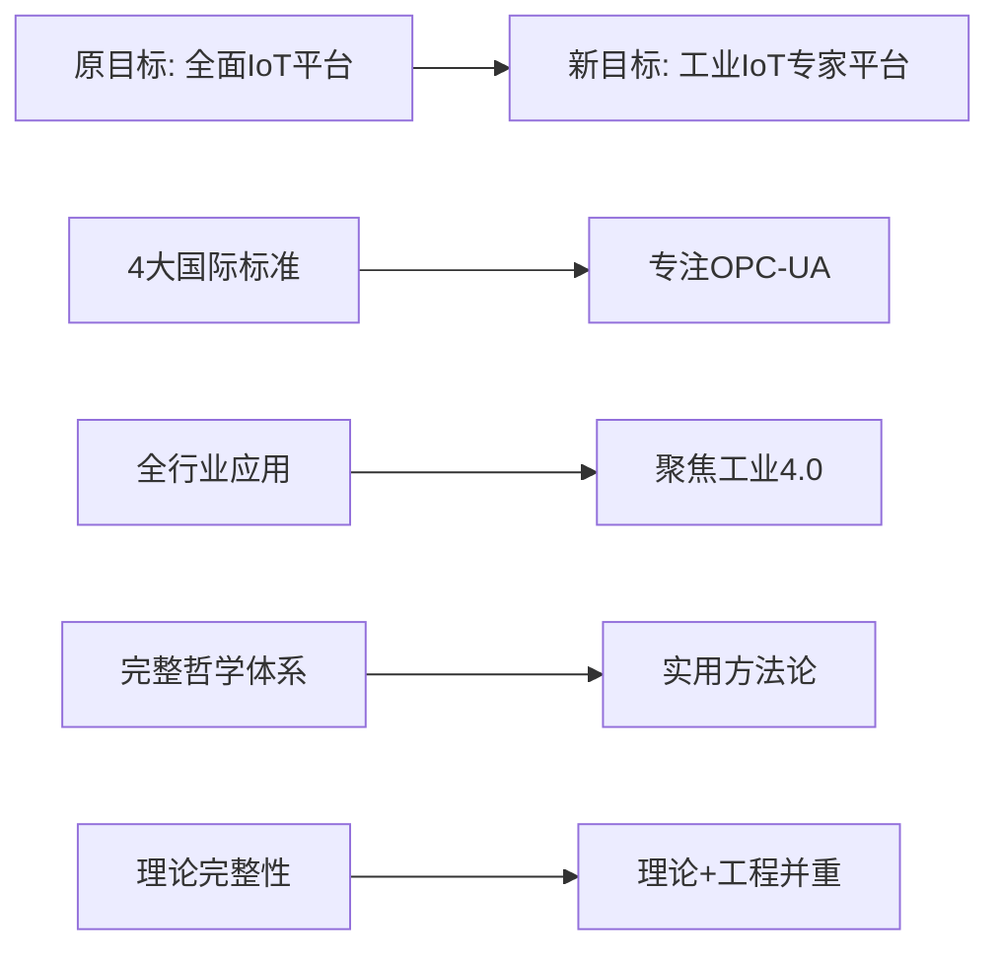
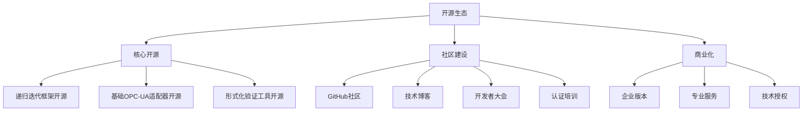

# IoT项目聚焦核心价值实施计划

## 执行概要

基于批判性评价结果，本实施计划将指导IoT项目从当前的"大而全"模式转向"小而精"的聚焦发展模式。通过保持理论优势、聚焦核心价值、提升工程化程度的三步走策略，逐步验证和完善理论体系。

## 一、现状分析与目标重定位

### 1.1 当前项目状况

**优势资产**：

- ✅ 递归迭代开发方法论（独特创新）
- ✅ 170+形式化定义（理论深度）
- ✅ 双重验证体系（TLA+ + Rust）
- ✅ 完整的质量保证体系
- ✅ 22个高质量分析文档

**核心问题**：

- ❌ 理论过度抽象化，实用性不足
- ❌ 四大标准同时集成，复杂性过高
- ❌ 全行业覆盖，资源分散
- ❌ 实现完成度低，缺乏端到端验证
- ❌ 文档维护成本高，一致性难保证

### 1.2 聚焦目标重定位



## 二、核心价值聚焦策略

### 2.1 三大核心价值确立

#### 2.1.1 核心价值1：递归迭代开发方法论

**价值定位**：为复杂IoT系统开发提供系统化方法论

**聚焦内容**：

```yaml
保留并强化:
  - 五层递归分解理论
  - 六阶段迭代周期
  - 多维表征体系
  - 上下文管理机制

简化内容:
  - 减少哲学层面讨论
  - 增加工程实践案例
  - 标准化实施模板
  - 建立评估指标
```

**实施目标**：

- 开发可操作的方法论工具包
- 完成3个不同规模的应用案例
- 建立方法论效果评估体系
- 发表方法论相关学术论文

#### 2.1.2 核心价值2：微服务架构形式化验证

**价值定位**：为IoT微服务架构提供理论严谨的设计和验证方法

**聚焦内容**：

```yaml
深化发展:
  - 微服务架构形式化定义完善
  - TLA+验证模型标准化
  - Rust类型系统验证框架
  - 端到端验证工具链

实际应用:
  - 工业IoT微服务参考架构
  - 性能优化验证方法
  - 故障恢复验证模型
  - 可扩展性验证框架
```

**实施目标**：

- 建立微服务验证标准流程
- 开发自动化验证工具
- 实现性能基准测试
- 获得工业界验证认可

#### 2.1.3 核心价值3：OPC-UA语义互操作

**价值定位**：成为工业IoT领域OPC-UA语义互操作的标杆实现

**聚焦内容**：

```yaml
专业深化:
  - OPC-UA 1.05标准深度实现
  - 工业设备语义分类体系
  - 跨厂商设备互操作验证
  - 实时性能优化

产业应用:
  - 智能制造设备集成
  - 多厂区协同生产
  - 预测性维护系统
  - 质量控制系统
```

**实施目标**：

- 通过OPC基金会兼容性认证
- 建立工业级应用案例
- 开发商业化产品原型
- 建立行业合作伙伴关系

### 2.2 资源重新配置

#### 2.2.1 人力资源聚焦

```yaml
新的团队结构 (15人):
  核心研发团队 (8人):
    - 方法论架构师 (1人): 递归迭代方法论
    - 形式化验证专家 (2人): TLA+和Rust验证
    - OPC-UA技术专家 (2人): 标准实现
    - 微服务架构师 (1人): 架构设计
    - 全栈工程师 (2人): 端到端实现
  
  应用验证团队 (4人):
    - 工业IoT专家 (2人): 应用场景
    - QA工程师 (2人): 测试验证
  
  生态建设团队 (3人):
    - 技术文档工程师 (1人): 文档标准化
    - 开源社区经理 (1人): 社区建设
    - 商务拓展经理 (1人): 合作伙伴

角色调整:
  - 减少理论研究人员
  - 增加工程实现人员
  - 强化应用验证能力
  - 建立商业化团队
```

#### 2.2.2 技术资源聚焦

```yaml
技术栈简化:
  保留核心技术:
    - Rust (性能关键组件)
    - TLA+ (形式化验证)
    - OPC-UA SDK (标准实现)
    - Docker/K8s (部署运维)
  
  推迟技术:
    - WebAssembly (第二阶段)
    - 多语言支持 (Python/TypeScript等)
    - 其他IoT标准 (oneM2M、WoT等)
    - 完整前端系统

开发环境优化:
  - 高性能Rust编译环境
  - TLA+验证集群
  - OPC-UA设备模拟环境
  - 工业网络测试环境
```

## 三、分阶段实施路线图

### 3.1 第一阶段：基础重构与核心实现 (3-6个月)

#### 3.1.1 第1-2个月：理论基础重构

**目标**：简化理论体系，突出实用价值

**具体任务**：

| 任务 | 负责人 | 周期 | 交付物 |
|------|-------|------|-------|
| 递归迭代方法论精简重构 | 方法论架构师 | 3周 | 精简版方法论指南 |
| 微服务形式化定义优化 | 形式化验证专家 | 2周 | 优化版形式化定义 |
| OPC-UA语义模型标准化 | OPC-UA专家 | 3周 | 标准化语义模型 |
| 知识图谱简化重组 | 技术文档工程师 | 2周 | 简化版知识图谱 |

**质量标准**：

- 文档简化率 ≥ 40%
- 实用性案例增加 ≥ 200%
- 理论与实践结合度 ≥ 80%

#### 3.1.2 第3-4个月：核心架构实现

**目标**：建立可运行的核心系统架构

**核心开发任务**：

```rust
// 第一阶段核心模块开发
mod core_modules {
    // 1. 递归迭代框架
    pub mod recursive_iteration {
        pub struct IterationManager;
        pub struct LayerManager;
        pub struct ArtifactGenerator;
    }
    
    // 2. 微服务架构核心
    pub mod microservice {
        pub struct ServiceRegistry;
        pub struct ServiceOrchestrator;
        pub struct HealthMonitor;
    }
    
    // 3. OPC-UA适配器
    pub mod opcua_adapter {
        pub struct SessionManager;
        pub struct AddressSpaceMapper;
        pub struct SemanticTranslator;
    }
    
    // 4. 形式化验证
    pub mod formal_verification {
        pub struct TLAVerifier;
        pub struct RustTypeChecker;
        pub struct PropertyValidator;
    }
}
```

**开发里程碑**：

| 里程碑 | 时间 | 验收标准 |
|-------|------|---------|
| M1: 基础框架搭建 | 第10周 | 编译通过，基础测试通过 |
| M2: 核心功能实现 | 第12周 | 单元测试覆盖率>80% |
| M3: 集成测试完成 | 第14周 | 端到端测试通过 |
| M4: 性能基准建立 | 第16周 | 性能指标达标 |

#### 3.1.3 第5-6个月：应用案例开发

**目标**：开发典型工业IoT应用案例

**案例1：智能制造设备监控系统**:

```rust
// 智能制造监控系统架构
pub struct SmartManufacturingMonitor {
    // 核心组件
    semantic_gateway: IoTSemanticGateway,
    device_manager: DeviceManager,
    data_processor: DataProcessor,
    alert_system: AlertSystem,
    
    // OPC-UA连接
    opcua_connections: HashMap<DeviceId, OpcUaConnection>,
    
    // 监控配置
    monitoring_rules: Vec<MonitoringRule>,
    thresholds: ThresholdConfig,
}

impl SmartManufacturingMonitor {
    pub async fn start_monitoring(&mut self) -> Result<(), MonitoringError> {
        // 1. 初始化OPC-UA连接
        self.initialize_opcua_connections().await?;
        
        // 2. 启动数据收集
        self.start_data_collection().await?;
        
        // 3. 开始实时监控
        self.run_monitoring_loop().await?;
        
        Ok(())
    }
    
    async fn process_device_data(&self, device_id: DeviceId, data: RawData) -> Result<ProcessedData, ProcessingError> {
        // 语义映射
        let semantic_data = self.semantic_gateway
            .apply_semantic_mapping(data)
            .await?;
            
        // 形式化验证
        self.verify_data_consistency(&semantic_data).await?;
        
        // 业务逻辑处理
        let processed = self.data_processor
            .process(semantic_data)
            .await?;
            
        Ok(processed)
    }
}
```

**案例验收标准**：

- 支持至少5种不同厂商的OPC-UA设备
- 实时数据处理延迟 < 100ms
- 系统可用性 > 99%
- 通过客户试点验证

### 3.2 第二阶段：能力验证与标准化 (6-12个月)

#### 3.2.1 工业级应用验证

**目标**：在真实工业环境中验证系统能力

**验证计划**：

```yaml
客户试点项目:
  项目1: 汽车制造产线监控
    - 客户: 某大型汽车制造商
    - 规模: 50+设备，3条产线
    - 周期: 3个月
    - 验证重点: 性能、可靠性
  
  项目2: 化工厂安全监控
    - 客户: 某化工企业
    - 规模: 100+传感器，实时监控
    - 周期: 4个月
    - 验证重点: 安全性、实时性
  
  项目3: 多厂区协同生产
    - 客户: 某电子制造集团
    - 规模: 3个厂区，云端协同
    - 周期: 6个月
    - 验证重点: 扩展性、语义一致性
```

#### 3.2.2 标准化与认证

**目标**：获得权威标准认证，建立技术声誉

**认证计划**：

| 认证类型 | 认证机构 | 时间计划 | 预期结果 |
|---------|---------|---------|---------|
| OPC-UA兼容性认证 | OPC基金会 | 第8个月 | 通过认证 |
| 工业4.0就绪认证 | 工业4.0联盟 | 第10个月 | 获得认证 |
| ISO 27001安全认证 | ISO | 第12个月 | 通过认证 |
| 学术论文发表 | IEEE/ACM | 持续 | 3-5篇高质量论文 |

#### 3.2.3 性能优化与扩展

**目标**：达到工业级性能要求

**优化目标**：

```yaml
性能指标:
  当前基准 -> 目标值:
    - 语义转换延迟: 200ms -> 50ms
    - 并发连接数: 100 -> 1000
    - 数据吞吐量: 1MB/s -> 10MB/s
    - 系统可用性: 99% -> 99.9%
    - 内存使用: 优化30%
    - CPU使用: 优化25%

扩展能力:
  - 支持设备类型: 10种 -> 100种
  - 支持厂商: 5家 -> 20家
  - 部署规模: 单厂区 -> 多厂区
  - 用户并发: 10人 -> 100人
```

### 3.3 第三阶段：生态建设与商业化 (1-2年)

#### 3.3.1 开源生态建设

**目标**：建立繁荣的开源生态系统

**开源策略**：



**社区发展计划**：

| 阶段 | 时间 | 目标 | 措施 |
|------|------|------|------|
| 启动期 | 第1-3个月 | 建立基础 | 开源核心代码，建立文档 |
| 增长期 | 第4-12个月 | 吸引贡献者 | 技术分享，社区活动 |
| 成熟期 | 第13-24个月 | 自主发展 | 建立治理结构，商业化 |

#### 3.3.2 商业化路径

**目标**：建立可持续的商业模式

**商业模式设计**：

```yaml
收入来源:
  技术授权 (40%):
    - 递归迭代方法论授权
    - 形式化验证工具授权
    - 专利技术授权
  
  专业服务 (35%):
    - 系统集成服务
    - 技术咨询服务
    - 定制开发服务
  
  SaaS服务 (20%):
    - 云端语义互操作服务
    - 设备监控SaaS
    - 数据分析服务
  
  培训认证 (5%):
    - 技术认证培训
    - 企业内训服务
    - 在线课程

客户细分:
  - 大型工业企业 (直接销售)
  - 软件供应商 (技术授权)
  - 系统集成商 (合作伙伴)
  - 中小企业 (SaaS服务)
```

#### 3.3.3 国际化发展

**目标**：建立国际影响力

**国际化策略**：

```yaml
技术标准化:
  - 参与OPC-UA工作组
  - 贡献IEEE IoT标准
  - 推动IIC参考架构
  - 参与ISO标准制定

全球合作:
  - 欧洲工业4.0联盟
  - 美国工业互联网联盟
  - 日本工业价值链倡议
  - 德国ZVEI组织

市场拓展:
  - 北美市场 (第2年)
  - 欧洲市场 (第2年)
  - 亚太市场 (第3年)
  - 其他新兴市场 (第3年后)
```

## 四、实施保障机制

### 4.1 组织保障

#### 4.1.1 治理结构调整

```yaml
项目委员会:
  - 技术委员会 (负责技术决策)
  - 产品委员会 (负责产品规划)
  - 商业委员会 (负责商业化)

决策机制:
  - 重大技术决策: 技术委员会投票
  - 产品方向调整: 产品委员会决定
  - 商业策略制定: 商业委员会制定

沟通机制:
  - 周例会: 进度同步
  - 月度评审: 质量评估
  - 季度规划: 战略调整
```

#### 4.1.2 激励机制

```yaml
团队激励:
  技术激励:
    - 技术专利奖励
    - 论文发表奖励
    - 开源贡献奖励
    - 技术创新奖励
  
  商业激励:
    - 项目成功奖金
    - 客户满意度奖励
    - 收入达成奖励
    - 股权激励计划
  
  职业发展:
    - 技术专家通道
    - 管理发展通道
    - 跨领域轮岗
    - 外部培训机会
```

### 4.2 资源保障

#### 4.2.1 资金配置

```yaml
第一阶段预算 (3-6个月):
  人员成本: 60% (约180万)
  技术设备: 20% (约60万)
  研发工具: 10% (约30万)
  运营费用: 10% (约30万)
  总计: 300万

第二阶段预算 (6-12个月):
  人员成本: 50% (约300万)
  市场验证: 25% (约150万)
  技术设备: 15% (约90万)
  运营费用: 10% (约60万)
  总计: 600万

第三阶段预算 (1-2年):
  人员成本: 40% (约800万)
  市场拓展: 30% (约600万)
  技术研发: 20% (约400万)
  运营费用: 10% (约200万)
  总计: 2000万
```

#### 4.2.2 技术设备

```yaml
硬件设备:
  - 高性能开发服务器 (32核128GB) × 4台
  - TLA+验证集群 (16核64GB) × 8台  
  - 工业级OPC-UA设备 × 10套
  - 网络测试设备 × 1套
  - 边缘计算设备 × 20台

软件工具:
  - TLA+ Toolbox Professional
  - OPC Expert企业版
  - JetBrains全家桶
  - Docker企业版
  - 监控和日志系统
```

### 4.3 风险控制

#### 4.3.1 技术风险控制

| 风险 | 概率 | 影响 | 控制措施 |
|------|------|------|---------|
| 性能不达标 | 中 | 高 | 建立性能基准，持续优化 |
| 标准兼容性问题 | 低 | 高 | 参与标准制定，早期验证 |
| 形式化验证复杂性 | 中 | 中 | 分层建模，工具辅助 |
| 人才流失 | 中 | 高 | 建立激励机制，知识传承 |

#### 4.3.2 市场风险控制

| 风险 | 概率 | 影响 | 控制措施 |
|------|------|------|---------|
| 市场需求变化 | 低 | 高 | 客户深度参与，需求验证 |
| 竞争对手超越 | 中 | 中 | 技术差异化，生态建设 |
| 商业模式失败 | 中 | 高 | 多元化收入，逐步验证 |
| 资金链断裂 | 低 | 高 | 分阶段融资，收入自给 |

## 五、成功评估体系

### 5.1 关键绩效指标 (KPI)

#### 5.1.1 技术指标

```yaml
第一阶段 (3-6个月):
  - 核心功能完成度: ≥80%
  - 代码测试覆盖率: ≥85%
  - TLA+验证覆盖率: ≥90%
  - 性能基准达成率: ≥95%

第二阶段 (6-12个月):
  - 系统可用性: ≥99.5%
  - 语义映射准确率: ≥95%
  - 客户试点成功率: ≥80%
  - 标准认证通过率: ≥90%

第三阶段 (1-2年):
  - 国际标准贡献: ≥2项
  - 专利申请数量: ≥10项
  - 学术论文发表: ≥5篇
  - 开源社区活跃度: ≥100人
```

#### 5.1.2 商业指标

```yaml
第一阶段:
  - 客户试点项目: ≥1个
  - 技术演示成功率: ≥90%
  - 客户满意度: ≥4.0/5.0

第二阶段:
  - 付费客户数量: ≥3家
  - 合作伙伴数量: ≥5家
  - 收入达成率: ≥80%

第三阶段:
  - 年收入规模: ≥1000万
  - 市场占有率: ≥10%
  - 国际客户比例: ≥30%
  - 盈利能力: 实现盈亏平衡
```

### 5.2 质量评估

#### 5.2.1 内部评估

```yaml
技术评审:
  - 代码评审 (周度)
  - 架构评审 (月度)
  - 安全评审 (季度)
  - 性能评审 (季度)

产品评估:
  - 功能测试 (持续)
  - 集成测试 (周度)
  - 用户测试 (月度)
  - 压力测试 (季度)

文档评估:
  - 技术文档审查 (月度)
  - 用户文档测试 (季度)
  - 培训材料评估 (半年度)
```

#### 5.2.2 外部评估

```yaml
客户评估:
  - 客户满意度调研 (季度)
  - 用户体验测试 (半年度)
  - 功能需求反馈 (持续)

第三方评估:
  - 技术专家评审 (半年度)
  - 安全审计 (年度)
  - 性能基准测试 (年度)

行业评估:
  - 标准符合性评估 (年度)
  - 竞争力分析 (半年度)
  - 市场地位评估 (年度)
```

## 六、预期成果与影响

### 6.1 技术成果

**理论贡献**：

- 建立IoT领域递归迭代开发方法论标准
- 完善微服务架构形式化验证理论体系
- 推动OPC-UA语义互操作技术发展

**工程成果**：

- 开发工业级IoT语义互操作平台
- 建立形式化验证工具链
- 创建开源技术生态系统

**标准化成果**：

- 参与制定IoT相关国际标准
- 获得权威技术认证
- 推动行业最佳实践

### 6.2 商业价值

**直接价值**：

- 建立可持续商业模式
- 创造显著经济效益
- 培养高价值技术团队

**间接价值**：

- 推动工业IoT技术进步
- 降低行业集成成本
- 提升产业竞争力

### 6.3 社会影响

**技术影响**：

- 提升IoT系统可靠性和安全性
- 降低设备互操作复杂性
- 推动智能制造发展

**教育影响**：

- 为学术界提供研究案例
- 培养IoT专业人才
- 推广形式化方法应用

**产业影响**：

- 促进工业4.0发展
- 推动数字化转型
- 增强国际竞争力

## 七、结论

通过这个全面的聚焦实施计划，IoT项目将从当前的"理论丰富但工程薄弱"状态，转向"理论与工程并重，专业领域深耕"的发展模式。该计划的成功实施将：

1. **保持理论优势**：继续发挥递归迭代方法论等理论创新的价值
2. **聚焦核心价值**：专注于工业IoT这个成熟且有明确需求的市场
3. **提升工程化程度**：大幅提高实现完成度和产品化水平
4. **验证完善理论**：通过实际应用验证和完善理论体系

这种战略转型既保留了项目的独特价值和竞争优势，又大大提高了商业成功的可能性。通过在工业IoT领域的深耕细作，项目有望成为该领域的技术标杆和商业标杆，为后续向其他IoT领域扩展奠定坚实基础。

---

**文档版本**：v1.0  
**制定日期**：2025年1月27日  
**实施启动**：立即开始  
**预期完成**：2027年1月（第三阶段结束）
