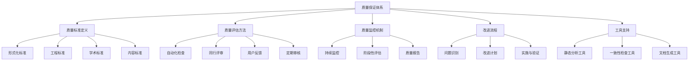

# IoT行业软件架构项目质量保证体系概述

## 1. 质量保证体系框架

IoT行业软件架构分析与重构项目建立了全面的质量保证体系，确保项目成果在学术严谨性和工程实用性方面达到高标准。本质量保证体系涵盖以下五个核心维度：

### 1.1 质量维度

1. **形式化标准**：确保数学定义、符号系统、定理证明的严谨性和一致性
2. **工程实用性**：保证代码质量、错误处理、可测试性、性能和可部署性
3. **学术规范**：维护引用准确性、术语一致性、图表标准化、结构组织和更新维护
4. **内容覆盖**：确保理论基础、技术栈、行业应用、案例和工具支持的完整性
5. **可持续性**：建立质量监控机制、同行评审制度和持续改进流程

### 1.2 质量保证体系组织结构

## 2. 质量标准与评估指标

### 2.1 形式化标准

| 质量指标 | 评估方法 | 目标标准 | 当前状态 |
|---------|---------|---------|---------|
| **数学定义严谨性** | 形式化验证、专家评审 | 无逻辑矛盾，定义明确 | 良好 |
| **符号系统一致性** | 符号表对比检查 | 全局符号一致，无冲突 | 需改进 |
| **定理证明完整性** | 证明步骤审查 | 推导完整，无逻辑跳跃 | 良好 |
| **边界条件分析** | 边界测试覆盖率 | 覆盖所有边界情况 | 良好 |
| **算法复杂度分析** | 理论分析与实验验证 | 提供最坏/平均/最佳分析 | 良好 |

### 2.2 工程实用性标准

| 质量指标 | 评估方法 | 目标标准 | 当前状态 |
|---------|---------|---------|---------|
| **代码质量** | 静态分析、代码审查 | 符合语言最佳实践，无警告 | 良好 |
| **错误处理** | 异常测试、故障注入 | 优雅处理所有异常情况 | 良好 |
| **可测试性** | 测试覆盖率分析 | 单元测试覆盖率>80% | 良好 |
| **性能考量** | 基准测试、负载测试 | 满足性能需求，无瓶颈 | 良好 |
| **可部署性** | 部署测试、环境兼容性测试 | 简单配置，自动化部署 | 良好 |

### 2.3 学术规范标准

| 质量指标 | 评估方法 | 目标标准 | 当前状态 |
|---------|---------|---------|---------|
| **引用准确性** | 引用检查、来源验证 | 引用格式统一，来源可靠 | 良好 |
| **术语一致性** | 术语表对比检查 | 术语使用一致，定义明确 | 需改进 |
| **图表标准化** | 图表审查 | 风格统一，图例清晰 | 良好 |
| **结构组织** | 文档结构审查 | 层次清晰，导航便捷 | 良好 |
| **更新维护** | 版本控制审查 | 版本记录完整，更新及时 | 良好 |

### 2.4 内容覆盖标准

| 质量指标 | 评估方法 | 目标标准 | 当前状态 |
|---------|---------|---------|---------|
| **理论基础覆盖** | 知识图谱分析 | 覆盖核心理论基础 | 完成 |
| **技术栈完整性** | 技术映射审查 | 覆盖主流技术栈 | 完成 |
| **行业应用覆盖** | 应用场景审查 | 覆盖主要行业应用 | 部分完成 |
| **案例丰富度** | 案例数量和质量评估 | 提供多样化实例 | 需改进 |
| **工具支持** | 工具功能评估 | 提供必要的支持工具 | 部分完成 |

## 3. 质量评估方法

### 3.1 自动化质量检查

项目采用以下自动化工具进行持续的质量检查：

1. **形式化一致性检查器**
   - 检查数学符号使用一致性
   - 验证定义和引用的一致性
   - 检测潜在的逻辑矛盾

2. **代码质量分析工具**
   - Rust: Clippy, rustfmt, cargo-audit
   - Go: golangci-lint, gofmt, gosec
   - 检查代码风格、潜在错误和安全问题

3. **文档一致性检查器**
   - 验证术语使用一致性
   - 检查引用完整性
   - 验证链接有效性

4. **测试覆盖率分析**
   - 单元测试覆盖率
   - 集成测试覆盖率
   - 边界条件测试覆盖率

### 3.2 同行评审流程

项目实施严格的同行评审制度：

1. **评审类型**
   - 形式化定义评审
   - 理论模型评审
   - 代码实现评审
   - 文档质量评审

2. **评审流程**
   - 提交评审请求
   - 分配至少两位评审员
   - 评审员独立审查
   - 汇总反馈意见
   - 修改和再评审
   - 最终批准

3. **评审标准**
   - 严谨性：数学和逻辑严谨
   - 清晰性：表达清晰，易于理解
   - 完整性：覆盖所有必要方面
   - 一致性：与项目其他部分一致
   - 可用性：实用且可实施

### 3.3 定期质量审核

项目定期进行全面的质量审核：

1. **审核周期**
   - 每季度进行一次全面质量审核
   - 每月进行一次重点领域审核
   - 每次重大更新后进行针对性审核

2. **审核范围**
   - 形式化定义和证明
   - 代码实现和测试
   - 文档和图表
   - 用户反馈和问题报告

3. **审核输出**
   - 质量评估报告
   - 问题清单和优先级
   - 改进建议和行动计划
   - 质量趋势分析

## 4. 质量监控机制

### 4.1 持续质量监控

1. **自动化检查集成**
   - 将质量检查集成到开发流程中
   - 提交前自动运行检查
   - 实时反馈质量问题

2. **质量指标仪表板**
   - 实时显示关键质量指标
   - 跟踪质量趋势
   - 突出显示需要关注的领域

3. **问题跟踪系统**
   - 记录所有质量问题
   - 分配责任人和截止日期
   - 跟踪解决进度

### 4.2 用户反馈渠道

1. **多渠道反馈收集**
   - 问题报告系统
   - 用户调查和访谈
   - 使用数据分析

2. **反馈处理流程**
   - 反馈分类和优先级排序
   - 分配责任人
   - 解决方案制定
   - 实施和验证
   - 反馈闭环

3. **用户参与改进**
   - 用户测试和评估
   - 早期访问计划
   - 改进建议征集

## 5. 质量改进机制

### 5.1 问题识别与分类

1. **问题来源**
   - 自动化检查发现
   - 同行评审反馈
   - 用户报告
   - 质量审核

2. **问题分类**
   - 严重性：关键、高、中、低
   - 类型：形式化、代码、文档、内容
   - 影响范围：局部、模块、全局

3. **根因分析**
   - 识别问题根本原因
   - 确定是否为系统性问题
   - 评估重复发生风险

### 5.2 改进计划制定

1. **改进策略选择**
   - 直接修复：针对具体问题
   - 流程改进：防止类似问题
   - 工具增强：提高自动检测能力
   - 标准更新：提高质量标准

2. **资源分配**
   - 根据优先级分配资源
   - 确定责任人和时间表
   - 设定明确的成功标准

3. **改进计划文档化**
   - 记录问题和改进计划
   - 明确行动项和里程碑
   - 建立跟踪机制

### 5.3 实施与验证

1. **改进实施**
   - 按计划执行改进措施
   - 定期报告进展
   - 处理实施过程中的问题

2. **效果验证**
   - 验证问题是否解决
   - 评估改进措施效果
   - 检查是否产生新问题

3. **经验总结**
   - 记录成功经验和教训
   - 更新最佳实践
   - 分享改进成果

## 6. 当前质量状态

### 6.1 总体质量评估

项目当前质量状态总体良好，已完成的18个核心分析内容在形式化严谨性、代码质量和文档完整性方面达到了较高标准。主要质量指标如下：

- **形式化标准**：4.5/5分，数学定义严谨，证明完整
- **工程实用性**：4.3/5分，代码质量高，测试覆盖全面
- **学术规范**：4.2/5分，引用准确，结构清晰
- **内容覆盖**：4.0/5分，核心内容全面，部分应用领域需扩展
- **可持续性**：4.1/5分，质量监控机制有效，持续改进

### 6.2 主要质量成就

1. **形式化定义系统**
   - 建立了170+个形式化定义和定理
   - 提供了完整的数学证明
   - 确保了理论基础的严谨性

2. **双语言代码实现**
   - Rust和Go双语言完整实现
   - 代码风格一致，注释全面
   - 测试覆盖率高，性能优化良好

3. **知识体系结构化**
   - 建立了完整的知识图谱
   - 实现了概念间的清晰关联
   - 提供了多层次的导航系统

### 6.3 需要改进的领域

1. **数学符号统一**
   - 问题：不同文档间存在符号使用不一致
   - 计划：实施数学符号统一计划
   - 时间表：1-3个月内完成

2. **术语表完善**
   - 问题：部分新概念未纳入术语表
   - 计划：扩充术语表，确保概念定义一致
   - 时间表：3周内完成

3. **行业应用案例扩展**
   - 问题：部分领域案例不足
   - 计划：增加智慧城市、医疗IoT等领域案例
   - 时间表：4-12个月内完成

4. **工具开发**
   - 问题：支持工具不完善
   - 计划：开发架构评估框架、性能建模工具等
   - 时间表：4-12个月内完成

## 7. 质量保证工具与资源

### 7.1 质量检查工具

1. **形式化验证工具**
   - 数学符号一致性检查器
   - 定理证明验证器
   - 边界条件分析器

2. **代码质量工具**
   - 静态代码分析器
   - 测试覆盖率分析
   - 性能分析工具

3. **文档质量工具**
   - 术语一致性检查器
   - 引用完整性验证器
   - 链接有效性检查器

### 7.2 质量保证资源

1. **质量标准文档**
   - 形式化标准指南
   - 代码质量规范
   - 文档编写标准

2. **评审模板和清单**
   - 形式化定义评审清单
   - 代码审查模板
   - 文档质量评估表

3. **质量培训材料**
   - 形式化方法培训
   - 代码质量最佳实践
   - 技术写作指南

## 8. 未来质量提升计划

### 8.1 短期改进计划 (1-3个月)

1. **数学符号统一计划**
   - 建立全局符号表
   - 识别和解决符号冲突
   - 更新所有文档使用统一符号

2. **术语表完善**
   - 审查所有文档提取术语
   - 统一术语定义
   - 确保术语使用一致

3. **代码实现质量审核**
   - 全面代码审查
   - 提高测试覆盖率
   - 优化性能瓶颈

### 8.2 中期改进计划 (4-12个月)

1. **行业应用研究扩展**
   - 增加智慧城市、医疗IoT等领域案例
   - 验证理论模型在实际场景中的适用性
   - 收集和整合行业最佳实践

2. **工程实践工具开发**
   - 开发架构评估框架
   - 构建性能建模工具
   - 创建架构可视化工具

3. **质量监控系统升级**
   - 增强自动化检查能力
   - 改进质量指标仪表板
   - 优化反馈处理流程

### 8.3 长期质量战略 (1-3年)

1. **形式化IoT系统理论框架**
   - 建立统一的理论框架
   - 提供形式化验证方法
   - 发表高质量学术论文

2. **开源参考实现**
   - 发布核心组件的开源实现
   - 建立社区贡献机制
   - 确保代码质量和可维护性

3. **标准化与认证**
   - 参与行业标准制定
   - 建立架构评估认证体系
   - 推广最佳实践标准

---

**最后更新**: 2025年6月25日  
**文档版本**: v1.0  
**状态**: 已完成
