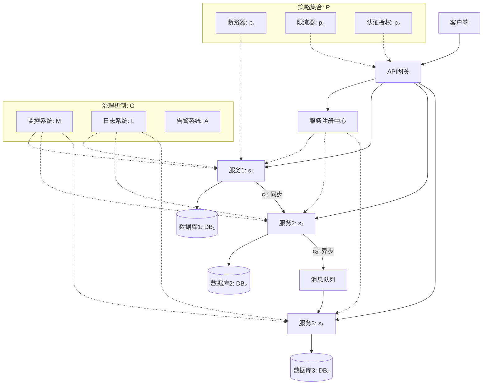

# 微服务架构形式化定义

```yaml
---
node_id: "CONCEPT-001-FORMAL"
version: "1.0"
created_date: "2025-06-28"
updated_date: "2025-06-28"
status: "active"
maturity: "emerging"
contributors: ["architect1", "knowledge_engineer1"]
tags: ["architecture", "microservices", "formal-definition", "mathematical-model"]
---
```

## 基本属性

- **定义**：微服务架构是一种将应用程序构建为独立可部署服务集合的架构风格，形式化定义为 $\mathcal{M} = (S, C, D, G, P, T)$，其中：
  - $S$ 是服务集合
  - $C$ 是通信机制集合
  - $D$ 是服务发现机制
  - $G$ 是治理机制
  - $P$ 是策略集合
  - $T$ 是状态转换函数集合
- **类别**：架构模式
- **层次**：服务层
- **标识符**：CONCEPT-001-FORMAL

## 关系属性

- **父概念**：
  - [微服务架构](CONCEPT-001) - extends
  - [分布式系统架构](CONCEPT-002) - is_part_of

- **子概念**：
  - [服务定义与边界](CONCEPT-003) - contains
  - [服务通信形式化模型](CONCEPT-004) - contains
  - [服务发现形式化模型](CONCEPT-005) - contains

- **关联概念**：
  - [形式化验证方法](CONCEPT-006) - uses
  - [分布式系统理论](CONCEPT-007) - depends_on
  - [状态转换系统](CONCEPT-008) - related_to

## 表征形式

### 数学模型

#### 1. 基本定义

```math
\mathcal{M} = (S, C, D, G, P, T)
```

其中：

- $S = \{s_1, s_2, ..., s_n\}$ 是服务集合，每个服务 $s_i$ 是一个独立的功能单元
- $C = \{c_1, c_2, ..., c_m\}$ 是通信机制集合，包括同步和异步通信方式
- $D: S \rightarrow 2^S$ 是服务发现函数，将服务映射到其可发现的服务集合
- $G = (M, L, A)$ 是治理机制，包括监控 $M$、日志 $L$ 和告警 $A$
- $P = \{p_1, p_2, ..., p_k\}$ 是策略集合，包括弹性、安全、扩展等策略
- $T: S \times E \rightarrow S$ 是状态转换函数集合，$E$ 是事件集合

#### 2. 服务定义

每个服务 $s_i \in S$ 定义为：

```math
s_i = (I_i, O_i, F_i, \Sigma_i, \delta_i, DB_i)
```

其中：

- $I_i$ 是输入接口集合
- $O_i$ 是输出接口集合
- $F_i: I_i \rightarrow O_i$ 是服务功能映射
- $\Sigma_i$ 是服务状态空间
- $\delta_i: \Sigma_i \times I_i \rightarrow \Sigma_i \times O_i$ 是状态转换函数
- $DB_i$ 是服务私有数据存储

#### 3. 通信机制

通信机制 $c_j \in C$ 定义为：

```math
c_j = (Proto_j, Msg_j, QoS_j)
```

其中：

- $Proto_j$ 是通信协议（如REST、gRPC、MQTT等）
- $Msg_j$ 是消息格式
- $QoS_j$ 是服务质量属性，包括可靠性、延迟、吞吐量等

##### 3.1 同步通信

对于同步通信 $c_{sync} \in C$：

```math
c_{sync}(s_i, s_j, m) = \{
  request: s_i \xrightarrow{m} s_j,
  response: s_j \xrightarrow{r} s_i
\}
```

其中 $m$ 是请求消息，$r$ 是响应消息。

##### 3.2 异步通信

对于异步通信 $c_{async} \in C$：

```math
c_{async}(s_i, s_j, e) = s_i \xrightarrow{e} Queue \xrightarrow{e} s_j
```

其中 $e$ 是事件消息，$Queue$ 是消息队列。

#### 4. 服务发现

服务发现机制 $D$ 定义为：

```math
D = (R, Q, H)
```

其中：

- $R: S \rightarrow Registry$ 是服务注册函数
- $Q: Query \rightarrow 2^S$ 是服务查询函数
- $H: S \rightarrow \{healthy, unhealthy\}$ 是健康检查函数

服务发现过程可表示为：

```math
\forall s_i \in S, \exists Q(criteria) = \{s_j \in S | match(s_j, criteria) \land H(s_j) = healthy\}
```

#### 5. 弹性模型

系统弹性定义为：

```math
Resilience(S, F) = \frac{|S_{available}|}{|S|} \times \frac{|F_{handled}|}{|F|}
```

其中：

- $S_{available}$ 是可用服务集合
- $F$ 是故障集合
- $F_{handled}$ 是被成功处理的故障集合

#### 6. 扩展性模型

系统扩展性定义为：

```math
Scalability(S, L) = \frac{Performance(S_{scaled}, L)}{Performance(S, L)}
```

其中：

- $S_{scaled}$ 是扩展后的服务集合
- $L$ 是负载
- $Performance$ 是性能度量函数

### 图形表示



### 代码实现

#### Rust实现

```rust
/// 微服务架构的形式化模型
pub struct MicroserviceArchitecture<S, C, D, G, P, T> {
    services: Vec<S>,
    communication_mechanisms: Vec<C>,
    service_discovery: D,
    governance: G,
    policies: Vec<P>,
    state_transitions: T,
}

/// 服务定义
pub struct Service<I, O, F, State, DB> {
    id: String,
    input_interfaces: Vec<I>,
    output_interfaces: Vec<O>,
    functions: F,
    state: State,
    database: DB,
}

/// 通信机制
pub enum CommunicationMechanism {
    Synchronous {
        protocol: Protocol,
        message_format: MessageFormat,
        quality_of_service: QualityOfService,
    },
    Asynchronous {
        protocol: Protocol,
        message_format: MessageFormat,
        queue: MessageQueue,
        quality_of_service: QualityOfService,
    },
}

/// 服务发现
pub struct ServiceDiscovery {
    registry: ServiceRegistry,
    query_engine: QueryEngine,
    health_checker: HealthChecker,
}

impl ServiceDiscovery {
    /// 服务注册
    pub fn register(&mut self, service: &Service) -> Result<(), RegistrationError> {
        self.registry.register(service)
    }
    
    /// 服务发现
    pub fn discover(&self, criteria: &QueryCriteria) -> Vec<ServiceInstance> {
        let candidates = self.query_engine.query(criteria);
        candidates.into_iter()
            .filter(|s| self.health_checker.is_healthy(s))
            .collect()
    }
}
```

#### Go实现

```go
// MicroserviceArchitecture 微服务架构的形式化模型
type MicroserviceArchitecture struct {
    Services []Service
    CommunicationMechanisms []CommunicationMechanism
    ServiceDiscovery ServiceDiscovery
    Governance Governance
    Policies []Policy
    StateTransitions map[string]TransitionFunction
}

// Service 服务定义
type Service struct {
    ID string
    InputInterfaces []Interface
    OutputInterfaces []Interface
    Functions map[string]ServiceFunction
    State ServiceState
    Database Database
}

// CommunicationMechanism 通信机制
type CommunicationMechanism struct {
    Type string // "sync" or "async"
    Protocol Protocol
    MessageFormat MessageFormat
    QualityOfService QualityOfService
    Queue *MessageQueue // nil for sync communication
}

// ServiceDiscovery 服务发现
type ServiceDiscovery struct {
    Registry ServiceRegistry
    QueryEngine QueryEngine
    HealthChecker HealthChecker
}

// Register 服务注册
func (sd *ServiceDiscovery) Register(service *Service) error {
    return sd.Registry.Register(service)
}

// Discover 服务发现
func (sd *ServiceDiscovery) Discover(criteria QueryCriteria) []ServiceInstance {
    candidates := sd.QueryEngine.Query(criteria)
    healthyInstances := make([]ServiceInstance, 0)
    
    for _, instance := range candidates {
        if sd.HealthChecker.IsHealthy(instance) {
            healthyInstances = append(healthyInstances, instance)
        }
    }
    
    return healthyInstances
}
```

### 应用实例

#### 场景1：IoT设备管理平台

在IoT设备管理平台中，微服务架构形式化模型可用于：

1. 定义设备管理、设备监控、固件更新等服务及其边界
2. 形式化描述设备状态变化和事件传播
3. 验证系统在设备离线、网络分区等故障场景下的行为
4. 分析系统扩展性，预测大规模设备接入时的性能

形式化表示示例：

```math
DeviceStateChange: T(DeviceService, DeviceConnectedEvent) \rightarrow 
  c_{async}(DeviceService, MonitoringService, DeviceStateChangedEvent)
```

#### 场景2：边缘计算协同系统

在边缘计算场景中，形式化模型可用于：

1. 描述云端服务与边缘服务的交互关系
2. 形式化定义服务迁移策略和条件
3. 验证系统在网络不稳定情况下的数据一致性
4. 分析不同部署策略下的系统延迟和资源利用率

形式化表示示例：

```math
ServiceMigration: T(CloudService, HighLatencyEvent) \rightarrow 
  \exists s_i \in S_{edge} | Migrate(CloudService, s_i)
```

## 资源链接

### 详细文档

- [微服务架构详细规范](docs/architecture/microservice_specification.md)
- [形式化验证方法](docs/verification/formal_verification.md)
- [弹性设计模式](docs/patterns/resilience_patterns.md)

### 参考资料

- Newman, S. (2021). Building Microservices (2nd ed.). O'Reilly Media.
- Marian, J. (2023). Formal Methods in Distributed Systems. Springer.
- Lamport, L. (2002). Specifying Systems: The TLA+ Language and Tools for Hardware and Software Engineers. Addison-Wesley.

## 版本历史

| 版本 | 日期 | 变更说明 | 贡献者 |
|-----|------|---------|-------|
| 1.0 | 2025-06-28 | 初始版本 | architect1, knowledge_engineer1 |

---

**注**: 本文档扩展了基本微服务架构定义(CONCEPT-001)，提供了更详细的形式化数学模型，可用于系统验证、性能分析和架构评估。
