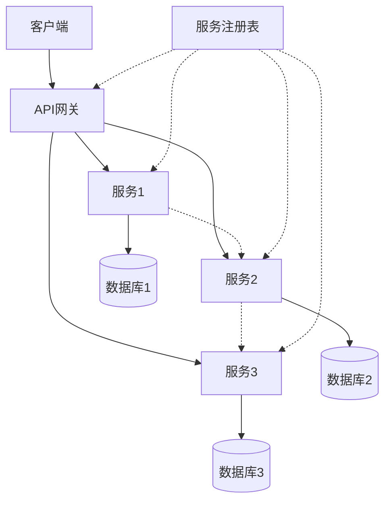

# 知识节点标准化模板

## 模板说明

本模板用于创建IoT行业软件架构知识图谱中的标准化知识节点。每个节点应遵循此结构，确保知识表示的一致性和完整性。

---

```yaml
---
node_id: "CONCEPT-001"
version: "1.0"
created_date: "2025-06-24"
updated_date: "2025-06-24"
status: "active"
maturity: "emerging|established|mature"
contributors: ["contributor1", "contributor2"]
tags: ["tag1", "tag2", "tag3"]
---
```

## [概念名称]

## 基本属性

- **定义**：[形式化定义，使用统一的数学符号系统]
- **类别**：[概念类别，如"架构模式"、"算法"、"协议"等]
- **层次**：[所属架构层，如"应用层"、"服务层"、"数据层"等]
- **标识符**：[唯一ID，格式为"CONCEPT-XXX"]

## 关系属性

- **父概念**：
  - [父概念1](链接) - [关系类型，如"is_part_of"]
  - [父概念2](链接) - [关系类型]

- **子概念**：
  - [子概念1](链接) - [关系类型，如"contains"]
  - [子概念2](链接) - [关系类型]

- **关联概念**：
  - [关联概念1](链接) - [关系类型，如"uses"、"depends_on"等]
  - [关联概念2](链接) - [关系类型]

## 表征形式

### 数学模型

```math
[使用LaTeX表示的数学模型]
例如：S = (C, R, P, I, O, T) 
其中：
- C 是组件集合
- R 是关系集合
- P 是属性集合
- I 是接口集合
- O 是操作集合
- T 是转换函数集合
```

### 图形表示

```mermaid
[使用Mermaid语法的图形表示]
例如：
graph TD
    A[组件A] --> B[组件B]
    A --> C[组件C]
    B --> D[组件D]
    C --> D
```

### 代码实现

#### Rust实现

```rust
/// [概念名称] 的Rust实现
/// 
/// 基于形式化定义: [引用形式化定义的关键部分]
pub struct ConceptName {
    // 字段定义
    field1: Type1,
    field2: Type2,
}

impl ConceptName {
    /// 创建新实例
    pub fn new(param1: Type1, param2: Type2) -> Self {
        Self {
            field1: param1,
            field2: param2,
        }
    }
    
    /// 核心方法
    pub fn core_operation(&self) -> Result<Output, Error> {
        // 实现
    }
}
```

#### Go实现

```go
// ConceptName 是[概念名称]的Go实现
// 基于形式化定义: [引用形式化定义的关键部分]
type ConceptName struct {
    Field1 Type1
    Field2 Type2
}

// NewConceptName 创建新实例
func NewConceptName(param1 Type1, param2 Type2) *ConceptName {
    return &ConceptName{
        Field1: param1,
        Field2: param2,
    }
}

// CoreOperation 核心方法
func (c *ConceptName) CoreOperation() (Output, error) {
    // 实现
}
```

### 应用实例

#### 场景1：[应用场景名称]

[描述如何在特定场景中应用此概念]

#### 场景2：[应用场景名称]

[描述如何在特定场景中应用此概念]

## 资源链接

### 详细文档

- [详细规范文档](链接)
- [设计文档](链接)
- [实现指南](链接)

### 参考资料

- [参考文献1](链接)
- [参考文献2](链接)
- [相关标准](链接)

## 版本历史

| 版本 | 日期 | 变更说明 | 贡献者 |
|-----|------|---------|-------|
| 1.0 | 2025-06-24 | 初始版本 | contributor1 |

---

## 使用说明

1. 复制此模板创建新的知识节点
2. 填写所有必填字段（基本属性、关系属性）
3. 根据概念特性选择性填写表征形式
4. 确保所有关系引用有效的知识节点
5. 添加适当的标签便于检索

## 模板示例：微服务架构

```yaml
---
node_id: "CONCEPT-001"
version: "1.0"
created_date: "2025-06-24"
updated_date: "2025-06-24"
status: "active"
maturity: "established"
contributors: ["architect1", "developer2"]
tags: ["architecture", "microservices", "distributed-systems"]
---
```

## 1. 微服务架构

### 1.1 基本属性

- **定义**：微服务架构是一种将应用程序构建为独立可部署服务集合的架构风格，形式化定义为 $\mathcal{M} = (S, C, D, G)$，其中：
  - $S$ 是服务集合
  - $C$ 是通信机制集合
  - $D$ 是服务发现机制
  - $G$ 是治理机制
- **类别**：架构模式
- **层次**：服务层
- **标识符**：CONCEPT-001

### 1.2. 关系属性

- **父概念**：
  - [分布式系统架构](链接) - is_part_of
  - [IoT服务架构](链接) - specializes

- **子概念**：
  - [服务发现机制](链接) - contains
  - [API网关模式](链接) - contains
  - [服务通信模式](链接) - contains

- **关联概念**：
  - [容器化部署](链接) - uses
  - [DevOps流程](链接) - depends_on
  - [服务网格](链接) - complements

#### 1.2.1    表征形式

#### 1.2.3 数学模型

```math
\mathcal{M} = (S, C, D, G)

其中：
- S = \{s_1, s_2, ..., s_n\} 是服务集合
- C = \{c_1, c_2, ..., c_m\} 是通信机制集合
- D: S \rightarrow 2^S 是服务发现函数
- G 是治理机制，包括监控、日志、追踪等
```

#### 1.2.4 图形表示



#### 1.2.5  代码实现

#### 1.2.6 Rust实现

```rust
/// 微服务架构的核心组件
pub struct MicroserviceArchitecture {
    services: Vec<Service>,
    service_registry: ServiceRegistry,
    api_gateway: ApiGateway,
    communication_mechanisms: Vec<CommunicationMechanism>,
}

impl MicroserviceArchitecture {
    /// 创建新的微服务架构
    pub fn new() -> Self {
        Self {
            services: Vec::new(),
            service_registry: ServiceRegistry::new(),
            api_gateway: ApiGateway::new(),
            communication_mechanisms: Vec::new(),
        }
    }
    
    /// 注册新服务
    pub fn register_service(&mut self, service: Service) -> Result<(), ServiceError> {
        self.service_registry.register(&service)?;
        self.services.push(service);
        Ok(())
    }
    
    /// 发现服务
    pub fn discover_service(&self, service_id: &str) -> Option<&Service> {
        self.service_registry.discover(service_id)
    }
}
```

#### 1.2.7 Go实现

```go
// MicroserviceArchitecture 微服务架构的核心组件
type MicroserviceArchitecture struct {
    Services []Service
    ServiceRegistry ServiceRegistry
    ApiGateway ApiGateway
    CommunicationMechanisms []CommunicationMechanism
}

// NewMicroserviceArchitecture 创建新的微服务架构
func NewMicroserviceArchitecture() *MicroserviceArchitecture {
    return &MicroserviceArchitecture{
        Services: make([]Service, 0),
        ServiceRegistry: NewServiceRegistry(),
        ApiGateway: NewApiGateway(),
        CommunicationMechanisms: make([]CommunicationMechanism, 0),
    }
}

// RegisterService 注册新服务
func (m *MicroserviceArchitecture) RegisterService(service Service) error {
    if err := m.ServiceRegistry.Register(service); err != nil {
        return err
    }
    m.Services = append(m.Services, service)
    return nil
}

// DiscoverService 发现服务
func (m *MicroserviceArchitecture) DiscoverService(serviceID string) (Service, bool) {
    return m.ServiceRegistry.Discover(serviceID)
}
```

### 1.3 应用实例

#### 1.3.1 场景1：IoT设备管理平台

在IoT设备管理平台中，微服务架构用于将设备注册、设备监控、固件更新等功能分解为独立服务，实现高可扩展性和弹性。服务发现机制确保设备可以动态发现并连接到适当的服务。

#### 场景2：智慧城市数据处理系统

在智慧城市场景中，微服务架构用于处理来自不同类型传感器的数据流，每个微服务专注于特定类型的数据处理，如交通数据、环境数据、能源数据等，通过API网关提供统一接口。

### 1.4 资源链接

#### 1.4.1 详细文档

- [微服务架构详细规范](链接)
- [微服务设计模式](链接)
- [微服务实现指南](链接)

#### 1.4.2 参考资料

- [Newman, Sam. Building Microservices](链接)
- [Richardson, Chris. Microservices Patterns](链接)
- [ISO/IEC 19944-1:2020](链接)

### 1.5 版本历史

| 版本 | 日期 | 变更说明 | 贡献者 |
|-----|------|---------|-------|
| 1.0 | 2025-06-24 | 初始版本 | architect1 |
