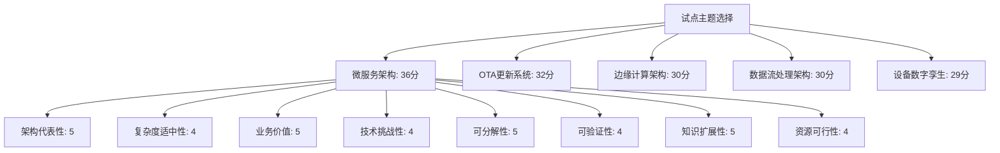

# IoT架构试点主题评估矩阵

## 评估目的

本评估矩阵用于系统性地评估和选择IoT架构递归迭代开发的试点主题。通过多维度分析，确保选择的试点主题既能代表整体架构的核心特性，又能在有限时间内取得可见成果，为后续迭代提供基础和经验。

## 评估维度

评估采用以下8个关键维度，每个维度按1-5分进行评分（1分最低，5分最高）：

1. **架构代表性**：该主题对整体IoT架构的代表程度
2. **复杂度适中性**：主题复杂度是否适合作为试点（既不过于简单也不过于复杂）
3. **业务价值**：主题对业务目标的贡献度
4. **技术挑战性**：主题是否包含有价值的技术挑战
5. **可分解性**：主题是否易于递归分解为多个层次
6. **可验证性**：成果是否容易验证和评估
7. **知识扩展性**：主题是否有助于扩展团队知识体系
8. **资源可行性**：在现有资源条件下完成的可行性

## 候选主题评估

### 1. 微服务架构

| 评估维度 | 评分 | 评分理由 |
|---------|------|---------|
| 架构代表性 | 5 | 微服务是现代IoT架构的核心组织方式，高度代表整体架构特性 |
| 复杂度适中性 | 4 | 概念清晰但实现细节丰富，适合递归分解 |
| 业务价值 | 5 | 直接影响系统可扩展性、弹性和开发效率 |
| 技术挑战性 | 4 | 包含服务边界、通信、数据一致性等多种技术挑战 |
| 可分解性 | 5 | 可自然分解为服务定义、通信模式、服务发现等多个层次 |
| 可验证性 | 4 | 可通过原型验证核心概念和设计决策 |
| 知识扩展性 | 5 | 涉及分布式系统、API设计等多个知识领域 |
| 资源可行性 | 4 | 可在一周内完成概念验证和基础设计 |
| **总分** | **36** | |

### 2. 边缘计算架构

| 评估维度 | 评分 | 评分理由 |
|---------|------|---------|
| 架构代表性 | 4 | 边缘计算是IoT系统的重要组成部分，但不是所有IoT系统都需要 |
| 复杂度适中性 | 3 | 涉及设备能力差异大，复杂度较高 |
| 业务价值 | 4 | 对低延迟场景和减轻云端负载有重要价值 |
| 技术挑战性 | 5 | 包含资源受限环境下的计算、同步、安全等挑战 |
| 可分解性 | 4 | 可分解为边缘设备管理、任务调度、数据同步等层次 |
| 可验证性 | 3 | 需要特定硬件环境进行完整验证 |
| 知识扩展性 | 4 | 涉及嵌入式系统、分布式计算等领域 |
| 资源可行性 | 3 | 验证需要额外硬件资源，时间周期较长 |
| **总分** | **30** | |

### 3. OTA更新系统

| 评估维度 | 评分 | 评分理由 |
|---------|------|---------|
| 架构代表性 | 3 | 是IoT系统的重要功能，但仅代表部分架构特性 |
| 复杂度适中性 | 4 | 概念明确，复杂度适中 |
| 业务价值 | 4 | 对设备生命周期管理至关重要 |
| 技术挑战性 | 4 | 包含版本管理、安全分发、失败恢复等挑战 |
| 可分解性 | 4 | 可分解为版本管理、分发机制、安装验证等层次 |
| 可验证性 | 5 | 容易构建测试环境并验证功能 |
| 知识扩展性 | 3 | 知识领域相对集中 |
| 资源可行性 | 5 | 可在现有资源条件下快速实现原型 |
| **总分** | **32** | |

### 4. 数据流处理架构

| 评估维度 | 评分 | 评分理由 |
|---------|------|---------|
| 架构代表性 | 4 | 数据处理是IoT系统的核心功能之一 |
| 复杂度适中性 | 3 | 涉及实时处理、批处理等多种模式，复杂度较高 |
| 业务价值 | 5 | 直接关系到IoT数据的价值挖掘 |
| 技术挑战性 | 5 | 包含高吞吐、低延迟、数据一致性等挑战 |
| 可分解性 | 4 | 可分解为数据采集、处理、存储、分析等层次 |
| 可验证性 | 3 | 需要较大数据量和场景才能充分验证 |
| 知识扩展性 | 4 | 涉及流处理、大数据等多个领域 |
| 资源可行性 | 2 | 需要较多计算资源和开发时间 |
| **总分** | **30** | |

### 5. 设备数字孪生

| 评估维度 | 评分 | 评分理由 |
|---------|------|---------|
| 架构代表性 | 4 | 数字孪生是现代IoT系统的重要概念 |
| 复杂度适中性 | 2 | 涉及复杂的建模和同步机制 |
| 业务价值 | 4 | 对设备监控、预测性维护等场景价值高 |
| 技术挑战性 | 5 | 包含实时同步、状态管理、模型演化等挑战 |
| 可分解性 | 4 | 可分解为模型定义、状态同步、行为模拟等层次 |
| 可验证性 | 3 | 验证完整功能需要较长周期 |
| 知识扩展性 | 5 | 涉及建模、仿真、状态管理等多领域 |
| 资源可行性 | 2 | 需要专业建模知识和较多开发资源 |
| **总分** | **29** | |

## 评分汇总与可视化

| 主题 | 总分 | 架构代表性 | 复杂度适中性 | 业务价值 | 技术挑战性 | 可分解性 | 可验证性 | 知识扩展性 | 资源可行性 |
|-----|------|-----------|------------|---------|-----------|---------|---------|-----------|-----------|
| 微服务架构 | 36 | 5 | 4 | 5 | 4 | 5 | 4 | 5 | 4 |
| OTA更新系统 | 32 | 3 | 4 | 4 | 4 | 4 | 5 | 3 | 5 |
| 边缘计算架构 | 30 | 4 | 3 | 4 | 5 | 4 | 3 | 4 | 3 |
| 数据流处理架构 | 30 | 4 | 3 | 5 | 5 | 4 | 3 | 4 | 2 |
| 设备数字孪生 | 29 | 4 | 2 | 4 | 5 | 4 | 3 | 5 | 2 |

## 推荐试点主题

基于评估结果，**微服务架构**是最适合的试点主题，因为它：

1. 获得了最高的总分（36分）
2. 在架构代表性、业务价值、可分解性和知识扩展性方面得分最高
3. 在资源可行性方面得分较高，表明可以在有限时间内取得成果
4. 作为IoT系统的基础架构，为后续其他主题的开发提供支撑

## 试点主题递归分解初步规划

选定微服务架构作为试点主题后，可按以下方式进行递归分解：

### L1: 微服务架构整体框架

- 形式化定义微服务架构的核心概念和原则
- 确定适用于IoT系统的微服务架构风格

### L2: 核心组成部分

- 服务定义与边界
- 服务通信模式
- 服务发现机制
- API网关
- 数据管理策略

### L3: 具体实现机制

- 服务定义标准
- 同步通信（REST、gRPC）
- 异步通信（消息队列、事件总线）
- 服务注册与发现实现
- API网关路由与聚合
- 分布式数据一致性

### L4: 技术实现细节

- 服务容器化
- 服务编排
- 健康检查与自愈
- 监控与日志
- 安全机制

### L5: 专业研究领域

- 微服务性能优化
- 弹性设计模式
- 混沌工程测试
- 高级服务网格

## 下一步行动

1. 确认微服务架构作为试点主题
2. 完成L1层形式化定义
3. 识别并定义L2层核心组成部分
4. 为每个L2组件创建知识节点
5. 建立微服务架构的上下文管理文件

---

**文档版本**：v1.0
**创建日期**：2025年6月26日
**状态**：评估完成，待确认
