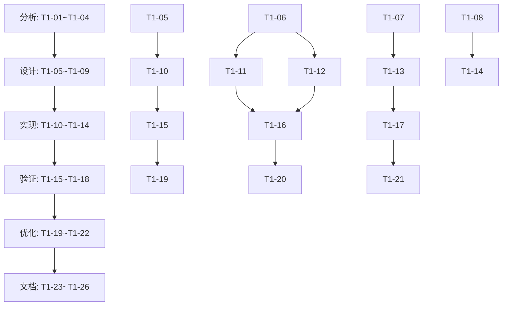
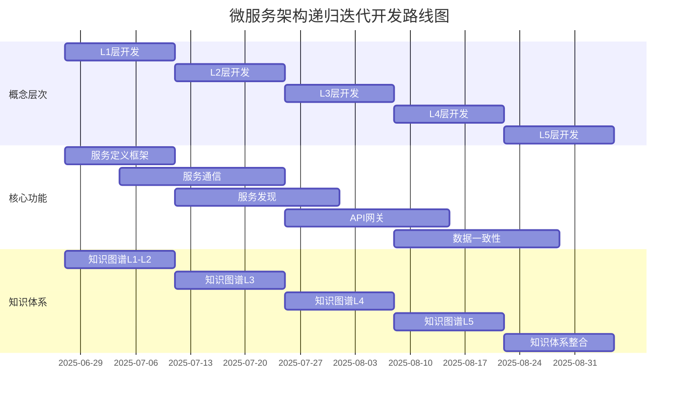

# 微服务架构递归迭代开发计划

## 文档元数据

```yaml
---
document_id: "PLAN-001"
title: "微服务架构递归迭代开发计划"
version: "1.0"
created_date: "2025-06-27"
updated_date: "2025-06-27"
status: "active"
owner: "架构师1"
contributors: ["开发者1", "知识工程师1"]
tags: ["微服务", "架构", "迭代计划", "IoT"]
---
```

## 1. 计划概述

本文档详细规划微服务架构作为试点主题的递归迭代开发过程。基于试点主题评估结果，微服务架构被选为首个递归迭代开发主题，将通过系统化的迭代过程，建立完整的微服务架构知识体系和实现方案。

### 1.1 目标与范围

**总体目标**：

- 建立IoT系统微服务架构的完整知识体系
- 形成可复用的微服务架构设计模式
- 实现关键组件的代码原型
- 验证微服务架构在IoT场景中的适用性

**范围界定**：

- 包含：微服务定义、通信、发现、网关、数据管理
- 不包含：具体业务逻辑实现、完整部署环境

### 1.2 迭代周期

采用2周一个迭代周期，每个迭代包含以下6个阶段：

1. **分析**（2天）：概念研究与形式化定义
2. **设计**（3天）：架构设计与模式确定
3. **实现**（4天）：核心组件代码实现
4. **验证**（2天）：概念验证与测试
5. **优化**（2天）：基于验证结果优化
6. **文档**（1天）：完善知识节点文档

## 2. 第一迭代周期（2周）

### 2.1 迭代目标

1. 完成微服务架构L1层（整体框架）的形式化定义
2. 完成L2层（核心组成部分）的概念分解和定义
3. 实现服务定义与服务通信的基础原型
4. 建立微服务架构知识图谱的基础结构

### 2.2 具体任务分解

#### 第1-2天：分析阶段

| 任务ID | 任务描述 | 负责人 | 预期成果 |
|-------|---------|-------|---------|
| T1-01 | 微服务架构核心概念研究 | 架构师1 | 概念清单与关键特性 |
| T1-02 | IoT场景下微服务特性分析 | 架构师1 | 特性分析报告 |
| T1-03 | 微服务架构形式化定义 | 知识工程师1 | 数学模型与形式化表达 |
| T1-04 | 微服务架构知识节点创建 | 知识工程师1 | L1层知识节点 |

#### 第3-5天：设计阶段

| 任务ID | 任务描述 | 负责人 | 预期成果 |
|-------|---------|-------|---------|
| T1-05 | 服务定义与边界设计 | 架构师1 | 服务定义标准 |
| T1-06 | 服务通信模式设计 | 开发者1 | 通信模式规范 |
| T1-07 | 服务发现机制设计 | 开发者1 | 服务发现架构 |
| T1-08 | API网关设计 | 架构师1 | API网关架构 |
| T1-09 | 数据管理策略设计 | 知识工程师1 | 数据管理模式 |

#### 第6-9天：实现阶段

| 任务ID | 任务描述 | 负责人 | 预期成果 |
|-------|---------|-------|---------|
| T1-10 | 服务定义框架实现 | 开发者1 | Rust服务框架代码 |
| T1-11 | REST通信实现 | 开发者1 | REST客户端与服务端 |
| T1-12 | 消息队列通信实现 | 开发者1 | 消息发布与订阅代码 |
| T1-13 | 简易服务注册实现 | 架构师1 | 服务注册与发现原型 |
| T1-14 | API网关基础实现 | 开发者1 | 基础路由功能 |

#### 第10-11天：验证阶段

| 任务ID | 任务描述 | 负责人 | 预期成果 |
|-------|---------|-------|---------|
| T1-15 | 服务定义与创建验证 | 开发者1 | 验证报告 |
| T1-16 | 服务通信验证 | 开发者1 | 通信测试报告 |
| T1-17 | 服务发现验证 | 架构师1 | 发现测试报告 |
| T1-18 | 端到端场景验证 | 架构师1 | 场景验证报告 |

#### 第12-13天：优化阶段

| 任务ID | 任务描述 | 负责人 | 预期成果 |
|-------|---------|-------|---------|
| T1-19 | 基于验证结果优化服务框架 | 开发者1 | 优化后代码 |
| T1-20 | 优化通信模式 | 开发者1 | 改进的通信代码 |
| T1-21 | 优化服务发现机制 | 架构师1 | 改进的发现机制 |
| T1-22 | 架构整体优化 | 架构师1 | 优化建议文档 |

#### 第14天：文档阶段

| 任务ID | 任务描述 | 负责人 | 预期成果 |
|-------|---------|-------|---------|
| T1-23 | 完善L1层知识节点 | 知识工程师1 | 更新的知识节点 |
| T1-24 | 创建L2层知识节点 | 知识工程师1 | L2层知识节点集 |
| T1-25 | 编写设计文档 | 架构师1 | 架构设计文档 |
| T1-26 | 编写实现指南 | 开发者1 | 实现指南文档 |

### 2.3 资源分配

| 角色 | 人员 | 主要职责 | 时间分配 |
|-----|------|---------|---------|
| 架构师 | 架构师1 | 架构设计、验证、优化 | 100% |
| 开发工程师 | 开发者1 | 代码实现、通信机制 | 100% |
| 知识工程师 | 知识工程师1 | 知识建模、文档 | 50% |

### 2.4 依赖关系



### 2.5 风险与缓解措施

| 风险ID | 风险描述 | 可能性 | 影响 | 缓解措施 |
|-------|---------|-------|-----|---------|
| R1-01 | 服务边界定义不清晰 | 中 | 高 | 采用领域驱动设计方法，明确界定上下文 |
| R1-02 | 通信机制选择不当 | 低 | 高 | 先进行小规模原型验证，再确定方案 |
| R1-03 | 知识节点间关系复杂 | 高 | 中 | 先建立核心关系，迭代完善 |
| R1-04 | 技术栈学习曲线陡峭 | 中 | 中 | 安排技术培训，从简单示例开始 |

## 3. 后续迭代规划

### 3.1 第二迭代周期预览

**目标**：

- 完成L3层（具体实现机制）的分解和定义
- 实现服务发现和API网关的完整功能
- 建立微服务间的数据一致性机制
- 扩展知识图谱的L2到L3层连接

**重点任务**：

- 服务注册与发现完整实现
- API网关高级功能（认证、限流）
- 分布式数据一致性模式实现
- 服务间通信安全机制

### 3.2 第三迭代周期预览

**目标**：

- 完成L4层（技术实现细节）的分解和定义
- 实现服务容器化和编排
- 建立监控与日志体系
- 完善微服务安全机制

**重点任务**：

- Docker容器化服务部署
- Kubernetes基础编排
- 分布式日志与监控
- 服务间认证与授权

### 3.3 长期迭代路线图



## 4. 评估与度量

### 4.1 成功标准

1. **知识完整性**
   - L1层形式化定义完整准确
   - L2层概念分解合理全面
   - 知识节点间关系清晰

2. **代码质量**
   - 通过所有单元测试
   - 符合代码规范
   - 具备基本文档

3. **功能验证**
   - 服务可正确定义和创建
   - 服务间通信可靠
   - 服务发现机制有效

### 4.2 评估指标

| 指标类别 | 指标名称 | 目标值 | 测量方法 |
|---------|---------|-------|---------|
| 知识质量 | 形式化定义完整度 | ≥90% | 专家评审 |
| 知识质量 | 概念关系准确度 | ≥85% | 关系验证测试 |
| 代码质量 | 测试覆盖率 | ≥80% | 自动化测试 |
| 代码质量 | 静态分析问题数 | ≤5个严重问题 | 静态分析工具 |
| 功能质量 | 服务通信成功率 | ≥99% | 压力测试 |
| 功能质量 | 服务发现准确率 | 100% | 功能测试 |
| 进度指标 | 任务完成率 | ≥90% | 任务追踪 |

### 4.3 评审机制

1. **每日站会**
   - 时间：每工作日上午9:30
   - 参与者：所有团队成员
   - 内容：进度更新、阻碍因素

2. **迭代评审会**
   - 时间：迭代结束后第一个工作日
   - 参与者：团队成员、利益相关者
   - 内容：成果展示、指标评估、反馈收集

3. **知识评审会**
   - 时间：文档阶段结束后
   - 参与者：知识工程师、架构师
   - 内容：知识节点质量、关系准确性

## 5. 协作与沟通

### 5.1 团队协作

1. **代码协作**
   - 使用Git进行版本控制
   - 采用分支策略：feature/bugfix/release
   - 代码提交前进行代码评审

2. **知识协作**
   - 知识节点变更需评审
   - 关系变更需验证
   - 定期同步知识图谱更新

### 5.2 沟通渠道

| 渠道 | 用途 | 频率 | 参与者 |
|-----|-----|-----|-------|
| 站会 | 日常同步 | 每日 | 全体成员 |
| 技术讨论会 | 解决技术问题 | 按需 | 相关技术人员 |
| 知识分享会 | 分享研究成果 | 每周一次 | 全体成员 |
| 文档评审 | 确保文档质量 | 文档完成后 | 相关人员 |

### 5.3 上下文管理

1. **上下文切换策略**
   - 每日工作结束前更新上下文文件
   - 任务切换时记录当前状态
   - 使用标准上下文模板

2. **上下文文件位置**
   - 微服务架构主上下文：`/docs/contexts/microservice_main.md`
   - 服务定义上下文：`/docs/contexts/service_definition.md`
   - 服务通信上下文：`/docs/contexts/service_communication.md`
   - 服务发现上下文：`/docs/contexts/service_discovery.md`

## 6. 资源与工具

### 6.1 开发环境

| 类别 | 工具/技术 | 版本 | 用途 |
|-----|----------|-----|-----|
| 编程语言 | Rust | 1.70+ | 服务框架开发 |
| 编程语言 | Go | 1.20+ | API网关开发 |
| 容器化 | Docker | 24.0+ | 服务容器化 |
| 消息队列 | NATS | 2.9+ | 异步通信 |
| 服务发现 | Consul | 1.15+ | 服务注册与发现 |

### 6.2 文档工具

| 工具 | 用途 | 位置 |
|-----|-----|-----|
| Markdown | 知识节点文档 | `/docs/nodes/` |
| Mermaid | 架构图表 | 内嵌于Markdown |
| LaTeX | 数学公式 | 内嵌于Markdown |
| PlantUML | 详细设计图 | `/docs/diagrams/` |

### 6.3 协作工具

| 工具 | 用途 | 访问方式 |
|-----|-----|---------|
| Git | 代码版本控制 | 项目仓库 |
| GitHub/GitLab | 代码托管与协作 | 项目仓库URL |
| Jira/Trello | 任务管理 | 项目看板URL |
| Slack/Teams | 团队沟通 | 团队频道 |

## 7. 附录

### 7.1 术语表

| 术语 | 定义 | 来源 |
|-----|-----|-----|
| 微服务 | 围绕业务功能构建的小型自治服务 | Martin Fowler |
| 服务发现 | 自动检测网络上可用服务的过程 | 微服务模式 |
| API网关 | 系统的单一入口点，负责请求路由、组合和协议转换 | 微服务模式 |
| 知识节点 | 知识图谱中表示概念的基本单元 | 本项目定义 |

### 7.2 参考资料

1. Newman, S. (2021). Building Microservices (2nd ed.). O'Reilly Media.
2. Richardson, C. (2018). Microservices Patterns. Manning Publications.
3. Burns, B. (2018). Designing Distributed Systems. O'Reilly Media.

### 7.3 相关文档

| 文档ID | 文档名称 | 位置 | 关系 |
|-------|---------|-----|-----|
| DOC-001 | IoT架构递归迭代生成计划 | `/IoT架构递归迭代生成计划.md` | 指导文档 |
| DOC-002 | 知识图谱递归迭代更新计划 | `/知识图谱递归迭代更新计划.md` | 指导文档 |
| DOC-003 | IoT项目上下文管理与切换实施计划 | `/IoT项目上下文管理与切换实施计划.md` | 指导文档 |
| DOC-004 | 试点主题评估矩阵 | `/试点主题评估矩阵.md` | 前置文档 |

---

**文档版本**：v1.0
**创建日期**：2025年6月27日
**状态**：初稿，待评审
